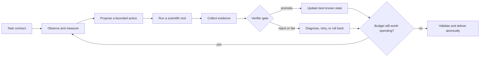

# AI4S Agent Lab

> Wanrun Cong's personal research record on evidence-first scientific agents, examined through four competition case studies.

[](https://github.com/Goldenmonstew/ai4s-agent-lab/actions/workflows/ci.yml)

[中文说明](README.zh-CN.md) · [Architecture](docs/architecture.md) · [Case studies](#four-case-studies) · [Research notebook](lab_notebook/README.md) · [Reproducibility](docs/reproducibility.md)

AI4S Agent Lab is a **personal open-source research project initiated, directed, reviewed, and published under the responsibility of Wanrun Cong**. It grew out of the author's personal post-competition analysis of a 2026 AI for Science experience; the project's identity and publication responsibility belong to the author alone. Its code, synthetic experiments, reconstructed evidence, and technical documentation were created for this project. Development-time programming-agent assistance is disclosed, while original competition assets and third-party payloads are not included.

The central lesson is deliberately modest:

> A scientific agent is not made trustworthy by adding more agents or more language-model calls. It becomes useful when observations change the next action, scientific tools produce real evidence, validators control promotion and rollback, and every claim is bounded by what the evidence can support.

## Research questions

- How can experimental results change an Agent's next action instead of merely producing an explanation?
- How should an LLM, scientific instruments, and deterministic validators divide responsibility?
- When do multi-agent roles, memory, and self-review add measurable value, and when do they only add complexity?

## What I implemented

| Personal implementation | Purpose | Entry point |
|---|---|---|
| `ResearchLoop` | Connect proposal, experiment, validation, promotion, and rollback | [`loop.py`](src/ai4s_agent_lab/loop.py) |
| Structured evidence log | Record each observation, action, result, decision, and artifact binding | [`evidence.py`](src/ai4s_agent_lab/evidence.py) |
| Independent validation and atomic delivery | Prevent failed candidates from replacing the verified best result | [`validation.py`](src/ai4s_agent_lab/validation.py) · [`artifacts.py`](src/ai4s_agent_lab/artifacts.py) |
| Replaceable research interfaces | Separate proposer, experiment tool, and validator contracts | [`contracts.py`](src/ai4s_agent_lab/contracts.py) |
| Synthetic end-to-end experiment | Test the full control chain without competition data | [`toy_decay.py`](src/ai4s_agent_lab/toy_decay.py) · [`tests/`](tests/) |

## Four research case studies

The cases come from the author's competition experience, but this repository uses them as research questions rather than as personal score claims.

| Case | Research question | Lesson carried into this project |
|---|---|---|
| Virtual screening | How should limited compute be allocated under a hard deadline? | Measure real throughput before spending on expensive inference. |
| Targeted molecule design | Can a scientific measurement change the next generation? | Feed docking evidence back into proposal probabilities instead of only ranking outputs. |
| Protein conformational ensemble | How should a multi-solution system represent uncertainty? | Separate a one-run high point, a stable operating range, and causal attribution. |
| Neural-operator PDE | When does a tool hide too much scientific reasoning? | Audit the scientific content inside tools, not only the apparent freedom of the planner. |

Historical rankings and scores belong to the team project in which the author participated, not to the author individually. Their exact values and reproducibility limits are kept in [Results and limitations](docs/results_and_limitations.md).

## How to read this project

- For the core method, start with [Architecture](docs/architecture.md) and [The research loop](docs/agent_research_loop.md).
- To inspect how an experimental result changed the next action, read the [molecule-design case](case_studies/task2_molecule_design/README.md) with its [reconstructed trace](evidence/reconstructed_traces/task2_molecule_design.jsonl).
- To examine failures, boundaries, and self-correction, read the [negative-result ledger](lab_notebook/03_negative_results.md) and [tool-governance postmortem](case_studies/task4_tool_governance/README.md).
- To decide what is actually reproducible, run the synthetic loop below and audit the claims through [R1–R4](docs/reproducibility.md), the [capability ledger](docs/capability_ledger.md), and the [benchmark matrix](benchmarks/README.md).

## What was shared—and what was not

The four competition systems did **not** share one universal solver, one runtime state machine, one model, or one control depth. The real shared layer was thin: language-model access, JSONL call logging, a competition-spec snapshot, basic validation and packaging patterns, and common engineering discipline.

Each task still required its own representation, scientific instruments, quality gates, budget policy, and output contract. This repository turns those lessons into a cleaner reference architecture:



The reusable object is the **research-control discipline**. The scientific instruments remain task-specific.

## Runnable minimal research loop

The public example calibrates a synthetic decay process. It is deliberately small and dependency-free: the point is to inspect the contract, floor, proposals, tool results, verifier decisions, rollback, evidence log, and atomic best-artifact delivery—not to imitate a competition dataset.

```bash
python -m venv .venv
source .venv/bin/activate
python -m pip install -e .
python -m ai4s_agent_lab \
  --output-dir artifacts/decay_demo \
  --iterations 6 \
  --run-id local-demo
python -m unittest discover -s tests -v
```

Inspect `artifacts/decay_demo/evidence.jsonl` and `best_model.json`. A rejected or failed proposal should be recorded as a rollback and must not replace the validated best artifact. The latest observed test status remains in [the current verification record](audit/CURRENT_VERIFICATION.md).

The v0.1 executable targets POSIX systems (Linux and macOS): its evidence lock and durability path use `fcntl`, `fsync`, and same-filesystem atomic replace. Windows behavior is not part of the R2 claim.

## Four case studies

### 1. [Virtual screening](case_studies/task1_virtual_screening/README.md)

A scale-and-scheduling case: a large newly mounted workload, a fixed wall-clock budget, a cheap full-coverage floor, and a more expensive 3D path. The important control decision was not “which magical model wins?” but “how much expensive inference can the measured machine actually finish while preserving complete, ordered output?”

### 2. [Targeted molecule design and retrosynthesis](case_studies/task2_molecule_design/README.md)

The deepest feedback loop across the four cases: pocket analysis → candidate generation → filtering → real docking → fragment reweighting → another generation → redocking and route validation. Historical config evidence supports the narrow claim that docking feedback changed later sampling. The score record used a different baseline and had no repeated equal-budget runs, so a one-off `+0.004909` difference is not presented as a stable net improvement. The case page preserves the full version boundary and negative results.

### 3. [Protein conformational ensembles](case_studies/task3_protein_ensemble/README.md)

A multi-solution and uncertainty case: folding and sampling engines produced candidates, data-dependent gates decided which branches ran, and quality/diversity rules selected an ensemble. The best historical run was about `0.7355`; two later seeded runs were about `0.719–0.720`. The evidence does not support attributing the best score to successful online LLM control.

### 4. [Tool governance for neural operators](case_studies/task4_tool_governance/README.md)

The most important failure case. A ReAct-style controller performed real runtime actions and the models trained at evaluation time, but two prebuilt tools already contained task-specific training and metric-alignment logic. Reviewers halved both subtasks. Runtime execution is not the same as runtime scientific invention.

## Capability ledger

| Capability | Historical implementation | Evidence strength | Personal project status |
|---|---|---|---|
| Task understanding | Input discovery, task-specific parsing, resource probes | Code path + stage records | Demonstrated on synthetic contracts |
| Hypothesis generation | Bounded LLM proposals in some tasks; deterministic gates in others | Uneven by task | Interface provided; no universal-agent claim |
| Real experimentation | Docking, folding, sampling, training, validation | Strongest where tool outputs and platform records align | Scientific backends are not redistributed |
| Feedback-driven iteration | Strong in task2; parameter/action feedback in task4; narrower elsewhere | Task-specific | Generic promotion/rollback pattern |
| Multi-agent oversight | Supervisor-like second opinion in later task-specific versions | Advisory, not strongly isolated | Presented as a pattern, not a completed universal system |
| Cross-run memory | Development documents and version control, not a runtime memory service | No unified runtime proof | Future work only |
| Context compression | A bounded recent-message window in one controller; summaries elsewhere were ad hoc | Partial | Not implemented; evaluation plan only |
| Reproducibility | Versioned evidence varied by task | R1–R4 differ | R2 verified for the synthetic core; R4 is not claimed |

The detailed, claim-by-claim version is in [Capability ledger](docs/capability_ledger.md).

## Logs and evidence

The repository does not publish raw competition logs. They can contain official input structure, internal paths, service metadata, and operational details. It also does not manufacture a smooth “perfect run.” Instead, the public evidence layer contains:

- an explicit [evidence hierarchy](docs/evidence_model.md);
- a schema for observation → action → tool result → verification → promotion;
- **reconstructed and labeled** traces based on source-code paths, tool outputs, version notes, and platform results;
- negative-result records and claim boundaries.

Every reconstructed event has `reconstructed: true`. It is an explanatory artifact, not an original log line.

## Multi-agent, context, and memory: the honest boundary

This project did not implement a single, strongly isolated multi-agent organization shared by all four tasks. Later task-specific versions included a supervisor role that combined deterministic checks with an optional LLM opinion. In at least one controller, main and supervisor roles shared the same process and model client; the supervisor was advisory rather than an independent security boundary.

Likewise, the competition runtime did not provide a proven cross-session long-term memory system, a Socratic-question memory, or a universal half-hour memory compressor. Development-time knowledge lived in repository documents, progress ledgers, prompts, and version history. See [Multi-agent, context, and memory](docs/multi_agent_context_memory.md).

## Reproducibility contract

This project separates four different promises:

| Level | Promise | This personal project |
|---|---|---|
| R1 | Source and claims can be reviewed | Verified by manifest, release scan, and review passes |
| R2 | A licensed synthetic example runs end to end | Verified locally and in Python 3.10–3.14 CI on POSIX runners |
| R3 | The full scientific environment can be rebuilt | Not yet claimed |
| R4 | Historical platform results can be repeated | Not claimed |

“Open source” does not automatically grant permission to redistribute model weights, official data, or third-party training assets. Full details: [Reproducibility](docs/reproducibility.md) and [Third-party notices](THIRD_PARTY_NOTICES.md).

## Repository map

```text
ai4s-agent-lab/
├── src/ and tests/                personal control-loop implementation and tests
├── examples/                      synthetic, license-safe examples
├── case_studies/                  four evidence-bounded technical narratives
├── lab_notebook/                  hypotheses, iterations, negative results
├── evidence/                      schemas and reconstructed traces
├── benchmarks/                    evaluation design, not a claimed leaderboard
├── docs/                          architecture, claims, provenance, reproducibility
└── audit/                         publication boundary and current verification
```

## Attribution and license

The Apache-2.0 license covers **only the original code, documentation, and synthetic materials created and committed for this personal project under Wanrun Cong's authorship responsibility**. Historical competition facts do not establish ownership of original competition artifacts; official competition data, third-party source code, model weights, and online services are not relicensed here.

Wanrun Cong is responsible for architecture, scientific choices, evidence review, version selection, and release decisions. Development-time programming agents assisted implementation, review, and documentation. Runtime language models, where used, were replaceable control components and should not be confused with the scientific backends that performed docking, folding, sampling, or training.

See [Contributions](CONTRIBUTIONS.md), [Provenance](docs/provenance_and_attribution.md), and [Third-party notices](THIRD_PARTY_NOTICES.md).

## Status

This is a personal post-competition research project independently maintained and published under the responsibility of Wanrun Cong. Before citing executable status, check [the current verification record](audit/CURRENT_VERIFICATION.md).
