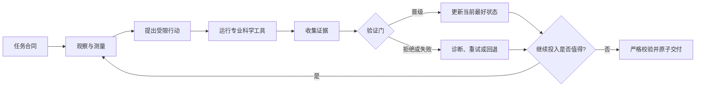

# AI4S Agent Lab

> Wanrun Cong 的个人科学智能体研究记录：用四个竞赛案例复盘证据驱动的 Agent 设计。

[](https://github.com/Goldenmonstew/ai4s-agent-lab/actions/workflows/ci.yml)

[English](README.md) · [系统架构](docs/architecture.md) · [四个案例](#四个案例) · [研究日志](lab_notebook/README.md) · [复现边界](docs/reproducibility.md)

AI4S Agent Lab 是 **Wanrun Cong 发起、指导、审阅并承担发布责任的个人开源研究项目**。它源于作者参加 2026 年 AI for Science 竞赛后的个人方法复盘，项目身份与发布责任只归属于作者本人。代码、合成实验、重建证据和技术文档都为这个项目创作；开发期的编程 Agent 辅助已明确披露，原始竞赛资产和第三方载荷没有进入本仓。

这个项目最重要的结论不是“Agent 越多越好”，而是：

> 当新观测能够改变下一步行动、专业科学工具真正产生证据、验证器决定晋级与回退、每个结论都不超过证据边界时，一个科研 Agent 才开始变得可信。

## 我在研究什么

- 实验结果怎样真正改变 Agent 的下一步，而不是只生成一段解释；
- LLM、专业科学工具和确定性验证器应该怎样分工；
- 多 Agent、记忆和自我审查在什么条件下有用，又在什么情况下只是增加复杂度。

## 我已经实现什么

| 个人实现 | 作用 | 入口 |
|---|---|---|
| `ResearchLoop` | 串起提案、实验、验证、晋级与回退 | [`loop.py`](src/ai4s_agent_lab/loop.py) |
| 结构化证据日志 | 记录每一步的观测、动作、结果、决定和产物绑定 | [`evidence.py`](src/ai4s_agent_lab/evidence.py) |
| 独立验证与原子交付 | 防止失败候选覆盖已验证的最佳结果 | [`validation.py`](src/ai4s_agent_lab/validation.py) · [`artifacts.py`](src/ai4s_agent_lab/artifacts.py) |
| 可替换科研接口 | 把提案器、实验工具和验证器拆成明确合同 | [`contracts.py`](src/ai4s_agent_lab/contracts.py) |
| 合成端到端实验 | 在不使用竞赛数据的情况下验证完整控制链 | [`toy_decay.py`](src/ai4s_agent_lab/toy_decay.py) · [`tests/`](tests/) |

## 四个研究案例

这些案例源于作者的参赛经历，但本仓把它们作为研究问题，而不是个人成绩展示。

| 案例 | 研究问题 | 带入本项目的方法认识 |
|---|---|---|
| 虚拟筛选 | 硬时限下怎样分配有限算力？ | 先测真实吞吐，再投入昂贵推理。 |
| 靶向分子设计 | 科学测量能否真正改变下一轮生成？ | 让 docking 证据改变提案概率，而不只给结果排序。 |
| 蛋白构象系综 | 多解系统怎样表达不确定性？ | 区分单次高点、稳定运行区间和因果归因。 |
| 神经算子 PDE | 工具在什么时候隐藏了过多科研决策？ | 审查工具内部的科学内容，而不只看规划器表面上是否自由。 |

历史排名和分数属于作者参与的团队项目，并不是作者的个人独立成绩。精确数值与复现边界保留在[结果与限制](docs/results_and_limitations.md)。

## 如何阅读这个项目

- 想先理解核心方法：阅读[系统架构](docs/architecture.md)和[科研闭环](docs/agent_research_loop.md)。
- 想看“实验结果如何改变下一步”：阅读[分子设计案例](case_studies/task2_molecule_design/README.md)和对应的[重建 trace](evidence/reconstructed_traces/task2_molecule_design.jsonl)。
- 想检查失败、边界和自我纠错：阅读[负结果台账](lab_notebook/03_negative_results.md)和[工具治理复盘](case_studies/task4_tool_governance/README.md)。
- 想判断哪些内容真正可复现：运行下方合成闭环，再用 [R1–R4](docs/reproducibility.md)、[能力账本](docs/capability_ledger.md)和[评测矩阵](benchmarks/README.md)逐项核对。

## 到底共享了什么

四个参赛系统并没有共享一个万能求解器、统一运行时状态机、统一模型或相同深度的控制流程。真实共享层很薄：语言模型调用、JSONL 调用记录、规则快照、基础校验与打包模式，以及一套共同的工程纪律。

每个任务仍要重新定义科学对象、专业工具、质量门、预算策略和输出合同。本项目把这些经验重建成下面这套参考流程：



真正可复用的是**科研控制纪律**，不是四个领域共用一套科学算法。

## 可运行的最小研究闭环

公开样例要校准一个自造的衰减过程。它很小，也不依赖专业第三方包；目的不是伪装比赛数据，而是让你检查任务合同、floor、候选行动、工具结果、验证决策、回退、证据日志和最佳产物的原子交付。

```bash
python -m venv .venv
source .venv/bin/activate
python -m pip install -e .
python -m ai4s_agent_lab \
  --output-dir artifacts/decay_demo \
  --iterations 6 \
  --run-id local-demo
python -m unittest discover -s tests -v
```

运行后查看 `artifacts/decay_demo/evidence.jsonl` 和 `best_model.json`。被拒绝或失败的候选应留下 rollback 记录，而且不能替换已经通过验证的最佳产物。当前测试状态以[当前验证记录](audit/CURRENT_VERIFICATION.md)为准。

v0.1 的可执行版本以 POSIX 系统（Linux 与 macOS）为目标：证据锁和持久化路径使用 `fcntl`、`fsync` 与同文件系统原子替换；Windows 不在本次 R2 声明内。

## 四个案例

### 1. [虚拟筛选](case_studies/task1_virtual_screening/README.md)

这是规模与资源分配问题：新挂载的大规模输入、固定时限、便宜但能全覆盖的 floor，以及更昂贵的三维推理路径。Agent 的关键不是“现场发明一个模型”，而是根据真实机器吞吐决定昂贵路径能做多深，同时保证所有输出完整且顺序正确。

### 2. [靶向分子设计与逆合成](case_studies/task2_molecule_design/README.md)

这是四个案例中最完整的反馈闭环：口袋分析 → 生成候选 → 过滤 → 真实 docking → 高分片段重加权 → 下一轮生成 → 复核与路线验证。历史配置对照支持“docking 反馈改变了后续采样”，但分数记录使用了不同基线，且没有同预算重复运行，因此不能把一次 `+0.004909` 的差值写成稳定净提升。完整版本边界和负结果见案例页。

### 3. [蛋白构象系综](case_studies/task3_protein_ensemble/README.md)

这是多解与不确定性问题：折叠和采样工具产生候选，现场数据决定哪些预置分支触发，再由质量和多样性规则选出系综。历史最好约 `0.7355`；后来两次固定种子运行约 `0.719–0.720`。现有证据不能把最好分归因于成功在线 LLM 控制。

### 4. [神经算子工具治理](case_studies/task4_tool_governance/README.md)

这是最重要的失败案例。ReAct 控制器确实在评测现场读结果、选动作，模型权重也在现场训练；但两个预置工具已经包含针对本题的训练与指标对齐逻辑。审核认定两题都越界并减半。现场运行计算，不等于现场自主发现方法。

## 能力账本

| 能力 | 历史实现 | 证据强度 | 公开仓状态 |
|---|---|---|---|
| 理解任务 | 输入发现、任务解析、资源探测 | 源码路径 + 阶段记录 | 用自造合同演示 |
| 提出假设 | 部分赛道用受限 LLM，另一些用确定性门控 | 赛道差异很大 | 只提供接口，不称万能 Agent |
| 执行真实实验 | docking、折叠、采样、训练、验证 | 工具产物与平台记录能对齐时最强 | 不再分发科学后端 |
| 根据反馈迭代 | task2 最强；task4 有参数/动作反馈；其余较窄 | 任务特化 | 提供通用晋级/回退模式 |
| 多 Agent 监督 | 后期版本有 supervisor 式二次检查 | 辅助意见，不是强隔离 | 作为模式说明，不称统一系统 |
| 跨运行长期记忆 | 开发文档与版本记录，不是运行时 memory service | 没有统一实现证据 | 仅列未来工作 |
| 上下文压缩 | 一个控制器保留有限近期消息；其他摘要较零散 | 部分实现 | 尚未实现，仅提供评测计划 |
| 可复现性 | 各赛道版本证据不同 | R1–R4 不同 | 自造核心已验证 R2，不承诺 R4 |

详见[能力账本](docs/capability_ledger.md)。

## 日志与证据

本仓不公开原始比赛日志。它们可能包含官方输入结构、内部路径、服务信息和运维细节；本仓也不会补造一条“看起来特别完整”的完美日志。公开证据层包含：

- 明确的[证据等级](docs/evidence_model.md)；
- “观测 → 行动 → 工具结果 → 验证 → 晋级/回退”事件结构；
- 根据源码路径、工具输出、版本记录和平台结果整理的、**明确标注为重建**的 trace；
- 负结果和不能过度声称的边界。

每条重建事件都带 `reconstructed: true`，它是讲解材料，不是原始日志行。

## 多 Agent、上下文和记忆：必须讲清楚的边界

历史竞赛实现没有形成四赛道共享、强隔离的多 Agent 组织。部分后期赛道版本加入 supervisor 角色，由确定性检查加可选 LLM 意见组成；至少一个控制器中，主角色与监督角色仍共享同一进程和模型客户端，监督是辅助建议，不是独立安全边界。

同样，比赛运行时没有被证明的跨会话长期记忆、“苏格拉底追问 memory”或统一的半小时记忆压缩器。开发阶段的知识主要存在 Git 文档、进度账本、Prompt 与版本历史里。详见[多 Agent、上下文和记忆](docs/multi_agent_context_memory.md)。

## 复现合同

本项目把“能复现”拆成四种承诺：

| 等级 | 承诺 | 本公开版 |
|---|---|---|
| R1 | 源码和结论可以审阅 | 已通过逐文件清单、发布扫描与分离审查验证 |
| R2 | 合法自造样例可以端到端运行 | 已在本地及 Python 3.10–3.14 POSIX CI 验证 |
| R3 | 完整科学环境可以重建 | 暂不声明 |
| R4 | 历史平台成绩可以重复 | 不声明 |

代码开源不等于模型权重、官方数据和第三方训练资产自动获得再分发权。详见[复现说明](docs/reproducibility.md)与[第三方声明](THIRD_PARTY_NOTICES.md)。

## 仓库结构

```text
ai4s-agent-lab/
├── src/ and tests/                个人控制闭环实现与测试
├── examples/                      自造且许可清楚的样例
├── case_studies/                  四个有证据边界的技术案例
├── lab_notebook/                  假设、迭代与负结果
├── evidence/                      schema 与重建 trace
├── benchmarks/                    评测设计，不冒充已跑榜单
├── docs/                          架构、结论、归属与复现
└── audit/                         公开边界与当前验证记录
```

## 归属与许可证

本仓 Apache-2.0 只覆盖 **在 Wanrun Cong 的作者责任下为这个个人项目创作并提交的原创代码、文档和合成材料**。历史竞赛事实不等于对原始竞赛资产的所有权；官方赛事数据、第三方源码、模型权重和在线服务也不由本仓重新许可。

Wanrun Cong 负责架构、科学选择、证据复核、版本判断和发布决定；开发期编程 Agent 辅助实现、审阅和文档；运行时语言模型若被使用，也只是可替换的控制组件，不能与真正执行 docking、折叠、采样或训练的科学后端混为一谈。

详见[贡献说明](CONTRIBUTIONS.md)、[来源与归属](docs/provenance_and_attribution.md)和[第三方声明](THIRD_PARTY_NOTICES.md)。

## 当前状态

这是由 Wanrun Cong 独立维护并承担发布责任的个人赛后研究项目。引用“可运行”状态前，请查看[当前验证记录](audit/CURRENT_VERIFICATION.md)。
