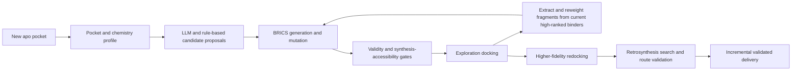

# Case study 2: molecule design with docking feedback and route checks

## Research question

Can an automated system use measurements from the **current target** to change the next generation of molecules, while maintaining chemical validity, docking evidence, retrosynthesis checks, and a fixed wall-clock budget?

This was the project’s deepest example of an observation genuinely changing a later action.

## Historical result

- Best recorded platform result: `0.757559`, reported as `0.7575`.
- Normalized score: `0.8339`.
- Associated with the v115ga line.
- The historical platform record contains a cross-version score observation, `v115=0.752650` → `v115ga=0.757559`, a difference of `+0.004909`; contemporaneous notes described that magnitude as within evaluation noise.
- v115c lacks an independently scored platform run, so the score observation is not a v115c → v115ga platform A/B.
- A later audit-hardened package added supervision and seed controls but was not independently shown to reproduce `0.757559`.

## Feedback loop

## The load-bearing idea

The key v115ga change was **goal-aware fragment weighting**:

1. generate and dock candidates for the current target;
2. take the higher-ranked candidates from that same run;
3. decompose them into BRICS fragments;
4. increase the probability of those fragments in the next generation;
5. dock the new candidates and repeat under the remaining budget.

The feedback did not consist of an LLM saying “looks better.” It came from a scientific tool, then changed the search distribution.

## Causal boundary

Version evidence supports that docking results were read, converted into fragment weights, and used to change the distribution sampled in a later round. That establishes the feedback loop as an executed mechanism, not a diagram-only proposal.

The recoverable historical run-config comparison is genuinely single-variable: the v115ga config differs from its v115c parent by adding only `GOAL_AWARE_FRAGS=1`. That source-level fact must be kept separate from the platform-score evidence. At score level, the historical ledger contains a cross-version observation, `v115=0.752650` → `v115ga=0.757559` (`+0.004909`), and the contemporaneous record called the magnitude noise-scale. v115c lacks an independently scored platform run, so this is not the measured platform A/B counterpart of the source-level toggle.

A single config toggle is not, by itself, a stable effect estimate. Here the source baseline and score-reference baseline are also different, the complete scoring image and score-bound run log carriers are missing, and there were no repeated equal-budget executions to estimate variance. The defensible conclusion is therefore: the feedback mechanism executed and one positive cross-version difference was observed, but its stable independent net contribution remains unknown.

## What changed at runtime

- the geometry and profile of the new apo pocket;
- LLM-proposed scaffolds or complete molecules where enabled;
- BRICS mutations and generated candidates;
- docking results for each candidate;
- fragment weights derived from current-target results;
- number of search restarts and rounds that fit the budget;
- route-search outcomes and fallback behavior.

## What was fixed before runtime

- planner prompts and candidate limits;
- starter and fragment pools;
- the genetic/search algorithm;
- docking-engine sequence, box rules, and restart policy;
- validity, quality, and route checks;
- shortlist and output sizes;
- fallback and delivery policies.

The correct label is **a closed-loop optimizer with LLM-assisted candidate generation**, not an open-world autonomous chemist.

## Verification hierarchy

| Stage | Evidence | Authority |
|---|---|---|
| Proposal | scaffold or complete molecule from LLM/rules | hypothesis only |
| Chemistry gate | parseability and deterministic molecular checks | hard for the fields checked |
| Exploration docking | GPU docking score | search proxy |
| Redocking | higher-fidelity CPU docking where completed | stronger proxy, still not wet-lab evidence |
| Route search | retrosynthesis engine output | route hypothesis |
| Route validation | product/element/balance and nontriviality checks | deterministic contract checks |
| Platform result | official task metric | competition outcome, not clinical value |

The historical pipeline contained explicit degradation paths. If higher-fidelity redocking failed, exploration scores could be retained; if route search failed, a deterministic fallback could be attempted. Public claims therefore do not say that every final molecule had a successful high-fidelity route.

## Supervisor boundary

Later task2 code included a supervisor that reviewed deterministic evidence such as input scope, candidate origin, tool use, and output status, with an optional LLM second opinion. The deterministic verdict was the defensible source of truth. This was useful audit instrumentation, but it was not a mathematically complete provenance system or proof of zero violations.

## Negative results that shaped the final method

| Experiment | Result | Decision |
|---|---:|---|
| Goal-aware fragments | source-level single-toggle contrast; cross-version score record `v115=0.752650` → `v115ga=0.757559` (`+0.004909`, noise-scale); v115c lacks an independently scored platform run | retain the feedback mechanism; do not treat a different-baseline, unreplicated score difference as a stable independent lift |
| A later retrieval-augmented fragment variant | `0.742419` | rejected; more historical context did not beat current-target feedback |
| A larger final emission variant | approximately `0.706` | rejected; more outputs did not imply better task score |

Other plausible additions were not retained when proxy or platform evidence disagreed. The lesson is methodological: **a more complicated generator is not an improvement until the same evaluator and budget support it**.

## What this case does not prove

- that docking equals binding affinity or biological efficacy;
- that every final route is commercially or experimentally feasible;
- that a named LLM caused `0.7575`;
- that the cross-version `+0.004909` difference is a platform A/B effect of the single source-level toggle;
- that the later audit package reproduced the best score;
- that the historical docking/retrosynthesis stack can be redistributed here.

## Public reconstruction level

- **R1:** method, evidence hierarchy, negative results, and limitations are reviewable.
- **R2:** the public core verifies generic event, promotion, and rollback behavior on synthetic scores; docking-driven generation is not reimplemented.
- **R3/R4:** not claimed for docking, route assets, or the platform result.
