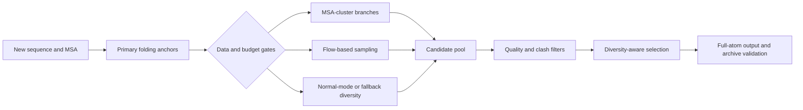

# Case study 3: protein conformational ensembles and uncertainty

## Research question

How should an automated system generate and select multiple plausible structures for a new protein when quality, conformational diversity, runtime, randomness, and reproducibility all matter?

This case is less about a free-form planner and more about a **data-gated structure-generation graph**.

## Historical results

- Best recorded platform results: `0.735478` and `0.735239`, reported as `0.7355`.
- Normalized score: `0.9075`.
- The best line did not fix the full random seed.
- Two later seeded runs recorded `0.720025` and `0.719021`, supporting an operating center near `0.72` for that later version.
- Existing evidence does not support attributing the `0.7355` high point to successful online LLM control.

## Candidate-generation graph

The sequence/MSA, length, runtime budget, tool success, candidate quality, and diversity signals determined which preconfigured branches produced useful candidates. The model menu, thresholds, clustering grid, selection formulas, and fallback rules were designed before runtime.

## Runtime LLM boundary

In later review-oriented versions, a planner saw aggregated features such as length and composition statistics, not raw coordinates, and returned a narrow spread category. That category mapped to preconfigured sampling amplitudes. The requested number of conformers did not control the final output count in the reviewed code path; the task contract did.

The highest-scoring v112/v114 line lacks sufficient evidence to say that a successful online LLM call caused the result. It is still inaccurate to call the system “precomputed answers” or “pure hard coding”: folding, sampling, gating, selection, and packaging ran on the new input.

## What changed at runtime

- the new sequence and MSA;
- whether a data-dependent cluster branch had support;
- which scientific tools succeeded within the budget;
- the structures generated by folding and sampling;
- observed quality, clash, and diversity signals;
- which candidates survived selection and fallback.

## What was fixed before runtime

- the scientific engine graph and checkpoints;
- sampling counts, threshold families, and fallback order;
- clustering grids and quality filters;
- diversity-selection logic and output contract;
- the narrow mapping from later LLM spread categories to amplitudes.

## A key negative result: proxy distribution mismatch

A later anchor-selection variant looked better on a development proxy. On the platform, the result fell to `0.706088`, about `0.029` below the nearby `0.735239` version.

The proxy did not represent the evaluation distribution well enough. The failure demonstrates:

> A clean local improvement on the wrong distribution can be a real regression on the target distribution.

The response was to reject the variant, not reinterpret the platform result until it fit the proxy story.

## Randomness and version truth

| Statement | Evidence status |
|---|---|
| “The historical best was about `0.7355`.” | Supported by platform records. |
| “The later seeded version ran near `0.719–0.720` twice.” | Supported by two platform runs. |
| “The seeded version exactly reproduces the best line.” | False. |
| “The difference is entirely random.” | Not proved; versions also differed. |
| “A named LLM produced the best score.” | Not supported. |

## What this case does not prove

- that the selected conformers reproduce a biological ensemble in full;
- that one run’s best score is a stable mean;
- that fixed seed removes all GPU, timeout, service, and scheduling variation;
- that the current public repository can rebuild the folding/sampling stack;
- that a narrow later planner controlled the entire engine graph.

## Public reconstruction level

- **R1:** pipeline, uncertainty, version split, and negative result are reviewable.
- **R2:** only the generic verifier/rollback control pattern is runnable; a quality/diversity ensemble selector is not implemented in v0.1.
- **R3/R4:** not claimed for the historical model stack or platform score.
