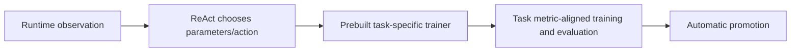

# Case study 4: tool governance after a neural-operator penalty

## Why this case is included

This is not a success story rewritten after the fact. It is the project’s clearest example of how an apparently active Agent can still inherit too much of the scientific answer from a prebuilt tool.

## Final ruling and result

- Historical raw result: `176.46`.
- Final reviewed result: `88.23`.
- Normalized score: `0.5181`.
- Two prebuilt task-specific training tools were ruled out of bounds.
- Both the KS and cylinder subtasks were halved.
- This personal retrospective preserves the ruling and does not present the penalty as a strategic win.

## What the runtime controller really did

The final reviewed control structure had meaningful runtime behavior:

- created fallback outputs before risky work;
- read current floor, training curves, validation values, errors, and remaining time;
- selected bounded actions and some training parameters;
- ran models that trained or fine-tuned at evaluation time;
- compared candidates against validation and promotion gates;
- received periodic supervisor-style advice;
- restored a floor when the final candidate was worse;
- wrote and checked output safely.

That is genuine orchestration. It was not enough to make the scientific method autonomous.

## Where the boundary failed

The two prebuilt tools already contained load-bearing task-specific logic.

### The two ruled-out tools

Both tools bundled task-specific training, evaluation, and metric-alignment decisions. That made the planner a parameter selector inside prewritten task solutions rather than an agent able to design and falsify alternative methods.

The planner could choose some parameters and switches, but it was choosing **inside an already solved task-specific method**.

## The incorrect argument

The historical design reasoning was approximately:

> The weights are trained at evaluation time, and the Agent chooses parameters, so the method is discovered at runtime.

The ruling exposed the error:

> Runtime computation is not runtime scientific discovery when the tool already contains the task-specific algorithm, objective alignment, and training recipe.

## Better tool-boundary test

Before exposing a tool to a scientific agent, ask:

1. Could the same tool be used on a new task in the same broad class without embedding benchmark-specific evaluation logic?
2. Does the tool expose an atomic scientific operation, or an end-to-end task solution?
3. Who selected the architecture, objective, hyperparameter search space, and stop policy?
4. Can the Agent form and falsify alternative methods, or only fill parameters into one prewritten trainer?
5. Does a public method description reveal generic knowledge, or the benchmark-specific answer?
6. Would removing the controller leave nearly the same scientific recipe intact?

If the last answer is yes, the controller is likely an executor around a hidden solution.

## Personal public replacement

The ruled-out tools are not published here. The public repository keeps only task-agnostic patterns:

- typed task contracts;
- action and tool events;
- a bounded iteration budget;
- floor-first fallback;
- verifier-gated promotion;
- rollback and atomic delivery;
- a documented rule that generic tools must not embed task-specific evaluator logic.

The public example uses synthetic objectives and cannot reveal the competition solution.

## Supervisor boundary

Periodic supervisor review asked whether recent actions represented real training, improper data use, or stalled progress. The advice was injected back into the same overall controller and was not a separate formal enforcement system. A reviewer prompt cannot repair a tool abstraction that already violates the task boundary.

## Lessons for future systems

- Review tools before reviewing prompts.
- Separate “instrument” from “complete method.”
- Keep benchmark-specific evaluators outside generic reusable tools.
- Require the Agent to choose among meaningfully different method families.
- Record who or what selected every load-bearing design choice.
- Treat compliance failures as first-class research outcomes.

## What this case does not claim

- that one subtask escaped the penalty;
- that the runtime controller invalidated or reduced the ruling;
- that the reviewers endorsed the rest of the method;
- that deleting the two files would automatically make the historical system compliant;
- that the public synthetic example reproduces the score.

## Public reconstruction level

- **R1:** the ruling, failure analysis, and governance checklist are reviewable.
- **R2:** generic floor/gate/rollback behavior is verified on the synthetic objective.
- **R3/R4:** not claimed.
