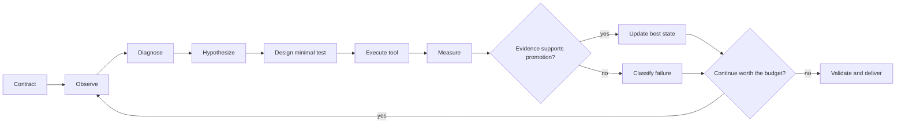

# The scientific-agent research loop

## Definition

A research loop is complete only when a new observation can change a later decision. Repeatedly calling a model or tool with a fixed recipe is execution, not evidence-driven research.



## Ten inspectable stages

| Stage | Required question | Evidence to retain |
|---|---|---|
| 0. Contract | What is the objective and boundary? | input, target, budget, tools, verifier, output schema |
| 1. Observe | What is true now? | input summary, resources, current floor, errors |
| 2. Diagnose | What is the current bottleneck? | evidence-backed diagnosis and uncertainty |
| 3. Hypothesize | What change could matter, and why? | expected effect and falsification condition |
| 4. Design | What is the smallest discriminating test? | variable, control, metric, cost, seed, stop rule |
| 5. Execute | Which real computation ran? | tool, version, parameters, input reference, exit status |
| 6. Verify | Is the result valid and comparable? | domain metric, hard constraints, anomaly checks |
| 7. Reflect | Why did it succeed or fail? | failure class, confidence, alternatives |
| 8. Promote/rollback | Should it replace the floor? | same-scale comparison and decision reason |
| 9. Deliver | Can another person inspect the output? | manifest, artifact checks, evidence links |

This is a post-competition common language, not a claim that all four historical systems instantiated one ten-state class.

## Hypothesis card

A useful hypothesis can be recorded in six fields:

```text
observation: what changed or failed
bottleneck: the suspected cause
action: one bounded intervention
expected_signal: what should improve if the idea is right
falsifier: what would reject or lower the hypothesis
budget_and_risk: cost, timeout, compliance, and fallback
```

“Sample more” is incomplete. “Increase the sampling probability of fragments extracted from the current target’s high-docking candidates, then compare the next round’s docking distribution under the same gate” is testable.

## Failure taxonomy

| Failure | Wrong conclusion | Better response |
|---|---|---|
| Scientific hypothesis rejected | “The tool is broken” | abandon or revise the hypothesis |
| Proxy disagrees with final evaluation | “The generator is useless” | lower proxy authority; seek a more faithful evaluator |
| Input or implementation contract bug | “The method failed” | repair engineering, then repeat the same scientific comparison |
| Random variation | “The best seed proves improvement” | repeat and report center, spread, and failure rate |
| Timeout or resource exhaustion | “The route has no value” | shrink, stage, or defer the experiment |
| Invalid artifact | “The score may still be good” | reject promotion |
| Tool or prior crosses the task boundary | “It ran at evaluation time, so it is autonomous” | stop, review the abstraction, and remove task-answer logic |

## Floor-first and verifier-gated promotion

The system should protect a valid result before spending the rest of the budget:

```text
floor_valid = validate(floor)
candidate = experiment(state, budget)
candidate_valid = validate(candidate)

if candidate_valid and comparable(candidate, floor) and better(candidate, floor):
    promote(candidate)
else:
    retain(floor)
```

This pattern does not make the science correct by itself. It prevents a failed branch from silently replacing a valid artifact.

## When an agent should stop

Stopping is a scientific decision, not only a timeout:

- the next experiment cannot finish with delivery reserve;
- repeated evidence rejects the current family of hypotheses;
- the verifier cannot distinguish candidates reliably;
- tool failure makes the result non-comparable;
- the expected value of another iteration is below its cost;
- the available action would violate the tool or data boundary.

## What can enter memory

Only a verified conclusion should be promoted into reusable research memory:

```text
context / observation / action / result / evidence level /
known exceptions / source version / expiry or review date
```

An unresolved Socratic question belongs in a hypothesis queue, not in the fact store. See [Multi-agent, context, and memory](multi_agent_context_memory.md).
