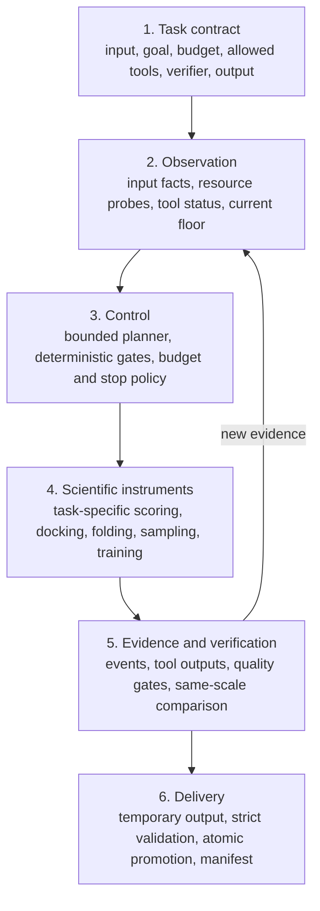

# Architecture: thin core, task-specific science

## Scope

AI4S Agent Lab is a personal reference architecture created by Wanrun Cong and informed by four historical scientific-agent case studies. It is not the original competition runtime and does not claim that one universal agent solved four domains.

The historical systems observed in those cases shared a thin engineering layer—LLM access, JSONL call logging, a local rule snapshot, basic validation and packaging patterns—but not a common solver, runtime state class, action space, or scientific evaluator. This personal reference design makes the common discipline explicit without rewriting that history.

## The six layers

### 1. Task contract

A task contract makes the scientific and operational boundary inspectable:

| Field | Question |
|---|---|
| Input | What is available now, and what must never be accessed? |
| Objective | Which metric or scientific property is being optimized? |
| Budget | How much wall time, compute, memory, and model usage is available? |
| Actions | What may the controller change? |
| Tools | Which operations are atomic instruments, and which would hide a task solution? |
| Verification | What evidence can promote or reject a candidate? |
| Stop policy | When should the system continue, switch, roll back, or stop? |
| Delivery | What files, schema, ordering, types, and logs are required? |

A prompt alone is not a task contract. The contract must also constrain tool exposure, input scope, validation, and output behavior.

### 2. Observation

The controller should receive facts that can change an action, not an unbounded dump of files:

- parsed input size, structure, missing fields, and task count;
- hardware availability and measured throughput;
- tool health, exit status, and resource usage;
- current candidate metrics, failures, and remaining budget;
- the current valid fallback artifact.

The public core represents these observations as typed state and events. It does not assume that every historical task used the same state object.

### 3. Control

Control can be a language model, deterministic rules, data-dependent gates, or a hybrid. The useful question is not “Did an LLM make every decision?” but:

> Did new evidence change the next action, and can that change be inspected?

Every proposed action should be bounded by the contract, remaining budget, a defined failure class, and a stop condition. Language-model output is a proposal, not scientific proof.

### 4. Scientific instruments

Scientific tools perform the domain computation. They are not interchangeable with the controller:

- task1 used molecular representation and scoring;
- task2 used molecular generation, docking, chemistry checks, and retrosynthesis;
- task3 used folding, conformational sampling, clustering, and ensemble selection;
- task4 used neural-operator training, inference, and validation.

This public repository does not redistribute those historical scientific stacks. Their code, weights, data, and nested licenses are separate objects.

### 5. Evidence and verification

Evidence is layered:

1. official or faithful domain evaluation;
2. real scientific-tool output;
3. deterministic contract and quality checks;
4. proxies and heuristics;
5. language-model interpretation.

Later items cannot overwrite earlier ones. A fluent explanation cannot promote an invalid artifact. See [Evidence model](evidence_model.md).

### 6. Delivery

The floor-first, atomic-delivery pattern protects the final result from a failed research branch:

1. create a minimum valid floor;
2. write new candidates to temporary paths;
3. validate schema and domain constraints;
4. compare candidate and floor on the same scale;
5. promote only if the gate passes;
6. flush, replace atomically, and write a manifest.

## Runtime lifecycle

| Phase | Runtime work | Inspectable evidence |
|---|---|---|
| Start | Read contract, paths, budget, environment | contract snapshot, start event |
| Preflight | Discover input, probe tools and resources | input summary, probe results |
| Floor | Produce or load a minimum valid result | floor artifact and validation |
| Research | Propose, execute, observe, and update | action and tool-result events |
| Gate | Validate and compare candidate | verifier result and decision |
| Deliver | Write the accepted artifact safely | manifest, checks, final event |

“Zero manual operation after container start” describes this runtime lifecycle. It does not imply zero human design before the run.

## Historical mapping

| Task | Observation that mattered | Action surface | Scientific verifier | Control depth |
|---|---|---|---|---|
| Virtual screening | input scale, references, measured throughput | effort and expensive-inference allocation | row coverage, ordering, finite scores; platform EF1% | bounded scheduling |
| Molecule design | pocket profile, validity, docking, route status | scaffolds, complete molecules, fragment weights, search rounds | docking, chemistry gates, retrosynthesis checks | deepest feedback loop |
| Protein ensemble | sequence/MSA-derived signals, length, budget, candidate quality/diversity | preconfigured branch gates and narrow spread control | structure quality, clashes, diversity, output checks | mostly data-gated pipeline |
| Neural operator | floor, curves, validation, errors, time | selected parameters and actions inside prebuilt tools | validation and promotion logic | real ReAct control, invalid tool boundary |

## Human, development-agent, runtime-agent, and tool boundaries

| Actor | Responsible for |
|---|---|
| Human researcher | scientific objective, allowed action space, tool selection, acceptance criteria, version choice, compliance, publication |
| Development-time programming agents | implementation assistance, debugging, review, tests, documentation |
| Runtime planner | bounded decisions on new runtime observations where enabled |
| Scientific backend | actual docking, folding, sampling, training, or inference |
| Deterministic verifier | checking the contract it was explicitly written to check |

None of these rows should be collapsed into a claim that “the AI did everything.”

## Known architectural limitations

- No universal four-domain runtime runner existed historically.
- Supervisor roles were not consistently isolated independent agents.
- Runtime memory was task-specific and limited; no shared cross-run memory service was demonstrated.
- Logging was layered and uneven: call logs, stage logs, tool outputs, validators, and development ledgers had to be combined.
- Tool boundaries were not always safe; task4 is the counterexample.
- Historical score reproduction depends on unavailable or non-redistributable data, weights, environments, and exact version bindings.

These limitations are part of the architecture record, not footnotes to hide.
