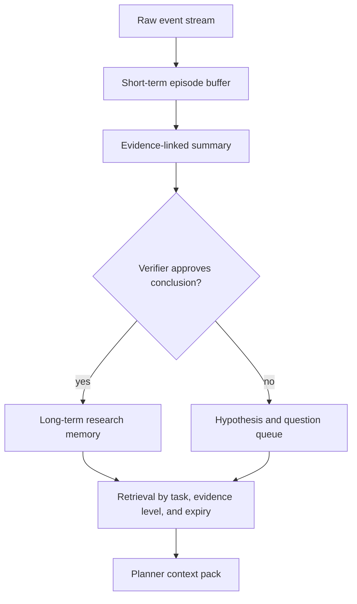

# Multi-agent, context, and memory: actual boundary and next design

## Short answer

The historical project did **not** implement one shared, strongly isolated multi-agent architecture with cross-session long-term memory. It used several agent-like roles and task-specific supervisors, but the roles, processes, contexts, and authority boundaries varied.

This distinction matters because “planner + reviewer prompts” is not automatically a robust multi-agent system.

## Historical runtime reality

### Shared harness

The shared harness was an engineering layer, not a universal agent operating system. It provided language-model access, call logging, a local rules snapshot, shallow validation/packaging utilities, and development templates. Domain control remained in the task directories.

### Supervisor roles

Later task-specific versions included supervisor-like behavior:

- deterministic checks inspected input scope, tool execution, output counts, or suspicious artifacts;
- an optional LLM opinion could review recent actions;
- supervisor events could be written to the audit stream.

Important boundaries:

- these additions did not exist with the same strength in every scoring version;
- the deterministic checks were the most defensible source of truth;
- the LLM opinion was advisory;
- at least one reviewed controller used the same process and model client for main and supervisor roles;
- the reviewer did not have a universal independent sandbox or formal power to prove compliance.

Therefore, the correct label is **task-specific oversight**, not “a fully independent multi-agent organization.”

## Was this a harness?

Yes, in the narrow engineering sense: a controlled runtime shell around inputs, budgets, model calls, tools, logs, validation, and output. No, if “harness” is used to imply a mature, domain-neutral operating system with a common state machine, shared memory service, agent scheduler, permissions system, and benchmark suite.

## Context management

The tasks used different techniques:

| Pattern | Historical use | Boundary |
|---|---|---|
| Aggregated scientific features | A protein planner could receive length/composition summaries instead of raw sequence/coordinates | Reduces exposure and distraction, but narrows the decision surface |
| Stage summaries | Molecule-design stages recorded analysis, design, generation, improvement, evolution, and supervision | Logs were not one shared structured memory system |
| Bounded recent messages | One ReAct controller retained a recent window of roughly 28 messages plus compact status | Not a time-based “half-hour memory,” and not cross-run |
| Deterministic state | Budgets, floors, best candidates, tool status, and output state | Reliable for defined fields, but task-specific |

There was no measured universal context compressor that proved better scientific decisions under the same budget.

## Long-term and short-term memory

### What existed

- in-run state such as current best, remaining budget, recent tool output, and action history;
- development-time documents, progress ledgers, prompts, postmortems, and Git history across sessions;
- human-reviewed summaries that helped later development work.

### What did not exist as a demonstrated runtime capability

- a cross-run memory database shared by all four agents;
- automatic promotion of verified findings into a durable fact store;
- a Socratic-question store carried across sessions;
- expiry, contradiction handling, deletion, or workload-growth controls for runtime memory;
- a measured “30-minute short-term memory” abstraction.

Repository documentation is valuable organizational memory, but it should not be advertised as runtime agent memory.

## Why more agents are not automatically better

Adding agents can introduce:

- duplicated context and token cost;
- correlated hallucinations when agents share the same model and evidence;
- stale summaries and lossy handoffs;
- authority ambiguity;
- slower tool throughput;
- a false sense of independent verification.

A reviewer is useful only if its evidence, incentives, context, and authority differ enough to catch a meaningful failure. The minimum baseline comparison should include:

1. deterministic workflow;
2. one planner with deterministic verifier;
3. planner + independent reviewer;
4. any larger multi-agent design.

All comparisons should hold wall time, tool budget, model budget, and scientific evaluator constant.

## Hallucination controls that actually help

- structured action schemas and allowlisted tools;
- deterministic input-scope and artifact checks;
- real scientific-tool output instead of model self-evaluation;
- source pointers and uncertainty on summaries;
- same-scale candidate/floor comparison;
- rollback when tool output is missing, malformed, or not comparable;
- explicit separation of hypothesis, observation, and verified conclusion.

None of these proves universal truth. They make defined failure modes more visible.

## Proposed memory architecture

This is future design, not historical fact:



Each memory record should include:

```text
kind: observation | hypothesis | verified_conclusion | unresolved_question
scope: task, dataset family, tool version
evidence: event and artifact references
confidence: calibrated or qualitative
exceptions: known failure conditions
created_at / reviewed_at / expires_at
supersedes / contradicts
```

Socratic questions should remain `unresolved_question` records until an experiment answers them. A question is not a fact merely because it persists.

## Workload-growth test

A memory system should be evaluated not only on retrieval accuracy but also on accumulated workload:

- context tokens per decision over N runs;
- retrieval latency and duplicate rate;
- contradiction and stale-record rate;
- number of unresolved questions that never trigger experiments;
- effect on scientific quality under a fixed total budget;
- ability to delete or supersede a record cleanly.

This project records those requirements because the historical system did not yet satisfy them.
