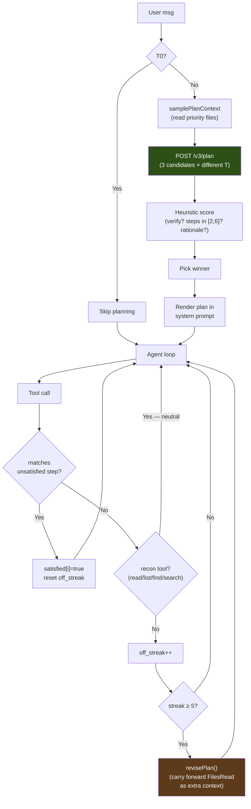

# Plan Mode

Plan mode is a pre-flight planning step that runs once per agent turn before the model starts calling tools. The planner samples 3 candidate plans from the LLM at different temperatures, scores each heuristically, and picks the best one. The winning plan goes into the system prompt and seeds an adherence gate that auto-revises when the model thrashes off-plan.

Designed to address two failure modes:

1. **Discovery thrashing.** Without a plan, the model's first 2–4 tool calls are often `read_file → list_directory → search_files → read_file → ...` — exploring instead of acting. With a plan, the system prompt tells it explicitly: read this, edit that, verify with curl.
2. **No-evidence "done"**. The plan's `verify_step` is treated as the proof-of-fix. The verification gate refuses `done` until that step has run successfully.

## End-to-end flow

## Components

### v3-service: `/v3/plan` (Python)

Defined in `v3-service/planning.py`; `v3-service/main.py` serves the route. The handler:

1. Renders `PLAN_PROMPT_TEMPLATE` with the user message + working dir + truncated project files.
2. Calls the LLM 3 times with seed offsets and temperatures `[0.3, 0.5, 0.7]`. By default it sends the optional `chat_template_kwargs: {enable_thinking: false}` control and reserves 2,048 output tokens for plan JSON. Supporting templates disable their reasoning channel; other templates ignore the flag. `ATLAS_PLAN_THINKING=1` requests reasoning and raises the budget to 8,192. No model-family prompt directive is injected.
3. Parses each raw response with a markdown-fence-tolerant + brace-depth-aware extractor (`_parse_plan_json`).
4. Scores each parsed plan with `_score_plan`:
   - **+0.3** for having a `verify_step`
   - **+0.2** for `len(steps) ∈ [2, 6]`
   - **+0.2** if the verify step's action references a known verification command (`pytest`, `python`, `curl`, `go test`, etc.)
   - **+0.1 per step** that targets a file the user named (capped at +0.2)
   - **+0.1** for a non-empty `rationale`
5. Picks the highest-scoring plan; tie-break favours fewer steps (less waffle).
6. If all candidates fail to parse, returns a one-step fallback (`{action: "investigate the request and act"}`) so the agent loop never blocks on planner failure.

API contract documented in [API.md § POST /v3/plan](API.md#post-v3plan).

### proxy: bridge, hook, gate (Go)

| File | Role |
|---|---|
| `proxy/v3_bridge.go` | `callV3PlanStreaming(reqCtx, v3URL, req, onProgress)` — opens the SSE stream, forwards progress events to the callback, returns the final `Plan` from the `event: result` frame. `reqCtx` binds the agent's request context so `/cancel` aborts an in-flight plan. Mirrors `callV3GenerateStreaming` for V3-pipeline runs. |
| `proxy/types.go` | `V3PlanRequest`, `Plan`, `PlanStep` types. `AgentContext` gains `Plan`, `PlanStepsSatisfied[]`, `PlanOffStreak`, `PlanRevisions`. |
| `proxy/agent.go` | `samplePlanContext()` walks priority files (app.py, templates/index.html, package.json, …) for the planner. `shouldGeneratePlan()` gates on tier + message length. `generatePlan()` runs the bridge, drops per-token noise, emits `plan_loaded` with the full step list. |
| `proxy/gates.go` | `matchPlanStep()` (loose tool-name + path-suffix match), `recordPlanAdherence()` (per-tool-call accounting; recon tools — `read_file`/`list_directory`/`find_file`/`search_files` — are neutral: they satisfy no step but never extend `off_streak`), `revisePlan()` (regenerate with `FilesRead` carried forward as extra context). |

The system prompt rendering happens in `buildSystemPrompt`. Plan steps are rendered as a numbered list with a `✓` marker on the verify step only, and the verify step is called out as the "evidence-of-fix" step that the verification gate guards against `done`. (The ☐/✓/⚐ per-step glyphs belong to the TUI rendering — see below.)

### tui: rendering (Go)

`tui/state.go` defines `planView` (state on the model) plus three `applyPlan*` handlers wired into `tui/model.go`'s chat dispatcher:

| Event | Handler | UI effect |
|---|---|---|
| `plan_loaded` | `applyPlanLoaded` | Replaces `m.plan` with the new plan; appends a multi-line chat row showing all steps with status glyphs. Revisions overwrite `m.plan` and reset Satisfied flags. |
| `plan_adherence` (matched) | `applyPlanAdherence` | Flips the matched step's `Satisfied` flag; appends a one-liner `✓ s2 satisfied · edit_file (1/3)`. |
| `plan_adherence` (unmatched) | `applyPlanAdherence` | **Silent** — off-plan calls only update internal state. Without this filter, every off-plan call would spawn a chat row, drowning out actual progress. |
| `plan_revise` | `applyPlanRevise` | Sets `Revising=true` on the current plan; appends `Plan revising (rev 1): <reason>`. Next `plan_loaded` (with `revision>0`) replaces it. |
| `v3_plan` | `formatV3StageEvent` | Renders the planner's own progress (`candidate 1/3 score=0.80`, `plan 1 won`) under a `plan` chat-row meta tag. |

## Tunables

Defined in `proxy/gates.go`:

| Constant | Default | Rationale |
|---|---|---|
| `planAutoReviseThreshold` | 5 | Non-recon off-plan tool calls before auto-revise fires (recon tools never extend the streak, so natural exploration doesn't count). Tight enough to catch a wrong plan early; loose enough that a few stray off-plan calls don't trigger thrashing. |
| `planMaxRevisions` | 2 | Cap on auto-revisions per loop. Past this, the loop runs plan-free for the remainder. Prevents pathological off-plan inputs from looping `/v3/plan` forever. |

`v3-service/planning.py` constants:

| Constant | Default | Rationale |
|---|---|---|
| `n_candidates` | 3 | Diverse sampling at temps `[0.3, 0.5, 0.7]`. More candidates → more wall time (~5–30s/candidate on the reference model). |
| `max_tokens` (per candidate) | 2048 | Empirically covers a 6-step plan with rationale. 1024 truncated mid-JSON in early testing. |

## When plan mode is skipped

Three predicates in `shouldGeneratePlan`:

1. **`ctx.BypassV3`** — a V3-bypassed turn (the baseline side of the split-pane demo) doesn't plan; its file writes bypass V3 later in the turn, so a plan would make that pane look orchestrated.
2. **`ctx.Tier == Tier0Conversational`** — trivial chat ("hi", "thanks") never plans.
3. **`len(message) < 12`** — short acks ("yes do it", "looks good") that depend on the prior turn's plan don't plan again.

Outside those, every turn plans. Failures (`/v3/plan` 5xx, network error, all candidates unparseable beyond the fallback) degrade silently — the loop runs without `ctx.Plan`, and the agent loop behaves as it does when plan mode is off.

## Cost

Wall time: **~5–30s per candidate** on the reference model (3-candidate sweep). Token cost: `3 × 2048 max_tokens` budget ≈ 1500 actual tokens per candidate × 3 = ~4500 tokens.

Both are paid up front before the agent's first tool call. The investment is recovered the moment the model skips a useless discovery round (each tool call is its own ~5–10s LLM round-trip plus tool execution).

## Testing

| Layer | File | What's covered |
|---|---|---|
| v3-service plan endpoint | `tests/v3-service/test_plan_scoring.py` (scorer); parser smoke-tested via `curl /v3/plan` | scorer recognizes language-specific linters as verification commands and does not credit recon calls as verification; parser tolerance (fences, prose preamble, brace-depth nesting) is exercised by the 3-candidate sampler |
| proxy bridge | `proxy/v3_bridge_test.go` | SSE parse, missing-result error, stage routing |
| proxy hook | `proxy/agent_test.go` | priority-file pickup, truncation thresholds, fallback walk, tier/length gating |
| proxy adherence | `proxy/gates_test.go` | match logic (tool name + path suffix), failed-call exclusion, revision cap, system-prompt rendering |
| TUI rendering | `tui/plan_test.go` | `planView` state transitions, plan_loaded replacement on revise, off-plan silence |
