<!-- source: docs/ARCHITECTURE.md synced-through: 4f1be83 -->
> **[English](../../ARCHITECTURE.md)** | **[简体中文](../zh-CN/ARCHITECTURE.md)** | **日本語** | **[한국어](../ko/ARCHITECTURE.md)**

# ATLAS アーキテクチャ

ATLAS V3.1.3 のシステムアーキテクチャ。二層構成: 外側のエージェントループがツールコールのオーケストレーションを担い、内側の V3 パイプラインがビルド検証とエネルギーベースの選択を通じて多様なコード候補を生成します。

---

## 1. システム概要

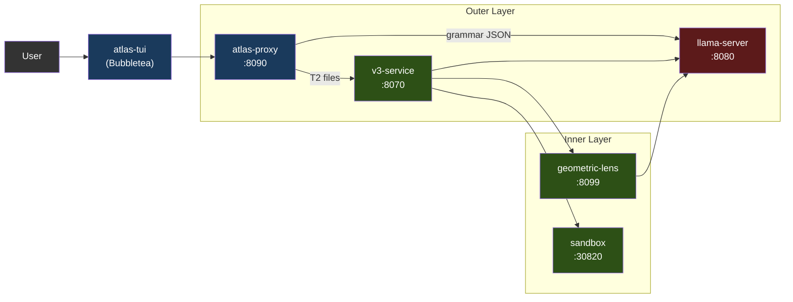

各サービスは Docker Compose 経由（推奨）でコンテナとして、または `atlas` ランチャー経由でローカルプロセスとして動作します。GPU を使うのは llama-server だけです。それ以外はすべて CPU 上で動きます。

チャットフロントエンドは **atlas-tui**（Bubbletea）です。ネイティブ Go 製のターミナル UI で、`/v1/agent`（ターンごとのチャット SSE）と `/events`（パイプラインペイン向けのグローバルな型付きエンベロープフィード）を消費します。`atlas`（対話モードのデフォルト）または `atlas tui`（明示指定）で起動します。パイプラインペインは V3 ステージをライブ表示し、チャットペインはアシスタントの Markdown を glamour でレンダリングします。スラッシュコマンド `/add /diff /commit /run` などがローカルファイルのコンテキストとシェルアウトを処理します。モードを意識した入力（チャット / `!bash` / `/slash`）にヒントドロップダウンが付きます。

ツールコール + V3 パイプラインを使いたいサードパーティクライアントは `/v1/agent` を直接対象にしてください。`/v1/chat/completions` は llama-server へのパススルーです（§3 を参照）。この契約は [API.md](../../API.md) に記載されています。

### 1.1 対応アクセラレータ

llama-server は GPU を使用する唯一のサービスです。それ以外のすべての ATLAS サービスは CPU 上で動作します（プロキシは Go、v3-service / geometric-lens / sandbox は Python）。これによりマルチバックエンドの対応面が小さく保たれます — 新しいアクセラレータを追加するには、新しい Dockerfile + エントリーポイントの環境変数分岐が必要なだけで、パイプラインへの変更は不要です。

| バックエンド | ステータス (V3.1.x) | イメージ / ビルドパス | Compose オーバーライド | 検証済みカード |
|---|---|---|---|---|
| **CUDA** (NVIDIA) | サポート対象 (Supported)（V3.1.0 以降） | `inference/Dockerfile.v31` → `atlas-llama` | (デフォルト) | RTX 5060 Ti 16GB（標準構成）。公開イメージは Blackwell（compute capability 12.0/12.1）のみを対象にコンパイルされており、それより前の世代はローカル再ビルドが必要 — [SETUP.md](./SETUP.md) を参照 |
| **ROCm / HIP** (AMD) | コミュニティ検証済み (Community-tested)（V3.1.1 以降） | `inference/Dockerfile.rocm` → `atlas-llama-rocm` | `docker-compose.rocm.yml` | RX 7900 XTX（コミュニティによるスモークテスト、GH #26） |
| **Metal** (Apple Silicon) | サポート対象 ([#32](https://github.com/itigges22/ATLAS/issues/32)) | ハイブリッド: ネイティブ llama-server (Metal) + 残りは Docker（macOS は GPU をコンテナにパススルーできないため） | `docker-compose.macos.yml` | M シリーズ; 16 GB 以下では Q4_K_M、24 GB 以上のユニファイドメモリでは Q6_K |
| **Vulkan**（クロスベンダーフォールバック） | プレビュー (Preview) | `inference/Dockerfile.vulkan` → `atlas-llama-vulkan` | `docker-compose.vulkan.yml` | lavapipe の CPU 起動パス（スモークテスト済み）。実 GPU での検証はまだなし |
| **SYCL** (Intel Arc) | ロードマップ (Roadmap) — Intel Arc は現在 `vulkan` を使用 | 未定 | 未定 | — |

**バックエンドの選択は実行時ではなくインストール時に行われます。** `atlas init` は `tier.detect_gpu()`（`atlas/cli/commands/tier.py` を参照）を実行し、検出されたすべてのベンダーの中から VRAM が最大の GPU を選び（`ATLAS_GPU_VENDOR` / `ATLAS_GPU_INDEX` でオーバーライド可能）、`.env` に `ATLAS_BACKEND={cuda|rocm|metal|vulkan}` を書き込みます。パッケージ済みのネイティブバックエンドが存在する場合、検出はそれに解決されます: NVIDIA には CUDA、x86_64 上の AMD には ROCm、macOS にはハイブリッド Metal パス。ホスト向けのネイティブバックエンドがパッケージされていない場合（Intel Arc、arm64 上の AMD、未認識のベンダー）、ウィザードは Vulkan ユニバーサルフォールバックを提案します（デフォルトは yes）: 1 つのイメージで AMD、Intel、Adreno、MoltenVK、lavapipe CPU ラスタライザをカバーし、性能はチューニング済みのネイティブバックエンドよりおおよそ 20〜40% 低くなります。起動しない `.env` を書き込む代わりに拒否するのは、使えるものが何も存在しない場合だけです。各バックエンドにはそれぞれ事前ビルド済みのイメージがあります。ユーザーがすべてのバックエンドのライブラリを同梱した肥大化したイメージを実行することはありません。

**持ち込みモデルの対応面 (V3.1.1)。** `atlas lens check` は、稼働中の llama-server に対する安価な事前チェックで、ロード済みモデルが Lens 互換かどうかを報告します。`atlas lens build --samples <path>` は `geometric-lens/geometric_lens/training.py` をラップし、モデルのネイティブ埋め込み次元で新しい C(x)（`cost_field.pt`）**と** G(x)（XGBoost）のアーティファクトをトレーニングします。この2つを組み合わせることで、ユーザーは Lens コードをフォークすることなくデフォルト以外の GGUF を差し込めます — C(x) コンストラクタは任意の `input_dim` を受け付けるため、モデルごとに変わるのはトレーニング済み重みだけです。ユーザー向けのフローは [CLI.md § atlas lens](../../CLI.md#atlas-lens) を参照してください。`atlas lens publish`（または統合コマンドの `atlas publish`）がアーティファクトを HuggingFace にアップロードし、そのハッシュを固定するレジストリ PR を開きます。

**ベンダー非依存な要素**（すべてのバックエンドで動作）: 文法制約付き JSON、セルフ埋め込み（`/embedding`）、レイヤーごとの隠れ状態、ASA 制御ベクトル（バックエンドを問わず llama.cpp の `control_vector_load` でロードされる）、KV キャッシュ量子化、外側のエージェントループ全体、V3 パイプライン、Geometric Lens、サンドボックス。

**バックエンドごとに異なる要素:**
- **Flash attention。** CUDA + ROCm: 完全サポート。Metal: 限定的（llama.cpp の Metal バックエンドは一部のヘッドサイズで flash-attn をサポート。未対応の場合はデフォルトでオフ）。Vulkan: ドライバ依存。
- **ピン留めホストメモリ。** `GGML_CUDA_NO_PINNED` は CUDA + ROCm に適用されます（HIP は GGML 互換レイヤーで CUDA のパスをミラーします）。Metal/Vulkan は CUDA/HIP のピン留めパスを使いません。
- **マルチ GPU + テンソル並列。** V1 はすべてのバックエンドでシングル GPU のみをサポートします。マルチ GPU は GH #34 で、特定のベンダーに紐づいてはいません。
- **Apple ユニファイドメモリ。** macOS は GPU とシステムメモリを共有します。「VRAM」の計算は実際には「合計 16 GB から OS + アプリを引いたもの」です。§7 を参照してください。

K3s デプロイパス（`scripts/install.sh`、`templates/` 内のマニフェスト）は V3.1.1 時点では CUDA 専用です — ROCm の K8s レシピは V3.2 のインフラ項目に延期されています（`/dev/kfd` + `/dev/dri` の hostPath マウントと `render`/`video` グループ所属が必要で、これは `docker-compose.rocm.yml` のクラスターレベル相当です）。

---

## 2. サービス

| サービス | ポート | 言語 | 役割 |
|---------|------|----------|---------|
| **llama-server** | 8080 | C++ (llama.cpp) | LLM 推論（CUDA / ROCm / Metal / Vulkan; SYCL はロードマップ — §1.1 を参照）、文法制約付き JSON、セルフ埋め込み、レイヤーごとの残差隠れ状態 |
| **atlas-proxy** | 8090 | Go | エージェントループ、ツールコールルーティング、ティア分類、`/v1/agent` SSE、`/events` 型付き SSE、`/cancel`。`/v1/chat/completions` は llama-server へそのままパススルー。 |
| **atlas-tui** | (クライアント) | Go | Bubbletea TUI; `/events` と `/v1/agent` の SSE ストリームを消費。 |
| **v3-service** | 8070 | Python | V3 パイプラインの HTTP ラッパー（PlanSearch、DivSampling、PR-CoT など） |
| **geometric-lens** | 8099 | Python (FastAPI) | 内部 `/internal/*` スコアリングサービス: C(x) エネルギースコアリング、G(x) XGBoost 品質予測、ステップごとのスコアリング、およびパターンキャッシュ（読み書き）。パターンキャッシュ、共起グラフ、タスクキューを支える SQLite ステートストア（`lens-state` ボリューム上の `SQLITE_DB_PATH`）を所有 |
| **sandbox** | 30820 (ホスト) / 8020 (コンテナ) | Python (FastAPI) | 分離されたコード実行、コンパイル、リント、テスト実行 |

---

## 3. atlas-proxy（外側のレイヤー）

プロキシはチャットフロントエンドのエントリーポイントです。`/v1/agent`（型付きイベントストリーム — TUI が使うもの）でユーザーメッセージを受け取り、llama-server を呼び出し、ツールコールをパースし、それらを実行し、イベントをストリームバックする内部エージェントループを実行します。`/v1/chat/completions` エンドポイントは llama-server への透過パススルーです。SDK 互換性のために残してあり、エージェントループは実行しません。イベントタイプの完全なカタログは [API.md](../../API.md) を参照してください。

プロキシは 12 個の Go ファイルで構成され、それぞれが 1 つの関心事を担います:

| ファイル | 担当 |
|---|---|
| `main.go` | HTTP サーバー、ルーティング、認証、パススルー、エラーエンベロープ、秘匿値のログフィルタ |
| `agent.go` | エージェントループ: ターン状態、LLM 呼び出し、プラン生成、パターンコンテキストの注入、スタックループのブレーカー |
| `tools.go` | 14 個のツール定義と実行系、ティア分類、ツールコール文法 |
| `gates.go` | 誠実性 / プランゲート: クレームチェック、構造、構文、埋め込みスクリプト、プラン遵守、プランリマインダ、アセットリント |
| `detectors.go` | スタックパターン検出: ツールの繰り返し、推論の繰り返し、トレースバックの局所化 |
| `context.go` | コンテキストの拡充: シンボルインデックス、プロジェクトスキャン、ワークスペース封じ込め、セッションファイルマニフェスト |
| `permissions.go` | パーミッションゲート（`/v1/permission`）、トラストモード、ハードブロックされたパターン |
| `lens.go` | レンズのスコアリング呼び出し、レンズサンプルのバンキング（`/feedback`）、キャリブレーション状態 |
| `guardrails.go` | ツールごとのステアリングガード（縮約、コマンド/モジュール欠落のステア、doctype 除去） |
| `events.go` | 型付きエンベロープのブローカー（`/events`）と SSE の配管 |
| `v3_bridge.go` | v3-service の `/v3/generate` + `/v3/plan` 向け SSE クライアント |
| `types.go` | 共有型、ティア、ターン上限 |

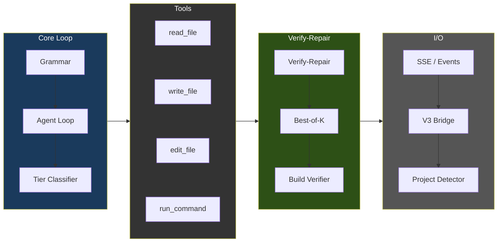

### エージェントループのフロー

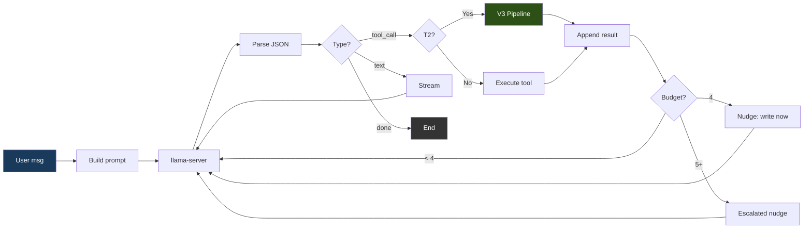

### 文法強制

すべてのモデル出力は、3つの有効な JSON 形状のいずれか1つへと制約されます:

```json
{"type": "tool_call", "name": "<tool_name>", "args": {...}}
{"type": "text", "content": "<message>"}
{"type": "done", "summary": "<summary>"}
```

デフォルトの `strict` モードでは、プロキシは完全な JSON スキーマ — `oneOf` と `additionalProperties: false` を用い、ツール名をレジストリから列挙したもの — を送信し、llama-server がそれをトークン生成中の文法として強制します。文法制約は不正な出力を稀にしますが、不可能にはしません: `ATLAS_GRAMMAR_MODE=loose` は `{"type":"json_object"}` のみを送信し（有効な JSON にはなるが形状は強制されない — 一部のモデルはこれを必要とします）、応答トークンの上限が JSON の途中で切り詰めることもあります。プロキシはパースを失敗し得るものとして扱います — 散文や `reasoning_content` から JSON を回復し、切り詰められたツール引数を実行前に検出し、的を絞ったパース失敗の説明をフィードバックし、3連続失敗でループを打ち切ります。

### ツール

`proxy/tools.go` に登録された14個のツール:

| ツール | 役割 | 読み取り専用 |
|------|---------|-----------|
| `read_file` | ファイル内容を読む（任意の offset/limit 付き） | はい |
| `outline_file` | ファイルのトップレベルの関数/クラスを行範囲付きで一覧表示し、本体は含めない（`.py` は tree-sitter、それ以外はベストエフォートのスキャン）。外科的読み取りのエントリーポイント: まずアウトラインし、次に offset/limit 付きで `read_file` する | はい |
| `write_file` | 新規ファイルを作成（既存の5行超ファイルでは拒否 — 安全制限を参照） | いいえ |
| `edit_file` | ≤10 行の変更向けの外科的なインライン文字列置換（old_str/new_str） | いいえ |
| `structural_edit` | tree-sitter セレクタ（`function:NAME`、`class:NAME`、`<tag>`）による関数/クラス/HTML 要素全体の書き換え; ノード全体の差し替えでは edit_file より優先して必須。GH #39、v1 では .py/.html/.htm のみ | いいえ |
| `delete_file` | ファイルまたは空ディレクトリを削除（実行後にループ終了を強制） | いいえ |
| `move_file` | ワークスペース内でファイルを移動またはリネーム（例: `index.html` → `templates/`）。純粋な移動 — V3/外科的編集のゲートをバイパスし、既存の宛先の上書きは拒否。シェルの `mv`/`cp` が拒否されるため「ファイルを再編成する」ための正規のパス | いいえ |
| `find_file` | ファイル**名** / パスによる正規表現検索（安価な存在確認 + 位置特定）。ファイル内容を grep する `search_files` とは区別される。 | はい |
| `search_files` | ファイル内容にまたがる正規表現検索（最大200件、.git/node_modules をスキップ） | はい |
| `list_directory` | ディレクトリ内容を種別とサイズ付きで一覧表示 | はい |
| `run_command` | サンドボックスコンテナ経由でシェルコマンドを実行; 5分のタイムアウト上限 | いいえ |
| `run_background` | サンドボックス内で長時間実行プロセス（例: `python app.py`）を開始; `job_id` を即座に返す | いいえ |
| `tail_background` | バックグラウンドジョブの新しい stdout/stderr を `job_id` で取得 | はい |
| `stop_background` | バックグラウンドジョブを `job_id` で SIGTERM/SIGKILL | いいえ |

### ツール選択バイアスの緩和策

計測を行ったリファレンスデプロイでは、`structural_edit` が正しい場合でも `structural_edit` より `edit_file` を優先するバイアスが観測されました（BiasBusters arxiv 2510.00307 — 近接するツール名の埋め込みが競合する; 名前よりも説明文の方が重要）。プロキシでは、モデルに依存しない4つの防御策を組み合わせます:

1. **説明文の書き換え**（`proxy/tools.go`）。edit_file の説明はファイル全体/関数全体での使用を警告し、structural_edit の説明は >10 行 / ノード全体の差し替えには必須と述べ、write_file の説明は新規ファイル専用と述べる。
2. **条件付き GBNF 文法**（`proxy/tools.go`、`proxy/agent.go:stepExclusions`）。既存の5行超 .py/.html/.htm ファイルに対する write_file が拒否されると、次の LLM 呼び出しはツール名のプロダクションから edit_file と write_file を禁止する GBNF 文法で制約される。モデルは物理的にそれらを発行できない。この制限は1回の判断後に失効する。
3. **ステップごとのツールリストフィルタ**（同じトリガー）。一時的な `[system note]` のユーザーメッセージが注入され、このステップでは structural_edit が唯一の構造的編集ツールであることをモデルに思い出させる。
4. **ASA ステアリングベクトル**（`geometric-lens/asa_calibration/`）。活性化ステアリングが残差ストリームの分布を上流でシフトさせ、いかなる拒否が発火する前の初回の判断でも structural_edit が優先される。`inference/entrypoint-v3.1.sh` が `/models/ast_edit_steering.gguf` から自動ロードするのは、その `.model` サイドカーが選択中のモデルと一致する場合のみ — `geometric-lens/asa_calibration/README.md` のワークフローで互換性のあるビルドを行えば、以降は常時オン。パス/スケール/レイヤー範囲は `ATLAS_CONTROL_VECTOR*` 環境変数でオーバーライドする。

   **モデル別の結合。** 各 ASA ベクトルは特定モデルの残差ストリーム幾何に対してトレーニングされます。モデルをまたぐフォールバックに安全なものはありません。`atlas asa check` は `.model` サイドカーを検証し、ロード済みの埋め込み次元をプローブし、GGUF のレイヤーメタデータをパースして、`compat` / `needs-build` / `incompatible` を報告します。`atlas asa build` はロード済みモデルから抽出レイヤーを導出し、ベクトルとマーカーを書き込み、lens コンテナ内で実行されます。`atlas asa publish` はアップロード前に、マーカーの欠落や不一致を拒否します。[CLI.md § atlas asa](../../CLI.md#atlas-asa) を参照。

### ファイルごとのティア分類

各 `write_file`/`edit_file` の呼び出しは独立して分類されます:

| ティア | 最大ターン数 | アクション |
|------|-----------|--------|
| T0（会話的） | 5 | テキスト応答のみ |
| T1（単純） | 0（上限なし） | 直接書き込み — V3 オーバーヘッドなし |
| T2（機能） | 0（上限なし） | V3 パイプライン発火 |
| T3（難しい） | 0（上限なし） | V3 パイプライン発火 |

ティアの上限は 0（上限なし）です。いつ打ち切るかはループ内の検出器スタックが決めます: lens リグレッション（`agent_lens_intervention`）、推論の繰り返し（`agent_reasoning_intervention`）、ツールコールの繰り返し（`agent_repeat_intervention`）、パス対応のエラーブレーカー、アクションなしの done ゲート、claim-check ゲート、プラン遵守の閾値、空応答のフォールバック。オペレーターは、単発の「アプリ全体を直す」プロンプト向けに `ATLAS_MAX_TURNS=<n>` でオーバーライドできます — `proxy/types.go::envOverrideMaxTurns` を参照。

分類器は `proxy/tools.go`（`classifyFileTier`）に、ロジックパターンマッチャーは同じファイル（`hasLogicIndicators`）にあります。

**常に T1（直接書き込み）:**
- 名前でマッチする設定ファイル（例: `package.json`、`go.mod`、`pyproject.toml`、`dockerfile`、`docker-compose.*`）
- 拡張子によるデータファイル（`.json`、`.yaml`、`.yml`、`.toml`、`.csv`、`.xml`、`.env`）
- スタイルファイル（`.css`、`.scss`、`.less`）
- ドキュメント（`.md`、`.txt`、`.rst`）とシェルスクリプト（`.sh`、`.bash`）
- **10 行未満**の自明なほど小さいファイル（そのサイズでは V3 が意味のある多様化を行う対象がない）
- ロジック指標のない未知の拡張子

設定ファイルの正確なリストと拡張子のセットは `proxy/tools.go:classifyFileTier` にあります。

**T2（V3 パイプライン）** — ファイルが 10 行以上であり、かつ以下のいずれかを満たす場合に該当:
- `hasLogicIndicators(content)` が true を返す — 関数/メソッド定義、制御フロー、エラー処理、Flask/FastAPI/Django ルーティング、Express/Node API、React の state/data、バリデーション、データベース呼び出し、JSX/React コンポーネントパターン、インポートをカバーするパターンファミリーにまたがる**2件以上の一致**（トークンの実リストは `proxy/tools.go:hasLogicIndicators` にあります）
- または、ファイルが認識されたソースコード / マークアップの拡張子（`.py`、`.go`、`.rs`、`.ts`、`.tsx`、`.js`、`.jsx`、`.html`、`.htm` など）を持ち、ロジック指標が発火しなかった場合 — T2 で疑わしきは罰せずの扱いを受ける（12行のコンポーネントの骨組みのような、最小だが本物のファイルをカバーする）

**T3（難しい）** — 現状、分類器が単独で T3 を発行することはありません。サイクロマティック複雑度のリファイナー（GH #39 のポイント2の `/internal/cyclomatic_complexity` 経由の `refineTierWithCC`）は McCabe CC に基づいて*エスカレート*します: CC ≥ 8 で T2 へ（T1 からも）、CC ≥ 16 で T3 へ。決してダウングレードはしません。

### プランモード（ターンごとの事前準備）

プランモードは、エージェントの各ターンで最初のツールコールより前に1回実行される事前プランニングステップです: プランナーが候補プランをサンプリングし、ヒューリスティックにスコア化し、勝者をシステムプロンプトにレンダリングします。そこでは、モデルがプランから逸脱して空回りすると遵守ゲートが自動修正します。探索の空回りを減らし、プランの検証ステップを守ることで証拠のない `done` をブロックします。

完全なフロー、コンポーネント、調整可能な値、スキップ条件、コスト、テストマトリクスは [PLAN_MODE.md](../../PLAN_MODE.md) を参照してください。

### 安全制限

オペレーター向けの制限と、それを調整するノブです。内部のステアリングガード（トレースバックの局所化、モジュール欠落/大文字小文字不一致のステア、シンボルグラウンディング、no-op/空コンテンツ/構文ゲート、doctype ストリップ）は `proxy/guardrails.go` と `proxy/agent.go` にあります。

| 制限 | 値 | 目的 |
|-------|-------|---------|
| 会話のトリム | スロットに合わせたスライディングウィンドウ: system + 最新のユーザー指示 + アクティブなファイルの内容 + `スロットあたりのコンテキスト − ATLAS_MAX_TOKENS − 2048` に収まるだけの末尾メッセージを保持（下限: 8 を保持; ハードな上限は `ATLAS_AGENT_HISTORY_BUDGET` 経由） | 編集中のファイルを落とすことなくコンテキストのオーバーフローを防ぐ |
| 冗長読み取りのショートサーキット | 未変更ファイルのファイル全体再読み取りは、内容がまだライブの場合に限り「すでにコンテキストにある」ポインタを返す; それ以外では完全なファイルが再提供される（`ATLAS_DEDUP_READS=0` で無効化） | モデルが盲目的に編集することなく、未変更ファイルを毎ターン再エンコードするのを避ける |
| V3 インタラクティブの実時間上限 | 単一の V3 パイプライン呼び出しは `ATLAS_V3_TIMEOUT`（デフォルト 180s）で上限。タイムアウト時、プロキシはモデルの構文ゲートされた内容にフォールバックする（`0` で無効化） | 長い修復の停滞の下でもインタラクティブセッションの応答性を保つ |
| ターンごとの推論予算 | 約 6144 推論トークンでストリームを打ち切る（`ATLAS_REASONING_BUDGET`、0 で無効）; 回復は埋め込まれた tool_call を抽出するか再プロンプトする | 推論のスパイラルを抑える |
| 既存ファイルへの write_file | ファイルが5行超なら拒否; .py/.html/.htm ではステップごとの文法ゲートが `structural_edit` へステアする | 外科的編集（`edit_file`）またはノード全体の編集（`structural_edit`）を強制する |
| 疑わしい縮小ガード | `oldSize >= 100B` かつ `newSize < 64B` のとき `structural_edit`/`edit_file` を拒否（`proxy/guardrails.go::validateNotSuspiciouslyShrunk`） | 破壊的なスタブ書き換えがディスクに到達する前に捕捉する |
| structural_edit の暴走コンテンツガード | `content` > 8 KB かつファイルサイズの > 4倍のとき拒否 | 置換ノードとして発行された推論リーク blob を捕捉する |
| エラーループブレーカー | 3連続失敗 | 暴走する失敗サイクルを停止 |
| 探索予算 | 4連続の読み取り専用呼び出しでナッジ; 5回以上でより強いナッジ。読み取りは常に実行されます — ナッジは*次の*ターンを書き込みへ誘導します | 際限なく探索する代わりに書くようモデルを押す |
| コマンド出力の切り詰め | stdout 8,000 文字、stderr 4,000 文字 | コンテキストの氾濫を防ぐ |
| 検索結果 | 最大200件; ファイル検索は 1 MB 超のファイルをスキップ | 検索コストを抑える |
| 切り詰め検出 | ツール引数の JSON パースチェック | 切り詰められたモデル出力を捕捉 |

---

## 4. V3 パイプライン（内側のレイヤー）

T2 以上のファイルに対する `write_file`/`edit_file` のエグゼキュータ内で起動します。パイプラインには4つのフェーズがあり、各段階で早期離脱できます。

### パイプラインのフロー

```mermaid
flowchart LR
    Entry["T2 detected"] --> Probe["Probe"] --> Score1["C(x)/G(x)"] --> SB1["Sandbox"]
    SB1 --> Pass1{"Pass?"}
    Pass1 -->|"Yes"| Done["Done"]

    Pass1 -->|"No"| PS["PlanSearch"] --> DS["DivSampling"] --> BF["BudgetForcing"] --> Build["Build Check"] --> Score2["Score K"] --> SB2["Test K"]

    SB2 --> AnyPass{"Passed?"}
    AnyPass -->|"2+"| SStar["S* Tiebreak"] --> Done
    AnyPass -->|"1"| Select["Lens Select"] --> Done

    AnyPass -->|"0"| FA["Failure Analysis"] --> PRCOT["PR-CoT"]
    PRCOT --> PRPass{"Pass?"}
    PRPass -->|"Yes"| Done
    PRPass -->|"No"| Refine["Refinement"]
    Refine --> RefPass{"Pass?"}
    RefPass -->|"Yes"| Done
    RefPass -->|"No"| Derive["Derivation"] --> Done

    style Entry fill:#1a3a5c,color:#fff
    style Done fill:#333,color:#fff
    style Probe fill:#1a3a5c,color:#fff
    style PS fill:#1a3a5c,color:#fff
    style DS fill:#1a3a5c,color:#fff
    style BF fill:#1a3a5c,color:#fff
    style SStar fill:#2d5016,color:#fff
    style Select fill:#2d5016,color:#fff
    style Score1 fill:#2d5016,color:#fff
    style Score2 fill:#2d5016,color:#fff
    style SB1 fill:#2d5016,color:#fff
    style SB2 fill:#2d5016,color:#fff
    style Build fill:#2d5016,color:#fff
    style PRCOT fill:#5c3a1a,color:#fff
    style Refine fill:#5c3a1a,color:#fff
    style Derive fill:#5c3a1a,color:#fff
    style FA fill:#5c3a1a,color:#fff
```

凡例: 青 = 生成、緑 = 検証/選択、茶 = 修復。

### フェーズの詳細

**フェーズ0: Probe** は段階的な予算リトライ（light → standard → nothink）で単一のベースライン候補を生成します。選択中のモデルの C(x)/G(x) アーティファクトでスコア化され、サンドボックスでテストされます。合格すれば、パイプラインは即座に離脱します。

**候補割り当て: CxGx ゲート**（`phase2` / `phase2_allocated` として送出）が、失敗したプローブに何個の候補を与えるかを決めます。プローブの C(x)+G(x) 合成スコア（埋め込み抽出1回、両モデルを使用）が2段階のルールを駆動します: キャリブレーション済みの C(x) 正規化エネルギーが、Budget Forcing と同じ梯子の上でベースティアを選び、G(x) の品質スコアがモデルのキャリブレーション済み severe 境界を下回るときにそのティアを +1、大きく下回る（その 0.75 倍）ときに +2 だけ引き上げます — プローブが C(x) には安く見えるのに G(x) には誤りに見えるケースです。ティアが k を決め（`nothink` 1、`standard` 3、`hard` 5、`extreme` 8）、そこに **k >= 3 のハードなフロア**が掛かります。したがってゲートは、以前ピン留めされていた k=3 に候補を追加することしかできず、減らすことはできません。最悪ケースが従来の挙動になります。どちらの信号もこのモデルのキャリブレーションファイル（`cx_normalization.json`、`gx_thresholds.json`）を必要とします: レンズが欠落・到達不能・未キャリブレーションの場合は `standard` でちょうど k=3 を割り当てるため、未キャリブレーションのバンドルは、そのモデルにとって意味を持たない尺度でルーティングされるのではなく、従来どおりのパイプラインを走らせます。

このフロアが、以前に削除された C(x) のみのアロケータとの違いです: あちらにはフロアがなく、プローブが*ちょうど失敗した*タスクに k=1 を渡してしまい、測定値は +0.0 pp でした。n=175/アームでの4アーム三角測量: ゲートあり 66.9%、固定 k=3 が 64.6%、同じティア構成をタスク間でシャッフルしたものが 61.7%、すべて k=8 が約27%多いトークンで 67.4%。同じ支出でシャッフルアームを 5.1 pp 上回ったことが、計算量だけでなくレンズの信号が情報を担っていると言える根拠です。

ライブパスとの違い: プロキシの V3 ブリッジは `ATLAS_V3_TIMEOUT`（デフォルト 180s）でパイプライン呼び出しを打ち切ります。これはベンチには存在しなかった上限で、k=8 への無制限なエスカレーションは予算を生成に使い切り、時間内に出せたはずの k=3 の答えではなくタイムアウトのフォールバックを返すことになります。そのためライブのオーケストレータは、残りの実時間とそのタスクで観測された呼び出しごとのレイテンシを渡し、ゲートは予算内で実際に生成できる水準までティアを下げます — エスカレーションがフェーズ3を枯渇させないようリファインメント1回分を確保しつつ、フロアを下回ることはありません。ベンチランナーは予算を渡さず、測定されたとおりに割り当てます。実装は `v3-service/stages/cxgx_gate.py` で、両方のオーケストレータが共有します。

**フェーズ1: 制約駆動の生成**

- **PlanSearch** は異なる制約セットを抽出することで、構造的に異なる3つの実装プランを生成します
- **DivSampling** は摂動の多様性を適用します: 4つのロール（competitive_programmer、systems_engineer、mathematician、pragmatist）+ 4つの指示（step_by_step、edge_case_first、complexity_aware、constraint_driven）+ 4つのスタイル（functional、pythonic、optimize_iteratively、structured）
- **Budget Forcing** は思考トークンの割り当てを制御します:

| ティア | 思考トークン | Wait 注入 |
|------|----------------|----------------|
| nothink | 0 | テンプレートレベルで thinking 無効 |
| light | 1,024 | なし |
| standard | 2,048 | 思考が < 512 トークンで終わった場合 |
| hard | 4,096 | 思考が < 1,024 トークンで終わった場合 |
| extreme | 8,192 | 思考が < 2,048 トークンで終わった場合 |

Wait 注入は、より長い推論パスを要求するために「Wait, let me reconsider.\n」を追加します。ティア選択は、選択中のモデルのキャリブレーション済み C(x) エネルギーを使用します。キャリブレーションがない場合、ATLAS は別のモデルの定数を借りるのではなく、設定されたデフォルトの予算を使用します。

**フェーズ2: 検証と選択**

- **ビルド検証**: Python（`py_compile`）、TypeScript（`tsc --noEmit`）、JavaScript（`node --check`）、Go（`go build`）、Java（`javac`）、Kotlin（`kotlinc`）、Rust（サンドボックスの `/execute` パスでは `rustc`。`Cargo.toml` のあるプロジェクトは検出されて `cargo build`、`cargo check` はビルドコマンドの許可リスト経由でのみ受理される）、C/C++（`/execute` では `-Wall` 付きの完全な `gcc`/`g++` コンパイル。`-fsyntax-only` が適用されるのは `/syntax-check` ルートのみ）、Ruby（`ruby -c`、インタプリタ言語のためコンパイル段階なし）、PHP（`php -l`、同上）、Shell（`bash -n`）。Next.js、React、Flask、Django、Express にはフレームワーク別のオーバーライドあり。
- **拒否権（Veto）**: サンドボックスを通過した候補でも、3つのチェックが却下し得ます — レンズ拒否権（ステップごとの `gx_min` がモデルのキャリブレーション済み severe しきい値を下回る場合: コードは実行できるが、生成パターンがスタブへ崩れている）、構造拒否権（tree-sitter が、ローカル定義・import・組み込み・プロジェクトシンボルのいずれにも解決しない直接識別子の呼び出しを検出した場合 — 発生待ちの `NameError`）、そしてフラッグで制御される呼び出しグラフ拒否権（`ATLAS_CALL_GRAPH`: スコープ内に定義のないファイル横断の呼び出し）。拒否された候補は失敗として記録され（`passed=false`、`vetoed_by`、拒否理由をエラー出力として持つ）、他の失敗候補と同様にフェーズ3の修復プールに入ります。最終的なエネルギーのフォールバックがそれを返すことはありません。すべての候補が拒否され修復も失敗した場合、パイプラインはコードを返さず、呼び出し元が自身のベースラインで代替します
- **Lens 選択**（1件以上が合格）: C(x) エネルギーでソートし、最低が勝つ

**フェーズ3: 修復**（0/K 合格の場合） — 3つの戦略を早期離脱付きで順次実行:

- **失敗分析**: 失敗を分類する（wrong_algorithm、implementation_bug、edge_case_miss、time_limit、format_error、partial_correct）
- **メタ認知評価**: 観測された失敗カテゴリから導出した補償制約を注入する
- **PR-CoT**: 4つの視点（logical_consistency、information_completeness、biases、alternative_solutions）×（分析 + 修復）= 約8回の LLM 呼び出し、最大3ラウンド
- **Refinement Loop**: 失敗分析 → 制約のリファイン → コード生成 → テスト → 学習。2反復、120秒予算、各約5回以上の LLM 呼び出し。コサイン距離フィルタリング（>= 0.15）が仮説の繰り返しを防ぐ
- **Derivation Chains**: 最大5つのサブ問題に分解し、それぞれをサンドボックスで検証し、最終形を合成する。約7回以上の LLM 呼び出し

### モジュールマップ

`v3-service/stages/` 内の13個の Python モジュールがパイプラインステージです。`v3-service/pipeline.py` はそのうち11個をオーケストレーションします（10個は直接、`constraint_refinement` はリファインメントループ経由）; `lens_feedback` と `embedding_store` はオフラインのベンチランナー（`atlas/bench/v3_runner.py`）の下でのみ動作します。ベンチランナーはチェックアウトの `v3-service/` を自身のパスに載せるため、両方の呼び出し元が単一のステージ実装を共有します:

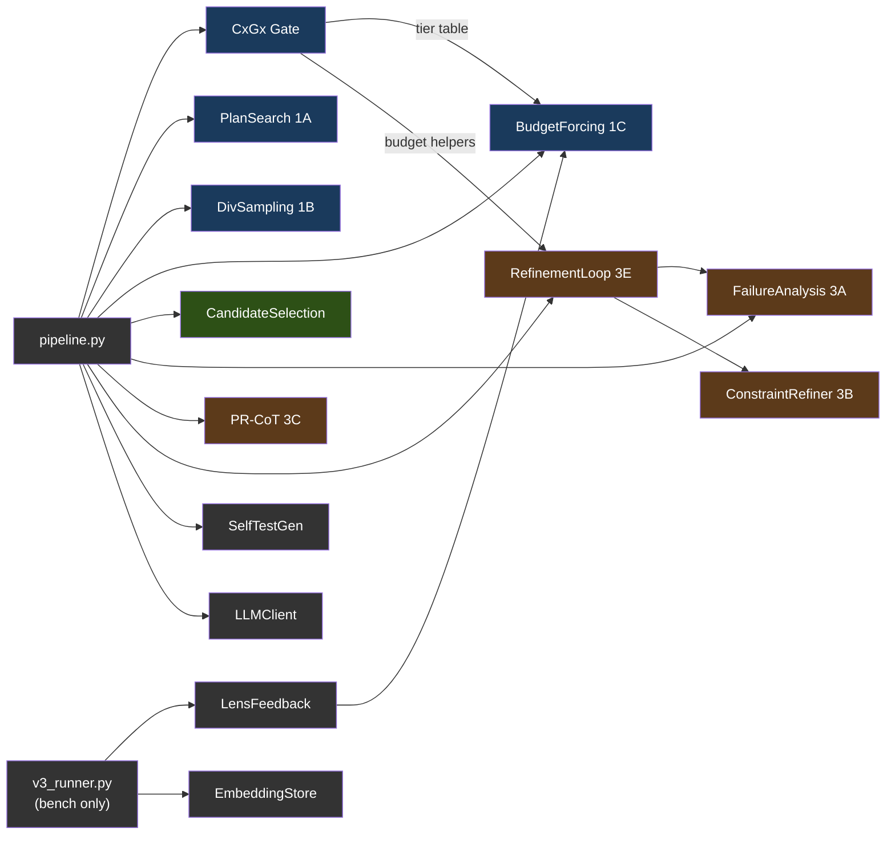

凡例: 青 = フェーズ1（生成）、緑 = フェーズ2（選択）、茶 = フェーズ3（修復）、グレー = ユーティリティ。`v3_runner.py` から供給されるモジュールはベンチランナー専用で、サービスはそれらを呼び出しません。サービス自体は `main.py`（HTTP ハンドラ）→ `pipeline.py`（オーケストレータ）→ `planning.py` / `scoring.py` / `symbols.py` / `adapters.py` というフラットな兄弟モジュール構成です。

---

## 5. Geometric Lens

モデルの埋め込みの幾何構造を分析することで、コードを実行せずにその品質を評価するニューラルスコアリングシステム。完全に CPU 上で動作します。サービスの表面は内部専用（`/internal/*`）です: C(x)/G(x) のスコアリング（単発およびステップごと）に加え、以前のセッションで得た教訓をエージェントループへ還流させる[パターンキャッシュ](#パターンキャッシュ)。

#### なぜ「Geometric Lens」なのか?

Geometric Lens の背後にある核心的なアイデアは、シンプルな前提から来ています: モデルのスケーリングをやめ、支援インフラで包み始めること。Jose Crespo の[「Everyone's Wrong About AI Programming」](https://www.josecrespophd.org/p/everyones-wrong-about-ai-programming)は、現在の LLM が正しいコードパスと正しくないコードパスのコストが同じになるフラットな埋め込み空間で動作するため、AI 生成コードはエラーへと漂流すると論じています。解決策は、正しいコードが「下り坂」で正しくないコードが「上り坂」になるようなエネルギー地形をモデルの周りに構築することです。

Anthropic の [Manipulating Manifolds](https://transformer-circuits.pub/2025/linebreaks/index.html) 研究は、トランスフォーマーがすでに埋め込み空間に操作可能な幾何構造を作り出しているという証拠を提供しています — 原材料はすでにそこにあります。Bar らの [Geometric Unification of Generative AI](https://arxiv.org/html/2510.00666v1) は、データ多様体上の距離関数がどのように学習され、スコアリングに使えるかを定式化しています。

ATLAS はこれを2つの補完的なモデルで実装します。C(x) は、選択中のモデル自身の埋め込み上の学習されたエネルギー関数（`hidden_dim`→512→128→1 の MLP）です。各コード候補は llama-server によって埋め込まれ、C(x) はそれがその幾何のどこに位置するかをスコア化します。低いエネルギーは候補が既知の正しいコードとクラスタリングすることを意味します。高いエネルギーは既知の正しくないコードとクラスタリングすることを意味します。外部オラクルも実行も不要 — ただ選択中のモデルの表現の幾何だけです。

G(x) は品質予測器です — PCA で次元削減した埋め込み上の XGBoost 分類器で、候補が削減後の空間のどこに位置するかから合格/不合格を予測します。C(x) が「この候補はどれくらい良いか?」に答えるのに対し、G(x) は「この候補は合格しそうか?」に答えます。これが唯一の G(x) 実装です: 以前の計量テンソルによる定式化とその correctability エンドポイントは、XGBoost がデプロイされるパスになった時点で削除されました（幾何を意識したバリアントは git 履歴を参照）。

### スコアリングモデル

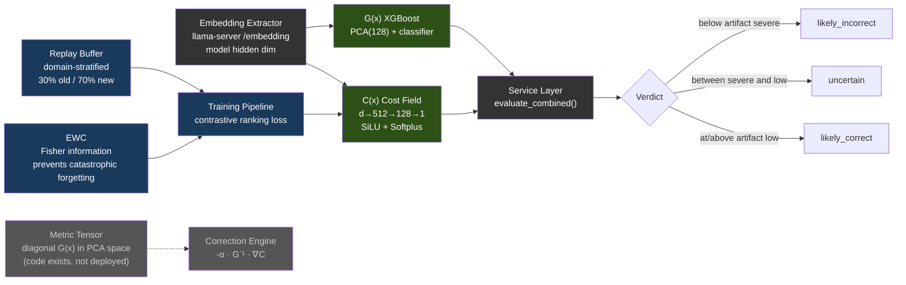

以下の数値は、公開済みの V3 研究に使われた凍結されたリファレンスアーティファクトを記述するものです。これらは出自の記録であり、ランタイムの次元やデフォルトではありません:

| モデル | リファレンスアーキテクチャ | トレーニングデータ | 性能 |
|-------|-------------|---------------|-------------|
| **C(x)** | 4096→512→128→1 MLP（SiLU, Softplus） | 597 個の LCB 埋め込み（504 PASS, 93 FAIL） | Val AUC 0.9467、分離 2.04x |
| **G(x)** | PCA(4096→128) + XGBoost | 13,398 個の埋め込み（4,835 PASS, 8,563 FAIL） | PCA 80.8% 分散 |

C(x) の正規化は `sigmoid(steepness × (energy - midpoint))` です。両方の値は選択中のモデルの `cx_normalization.json` が供給します。`atlas lens build` は、そのモデルのラベル付き PASS/FAIL 候補からこれらを導出します。同様に、G(x) の判定閾値は `gx_thresholds.json` に由来します。どちらのキャリブレーションもない場合、正規化された判定はリファレンスアーティファクトのスケールを借りるのではなく、中立/未キャリブレーションに留まります。

現行のすべての Lens バンドルには `model_identity.json` も含まれます。サービスはそのモデル名が、llama-server の `/v1/models` が報告する提供モデル id（プローブが失敗した場合のフォールバックは `ATLAS_MODEL_NAME`）と一致することを要求します。埋め込み幅の一致だけでは、2つの異なるモデル間の互換性を立証できないからです。

> **注:** モデルの重み（.pt、.pkl ファイル）はリポジトリにコミットされていません — トレーニング中にビルドされ、コンテナイメージに焼き込まれるか、実行時にマウントされます。モデルファイルが存在しない場合、サービスは緩やかにデグレードします: C(x) は中立エネルギーを返し、G(x) は `gx_score: 0.5` と `verdict: "unavailable"` を返します。トレーニングデータと重みは [HuggingFace](https://huggingface.co/datasets/itigges22/ATLAS) で公開しています。

### パターンキャッシュ

セッションをまたぐ記憶: 成功した実行の後に書き込まれたパターンが、以後のエージェントループにコンテキストとして提供されます。

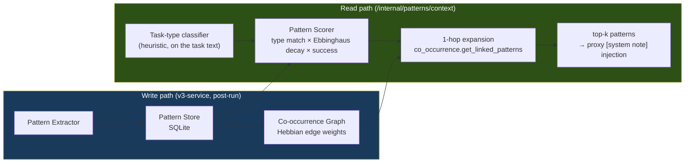

モジュール: `geometric-lens/cache/{pattern_store, pattern_extractor, pattern_scorer, co_occurrence, seed_patterns}.py`。マッチングはパターン種別 + 新しさ + 成功率で行われ、検索インデックスは存在しません。ストアは初回起動時に `seed_patterns` で自身をシードし、提供のたびにそのパターンのアクセス統計を更新します。消費側はプロキシのパターンコンテキスト注入です（§3）。

<a id="rag--pageindex-v2"></a><a id="confidence-router--pattern-cache"></a>

> **削除されたサブシステム。** 以前のリリースには、RAG/PageIndex のプロジェクトインデクサ、BM25 のパターンマッチャ、そして Thompson サンプリングによる信頼度ルーターがレンズ内に同梱されていました。これらはプロダクト内のどこからも呼ばれていないレンズのエンドポイント経由でしか到達できず、2026-08 の簡素化キャンペーンで削除されました（CHANGELOG を参照）。上記のパターンキャッシュが、そのスタックから残ったものであり、常時オンの単一リーダーを中心に作り直されています。

---

## 6. サンドボックス

コンパイル、テスト、リントを伴う分離されたコード実行。

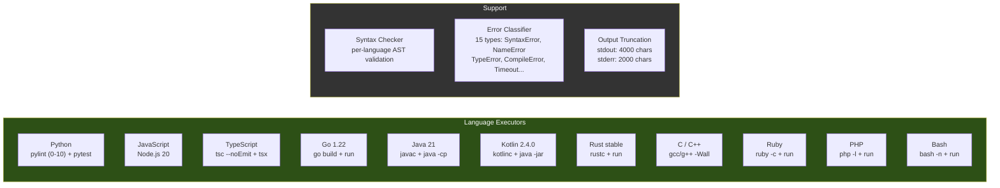

受け付ける言語エイリアス: `py`/`python3`（Python）、`js`/`node`（JavaScript）、`ts`（TypeScript）、`golang`（Go）、`java`（Java）、`kt`/`kts`（Kotlin）、`rs`（Rust）、`c++`（C++）、`rb`（Ruby）、`php`（PHP）、`sh`/`shell`（Bash）。一般的な CLI ツールはイメージに焼き込まれており（`git`、`sqlite3`、`jq`、`patch`、`zip`/`unzip`、`xz`、`curl`）、加えてバイナリ検査用のツール（binutils 由来の `strings`、`objdump`、`readelf`、`nm`、および `file`、`xxd`）も含まれます — コンテナは読み取り専用ベース上で非 root として動作するため、タスクがシェルアウトする先はすべて事前にインストールされている必要があり、実行時に apt で入れることはできません。バイナリに対する `read_file` は生のバイト列ではなく、これらのツールへの案内を返します。最大実行時間: Docker デプロイでは300秒（compose がプロキシの `run_command` の5分上限に合わせて `MAX_EXECUTION_TIME=${ATLAS_SANDBOX_MAX_EXECUTION_TIME:-300}` を設定します; 素のコードのデフォルトは60秒）。メモリ、CPU、プロセス数の上限はコンテナレベルです: compose が `mem_limit ${ATLAS_SANDBOX_MEM:-4g}`、`cpus ${ATLAS_SANDBOX_CPUS:-2}`、`pids_limit ${ATLAS_SANDBOX_PIDS:-1024}` を設定し、`atlas init` はホストに応じた値（RAM とコア数の約 75%）を `.env` に書き込みます。2つのワークスペースパス: **`/execute`**（V3 候補テストパス）は `/tmp/sandbox`（tmpfs）下の一時的なスクラッチディレクトリを使用; **`/shell`**（エージェントの `run_command` ルート、加えてバックグラウンドプロセス向けの `/jobs/*`）は `/workspace` — `ATLAS_PROJECT_DIR`（Docker）または hostPath `${ATLAS_PROJECTS_DIR}`（K3s）からバインドマウントされたプロジェクトルートで、プロキシが見るのと同じパス — に対して実行します。

---

## 7. VRAM 予算の例

9B Q6 モデルと 32K コンテキストを使った、計測済みの RTX 5060 Ti 16GB デプロイの一例:

| コンポーネント | VRAM |
|-----------|------|
| Qwen3.5-9B-Q6_K モデル重み | 約 6.9 GB |
| KV キャッシュ（32K コンテキスト） | 約 1.3 GB |
| **llama-server 合計** | **約 8.2 GB** |
| Geometric Lens | 0（CPU 専用、モデル用に約 12 MB RAM、PyTorch ランタイム用に約 128 MB） |
| v3-service | 0（CPU 専用） |
| sandbox | 0（CPU 専用） |
| atlas-proxy | 0（Go バイナリ、約 30 MB RAM） |
| **空き VRAM** | **約 7.8 GB** |

llama-server 以外のすべての計算は CPU 上で動作します。GPU は LLM 推論と埋め込み抽出に専ら使われます。

### 7.1 バックエンドごとの VRAM 予算

上記の 8.2 GB / 空き 7.8 GB の分割は一例であり、ATLAS のモデルデフォルトではありません。実際の使用量は、`atlas init` が選択したモデル、量子化、コンテキスト、並列スロットの設定に従います。他のバックエンドは構造的に異なります:

| バックエンド | 報告される「VRAM」 | 負荷時の現実的な予算 | 備考 |
|---|---|---|---|
| **CUDA**（専用 VRAM） | ハードウェアスペック（標準構成の 5060 Ti では 16 GB） | スペックの約95%（ドライバが約 500 MB を予約） | 上の表の数値がそのまま適用される。 |
| **ROCm**（専用 VRAM） | ハードウェアスペック | スペックの約90〜95%（HIP ランタイムは CUDA よりわずかに重い） | RX 7900 XTX（24 GB）→ 14B Q5 + 32K コンテキストを2並列スロットで余裕をもって実行。 |
| **Metal**（Apple ユニファイド） | システム RAM 合計 | システム RAM の**約70%** | OS + ブラウザ + IDE が約30%を消費する。16 GB の MBP は*現実的に* 11 GB の予算 — macOS 自身の GPU ワーキングセットが同じメモリに載ることを考えると、Qwen3.5-9B Q6_K（§7 より、重み約 6.9 GB + 32K で KV 約 1.3 GB）にはほとんど余裕がない。16 GB 以下では Q4_K_M（5 GB）を使う; Q6_K は 24 GB 以上のユニファイドメモリが必要。 |
| **Vulkan**（クロスベンダー） | ハードウェアスペック | 計測済みのデプロイはまだなし（プレビュー — lavapipe の CPU パスでのみ検証） | 同じカード上でも、チューニング済みのネイティブバックエンドより約 20〜40% 低い性能を想定。 |
| **SYCL**（Intel Arc） | ハードウェアスペック | ロードマップ — Intel Arc は現在 Vulkan を使用 | A770（16 GB）ターゲットは NVIDIA 16 GB と保守的に同等。 |

---

## 8. デプロイ

サービスの依存グラフ（すべてのデプロイモードで同一）:

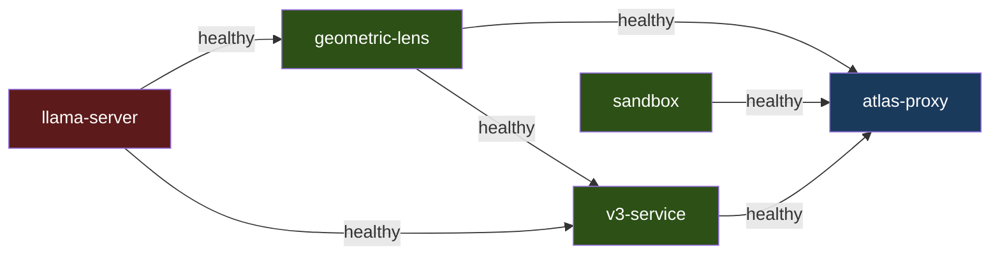

`llama-server` と `sandbox` は独立して起動します。`geometric-lens` は `llama-server` が healthy になるのを待ちます; `v3-service` は `llama-server` と `geometric-lens` を待ちます; `atlas-proxy` は `llama-server`、`geometric-lens`、`v3-service`、`sandbox` を待ちます。同じ `inference/entrypoint-v3.1.sh` が Docker Compose、ベアメタル、K3s を駆動するため、コンテキストサイズ、KV キャッシュ量子化、flash attention、mlock は環境変数で制御され、挙動はこれらのモード間で同一です。macOS ハイブリッドパスは `scripts/atlas-llama-macos.sh` 経由でネイティブ llama-server を起動し、このスクリプトはエントリーポイントのフラグをミラーします。

インストールとモード別の立ち上げ手順（NVIDIA / ROCm オーバーライド、ベアメタル、macOS ハイブリッド Metal、K3s マニフェスト）は [SETUP.md](./SETUP.md) に、macOS ネイティブパスは [SETUP_MACOS.md](../../SETUP_MACOS.md) にあります。

---

## 9. データフロー

### T1: 単純なファイル書き込み

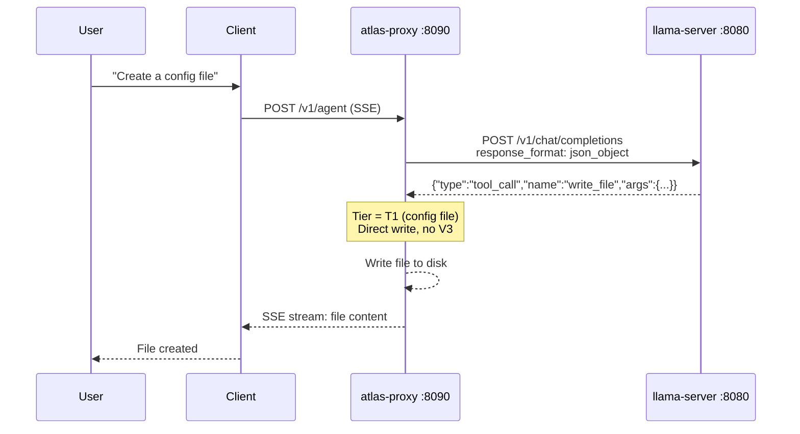

1回の LLM 呼び出し。V3 オーバーヘッドなし。

### T2: 機能ファイル書き込み

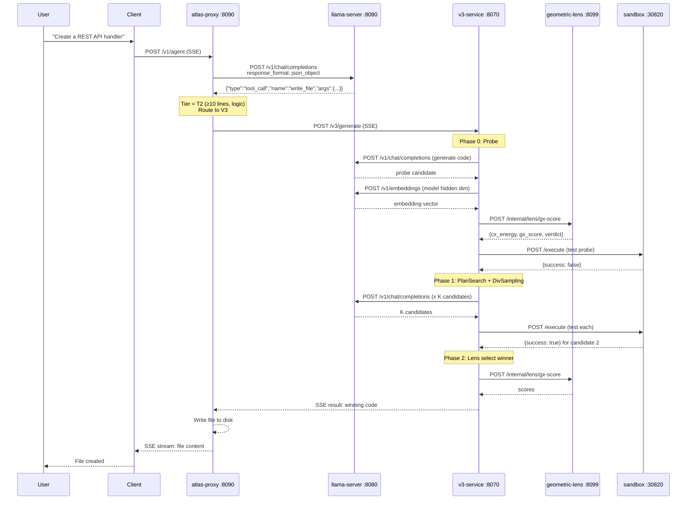

アルゴリズム的なタスクでは最低3回の llama-server 呼び出し（probe 生成1回 + セルフテスト生成1回 + 埋め込み抽出1回）。インタラクティブなタスク（ゲーム、UI、フレームワークコード）はセルフテスト生成をスキップするため、最低は2回です。フェーズ3の修復がすべての戦略を発動させると最大30回以上。

### 既存コードの編集

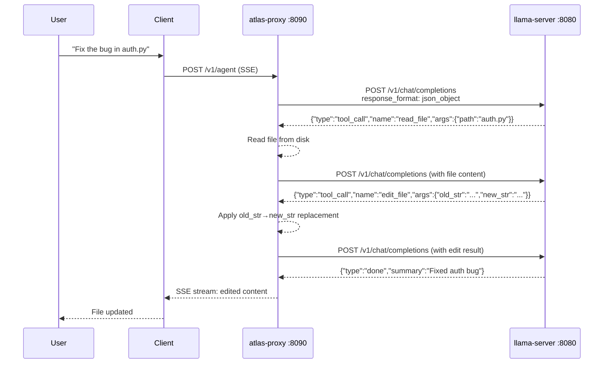

5行を超える既存ファイルは `write_file` で拒否されます — モデルは `edit_file`（外科的、≤10 行）または `structural_edit`（ノード全体の書き換え、.py/.html/.htm のみ）を使う必要があります。`.py`/`.html`/`.htm` ファイルでは、ステップごとの文法ゲート（BiasBusters #2）が次の判断のためにツール名のプロダクションから `edit_file`/`write_file` を能動的に禁止し、モデルが間違ったショートカットに逆戻りできないようにします。
