<!-- source: docs/ARCHITECTURE.md synced-through: 4f1be83 -->
> **[English](../../ARCHITECTURE.md)** | **[简体中文](../zh-CN/ARCHITECTURE.md)** | **[日本語](../ja/ARCHITECTURE.md)** | **한국어**

# ATLAS 아키텍처

ATLAS V3.1.3의 시스템 아키텍처입니다. 2계층 설계로, 바깥쪽 에이전트 루프가 도구 호출 오케스트레이션을 담당하고, 안쪽 V3 파이프라인이 빌드 검증과 에너지 기반 선택을 통해 다양한 코드 후보를 생성합니다.

---

## 1. 시스템 개요

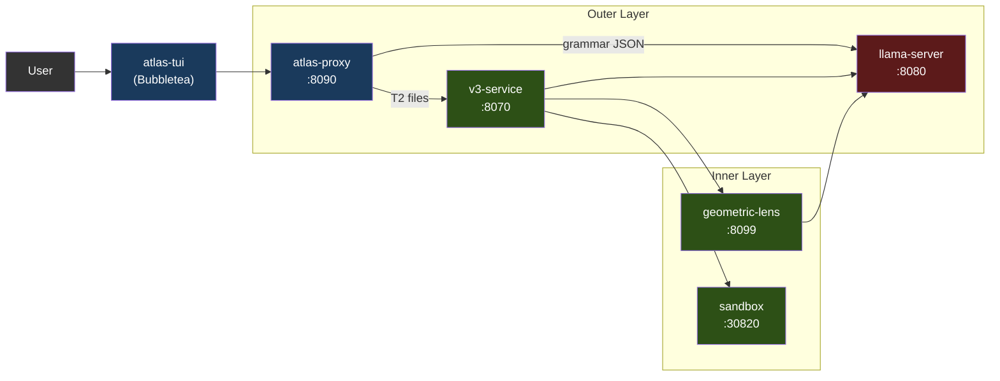

서비스는 Docker Compose(권장)를 통해 컨테이너로 실행되거나, `atlas` 런처를 통해 로컬 프로세스로 실행됩니다. GPU를 사용하는 것은 llama-server뿐입니다. 나머지는 모두 CPU에서 돌아갑니다.

채팅 프론트엔드는 **atlas-tui**(Bubbletea)입니다. `/v1/agent`(턴별 채팅 SSE)와 `/events`(파이프라인 패널용 전역 타입 봉투 피드)를 소비하는 네이티브 Go 터미널 UI입니다. `atlas`(대화형 기본값) 또는 `atlas tui`(명시적)로 실행합니다. 파이프라인 패널은 V3 단계를 실시간으로 보여주고, 채팅 패널은 어시스턴트 마크다운을 glamour로 렌더링합니다. 슬래시 명령 `/add /diff /commit /run` 등이 로컬 파일 컨텍스트와 셸 호출을 처리합니다. 모드 인식 입력(채팅 / `!bash` / `/slash`)에 힌트 드롭다운이 함께 제공됩니다.

도구 호출 + V3 파이프라인을 원하는 서드파티 클라이언트는 `/v1/agent`를 직접 대상으로 합니다. `/v1/chat/completions`는 llama-server로의 패스스루입니다(§3 참고). 계약은 [API.md](../../API.md)에 문서화되어 있습니다.

### 1.1 지원 가속기

llama-server는 GPU를 사용하는 유일한 서비스입니다. 다른 모든 ATLAS 서비스는 CPU에서 돌아갑니다(프록시는 Go, v3-service / geometric-lens / sandbox는 Python). 덕분에 다중 백엔드 표면이 작게 유지됩니다 — 새 가속기를 추가한다는 것은 파이프라인을 변경하는 것이 아니라 새 Dockerfile + 엔트리포인트 환경 변수 분기를 추가하는 것을 의미합니다.

| 백엔드 | 상태 (V3.1.x) | 이미지 / 빌드 경로 | Compose 오버라이드 | 테스트된 카드 |
|---|---|---|---|---|
| **CUDA** (NVIDIA) | 지원(Supported) (V3.1.0부터) | `inference/Dockerfile.v31` → `atlas-llama` | (기본값) | RTX 5060 Ti 16GB (정규). 게시된 이미지는 Blackwell(컴퓨트 캐퍼빌리티 12.0/12.1) 전용으로 컴파일되어 있으며, 이전 세대는 로컬 재빌드가 필요합니다 — [SETUP.md](../ko/SETUP.md) 참고 |
| **ROCm / HIP** (AMD) | 커뮤니티 검증(Community-tested) (V3.1.1부터) | `inference/Dockerfile.rocm` → `atlas-llama-rocm` | `docker-compose.rocm.yml` | RX 7900 XTX (커뮤니티 스모크 테스트, GH #26) |
| **Metal** (Apple Silicon) | 지원 ([#32](https://github.com/itigges22/ATLAS/issues/32)) | 하이브리드: 네이티브 llama-server (Metal) + 나머지는 Docker (macOS는 컨테이너로 GPU 패스스루 불가) | `docker-compose.macos.yml` | M 시리즈; ≤16 GB에서 Q4_K_M, ≥24 GB 통합 메모리에서 Q6_K |
| **Vulkan** (크로스 벤더 폴백) | 프리뷰(Preview) | `inference/Dockerfile.vulkan` → `atlas-llama-vulkan` | `docker-compose.vulkan.yml` | lavapipe CPU 부팅 경로 (스모크 테스트됨); 실제 GPU 검증은 아직 없음 |
| **SYCL** (Intel Arc) | 로드맵(Roadmap) — Intel Arc는 현재 `vulkan` 사용 | 미정 | 미정 | — |

**백엔드 선택은 런타임이 아니라 설치 시점에 이루어집니다.** `atlas init`는 `tier.detect_gpu()`(`atlas/cli/commands/tier.py` 참고)를 실행해 감지된 모든 벤더 중 VRAM이 가장 큰 GPU를 고르고(`ATLAS_GPU_VENDOR` / `ATLAS_GPU_INDEX`로 재정의), `.env`에 `ATLAS_BACKEND={cuda|rocm|metal|vulkan}`를 기록합니다. 패키징된 네이티브 백엔드가 있으면 감지는 그것으로 귀결됩니다: NVIDIA는 CUDA, x86_64의 AMD는 ROCm, macOS는 하이브리드 Metal 경로. 호스트용으로 패키징된 네이티브 백엔드가 없으면(Intel Arc, arm64의 AMD, 인식되지 않는 벤더) 마법사가 Vulkan 범용 폴백을 제안합니다(기본값: 예) — 이미지 하나가 AMD, Intel, Adreno, MoltenVK, lavapipe CPU 래스터라이저를 커버하며, 성능은 튜닝된 네이티브 백엔드 대비 대략 20–40% 낮습니다. 마법사가 부팅되지 않을 `.env`를 쓰는 대신 거부하는 것은 쓸 수 있는 것이 아무것도 없을 때뿐입니다. 각 백엔드는 자체 사전 빌드 이미지를 가지므로, 사용자는 모든 백엔드의 라이브러리를 담은 무거운 이미지를 실행하지 않습니다.

**자체 모델 반입(BYO model) 표면 (V3.1.1).** `atlas lens check`는 실행 중인 llama-server에 대한 저렴한 사전 점검으로, 로드된 모델이 Lens 호환인지 보고합니다. `atlas lens build --samples <path>`는 `geometric-lens/geometric_lens/training.py`를 감싸 모델의 네이티브 임베딩 차원에 맞춰 새로운 C(x)(`cost_field.pt`) **그리고** G(x)(XGBoost) 아티팩트를 학습시킵니다. 이 둘을 함께 쓰면 사용자가 lens 코드를 포크하지 않고도 기본이 아닌 GGUF를 갈아 끼울 수 있습니다 — C(x) 생성자가 임의의 `input_dim`을 받기 때문에, 모델마다 바뀌는 것은 학습된 가중치뿐입니다. 사용자 대상 흐름은 [CLI.md § atlas lens](../../CLI.md#atlas-lens)를 참고하세요. `atlas lens publish`(또는 통합 명령 `atlas publish`)는 아티팩트를 HuggingFace에 업로드하고 그 해시를 고정하는 레지스트리 PR을 엽니다.

**벤더 비의존적인 것**(모든 백엔드에서 동작): 문법 제약 JSON, 셀프 임베딩(`/embedding`), 레이어별 히든 스테이트, ASA 제어 벡터(백엔드와 무관하게 llama.cpp의 `control_vector_load`로 로드), KV 캐시 양자화, 바깥쪽 에이전트 루프 전체, V3 파이프라인, Geometric Lens, 샌드박스.

**백엔드별로 다른 것:**
- **Flash attention.** CUDA + ROCm: 완전 지원. Metal: 제한적(llama.cpp Metal 백엔드는 일부 head size에 대해 flash-attn을 지원하며, 지원되지 않으면 기본 비활성화). Vulkan: 드라이버에 따라 다름.
- **고정(pinned) 호스트 메모리.** `GGML_CUDA_NO_PINNED`는 CUDA + ROCm에 적용됩니다(HIP는 GGML 호환 계층에서 CUDA 경로를 미러링). Metal/Vulkan은 CUDA/HIP 고정 경로를 사용하지 않습니다.
- **멀티 GPU + 텐서 병렬화.** V1은 모든 백엔드에서 단일 GPU만 지원합니다. 멀티 GPU는 특정 벤더에 묶이지 않은 GH #34입니다.
- **Apple 통합 메모리.** macOS는 GPU+시스템 메모리를 공유합니다. "VRAM" 계산은 실제로는 "총 16 GB에서 OS + 앱을 뺀 것"입니다. §7 참고.

K3s 배포 경로(`scripts/install.sh`, `templates/`의 매니페스트)는 V3.1.1 시점에 CUDA 전용입니다 — ROCm K8s 레시피는 V3.2 인프라 목록으로 연기되었습니다(`/dev/kfd` + `/dev/dri` hostPath 마운트와 `render`/`video` 그룹 멤버십, 즉 `docker-compose.rocm.yml`의 클러스터 수준 등가물이 필요).

---

## 2. 서비스

| 서비스 | 포트 | 언어 | 용도 |
|---------|------|----------|---------|
| **llama-server** | 8080 | C++ (llama.cpp) | LLM 추론(CUDA / ROCm / Metal / Vulkan; SYCL은 로드맵 — §1.1 참고), 문법 제약 JSON, 셀프 임베딩, 레이어별 residual 히든 스테이트 |
| **atlas-proxy** | 8090 | Go | 에이전트 루프, 도구 호출 라우팅, 등급 분류, `/v1/agent` SSE, `/events` 타입 SSE, `/cancel`. `/v1/chat/completions`는 변경 없이 llama-server로 패스스루. |
| **atlas-tui** | (클라이언트) | Go | Bubbletea TUI; `/events`와 `/v1/agent` SSE 스트림을 소비. |
| **v3-service** | 8070 | Python | V3 파이프라인 HTTP 래퍼(PlanSearch, DivSampling, PR-CoT 등) |
| **geometric-lens** | 8099 | Python (FastAPI) | 내부 `/internal/*` 스코어링 서비스: C(x) 에너지 스코어링, G(x) XGBoost 품질 예측, 스텝별 스코어링, 그리고 패턴 캐시(읽기 + 쓰기). 패턴 캐시·동시 발생 그래프·태스크 큐를 지탱하는 SQLite 상태 저장소(`lens-state` 볼륨의 `SQLITE_DB_PATH`)를 소유 |
| **sandbox** | 30820 (호스트) / 8020 (컨테이너) | Python (FastAPI) | 격리된 코드 실행, 컴파일, 린팅, 테스트 실행 |

---

## 3. atlas-proxy (바깥 계층)

프록시는 채팅 프론트엔드의 진입점입니다. `/v1/agent`(타입 이벤트 스트림 — TUI가 사용하는 것)에서 사용자 메시지를 받아들이고, llama-server를 호출하고 도구 호출을 파싱·실행해 이벤트를 다시 스트리밍하는 내부 에이전트 루프를 실행합니다. `/v1/chat/completions` 엔드포인트는 llama-server로의 투명한 패스스루입니다. SDK 호환성을 위해 유지되며 에이전트 루프를 실행하지 않습니다. 전체 이벤트 타입 카탈로그는 [API.md](../../API.md)를 참고하세요.

프록시는 12개의 Go 파일로 구성되며, 각 파일이 하나의 관심사를 담당합니다:

| 파일 | 담당 |
|---|---|
| `main.go` | HTTP 서버, 라우팅, 인증, 패스스루, 오류 엔벨로프, 비공개 값 로그 필터 |
| `agent.go` | 에이전트 루프: 턴 상태, LLM 호출, 플랜 생성, 패턴 컨텍스트 주입, 스턱 루프 차단기 |
| `tools.go` | 14개 도구 정의와 실행기, 티어 분류, 도구 호출 문법 |
| `gates.go` | 정직성/플랜 게이트: 클레임 체크, 구조, 구문, 임베드 스크립트, 플랜 준수, 플랜 리마인더, 에셋 린트 |
| `detectors.go` | 스턱 패턴 검출: 도구 반복, 추론 반복, 트레이스백 지역화 |
| `context.go` | 컨텍스트 보강: 심볼 인덱스, 프로젝트 스캔, 워크스페이스 봉쇄, 세션 파일 매니페스트 |
| `permissions.go` | 권한 게이트(`/v1/permission`), 트러스트 모드, 하드 차단 패턴 |
| `lens.go` | 렌즈 스코어링 호출, 렌즈 샘플 뱅킹(`/feedback`), 캘리브레이션 상태 |
| `guardrails.go` | 도구별 스티어링 가드(축소, 누락된 명령/모듈 스티어, doctype 제거) |
| `events.go` | 타입 엔벨로프 브로커(`/events`)와 SSE 배관 |
| `v3_bridge.go` | v3-service의 `/v3/generate` + `/v3/plan`용 SSE 클라이언트 |
| `types.go` | 공유 타입, 티어, 턴 상한 |

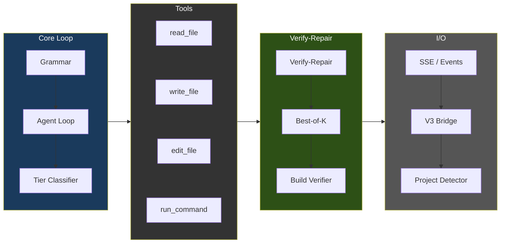

### 에이전트 루프 흐름

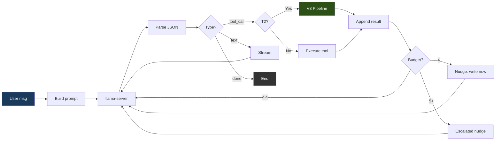

### 문법 강제

모든 모델 출력은 세 가지 유효한 JSON 형태 중 하나를 향하도록 제약됩니다:

```json
{"type": "tool_call", "name": "<tool_name>", "args": {...}}
{"type": "text", "content": "<message>"}
{"type": "done", "summary": "<summary>"}
```

기본 `strict` 모드에서 프록시는 완전한 JSON 스키마 — `additionalProperties: false`와 함께 `oneOf`를 사용하고 레지스트리에서 도구 이름을 열거 — 를 전송하며, llama-server가 이를 토큰 생성 중 문법으로 강제합니다. 문법 제약은 잘못된 형식의 출력을 불가능하게 만드는 것이 아니라 드물게 만듭니다: `ATLAS_GRAMMAR_MODE=loose`는 `{"type":"json_object"}`만 전송하고(유효한 JSON이되 형태는 강제하지 않음 — 일부 모델에는 이것이 필요합니다), 응답 토큰 상한이 JSON 중간을 자를 수 있습니다. 프록시는 파싱을 실패할 수 있는 것으로 취급합니다 — 산문/`reasoning_content`에서 JSON을 복구하고, 실행 전에 잘린 도구 인자를 감지하며, 표적화된 파스 실패 설명을 되먹이고, 3회 연속 실패 후 루프를 끊습니다.

### 도구

`proxy/tools.go`에 등록된 14개의 도구:

| 도구 | 용도 | 읽기 전용 |
|------|---------|-----------|
| `read_file` | 파일 내용 읽기(선택적 offset/limit 포함) | 예 |
| `outline_file` | 파일의 최상위 함수/클래스를 본문 없이 줄 범위와 함께 나열(`.py`는 tree-sitter, 그 외는 최선 노력 스캔). 정밀 읽기의 진입점: 먼저 아웃라인하고, 그다음 offset/limit으로 `read_file` | 예 |
| `write_file` | 새(NEW) 파일 생성(5줄 초과의 기존 파일에 대해서는 거부 — 안전 제한 참고) | 아니오 |
| `edit_file` | ≤10줄 변경을 위한 정밀 인라인 문자열 치환(old_str/new_str) | 아니오 |
| `structural_edit` | tree-sitter 셀렉터(`function:NAME`, `class:NAME`, `<tag>`)를 통한 함수/클래스/HTML 요소 전체 재작성; 노드 전체 교체에는 edit_file보다 필수(REQUIRED). GH #39, v1에서는 .py/.html/.htm만 | 아니오 |
| `delete_file` | 파일 또는 빈 디렉토리 삭제(이후 루프 종료를 강제) | 아니오 |
| `move_file` | 워크스페이스 내에서 파일 이동 또는 이름 변경(예: `index.html` → `templates/`). 순수 재배치 — V3/정밀 편집 게이트를 우회하며, 기존 대상을 덮어쓰는 것은 거부. 셸 `mv`/`cp`가 거부되므로 "파일 재구성"을 위한 지원 경로 | 아니오 |
| `find_file` | 파일 **이름**/경로에 대한 정규식 검색(저렴한 존재 확인 + 위치 파악). 파일 내용을 grep하는 `search_files`와 구별됨. | 예 |
| `search_files` | 파일 내용 전체에 대한 정규식 검색(최대 200개 일치, .git/node_modules 건너뜀) | 예 |
| `list_directory` | 타입과 크기와 함께 디렉토리 내용 나열 | 예 |
| `run_command` | 샌드박스 컨테이너를 통한 셸 명령 실행; 5분 타임아웃 상한 | 아니오 |
| `run_background` | 샌드박스에서 장기 실행 프로세스(예: `python app.py`) 시작; 즉시 `job_id` 반환 | 아니오 |
| `tail_background` | `job_id`로 백그라운드 작업의 새 stdout/stderr 가져오기 | 예 |
| `stop_background` | `job_id`로 백그라운드 작업을 SIGTERM/SIGKILL | 아니오 |

### 도구 선택 편향 완화

측정된 레퍼런스 배포에서, `structural_edit`가 옳은 경우에도 `structural_edit`보다
`edit_file`을 선호하는 편향이 나타났습니다(BiasBusters arxiv 2510.00307 —
인접한 도구 이름의 임베딩이 경쟁하며, 설명이 이름보다 더 중요함).
프록시에서 모델 독립적인 네 가지 방어책이 결합됩니다:

1. **설명 재작성**(`proxy/tools.go`). edit_file의 설명은 파일 전체/함수
   전체 용도에 대해 경고하고, structural_edit의 설명은 >10줄 / 노드 전체 교체에
   필수(REQUIRED)라고 명시하며, write_file의 설명은 새(NEW) 파일 전용임을
   명시합니다.
2. **조건부 GBNF 문법**(`proxy/tools.go`,
   `proxy/agent.go:stepExclusions`). 5줄 초과의 기존 .py/.html/.htm
   파일에 대한 write_file가 거부되면, 다음 LLM 호출은 도구 이름 생성
   규칙에서 edit_file와 write_file를 금지하는 GBNF 문법으로 제약됩니다.
   모델은 물리적으로 그것들을 내보낼 수 없습니다. 제한은 한 번의
   결정 후 만료됩니다.
3. **단계별 도구 목록 필터**(동일 트리거). 일시적인
   `[system note]` 사용자 메시지가 주입되어, 이 단계에서는 structural_edit가
   유일한 구조적 편집 도구임을 모델에 상기시킵니다.
4. **ASA 스티어링 벡터**(`geometric-lens/asa_calibration/`).
   활성화 스티어링이 residual-stream 분포를 상류에서 이동시켜, 어떤
   거부도 발생하기 전인 첫 시도 결정에서도 structural_edit가 선호되도록 합니다.
   `inference/entrypoint-v3.1.sh`가 `/models/ast_edit_steering.gguf`에서
   자동 로드하되, 그 `.model` 사이드카가 선택된 모델과 일치할 때만
   로드합니다 — `geometric-lens/asa_calibration/README.md`의 워크플로를
   통해 호환 빌드가 이루어지면 항상 켜져 있습니다. `ATLAS_CONTROL_VECTOR*`
   환경 변수로 path/scale/layer-range를 재정의합니다.

   **모델별 결합.** 각 ASA 벡터는 특정 모델의 residual-stream 기하
   구조에 대해 학습됩니다. 모델 간 폴백은 어느 것도 안전하지 않습니다.
   `atlas asa check`는 `.model` 사이드카를 확인하고, 로드된 임베딩
   차원을 탐침하며, GGUF 레이어 메타데이터를 파싱해 `compat` /
   `needs-build` / `incompatible`을 보고합니다. `atlas asa build`는
   로드된 모델로부터 추출 레이어를 도출하고 벡터와 마커를 기록하며,
   lens 컨테이너 안에서 실행됩니다. `atlas asa publish`는 업로드 전에
   누락되거나 불일치하는 마커를 거부합니다. [CLI.md § atlas asa](../../CLI.md#atlas-asa) 참고.

### 파일별 등급 분류

각 `write_file`/`edit_file` 호출은 독립적으로 분류됩니다:

| 등급 | 최대 턴 | 동작 |
|------|-----------|--------|
| T0 (대화형) | 5 | 텍스트 응답만 |
| T1 (단순) | 0 (무제한) | 직접 쓰기 — V3 오버헤드 없음 |
| T2 (기능) | 0 (무제한) | V3 파이프라인 실행 |
| T3 (난이도 높음) | 0 (무제한) | V3 파이프라인 실행 |

등급 상한은 0(무제한)입니다. 언제 중단할지는 루프 내부의 디텍터 스택이 결정합니다: lens 회귀(`agent_lens_intervention`), 추론 반복(`agent_reasoning_intervention`), 도구 호출 반복(`agent_repeat_intervention`), 경로 인식 에러 브레이커, 동작 없는 done 게이트, 주장 검증 게이트, 계획 준수 임계값, 빈 응답 폴백. 운영자는 일회성 "앱 전체 수정" 프롬프트를 위해 `ATLAS_MAX_TURNS=<n>`으로 재정의할 수 있습니다 — `proxy/types.go::envOverrideMaxTurns` 참고.

분류기는 `proxy/tools.go`(`classifyFileTier`)에 있고, 로직 패턴 매처는 같은 파일(`hasLogicIndicators`)에 있습니다.

**항상 T1 (직접 쓰기):**
- 이름으로 식별되는 설정 파일(예: `package.json`, `go.mod`, `pyproject.toml`, `dockerfile`, `docker-compose.*`)
- 확장자로 식별되는 데이터 파일(`.json`, `.yaml`, `.yml`, `.toml`, `.csv`, `.xml`, `.env`)
- 스타일 파일(`.css`, `.scss`, `.less`)
- 문서(`.md`, `.txt`, `.rst`)와 셸 스크립트(`.sh`, `.bash`)
- **10줄** 미만의 사소하게 작은 파일(그 크기에서는 V3가 의미 있게 다양화할 것이 없음)
- 로직 지표가 없는 미지의 확장자

정확한 설정 파일 목록과 확장자 집합은 `proxy/tools.go:classifyFileTier`에 있습니다.

**T2 (V3 파이프라인)** — 파일이 ≥10줄이고 다음 중 하나에 해당하면 자격을 충족합니다:
- `hasLogicIndicators(content)`가 true 반환 — 함수/메서드 정의, 제어 흐름, 에러 처리, Flask/FastAPI/Django 라우팅, Express/Node API, React 상태/데이터, 검증, 데이터베이스 호출, JSX/React 컴포넌트 패턴, 임포트를 포괄하는 패턴 패밀리 전반에서 **2개 이상 일치**(리터럴 토큰 목록은 `proxy/tools.go:hasLogicIndicators`에 있음)
- 또는 파일이 인식되는 소스 코드/마크업 확장자(`.py`, `.go`, `.rs`, `.ts`, `.tsx`, `.js`, `.jsx`, `.html`, `.htm`, …)를 가지고 있고 로직 지표가 발동하지 않은 경우 — T2에서 의심의 혜택을 받습니다(12줄짜리 컴포넌트 셸 같은 최소하지만 실제인 파일을 포괄)

**T3 (난이도 높음)** — 현재 분류기는 단독으로 T3를 내보내지 않습니다. 순환 복잡도(cyclomatic-complexity) 리파이너(`refineTierWithCC`, GH #39 항목 2의 `/internal/cyclomatic_complexity` 경유)가 McCabe CC를 기준으로 *상향*합니다: CC ≥ 8이면 T2로(T1에서 올라오는 경우 포함), CC ≥ 16이면 T3로. 절대 하향하지 않습니다.

### Plan 모드 (턴별 사전 점검)

Plan 모드는 첫 도구 호출 전에 에이전트 턴마다 한 번 실행되는 사전 계획 단계입니다: 플래너가 후보 계획들을 샘플링하고 휴리스틱하게 채점해 우승 계획을 시스템 프롬프트에 렌더링하며, 모델이 계획을 벗어나 헤맬 때 준수 게이트가 자동으로 계획을 수정합니다. 탐색 헤맴을 줄이고, 계획의 verify 단계를 지켜 증거 없는 `done`을 차단합니다.

전체 흐름, 구성요소, 튜닝 항목, 건너뛰기 조건, 비용, 테스트 매트릭스는 [PLAN_MODE.md](../../PLAN_MODE.md)를 참고하세요.

### 안전 제한

운영자 대상 제한과 이를 튜닝하는 손잡이들입니다. 내부 스티어링 가드(트레이스백 위치 파악, 누락 모듈/대소문자 불일치 스티어, 심볼 그라운딩, no-op/빈 콘텐츠/구문 게이트, doctype 제거)는 `proxy/guardrails.go`와 `proxy/agent.go`에 있습니다.

| 제한 | 값 | 용도 |
|-------|-------|---------|
| 대화 트림 | 슬롯 크기에 맞춘 슬라이딩 윈도우: 시스템 + 가장 최근 사용자 지시 + 활성 파일의 내용 + `슬롯당 컨텍스트 − ATLAS_MAX_TOKENS − 2048`에 들어가는 만큼의 후행 메시지를 유지(하한: 8개 유지; `ATLAS_AGENT_HISTORY_BUDGET`을 통한 하드 상한) | 편집 중인 파일을 떨어뜨리지 않으면서 컨텍스트 오버플로 방지 |
| 중복 읽기 단락(short-circuit) | 변경되지 않은 파일의 파일 전체 재읽기는 내용이 아직 라이브일 때만 "이미 컨텍스트에 있음" 포인터를 반환; 그렇지 않으면 전체 파일을 다시 제공(`ATLAS_DEDUP_READS=0`으로 비활성화) | 모델이 깜깜이로 편집하는 일 없이, 변경되지 않은 파일을 매 턴 재인코딩하는 것을 회피 |
| V3 대화형 벽시계 상한 | 단일 V3 파이프라인 호출은 `ATLAS_V3_TIMEOUT`(기본 180초)으로 상한; 타임아웃 시 프록시는 모델의 구문 게이트를 통과한 내용으로 폴백(`0`은 비활성화) | 긴 수리 정체 상황에서도 대화형 세션의 응답성 유지 |
| 턴별 추론 예산 | ~6144 추론 토큰 후 스트림을 끊음(`ATLAS_REASONING_BUDGET`, 0은 비활성화); 복구는 내장된 tool_call을 추출하거나 다시 프롬프트함 | 추론 나선을 제한 |
| 기존 파일에 대한 write_file | 파일이 5줄 초과면 거부; .py/.html/.htm에서는 단계별 문법 게이트가 `structural_edit`로 스티어 | 정밀 편집(`edit_file`) 또는 노드 전체 편집(`structural_edit`)을 강제 |
| 의심스러운 축소 가드 | `oldSize >= 100B`이고 `newSize < 64B`일 때 `structural_edit`/`edit_file` 거부(`proxy/guardrails.go::validateNotSuspiciouslyShrunk`) | 파괴적 스텁 재작성이 디스크에 닿기 전에 포착 |
| structural_edit 폭주 콘텐츠 가드 | `content` > 8 KB AND > 파일 크기의 4배일 때 거부 | 교체 노드로 방출된 추론 누출 덩어리를 포착 |
| 에러 루프 브레이커 | 연속 3회 실패 | 폭주하는 실패 사이클 중단 |
| 탐색 예산 | 연속 4회 읽기 전용 호출에서 넛지; 5회 이상에서 강화된 넛지. 읽기는 항상 실행됩니다 — 넛지는 *다음* 턴을 쓰기 쪽으로 유도할 뿐입니다 | 무한정 탐색하는 대신 쓰도록 모델을 유도 |
| 명령 출력 잘라내기 | stdout 8,000자, stderr 4,000자 | 컨텍스트 범람 방지 |
| 검색 결과 | 최대 200개 일치; 파일 검색은 1 MB 초과 파일 건너뜀 | 검색 비용 제한 |
| 잘림 감지 | 도구 인자에 대한 JSON 파스 점검 | 잘린 모델 출력 포착 |

---

## 4. V3 파이프라인 (안쪽 계층)

T2+ 파일에 대해 `write_file`/`edit_file` 실행기 안에서 활성화됩니다. 파이프라인은 네 개의 페이즈를 가지며, 모든 단계에 조기 종료 지점이 있습니다.

### 파이프라인 흐름

```mermaid
flowchart LR
    Entry["T2 detected"] --> Probe["Probe"] --> Score1["C(x)/G(x)"] --> SB1["Sandbox"]
    SB1 --> Pass1{"Pass?"}
    Pass1 -->|"Yes"| Done["Done"]

    Pass1 -->|"No"| PS["PlanSearch"] --> DS["DivSampling"] --> BF["BudgetForcing"] --> Build["Build Check"] --> Score2["Score K"] --> SB2["Test K"]

    SB2 --> AnyPass{"Passed?"}
    AnyPass -->|"2+"| SStar["S* Tiebreak"] --> Done
    AnyPass -->|"1"| Select["Lens Select"] --> Done

    AnyPass -->|"0"| FA["Failure Analysis"] --> PRCOT["PR-CoT"]
    PRCOT --> PRPass{"Pass?"}
    PRPass -->|"Yes"| Done
    PRPass -->|"No"| Refine["Refinement"]
    Refine --> RefPass{"Pass?"}
    RefPass -->|"Yes"| Done
    RefPass -->|"No"| Derive["Derivation"] --> Done

    style Entry fill:#1a3a5c,color:#fff
    style Done fill:#333,color:#fff
    style Probe fill:#1a3a5c,color:#fff
    style PS fill:#1a3a5c,color:#fff
    style DS fill:#1a3a5c,color:#fff
    style BF fill:#1a3a5c,color:#fff
    style SStar fill:#2d5016,color:#fff
    style Select fill:#2d5016,color:#fff
    style Score1 fill:#2d5016,color:#fff
    style Score2 fill:#2d5016,color:#fff
    style SB1 fill:#2d5016,color:#fff
    style SB2 fill:#2d5016,color:#fff
    style Build fill:#2d5016,color:#fff
    style PRCOT fill:#5c3a1a,color:#fff
    style Refine fill:#5c3a1a,color:#fff
    style Derive fill:#5c3a1a,color:#fff
    style FA fill:#5c3a1a,color:#fff
```

범례: 파랑 = 생성, 초록 = 검증/선택, 갈색 = 수리.

### 페이즈 상세

**Phase 0: Probe**는 점진적 예산 재시도(light → standard → nothink)로 단일 기준 후보를 생성합니다. 선택된 모델의 C(x)/G(x) 아티팩트로 채점하고 샌드박스에서 테스트합니다. 통과하면 파이프라인은 즉시 종료합니다.

**후보 할당: CxGx 게이트**(`phase2` / `phase2_allocated`로 방출)가 실패한 프로브에 후보를 몇 개 줄지 결정합니다. 프로브의 C(x)+G(x) 결합 점수(임베딩 추출 1회, 두 모델 모두 사용)가 2단계 규칙을 구동합니다: 보정된 C(x) 정규화 에너지가 Budget Forcing이 쓰는 것과 같은 사다리에서 기본 티어를 고르고, G(x) 품질 점수가 모델의 보정된 severe 경계 아래로 떨어지면 그 티어를 +1, 한참 아래(그 0.75배)로 떨어지면 +2 올립니다 — 프로브가 C(x)에는 싸 보이지만 G(x)에는 틀려 보이는 경우입니다. 티어가 k를 정하고(`nothink` 1, `standard` 3, `hard` 5, `extreme` 8) 여기에 **k >= 3의 하드 플로어**가 걸립니다. 따라서 게이트는 기존에 고정돼 있던 k=3에 후보를 더할 수만 있고 뺄 수는 없으며, 최악의 경우가 곧 예전 동작입니다. 두 신호 모두 이 모델의 보정 파일(`cx_normalization.json`, `gx_thresholds.json`)을 필요로 합니다: 렌즈가 없거나 도달 불가하거나 보정되지 않았다면 `standard`에서 정확히 k=3을 할당하므로, 보정되지 않은 번들은 자기에게 아무 의미도 없는 척도로 라우팅되는 대신 예전에 돌리던 파이프라인을 그대로 돌립니다.

이 플로어가 앞서 제거된 C(x) 전용 할당기와의 차이입니다: 그쪽은 플로어가 없어서 *방금 실패한* 프로브의 태스크에 k=1을 건네주었고, 측정값은 +0.0 pp였습니다. 암당 n=175의 4-암 삼각측량: 게이트 적용 66.9%, 고정 k=3 64.6%, 같은 티어 구성을 태스크 간에 섞은 것 61.7%, 전부 k=8이 약 27% 더 많은 토큰으로 67.4%. 동일한 지출에서 셔플 암을 5.1 pp 앞선 것이, 연산량만이 아니라 렌즈 신호가 정보를 담고 있음을 말해 줍니다.

라이브 경로와의 차이: 프록시의 V3 브리지는 `ATLAS_V3_TIMEOUT`(기본 180s) 이후 파이프라인 호출을 포기합니다. 벤치에는 없던 상한이라, k=8로의 무제한 에스컬레이션은 예산을 생성에 다 써 버리고 시간 안에 낼 수 있었던 k=3 답 대신 타임아웃 폴백을 반환하게 됩니다. 그래서 라이브 오케스트레이터는 남은 실시간과 해당 태스크에서 관측된 호출당 지연을 함께 넘기고, 게이트는 예산이 실제로 생성할 수 있는 수준까지 티어를 낮춥니다 — 에스컬레이션이 Phase 3를 굶기지 않도록 리파인먼트 1회분을 남겨 두되, 플로어 아래로는 결코 내려가지 않습니다. 벤치 러너는 예산을 넘기지 않고 측정된 그대로 할당합니다. 구현은 `v3-service/stages/cxgx_gate.py`이며 두 오케스트레이터가 공유합니다.

**Phase 1: 제약 기반 생성(Constraint-Driven Generation)**

- **PlanSearch**는 서로 다른 제약 집합을 추출하여 구조적으로 다른 3개의 구현 계획을 생성합니다
- **DivSampling**은 섭동 다양성을 적용합니다: 4개 역할(competitive_programmer, systems_engineer, mathematician, pragmatist) + 4개 지시(step_by_step, edge_case_first, complexity_aware, constraint_driven) + 4개 스타일(functional, pythonic, optimize_iteratively, structured)
- **Budget Forcing**은 사고 토큰 할당을 제어합니다:

| 등급(Tier) | 사고 토큰 | Wait 주입 |
|------|----------------|----------------|
| nothink | 0 | 템플릿 수준에서 사고 비활성화 |
| light | 1,024 | 없음 |
| standard | 2,048 | 사고가 < 512 토큰에서 끝나면 |
| hard | 4,096 | 사고가 < 1,024 토큰에서 끝나면 |
| extreme | 8,192 | 사고가 < 2,048 토큰에서 끝나면 |

Wait 주입은 더 긴 추론 패스를 요청하기 위해 "Wait, let me reconsider.\n"을 덧붙입니다. 등급 선택은 선택된 모델의 캘리브레이션된 C(x) 에너지를 사용합니다. 캘리브레이션이 없으면 ATLAS는 다른 모델의 상수를 빌리는 대신 구성된 기본 예산을 사용합니다.

**Phase 2: 검증 및 선택**

- **빌드 검증**: Python(`py_compile`), TypeScript(`tsc --noEmit`), JavaScript(`node --check`), Go(`go build`), Java(`javac`), Kotlin(`kotlinc`), Rust(샌드박스 `/execute` 경로에서는 `rustc`. `Cargo.toml` 프로젝트는 감지되어 `cargo build`를 쓰고, `cargo check`는 빌드 커맨드 허용목록을 통해서만 허용), C/C++(`/execute`에서는 `-Wall`을 붙인 완전한 `gcc`/`g++` 컴파일. `-fsyntax-only`는 `/syntax-check` 경로에만 적용), Ruby(`ruby -c`, 인터프리터 언어라 컴파일 단계 없음), PHP(`php -l`, 동일), Shell(`bash -n`). Next.js, React, Flask, Django, Express에는 프레임워크별 오버라이드가 있습니다.
- **거부권(Veto)**: 샌드박스를 통과한 후보라도 세 가지 검사가 이를 기각할 수 있습니다 — 렌즈 거부권(스텝별 `gx_min`이 모델의 보정된 severe 임계값 아래인 경우: 코드는 실행되지만 생성 패턴이 스텁 쪽으로 무너진 것), 구조 거부권(tree-sitter가 로컬 정의·import·빌트인·프로젝트 심볼 어디에도 해석되지 않는 직접 식별자 호출을 찾은 경우 — 예약된 `NameError`), 그리고 플래그로 게이트되는 호출 그래프 거부권(`ATLAS_CALL_GRAPH`: 스코프 안에 정의가 없는 파일 간 호출). 거부된 후보는 실패로 표시되고(`passed=false`, `vetoed_by`, 거부 사유가 오류 출력으로), 다른 실패 후보와 마찬가지로 Phase 3 복구 풀에 합류합니다. 최종 에너지 폴백이 이를 반환하는 일은 없습니다. 모든 후보가 거부되고 복구도 실패하면 파이프라인은 코드를 반환하지 않으며, 호출자가 자신의 베이스라인으로 대체합니다
- **Lens 선택**(1개 이상 통과): C(x) 에너지로 정렬해 가장 낮은 것이 승리

**Phase 3: 수리**(0/K 통과 시) — 세 가지 전략, 조기 종료를 동반한 순차 실행:

- **실패 분석(Failure Analysis)**: 실패를 분류(wrong_algorithm, implementation_bug, edge_case_miss, time_limit, format_error, partial_correct)
- **메타인지 평가(Metacognitive Evaluation)**: 관측된 실패 카테고리로부터 도출한 보상 제약을 주입
- **PR-CoT**: 4개 관점(logical_consistency, information_completeness, biases, alternative_solutions) x (분석 + 수리) = ~8회 LLM 호출, 최대 3라운드
- **Refinement 루프**: 실패 분석 → 제약 정제 → 코드 생성 → 테스트 → 학습. 2회 반복, 120초 예산, 각 ~5회 이상 LLM 호출. 코사인 거리 필터링(>= 0.15)으로 가설 반복 방지
- **Derivation 체인**: 최대 5개의 하위 문제로 분해, 각각 샌드박스 검증, 최종 합성. ~7회 이상 LLM 호출

### 모듈 맵

파이프라인 스테이지는 `v3-service/stages/`에 있는 13개의 Python 모듈입니다. `v3-service/pipeline.py`가 그중 11개를 오케스트레이션합니다(10개는 직접, `constraint_refinement`는 리파인먼트 루프를 통해). `lens_feedback`과 `embedding_store`는 오프라인 벤치 러너(`atlas/bench/v3_runner.py`)에서만 실행되며, 이 러너는 체크아웃의 `v3-service/`를 자신의 경로에 올리므로 두 호출자가 하나의 스테이지 구현을 공유합니다:

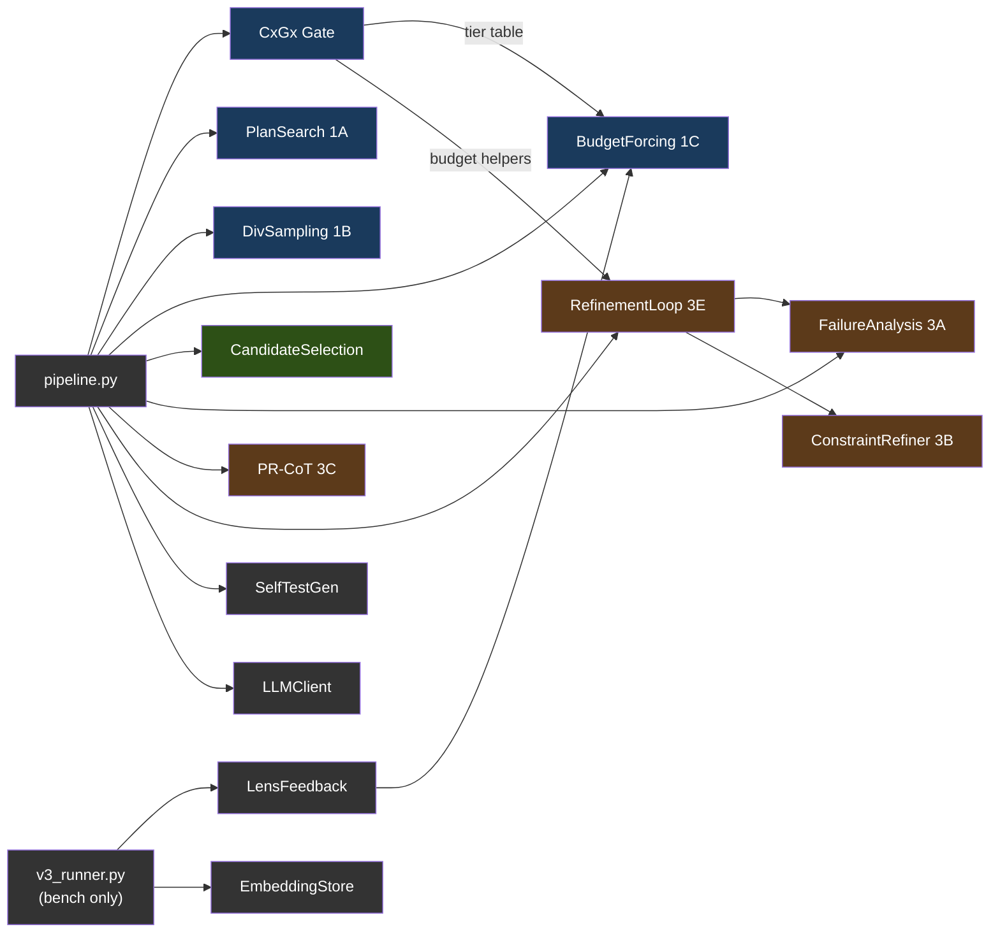

범례: 파랑 = Phase 1(생성), 초록 = Phase 2(선택), 갈색 = Phase 3(수리), 회색 = 유틸리티. `v3_runner.py`가 공급하는 모듈은 벤치 러너 전용이며, 서비스는 이를 호출하지 않습니다. 서비스 자체는 `main.py`(HTTP 핸들러) → `pipeline.py`(오케스트레이터) → `planning.py` / `scoring.py` / `symbols.py` / `adapters.py` 라는 평면적 형제 모듈 구성입니다.

---

## 5. Geometric Lens

모델 임베딩의 기하 구조를 분석하여 코드를 실행하지 않고도 코드 품질을 평가하는 신경 스코어링 시스템입니다. 전적으로 CPU에서 돌아갑니다. 서비스 표면은 내부 전용(`/internal/*`)입니다: C(x)/G(x) 스코어링(단발 및 스텝별)과, 이전 세션의 교훈을 에이전트 루프로 되돌려 주는 [패턴 캐시](#패턴-캐시).

#### 왜 "Geometric Lens"인가?

Geometric Lens의 핵심 아이디어는 간단한 전제에서 출발합니다: 모델을 키우는 것을 멈추고 지원 인프라로 감싸기 시작하라. Jose Crespo의 ["Everyone's Wrong About AI Programming"](https://www.josecrespophd.org/p/everyones-wrong-about-ai-programming)은, 현재 LLM이 올바른 코드 경로와 잘못된 코드 경로의 비용이 같은 평평한 임베딩 공간에서 작동하기 때문에 AI 생성 코드가 오류 쪽으로 표류한다고 주장합니다. 해법은 올바른 코드가 "내리막"이고 잘못된 코드가 "오르막"인 에너지 지형을 모델 주위에 구축하는 것입니다.

Anthropic의 [Manipulating Manifolds](https://transformer-circuits.pub/2025/linebreaks/index.html) 연구는 트랜스포머가 이미 임베딩 공간에 조작 가능한 기하 구조를 만든다는 증거를 제공합니다 — 원재료는 이미 거기 있습니다. Bar 등의 [Geometric Unification of Generative AI](https://arxiv.org/html/2510.00666v1)는 데이터 매니폴드 위의 거리 함수를 학습하고 스코어링에 사용하는 방법을 형식화합니다.

ATLAS는 이를 두 개의 상호 보완적 모델로 구현합니다. C(x)는 선택된 모델 자체 임베딩 위의 학습된 에너지 함수(`hidden_dim`→512→128→1 MLP)입니다. 각 코드 후보는 llama-server에 의해 임베딩되고, C(x)는 그것이 그 기하 구조에서 어디에 위치하는지 스코어링합니다. 낮은 에너지는 후보가 알려진 정답 코드와 군집함을 의미합니다. 높은 에너지는 알려진 오답 코드와 군집함을 의미합니다. 외부 오라클도, 실행도 필요 없습니다 — 선택된 모델 표현의 기하 구조만 필요합니다.

G(x)는 품질 예측기입니다 — PCA로 축소된 임베딩 위의 XGBoost 분류기로, 후보가 축소된 공간에서 어디에 위치하는지로부터 통과/실패를 예측합니다. C(x)가 "이 후보가 얼마나 좋은가?"에 답한다면, G(x)는 "이 후보가 통과할 가능성이 있는가?"에 답합니다. 이것이 유일한 G(x) 구현입니다: 이전의 메트릭 텐서 정식화와 그 correctability 엔드포인트는 XGBoost가 배포 경로가 되면서 제거되었습니다(기하 인식 변형은 git 이력을 참고하세요).

### 스코어링 모델

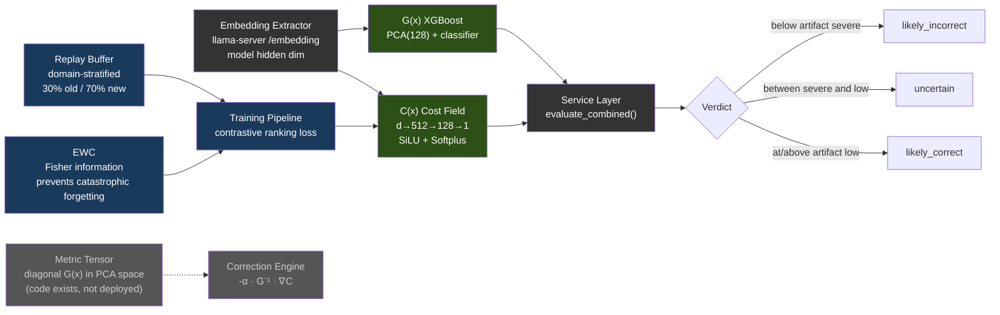

다음 수치는 공개된 V3 연구에 사용된 동결 레퍼런스 아티팩트를 설명합니다. 출처(provenance)일 뿐 런타임 차원이나 기본값이 아닙니다:

| 모델 | 레퍼런스 아키텍처 | 학습 데이터 | 성능 |
|-------|-------------|---------------|-------------|
| **C(x)** | 4096→512→128→1 MLP (SiLU, Softplus) | 597개 LCB 임베딩 (504 PASS, 93 FAIL) | Val AUC 0.9467, sep 2.04x |
| **G(x)** | PCA(4096→128) + XGBoost | 13,398개 임베딩 (4,835 PASS, 8,563 FAIL) | PCA 80.8% 분산 |

C(x) 정규화는 `sigmoid(steepness × (energy - midpoint))`입니다. 선택된 모델의 `cx_normalization.json`이 두 값을 공급하며, `atlas lens build`가 그 모델의 라벨링된 PASS/FAIL 후보로부터 이를 도출합니다. G(x) 판정 임계값도 마찬가지로 `gx_thresholds.json`에서 옵니다. 어느 쪽 캘리브레이션도 없으면, 정규화된 판단은 레퍼런스 아티팩트의 스케일을 빌리는 대신 중립/비캘리브레이션 상태로 유지됩니다.

현재의 모든 Lens 번들에는 `model_identity.json`도 포함됩니다. 서비스는 그 모델 이름이 llama-server의 `/v1/models`가 보고하는 서빙 모델 id와 일치할 것을 요구합니다(탐침이 실패하면 `ATLAS_MODEL_NAME`이 폴백). 임베딩 폭이 같다는 것만으로는 서로 다른 두 모델 간의 호환성을 입증할 수 없습니다.

> **참고:** 모델 가중치(.pt, .pkl 파일)는 저장소에 커밋되지 않습니다 — 학습 중에 빌드되어 컨테이너 이미지에 구워지거나 런타임에 마운트됩니다. 모델 파일이 없으면 서비스는 우아하게 성능 저하됩니다: C(x)는 중립 에너지를 반환하고, G(x)는 `gx_score: 0.5`와 `verdict: "unavailable"`을 반환합니다. 학습 데이터와 가중치는 [HuggingFace](https://huggingface.co/datasets/itigges22/ATLAS)에서 제공됩니다.

### 패턴 캐시

세션을 넘나드는 기억: 성공한 실행 뒤에 기록된 패턴이 이후 에이전트 루프에 컨텍스트로 제공됩니다.

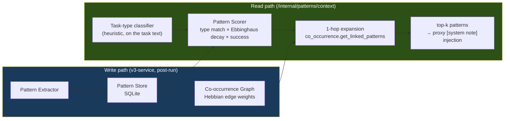

모듈: `geometric-lens/cache/{pattern_store, pattern_extractor, pattern_scorer, co_occurrence, seed_patterns}.py`. 매칭은 패턴 종류 + 최신성 + 성공률로 이뤄지며 검색 인덱스는 없습니다. 스토어는 첫 부팅 때 `seed_patterns`로 스스로를 시드하고, 서빙할 때마다 해당 패턴의 접근 통계를 갱신합니다. 소비 측은 프록시의 패턴 컨텍스트 주입입니다(§3).

<a id="rag--pageindex-v2"></a><a id="confidence-router--pattern-cache"></a>

> **제거된 서브시스템.** 이전 릴리스에는 RAG/PageIndex 프로젝트 인덱서, BM25 패턴 매처, 그리고 Thompson 샘플링 기반 신뢰도 라우터가 렌즈 안에 들어 있었습니다. 이들은 제품에서 아무도 호출하지 않는 렌즈 엔드포인트를 통해서만 접근할 수 있었고, 2026-08 단순화 캠페인에서 제거되었습니다(CHANGELOG 참고). 위의 패턴 캐시가 그 스택에서 남은 부분이며, 항상 켜져 있는 단일 리더를 중심으로 다시 만들어졌습니다.

---

## 6. Sandbox

컴파일, 테스트, 린팅을 갖춘 격리된 코드 실행 환경입니다.

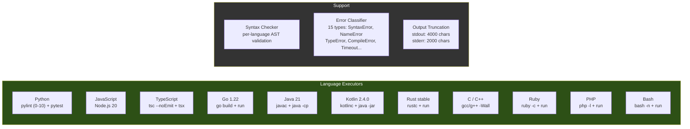

허용되는 언어 별칭: `py`/`python3` (Python), `js`/`node` (JavaScript), `ts` (TypeScript), `golang` (Go), `java` (Java), `kt`/`kts` (Kotlin), `rs` (Rust), `c++` (C++), `rb` (Ruby), `php` (PHP), `sh`/`shell` (Bash). 흔히 쓰는 CLI 도구는 이미지에 구워져 있고(`git`, `sqlite3`, `jq`, `patch`, `zip`/`unzip`, `xz`, `curl`), 바이너리 검사 도구(binutils의 `strings`, `objdump`, `readelf`, `nm`, 그리고 `file`, `xxd`)도 함께 들어 있습니다 — 컨테이너는 읽기 전용 베이스 위에서 비루트로 돌아가므로, 태스크가 셸로 호출하는 것은 전부 미리 설치돼 있어야 하며 런타임에 apt로 설치할 수 없습니다. 바이너리에 대한 `read_file`은 원시 바이트 대신 이 도구들을 가리키는 안내를 반환합니다. 최대 실행 시간: Docker 배포에서는 300초(compose가 프록시의 5분 `run_command` 상한에 맞춰 `MAX_EXECUTION_TIME=${ATLAS_SANDBOX_MAX_EXECUTION_TIME:-300}`를 설정; 순수 코드 기본값은 60초). 메모리, CPU, 프로세스 상한은 컨테이너 수준입니다: compose가 `mem_limit ${ATLAS_SANDBOX_MEM:-4g}`, `cpus ${ATLAS_SANDBOX_CPUS:-2}`, `pids_limit ${ATLAS_SANDBOX_PIDS:-1024}`를 설정하며, `atlas init`이 호스트에 맞는 값(RAM과 코어의 ~75%)을 `.env`에 기록합니다. 두 개의 워크스페이스 경로: **`/execute`**(V3 후보 테스트 경로)는 `/tmp/sandbox`(tmpfs) 아래의 일시적 스크래치 디렉토리를 사용; **`/shell`**(에이전트의 `run_command` 경로, 그리고 백그라운드 프로세스용 `/jobs/*`)은 `/workspace`에 대해 실행됩니다 — `ATLAS_PROJECT_DIR`(Docker)에서 바인드 마운트된 프로젝트 루트 또는 hostPath `${ATLAS_PROJECTS_DIR}`(K3s)로, 프록시가 보는 것과 동일한 경로입니다.

---

## 7. VRAM 예산 예시

9B Q6 모델과 32K 컨텍스트를 사용해 실측한 RTX 5060 Ti 16GB 배포 사례 하나:

| 구성요소 | VRAM |
|-----------|------|
| Qwen3.5-9B-Q6_K 모델 가중치 | ~6.9 GB |
| KV 캐시 (32K 컨텍스트) | ~1.3 GB |
| **llama-server 총합** | **~8.2 GB** |
| Geometric Lens | 0 (CPU 전용, 모델용 ~12 MB RAM, PyTorch 런타임용 ~128 MB) |
| v3-service | 0 (CPU 전용) |
| sandbox | 0 (CPU 전용) |
| atlas-proxy | 0 (Go 바이너리, ~30 MB RAM) |
| **여유 VRAM** | **~7.8 GB** |

llama-server 외부의 모든 연산은 CPU에서 돌아갑니다. GPU는 오로지 LLM 추론과 임베딩 추출에만 사용됩니다.

### 7.1 백엔드별 VRAM 예산

위의 8.2 GB / 7.8 GB 여유 분할은 예시일 뿐 ATLAS 모델 기본값이 아닙니다. 실제 사용량은 `atlas init`가 선택한 모델, 양자화, 컨텍스트, 병렬 슬롯 설정을 따릅니다. 다른 백엔드는 구조적으로 다릅니다:

| 백엔드 | 보고되는 "VRAM" | 부하 시 현실적 예산 | 비고 |
|---|---|---|---|
| **CUDA** (전용 VRAM) | 하드웨어 스펙(정규 5060 Ti에서 16 GB) | 스펙의 ~95%(드라이버가 ~500 MB 예약) | 위 표의 수치가 직접 적용됨. |
| **ROCm** (전용 VRAM) | 하드웨어 스펙 | 스펙의 ~90–95%(HIP 런타임이 CUDA보다 약간 무거움) | RX 7900 XTX (24 GB) → 14B Q5 + 32K 컨텍스트를 2개 병렬 슬롯으로 여유롭게 실행. |
| **Metal** (Apple 통합) | 총 시스템 RAM | 시스템 RAM의 **~70%** | OS + 브라우저 + IDE가 ~30%를 잡아먹음. 16 GB MBP의 *현실적* 예산은 11 GB — macOS 자체 GPU 워킹셋이 같은 메모리에 얹히면 Qwen3.5-9B Q6_K(가중치 ~6.9 GB + 32K에서 KV ~1.3 GB, §7 기준)에는 여유가 거의 없음. ≤16 GB에서는 Q4_K_M(5 GB) 사용; Q6_K는 ≥24 GB 통합 메모리를 원함. |
| **Vulkan** (크로스 벤더) | 하드웨어 스펙 | 실측된 배포 아직 없음 (프리뷰(Preview) — lavapipe CPU 경로에서만 검증됨) | 같은 카드에서 튜닝된 네이티브 백엔드 대비 ~20–40% 낮은 성능 예상. |
| **SYCL** (Intel Arc) | 하드웨어 스펙 | 로드맵(Roadmap) — Intel Arc는 현재 Vulkan 사용 | A770 (16 GB) 목표는 NVIDIA 16 GB와 보수적으로 동등. |

---

## 8. 배포

서비스 의존성 그래프(배포 모드 전반에서 동일):

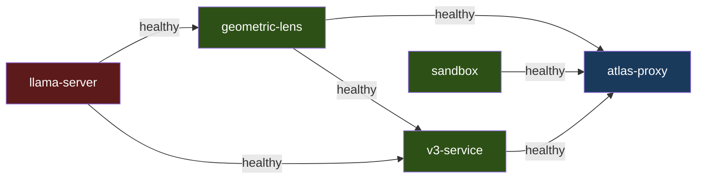

`llama-server`와 `sandbox`는 독립적으로 시작합니다. `geometric-lens`는 `llama-server`가 healthy해지기를 기다리고, `v3-service`는 `llama-server`와 `geometric-lens`를, `atlas-proxy`는 `llama-server`, `geometric-lens`, `v3-service`, `sandbox`를 기다립니다. Docker Compose, 베어메탈, K3s는 동일한 `inference/entrypoint-v3.1.sh`로 구동되므로, 컨텍스트 크기, KV 캐시 양자화, flash attention, mlock이 환경 변수로 제어되며 이 모드들 전반에서 동작이 동일합니다. macOS 하이브리드 경로는 엔트리포인트의 플래그를 미러링하는 `scripts/atlas-llama-macos.sh`를 통해 네이티브 llama-server를 실행합니다.

설치와 모드별 기동 절차(NVIDIA / ROCm 오버라이드, 베어메탈, macOS 하이브리드 Metal, K3s 매니페스트)는 [SETUP.md](../ko/SETUP.md)에, macOS 네이티브 경로는 [SETUP_MACOS.md](../../SETUP_MACOS.md)에 있습니다.

---

## 9. 데이터 흐름

### T1: 단순 파일 쓰기

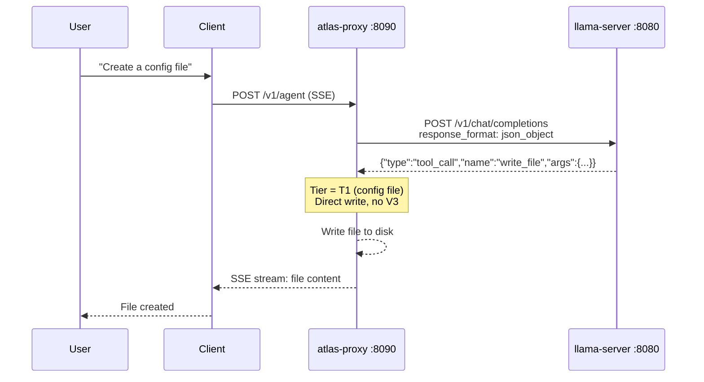

LLM 호출 1회. V3 오버헤드 없음.

### T2: 기능 파일 쓰기

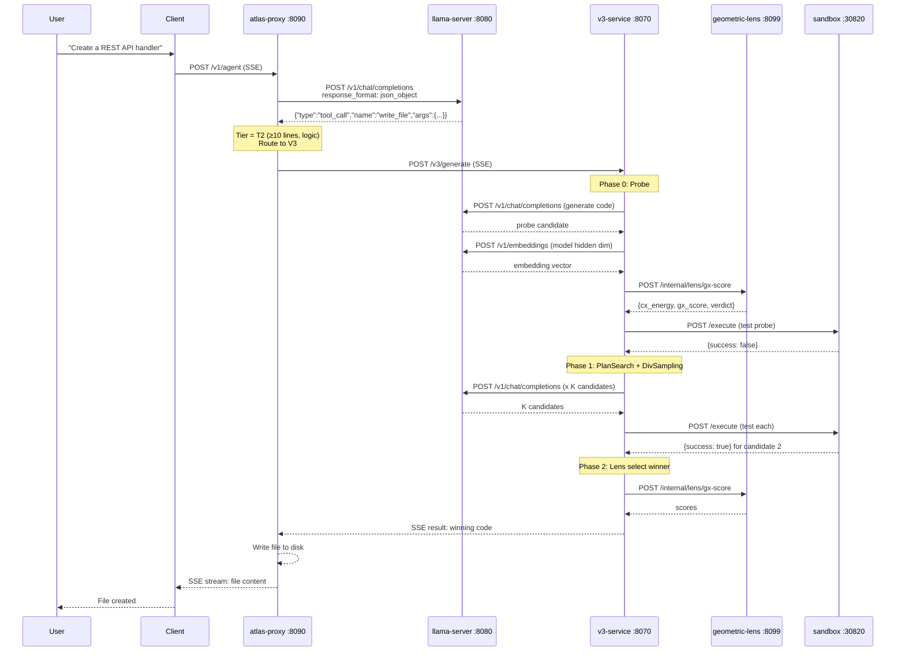

알고리즘성 작업 기준 최소 3회의 llama-server 호출(probe 생성 1회 + 셀프 테스트 생성 1회 + 임베딩 추출 1회). 대화형 작업(게임, UI, 프레임워크 코드)은 셀프 테스트 생성을 건너뛰므로 최소 2회입니다. Phase 3 수리가 모든 전략을 동원하면 최대 30회 이상.

### 기존 코드 편집

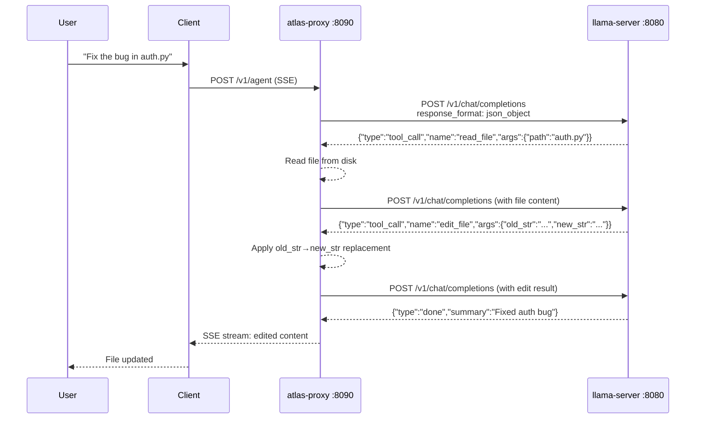

5줄을 초과하는 기존 파일은 `write_file`에 대해 거부됩니다 — 모델은 `edit_file`(정밀, ≤10줄) 또는 `structural_edit`(노드 전체 재작성, .py/.html/.htm만)를 사용해야 합니다. `.py`/`.html`/`.htm` 파일에서는 단계별 문법 게이트(BiasBusters #2)가 다음 결정에 대해 도구 이름 생성 규칙에서 `edit_file`/`write_file`를 능동적으로 금지하여 모델이 잘못된 지름길로 되돌아가지 못하게 합니다.
