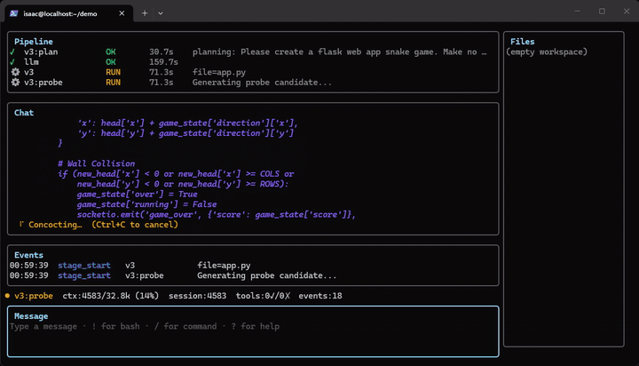

<!-- source: README.md synced-through: 4f1be83 -->
> **[English](../../../README.md)** | **[简体中文](../zh-CN/README.md)** | **[日本語](../ja/README.md)** | **한국어**

<p align="center">
  <br/>
  <sub><i>ATLAS TUI 라이브 데모(10배속). V3 파이프라인이 파일 생성을 처리하는 모습.</i></sub>
</p>

<h1 align="center">A.T.L.A.S.</h1>
<p align="center"><b>Adaptive Test-time Learning and Autonomous Specialization</b></p>

<p align="center">
  
  
  
</p>

<p align="center">
  <a href="https://github.com/itigges22/ATLAS/actions/workflows/test.yml"></a>
  <a href="https://github.com/itigges22/ATLAS/actions/workflows/install-test.yml"></a>
  <a href="https://github.com/itigges22/ATLAS/actions/workflows/codeql.yml"></a>
  <a href="https://github.com/itigges22/ATLAS/actions/workflows/container-scan.yml"></a>
  <a href="https://github.com/itigges22/ATLAS/actions/workflows/verify-tags.yml"></a>
</p>


## 🌎 ATLAS란?

**ATLAS는 프런티어급 추론과 검증을 콤팩트한 오픈 모델에 가져다주는 로컬 코딩 에이전트입니다.** 모델을 둘러싼 시스템(계획 수립, 후보 생성, 품질 스코어링, 샌드박스 테스트, 수리)에 더 많은 지능을 배치하여, 더 작은 모델이 호스팅 API나 토큰당 과금 없이 본인 하드웨어만으로 실제 소프트웨어 작업을 해낼 수 있게 합니다.

## 💡 왜 ATLAS인가?

* **더 작은 모델에서 더 많은 것을 끌어냅니다.** ATLAS는 단일 생성에 의존하는 대신 모델 주위에 계획 수립, 후보 선택, 검증, 수리를 더합니다.
* **받아들이기 전에 검증합니다.** 생성된 코드는 격리된 실행 환경 안에서 컴파일·테스트·수정될 수 있습니다.
* **연산을 필요한 곳에 씁니다.** 단순한 편집은 짧은 경로를 타고, 어려운 작업일수록 더 많은 후보·추론·검증을 받습니다.
* **본인 모델을 돌립니다.** NVIDIA, AMD, Apple Silicon, Vulkan, CPU 지원 하드웨어에서 호환 GGUF 모델을 사용할 수 있습니다.
* **로컬에서 관리합니다.** ATLAS는 저장소나 프롬프트를 호스팅 모델 또는 ATLAS 운영 서비스에 의도적으로 업로드하지 않습니다. 샌드박스 명령은 기본적으로 외부 네트워크에 접근할 수 있으며, `ATLAS_SANDBOX_NET_INTERNAL=true`로 비활성화할 수 있습니다.
* **스택 전체를 소유합니다.** ATLAS는 오픈 소스이며 셀프 호스팅됩니다. 호스팅 모델이나 타사 모델 제공업체 API 키는 필요하지 않으며, 로컬 설치별 서비스 토큰이 ATLAS 서비스 간 통신을 인증합니다.

---

## 📰 최신 소식

- **2026-07-06** - **[V3.1.3 "Maia" 출시](https://github.com/itigges22/ATLAS/releases/tag/v3.1.3)** - 프로덕션 플랫폼 정비: 자동 복원을 갖춘 단계적 업그레이드/롤백, SQLite 상태 저장소(Redis 제거), 서명된 아티팩트 매니페스트, 구조화 로그 + 상관관계 ID, 대화형 권한, 세션 재개, 그리고 두 차례의 적대적 버그 수정 스윕
- **2026-06-17** - **[V3.1.2 "Maia" 출시](https://github.com/itigges22/ATLAS/releases/tag/v3.1.2)** - 더 넓은 하드웨어 지원(ROCm / Metal / Vulkan), 자체 모델 반입(BYO) Lens + ASA 학습, 사용자 자신의 워크로드로부터의 인루프 lens 재학습, 에이전트 신뢰성 정비
- **2026-05-12** - **[V3.1.0 "Maia" 출시](https://github.com/itigges22/ATLAS/releases/tag/v3.1.0)** - 네이티브 Bubbletea TUI, 원커맨드 부트스트랩, 스트리밍 Lens + ASA 활성화 스티어링, AST 인식 정밀 편집
- **2026-03-26** - [Hacker News 첫 페이지](https://news.ycombinator.com/item?id=47533297) - 489 포인트, 285 댓글
- **2026-03-05** - **[V3.0 출시](../../reports/V3_ABLATION_STUDY.md)** - 동결된 Qwen3-14B에서 LiveCodeBench pass@1-v(k=3) 74.6% (생성 후보 k=3, Lens 선택, 수리를 포함한 pass@1이며 단일 생성 pass@1이 아님; [방법론](../../reports/V3_ABLATION_STUDY.md))
- **2026-02-18** - **[V2.0 출시](../../../CHANGELOG.md)** - 벤치마크 인프라, HumanEval/MBPP/LiveCodeBench/GPQA/SciCode 평가 스위트

## ⭐ Star History

<!-- Self-hosted chart: rendered weekly by .github/workflows/star-chart.yml
     onto the `star-history` asset branch (scripts/star-history-chart.py).
     Replaces the star-history.com embed, whose shared token pool
     rate-limits unpredictably. -->
<a href="https://github.com/itigges22/ATLAS/stargazers">
 <picture>
   <source media="(prefers-color-scheme: dark)" srcset="https://raw.githubusercontent.com/itigges22/ATLAS/star-history/star-history-dark.svg" />
   <source media="(prefers-color-scheme: light)" srcset="https://raw.githubusercontent.com/itigges22/ATLAS/star-history/star-history-light.svg" />
   
 </picture>
</a>

<sub>매주 월요일 GitHub Actions로 업데이트됩니다.</sub>

---

## 🧱 ATLAS의 기능

1. **[atlas-tui](../../CLI.md)** - 네이티브 Bubbletea 터미널 UI이자 공식 채팅 클라이언트. 아무 프로젝트 디렉토리에서나 `atlas`를 입력해 실행합니다.
   - [라이브 파이프라인 뷰](../../CLI.md#panes) - 사이드 패널에서 V3 단계를 실시간으로 확인
   - [슬래시 명령](../../CLI.md#slash-commands) - `/add`, `/diff`, `/commit`, `/run`으로 로컬 파일 컨텍스트와 셸 호출 처리
   - [입력 모드](../../CLI.md#input-modes) - 채팅, `!bash`, `/slash` 모드와 힌트 드롭다운

2. **[atlas-proxy](../../ARCHITECTURE.md#3-atlas-proxy-outer-layer)** - 시스템을 오케스트레이션하는 Go 에이전트 루프.
   - [도구 호출 라우팅](../../ARCHITECTURE.md#tools) - 파일 작업을 복잡도 등급별로 분류
   - [문법 강제](../../ARCHITECTURE.md#grammar-enforcement) - GBNF 스키마로 출력을 예상 JSON 형식 쪽으로 강하게 유도하고, 잘못되거나 잘린 출력은 프록시에서 복구
   - [BiasBusters](../../ARCHITECTURE.md#tool-selection-bias-mitigations) - 구조적 코드 편집에서 모델을 `structural_edit` 쪽으로 밀어주는 네 가지 결합 완화책(설명, 문법 금지, 시스템 노트, ASA 스티어링)
   - [안전 제한](../../ARCHITECTURE.md#safety-limits) - 턴 상한, 토큰 예산, 타임아웃

3. **[V3 파이프라인](../../ARCHITECTURE.md#4-v3-pipeline-inner-layer)** - 단일 프롬프트를 검증된 후보로 바꾸는 멀티 페이즈 코드 생성.
   - [PlanSearch](../../reports/V3_ABLATION_STUDY.md#phase-1-constraint-driven-generation-124pp) - 제약 기반 구조화 계획
   - [DivSampling](../../reports/V3_ABLATION_STUDY.md#phase-1-constraint-driven-generation-124pp) - 온도와 전략에 걸친 다양한 후보 생성
   - [Budget Forcing](../../reports/V3_ABLATION_STUDY.md#phase-1-constraint-driven-generation-124pp) - 페이즈별 사고 토큰 할당
   - [PR-CoT Repair](../../reports/V3_ABLATION_STUDY.md#pr-cot-repair-36-rescues) - 자체 생성 테스트 케이스를 활용한 반복 수정
   - [Refinement Loops](../../reports/V3_ABLATION_STUDY.md#refinement-loop-6-rescues) - 샌드박스 검증과 수정의 반복
   - [Derivation Chains](../../reports/V3_ABLATION_STUDY.md#derivation-chains-0-rescues) - 더 어려운 문제를 위한 다단계 추론

4. **[Geometric Lens](../../ARCHITECTURE.md#5-geometric-lens)** - 모델 자체 임베딩 위에서 동작하는 에너지 기반 스코어링. 외부 오라클 불필요. (["Geometric Lens"란?](../../ARCHITECTURE.md#why-geometric-lens))
   - [C(x) Cost Field](../../ARCHITECTURE.md#scoring-models) - 후보 품질을 스코어링하는 모델 hidden-dim→512→128→1 MLP
   - [G(x) Quality Prediction](../../ARCHITECTURE.md#scoring-models) - 선택에 쓰이는 XGBoost 앙상블
   - [RAG / PageIndex V2](../../ARCHITECTURE.md#rag--pageindex-v2) - AST 인식 코드 검색과 프로젝트 인덱싱
   - [Confidence Router](../../ARCHITECTURE.md#confidence-router--pattern-cache) - Thompson Sampling으로 필요한 후보에 연산 집중

5. **[Sandbox](../../ARCHITECTURE.md#6-sandbox)** - 빌드 검증을 위한 격리 실행 환경.
   - 다중 언어 실행: Python, Rust, Go, C, Shell 등
   - 스코어링 전 컴파일과 린팅
   - 생성된 테스트와 기존 테스트 스위트 모두 실행

6. **[llama-server](../../CONFIGURATION.md#6-llama-server)** - 소비자용 GPU 한 장에서의 로컬 LLM 추론.
   - GPU 가속 양자화 추론(Q6_K / Q4_K_M) - NVIDIA CUDA, AMD ROCm, Apple Metal(macOS 하이브리드), Vulkan; Intel SYCL은 로드맵에 있음
   - 토큰 수준의 문법 제약 디코딩
   - 셀프 임베딩 — lens에 별도 모델이 필요 없음

전체 문서(설정, 아키텍처, 구성, 문제 해결, 벤치마크 보고서, 그리고 각 구성요소의 [연구 배경](../../SOURCES.md))는 [docs/](../../) 디렉토리에 있습니다.

---

## 🚀 시작하기

원샷 설치:
```bash
curl -fsSL https://raw.githubusercontent.com/itigges22/ATLAS/main/scripts/atlas-bootstrap.sh | bash
```

계속 바뀌는 스크립트를 그대로 bash에 파이프하고 싶지 않다면? 같은 설치 프로그램을 더 신중하게 실행하는 두 가지 방법이 있습니다:
```bash
# Pinned to a release: script, checkout, and images all at the signed tag
curl -fsSL https://raw.githubusercontent.com/itigges22/ATLAS/v3.1.3/scripts/atlas-bootstrap.sh \
  | ATLAS_BOOTSTRAP_REF=v3.1.3 bash

# Review before running
curl -fsSL -o atlas-bootstrap.sh https://raw.githubusercontent.com/itigges22/ATLAS/main/scripts/atlas-bootstrap.sh
less atlas-bootstrap.sh
bash atlas-bootstrap.sh
```

스크립트는 배포판(Ubuntu, Debian, RHEL, Fedora, Rocky, Alma)과 GPU 벤더(NVIDIA → nvidia-container-toolkit; AMD → ROCm 디바이스 패스스루)를 감지해 적절한 런타임을 설치하고, 모델 가중치를 다운로드하며, ASA 스티어링 벡터를 빌드하고 스택을 기동합니다. 소요 시간은 10~30분 정도이며, 모델 다운로드가 병목입니다.

완료 후 아무 프로젝트 디렉토리에서나 `atlas`를 실행하세요.

**요구 사항**

| | |
|---|---|
| GPU | VRAM 16GB 이상. NVIDIA (CUDA, 지원(Supported)), AMD (ROCm, 커뮤니티 검증(Community-tested)), 또는 Apple Silicon (Metal, macOS 하이브리드, 지원); 그 외 대부분의 GPU는 Vulkan(프리뷰(Preview))으로 커버됩니다. 사전 빌드된 CUDA 이미지는 Blackwell(RTX 50xx)을 대상으로 하며, 구형 NVIDIA GPU는 일회성 로컬 재빌드가 필요합니다([SETUP.md § CUDA Compute Capability](../../SETUP.md#cuda-compute-capability-dockerfilev31) 참고). 지원 수준: [SUPPORT_MATRIX.md](../../../SUPPORT_MATRIX.md); GPU 목록: [SETUP.md § Supported GPUs](../../SETUP.md#supported-gpus). 특정 모델이 본인 카드에 맞는지 가늠하려면 [내 GPU에는 무엇이 들어가는가?](../../TROUBLESHOOTING.md#what-fits-on-my-gpu)를 참고하세요. |
| 런타임 | Docker (NVIDIA: + nvidia-container-toolkit; AMD: 단독 Docker로 충분) 또는 Podman |
| Python | 3.9 이상 |
| 디스크 | 약 20GB CUDA / 약 22GB ROCm (모델 가중치 + 컨테이너 이미지) |

Apple Silicon은 macOS 하이브리드 Metal 경로(추론은 네이티브 llama-server, 나머지 스택은 Docker — **[SETUP_MACOS.md](../../SETUP_MACOS.md)** 참고)를 통해 네이티브로 동작합니다. Intel Arc (SYCL)는 로드맵에 있습니다. 수동 설치 경로(Docker Compose, 베어메탈, K3s)와 부트스트랩 플래그 전체 목록은 **[SETUP.md](../ko/SETUP.md)**를 참고하세요.

---

## ⚠️ 알려진 제한 사항

- **Linux Docker 스택과 네이티브 macOS 경로.** NVIDIA(지원(Supported)), AMD ROCm(커뮤니티 검증(Community-tested)), Vulkan(프리뷰(Preview)) Docker 경로가 현재 존재합니다. Apple Silicon(지원)은 네이티브 macOS 하이브리드 Metal 경로([#32](https://github.com/itigges22/ATLAS/issues/32))로 동작합니다. Intel Arc / SYCL은 로드맵(Roadmap)입니다. 수준 정의: [SUPPORT_MATRIX.md](../../../SUPPORT_MATRIX.md).
- **현재 레지스트리 모델은 아직 공식 벤치마크 전입니다.** 대표 수치인 74.6% LiveCodeBench 점수는 동결된 14B 레퍼런스 빌드 기준입니다. 새로운 모델별 수치는 [#28](https://github.com/itigges22/ATLAS/issues/28)에서 추적합니다. 레퍼런스 방법론과 어블레이션은 [`docs/reports/V3_ABLATION_STUDY.md`](../../reports/V3_ABLATION_STUDY.md)에, 원시 트레이스는 [HuggingFace](https://huggingface.co/datasets/itigges22/ATLAS)에 있습니다.
- **복잡한 기능 추가는 일관성이 떨어질 수 있습니다.** 콤팩트 모델은 코드를 쓰기 전에 낯선 코드베이스 탐색으로 에이전트 턴을 소비하기도 합니다. V3.1.2의 에이전트 신뢰성 정비로 안정성이 개선되었으며, 최신 모델별 수치는 [#28](https://github.com/itigges22/ATLAS/issues/28)에서 추적합니다.
- **문법 제약 디코딩이 느립니다.** llama-server에서 약 51 tok/s.

---

## 🗺️ 로드맵

**V3.1.3 "Maia"** - 현재 릴리스. V3.1.2 위에 얹은 프로덕션 플랫폼 정비: 자동 복원을 갖춘 단계적 `atlas upgrade`/`rollback`, Redis를 대체하는 SQLite 상태 저장소([ADR 0007](../../adr/0007-sqlite-state-store.md)), 서명된 아티팩트 매니페스트, 서비스 간 상관관계 ID를 갖춘 구조화 JSON 로그, 대화형 권한 프롬프트, 세션 재개, 타입 기반 설정 검증/마이그레이션, 그리고 두 차례의 적대적 버그 수정 스윕(확정 수정 33건).

**V3.1.2 "Maia"** - V3.1.0 기반(TUI, 원커맨드 설치, 스트리밍 Lens + ASA) 위에 얹은 더 넓은 하드웨어 지원, 자체 모델 반입 학습, 에이전트 신뢰성 정비.
- 하드웨어 지원: llama.cpp 경유 AMD ROCm — RDNA4 / RX 9070 (gfx1200/gfx1201) 포함 ([#26](https://github.com/itigges22/ATLAS/issues/26)); Apple Silicon 네이티브 macOS 하이브리드 Metal 경로 ([#32](https://github.com/itigges22/ATLAS/issues/32), [SETUP_MACOS.md](../../SETUP_MACOS.md) 참고); AMD / Intel / Snapdragon / MoltenVK 경유 Apple / CPU를 커버하는 Vulkan 범용 폴백 ([#114](https://github.com/itigges22/ATLAS/issues/114)).
- 자체 모델 반입: 로컬 Lens 학습 파이프라인(`atlas lens build` / `retrain`, [#100](https://github.com/itigges22/ATLAS/issues/100))과 ASA 모델별 캘리브레이션 패리티(`atlas asa check/build/publish`, [#113](https://github.com/itigges22/ATLAS/issues/113)) — 추가 GGUF에 대한 Lens + ASA 아티팩트 학습과, lens에 함께 실리는 모델별 운영 임계값.
- 인루프 lens 학습: TUI에서 패스를 평가(`/good` · `/bad` · `/review` · `/deny`) → 수집·가중치화된 샘플 → 본인 워크로드에 대한 `atlas lens retrain`.
- 에이전트 신뢰성: 도구 결과 가시성 수정, 읽기 중복 제거, 트레이스백 → 지시된 편집, `move_file`, pip-install / 대소문자 불일치 스티어, 샌드박스 셸 정책 + 호스트 크기의 cgroup 제한.
- 구조적 콜 그래프 추론([#39](https://github.com/itigges22/ATLAS/issues/39) / [#125](https://github.com/itigges22/ATLAS/pull/125), [@yogthos](https://github.com/yogthos) 감사합니다); ARCHITECTURE.md의 zh-CN / ja / ko 번역([#25](https://github.com/itigges22/ATLAS/issues/25)).

**V3.2** - 다음 마일스톤: 더 깊은 코드 추론과 계획.
- 아키텍처 우선 계획 페이즈 — RPG 스타일의 계획 후 채우기: 모듈 범위에서 계획하고 함수 범위에서 구현 ([#120](https://github.com/itigges22/ATLAS/issues/120), PR [#124](https://github.com/itigges22/ATLAS/pull/124)).
- 구조적 코드 추론 (후속) — 솔버 기반 도달성 분석 + 다중 해상도 "어떤 파일이 중요한가" 검색을 위한 구문 비의존적 wavelet 분해 ([#39](https://github.com/itigges22/ATLAS/issues/39)).
- 샘플링 기반 추론 — 효율성과 품질 향상 ([#9](https://github.com/itigges22/ATLAS/issues/9)).
- 이월된 인프라: 자동화된 HuggingFace 제출 파이프라인 ([#102](https://github.com/itigges22/ATLAS/issues/102)); K3s / Kubernetes 상의 ROCm; 공식 레지스트리 모델 벤치마크 — LiveCodeBench, GPQA Diamond, SciCode ([#28](https://github.com/itigges22/ATLAS/issues/28)).

**백로그 / 도움 요청**
- 하드웨어: ARM64 멀티 아키텍처 빌드 ([#115](https://github.com/itigges22/ATLAS/issues/115)), 더 큰 모델을 위한 멀티 GPU ([#34](https://github.com/itigges22/ATLAS/issues/34)), Intel oneAPI / SYCL ([#27](https://github.com/itigges22/ATLAS/issues/27)).
- 툴링: VS Code / JetBrains 확장 ([#35](https://github.com/itigges22/ATLAS/issues/35)).
- 샌드박스 언어: Java / Kotlin ([#29](https://github.com/itigges22/ATLAS/issues/29)), Ruby / PHP ([#30](https://github.com/itigges22/ATLAS/issues/30)).
- 아키텍처: 모델 비의존적 플랫폼 ([#66](https://github.com/itigges22/ATLAS/issues/66)).

---

## ❤️ ATLAS 후원하기

ATLAS는 대학생 한 명이 여가 시간에 소비자용 GPU 한 장으로 만들고 있습니다([ATLAS의 뒷이야기](../../STORY.md)). 이 프로젝트가 유용했고 지속 가능하도록 돕고 싶으시다면 **[GitHub 후원](https://github.com/sponsors/itigges22)**을 고려해 주세요.

후원금은 다음에 직접 쓰입니다:

- **컴퓨트 & 하드웨어** - 더 빠른 벤치마크 반복을 위한 GPU 추가, 메인테이너가 감당할 수 없는 아키텍처(AMD ROCm, 고용량 VRAM 카드, 대형 모델 실험용 클라우드 대여)에 대한 접근.
- **기여자 바운티** - 실질적인 PR에 진짜 시간을 들인 외부 기여자에게 의미 있는 보상을 제공하여, ATLAS가 1인 개발 속도보다 빠르게 성장할 수 있게 합니다.
- **연구** - 향후 워크숍·학회 제출부터 논문 작성, 접근법을 검증하고 확장하는 협업까지, 아키텍처를 둘러싼 지속적인 학술 활동.
- **커뮤니티** - 문서, 사용자 채널, 교육 콘텐츠 등 ATLAS가 더 많은 개발자에게 닿고 기존 사용자를 더 잘 지원하도록 하는 커뮤니티와 플랫폼에 대한 지속적인 지원.

모든 후원자는 자신이 후원한 버전의 릴리스 노트에 이름이 실립니다.

---

## 🤝 기여하기

ATLAS는 오픈으로 개발되며 기여자와 핵심 메인테이너를 환영합니다. 버그 수정, 가속기 지원, 더 큰 하위 시스템 작업 모두 환영입니다.

버그를 찾았거나 벽에 부딪히셨나요? **[이슈를 열어 주세요](https://github.com/itigges22/ATLAS/issues)** — 수정까지 제출하실 필요는 없습니다. 버그 리포트와 피드백은 코드만큼이나 큰 도움이 됩니다.

가이드라인은 **[CONTRIBUTING.md](../../../CONTRIBUTING.md)**를, 코드베이스 구조 개요는 [저장소 맵](../../MAP.md)을 참고하세요.

---

## 📄 라이선스

[GNU Affero General Public License v3.0 (AGPL-3.0)](../../../LICENSE)에 따라 라이선스가 부여됩니다.
