<!-- source: docs/ARCHITECTURE.md synced-through: 4f1be83 -->
> **[English](../../ARCHITECTURE.md)** | **简体中文** | **[日本語](../ja/ARCHITECTURE.md)** | **[한국어](../ko/ARCHITECTURE.md)**

# ATLAS 架构

ATLAS V3.1.3 的系统架构。采用双层设计：外层 agent 循环负责工具调用的编排，内层 V3 pipeline 则生成多样化的代码候选，并配合构建验证与基于能量的选择。

---

## 1. 系统概览

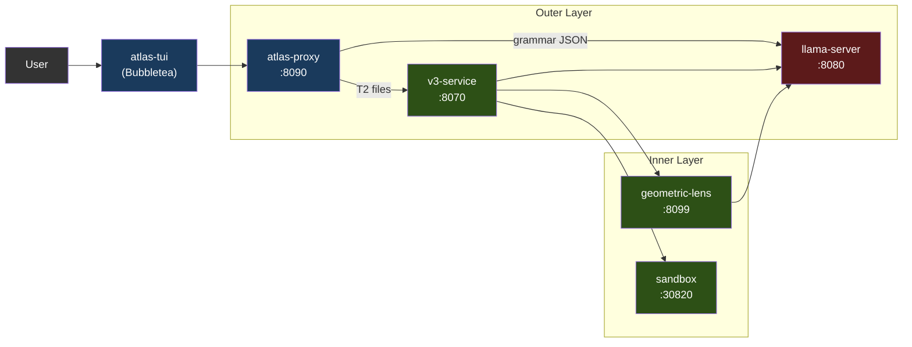

各服务既可以通过 Docker Compose（推荐）作为容器运行，也可以通过 `atlas` 启动器作为本地进程运行。只有 llama-server 使用 GPU，其余所有组件都跑在 CPU 上。

聊天前端是 **atlas-tui**（Bubbletea）：一个原生 Go 终端 UI，消费 `/v1/agent`（按轮次的聊天 SSE）和 `/events`（面向 pipeline 窗格的全局类型化信封事件流）。用 `atlas`（默认交互模式）或 `atlas tui`（显式指定）启动。Pipeline 窗格实时展示 V3 各阶段；聊天窗格通过 glamour 渲染助手的 markdown；斜杠命令 `/add /diff /commit /run` 等负责处理本地文件上下文与 shell 调用。输入是模式感知的（chat / `!bash` / `/slash`），并带有提示下拉。

希望使用工具调用 + V3 pipeline 的第三方客户端应直接对接 `/v1/agent`；`/v1/chat/completions` 是对 llama-server 的透传（见 §3）。该契约记录在 [API.md](../../API.md) 中。

### 1.1 支持的加速器

llama-server 是唯一使用 GPU 的服务；其余每个 ATLAS 服务都跑在 CPU 上（代理是 Go，v3-service / geometric-lens / sandbox 是 Python）。这让多后端的表面积保持很小 —— 添加一个新加速器意味着一个新的 Dockerfile 加上一个入口点环境变量分支，而不是改动整个 pipeline。

| 后端 | 状态 (V3.1.x) | 镜像 / 构建路径 | Compose override | 已测试显卡 |
|---|---|---|---|---|
| **CUDA** (NVIDIA) | 支持 (Supported)（自 V3.1.0 起） | `inference/Dockerfile.v31` → `atlas-llama` | （默认） | RTX 5060 Ti 16GB（基准）。发布的镜像只针对 Blackwell（计算能力 12.0/12.1）编译；更早的代次需要本地重建 —— 见 [SETUP.md](../../SETUP.md) |
| **ROCm / HIP** (AMD) | 社区验证 (Community-tested)（自 V3.1.1 起） | `inference/Dockerfile.rocm` → `atlas-llama-rocm` | `docker-compose.rocm.yml` | RX 7900 XTX（社区冒烟测试，GH #26） |
| **Metal** (Apple Silicon) | 支持 ([#32](https://github.com/itigges22/ATLAS/issues/32)) | 混合方案：原生 llama-server (Metal) + 其余组件用 Docker（macOS 无法将 GPU 直通给容器） | `docker-compose.macos.yml` | M 系列；≤16 GB 用 Q4_K_M，≥24 GB 统一内存用 Q6_K |
| **Vulkan**（跨厂商回退） | 预览 (Preview) | `inference/Dockerfile.vulkan` → `atlas-llama-vulkan` | `docker-compose.vulkan.yml` | lavapipe CPU 启动路径（已冒烟测试）；尚无真实 GPU 验证 |
| **SYCL** (Intel Arc) | 路线图 (Roadmap) —— Intel Arc 目前使用 `vulkan` | 待定 | 待定 | — |

**后端选择发生在安装时，而非运行时。** `atlas init` 运行 `tier.detect_gpu()`（见 `atlas/cli/commands/tier.py`），在所有检测到的厂商中挑选显存最大的 GPU（可用 `ATLAS_GPU_VENDOR` / `ATLAS_GPU_INDEX` 覆盖），并把 `ATLAS_BACKEND={cuda|rocm|metal|vulkan}` 写入 `.env`。当主机存在打包好的原生后端时，检测会解析到它：NVIDIA 用 CUDA，x86_64 上的 AMD 用 ROCm，macOS 用混合 Metal 路径。当主机没有打包好的原生后端时（Intel Arc、arm64 上的 AMD、无法识别的厂商），向导会提供 Vulkan 通用回退（默认选是）：一个镜像覆盖 AMD、Intel、Adreno、MoltenVK 和 lavapipe CPU 光栅化器，性能比调优过的原生后端低大约 20–40%。只有当完全不存在可用的后端时，它才会拒绝 —— 而不是写出一个无法启动的 `.env`。每个后端都有自己预构建的镜像；用户不会运行一个打包了所有后端库的臃肿镜像。

**自带模型的表面（V3.1.1）。** `atlas lens check` 是针对运行中的 llama-server 的一次廉价预检，用于报告当前加载的模型是否与 Lens 兼容。`atlas lens build --samples <path>` 封装了 `geometric-lens/geometric_lens/training.py`，按模型原生的嵌入维度训练全新的 C(x)（`cost_field.pt`）**和** G(x)（XGBoost）工件。二者结合让用户无需 fork lens 代码即可换入非默认的 GGUF —— C(x) 构造函数接受任意 `input_dim`，因此逐模型变化的只有训练出来的权重。面向用户的流程见 [CLI.md § atlas lens](../../CLI.md#atlas-lens)；`atlas lens publish`（或合并的 `atlas publish`）会把工件上传到 HuggingFace，并开出固定其哈希的注册表 PR。

**与厂商无关的部分**（在每个后端上都可用）：语法约束的 JSON、自嵌入（`/embedding`）、逐层隐藏状态、ASA 控制向量（由 llama.cpp 的 `control_vector_load` 加载，与后端无关）、KV 缓存量化、整个外层 agent 循环、V3 pipeline、Geometric Lens 以及 sandbox。

**逐后端有差异的部分：**
- **Flash attention。** CUDA + ROCm：完整支持。Metal：受限（llama.cpp 的 Metal 后端对部分 head 尺寸支持 flash-attn；不支持时默认关闭）。Vulkan：取决于驱动。
- **固定（pinned）主机内存。** `GGML_CUDA_NO_PINNED` 适用于 CUDA + ROCm（HIP 在 GGML 兼容层镜像了 CUDA 的路径）。Metal/Vulkan 不使用 CUDA/HIP 的固定内存路径。
- **多 GPU + 张量并行。** V1 在每个后端上都只支持单 GPU；多 GPU 是 GH #34，不绑定到特定厂商。
- **Apple 统一内存。** macOS 共享 GPU+系统内存；"VRAM" 的算法实际上是"总共 16 GB 减去操作系统 + 应用"。见 §7。

K3s 部署路径（`scripts/install.sh`，清单在 `templates/` 中）截至 V3.1.1 仅支持 CUDA —— ROCm K8s 方案已推迟到 V3.2 的基础设施清单（需要 `/dev/kfd` + `/dev/dri` hostPath 挂载以及 `render`/`video` 组成员身份，相当于集群级别的 `docker-compose.rocm.yml`）。

---

## 2. 服务

| 服务 | 端口 | 语言 | 用途 |
|---------|------|----------|---------|
| **llama-server** | 8080 | C++ (llama.cpp) | LLM 推理（CUDA / ROCm / Metal / Vulkan；SYCL 在路线图上 —— 见 §1.1）、语法约束的 JSON、自嵌入、逐层残差隐藏状态 |
| **atlas-proxy** | 8090 | Go | agent 循环、工具调用路由、tier 分类、`/v1/agent` SSE、`/events` 类型化 SSE、`/cancel`。`/v1/chat/completions` 原样透传给 llama-server。 |
| **atlas-tui** | （客户端） | Go | Bubbletea TUI；消费 `/events` 和 `/v1/agent` SSE 流。 |
| **v3-service** | 8070 | Python | V3 pipeline 的 HTTP 封装（PlanSearch、DivSampling、PR-CoT 等） |
| **geometric-lens** | 8099 | Python (FastAPI) | 内部 `/internal/*` 打分服务：C(x) 能量打分、G(x) XGBoost 质量预测、逐步打分，以及模式缓存（读 + 写）；拥有 SQLite 状态存储（`lens-state` 卷上的 `SQLITE_DB_PATH`），支撑模式缓存、共现图和任务队列 |
| **sandbox** | 30820（主机）/ 8020（容器） | Python (FastAPI) | 隔离的代码执行、编译、检查、测试运行 |

---

## 3. atlas-proxy（外层）

代理是聊天前端的入口点。它在 `/v1/agent` 上接收用户消息（类型化事件流 —— TUI 使用的就是它），并运行一个内部 agent 循环：调用 llama-server、解析工具调用、执行它们，然后把事件流式回传。`/v1/chat/completions` 端点是对 llama-server 的透明透传；保留它是为了 SDK 兼容性，它并不运行 agent 循环。完整的事件类型目录见 [API.md](../../API.md)。

代理由 12 个 Go 文件组成，每个文件只负责一件事：

| 文件 | 职责 |
|---|---|
| `main.go` | HTTP 服务器、路由、鉴权、透传、错误信封、私密值日志过滤 |
| `agent.go` | agent 循环：轮次状态、LLM 调用、计划生成、模式上下文注入、卡死循环断路器 |
| `tools.go` | 14 个工具定义与执行器、层级分类、工具调用语法 |
| `gates.go` | 诚实性/计划闸门：声明校验、结构、语法、内嵌脚本、计划遵循、计划提醒、资源 lint |
| `detectors.go` | 卡死模式检测：工具重复、推理重复、traceback 定位 |
| `context.go` | 上下文增强：符号索引、项目扫描、工作区隔离、会话文件清单 |
| `permissions.go` | 权限闸门（`/v1/permission`）、信任模式、硬阻断模式 |
| `lens.go` | lens 打分调用、lens 样本入库（`/feedback`）、校准状态 |
| `guardrails.go` | 按工具的引导防护（收缩、缺失命令/模块的引导、doctype 剥离） |
| `events.go` | 类型化信封 broker（`/events`）与 SSE 管道 |
| `v3_bridge.go` | 面向 v3-service `/v3/generate` + `/v3/plan` 的 SSE 客户端 |
| `types.go` | 共享类型、层级、轮次上限 |

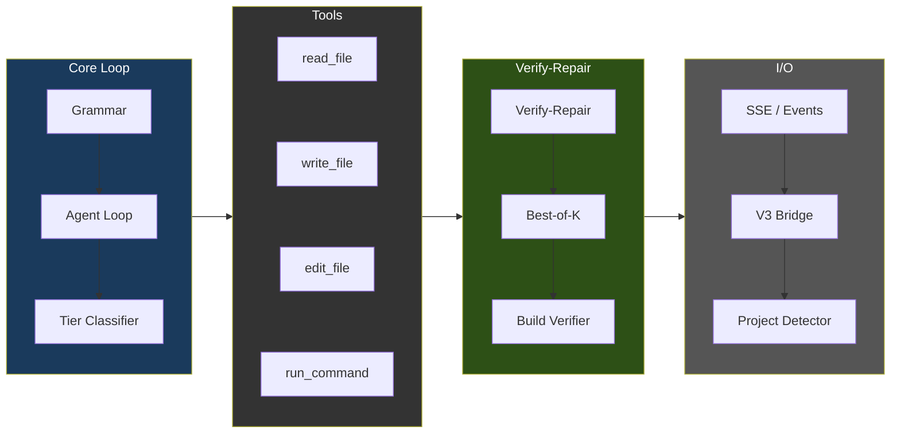

### Agent 循环流程

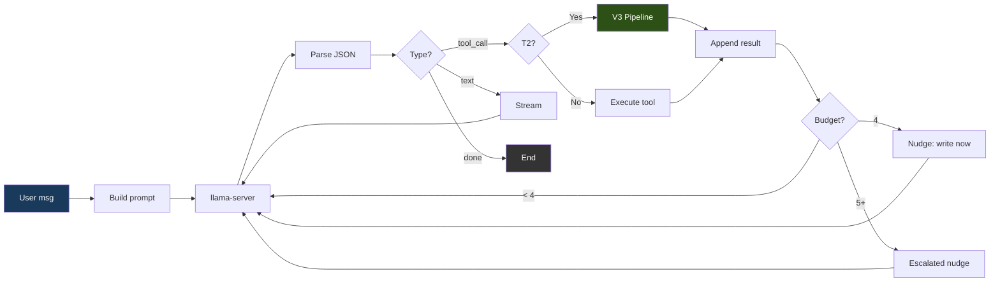

### 语法强制执行

每一次模型输出都被约束到三种有效 JSON 形态之一：

```json
{"type": "tool_call", "name": "<tool_name>", "args": {...}}
{"type": "text", "content": "<message>"}
{"type": "done", "summary": "<summary>"}
```

在默认的 `strict` 模式下，代理发送一个完整的 JSON schema —— 带 `additionalProperties: false` 的 `oneOf`，工具名从注册表中枚举 —— llama-server 在 token 生成期间将其作为语法强制执行。语法约束让畸形输出变得罕见，而非不可能：`ATLAS_GRAMMAR_MODE=loose` 只发送 `{"type":"json_object"}`（有效 JSON，不强制形态 —— 有些模型需要它），而且回复 token 上限可能在 JSON 中途截断。代理把解析当作可能失败的操作对待 —— 它会从散文/`reasoning_content` 中恢复 JSON，在执行前检测被截断的工具参数，把针对性的解析失败描述反馈回去，并在连续三次失败后中断循环。

### 工具

`proxy/tools.go` 中注册了 14 个工具：

| 工具 | 用途 | 只读 |
|------|---------|-----------|
| `read_file` | 读取文件内容（可选 offset/limit） | 是 |
| `outline_file` | 列出文件的顶层函数/类及其行号范围，不含函数体（`.py` 使用 tree-sitter，其余为尽力而为的扫描）。外科式读取的入口点：先 outline，再用带 offset/limit 的 `read_file` | 是 |
| `write_file` | 创建一个新文件（对超过 5 行的已有文件会被拒绝 —— 见安全限制） | 否 |
| `edit_file` | 针对 ≤10 行改动的外科式内联字符串替换（old_str/new_str） | 否 |
| `structural_edit` | 通过 tree-sitter 选择器（`function:NAME`、`class:NAME`、`<tag>`）对整个函数/类/HTML 元素进行重写；对整节点替换而言，必须优先于 edit_file 使用。GH #39，v1 中仅支持 .py/.html/.htm | 否 |
| `delete_file` | 删除文件或空目录（之后强制退出循环） | 否 |
| `move_file` | 在工作区内移动或重命名文件（例如 `index.html` → `templates/`）。纯粹的重定位 —— 绕过 V3/外科式编辑门控，拒绝覆盖已存在的目标。由于 shell `mv`/`cp` 会被拒绝，这是"重新组织文件"的受支持路径 | 否 |
| `find_file` | 按文件**名**/路径做正则搜索（廉价的存在性检查 + 定位）。区别于在文件内容中 grep 的 `search_files`。 | 是 |
| `search_files` | 跨文件内容做正则搜索（最多 200 个匹配，跳过 .git/node_modules） | 是 |
| `list_directory` | 列出目录内容及其类型和大小 | 是 |
| `run_command` | 通过 sandbox 容器执行 shell 命令；5 分钟超时上限 | 否 |
| `run_background` | 在 sandbox 中启动一个长时间运行的进程（例如 `python app.py`）；立即返回一个 `job_id` | 否 |
| `tail_background` | 通过 `job_id` 获取某个后台任务新增的 stdout/stderr | 是 |
| `stop_background` | 通过 `job_id` 对某个后台任务发送 SIGTERM/SIGKILL | 否 |

### 工具选择偏差缓解

一次实测的参考部署显示出一种偏差：即便 `structural_edit` 才是正确选择，模型也倾向于用 `edit_file`（BiasBusters arxiv 2510.00307 —— 相邻工具名的嵌入会相互竞争；描述比名称更重要）。代理中组合了四道与模型无关的防线：

1. **描述重写**（`proxy/tools.go`）。edit_file 的描述
   警告不要用于整文件/整函数；structural_edit 的描述
   声明对 >10 行 / 整节点替换是必需的；write_file 的描述
   声明仅用于新文件。
2. **条件式 GBNF 语法**（`proxy/tools.go`，
   `proxy/agent.go:stepExclusions`）。当一个 write_file 对
   一个 >5 行的已有 .py/.html/.htm 文件被拒绝时，下一次 LLM 调用会
   被一个 GBNF 语法约束，该语法从工具名产生式中禁掉
   edit_file 和 write_file。模型在物理上无法发出
   它们。该限制在一次决策后失效。
3. **逐步工具列表过滤**（同一触发条件）。注入一条临时的
   `[system note]` 用户消息，提醒模型在这一步
   structural_edit 是唯一的结构性编辑工具。
4. **ASA 操控向量**（`geometric-lens/asa_calibration/`）。
   激活操控在上游移动残差流分布，因此即使在任何拒绝
   触发之前的首次尝试决策中，也会偏好 structural_edit。仅当
   `/models/ast_edit_steering.gguf` 的 `.model` 侧车标记与所选模型
   匹配时，才由 `inference/entrypoint-v3.1.sh` 自动加载 —— 一旦通过
   `geometric-lens/asa_calibration/README.md` 中的工作流构建出兼容的
   向量，它就始终生效。可通过 `ATLAS_CONTROL_VECTOR*` 环境变量
   覆盖路径/缩放/层范围。

   **逐模型耦合。** 每个 ASA 向量都是针对某个特定模型的
   残差流几何结构训练出来的。任何跨模型回退都不安全。
   `atlas asa check` 验证 `.model` 侧车标记，探测已加载的嵌入维度，
   解析 GGUF 层元数据，并报告 `compat` / `needs-build` /
   `incompatible`。`atlas asa build` 从已加载的模型推导提取层，
   写出向量和标记，并运行在 lens 容器内部。`atlas asa publish`
   在上传前会拒绝缺失或不匹配的标记。见 [CLI.md § atlas asa](../../CLI.md#atlas-asa)。

### 逐文件 Tier 分类

每一次 `write_file`/`edit_file` 调用都被独立分类：

| Tier | 最大轮次 | 动作 |
|------|-----------|--------|
| T0（对话型） | 5 | 仅文本回复 |
| T1（简单） | 0（无上限） | 直接写入 —— 无 V3 开销 |
| T2（功能） | 0（无上限） | 触发 V3 pipeline |
| T3（困难） | 0（无上限） | 触发 V3 pipeline |

tier 上限为 0（无上限）；由循环内部的检测器栈决定何时中断：lens 回退（`agent_lens_intervention`）、推理重复（`agent_reasoning_intervention`）、工具调用重复（`agent_repeat_intervention`）、路径感知的错误熔断器、无动作即 done 门控、claim-check 门控、计划遵循阈值，以及空回复回退。对于一次性的"修复整个应用"提示，运维人员可用 `ATLAS_MAX_TURNS=<n>` 覆盖 —— 见 `proxy/types.go::envOverrideMaxTurns`。

分类器在 `proxy/tools.go`（`classifyFileTier`）；逻辑模式匹配器在同一文件中（`hasLogicIndicators`）。

**始终为 T1（直接写入）：**
- 按名称匹配的配置文件（如 `package.json`、`go.mod`、`pyproject.toml`、`dockerfile`、`docker-compose.*`）
- 按扩展名匹配的数据文件（`.json`、`.yaml`、`.yml`、`.toml`、`.csv`、`.xml`、`.env`）
- 样式文件（`.css`、`.scss`、`.less`）
- 文档（`.md`、`.txt`、`.rst`）和 shell 脚本（`.sh`、`.bash`）
- 少于 **10 行**的极小文件（在那种体量下 V3 没有任何可以有意义地多样化的东西）
- 没有逻辑指标的未知扩展名

完整的配置文件列表和扩展名集合位于 `proxy/tools.go:classifyFileTier`。

**T2（V3 pipeline）** —— 当文件 ≥10 行且满足以下任一条件时合格：
- `hasLogicIndicators(content)` 返回 true —— 在覆盖函数/方法定义、控制流、错误处理、Flask/FastAPI/Django 路由、Express/Node API、React 状态/数据、校验、数据库调用、JSX/React 组件模式和导入的模式家族中出现 **2 次以上匹配**（字面 token 列表见 `proxy/tools.go:hasLogicIndicators`）
- 或者该文件具有可识别的源代码 / 标记语言扩展名（`.py`、`.go`、`.rs`、`.ts`、`.tsx`、`.js`、`.jsx`、`.html`、`.htm` 等）且没有触发逻辑指标 —— 在 T2 给予它疑点利益（覆盖诸如 12 行组件骨架这类极简但真实的文件）

**T3（困难）** —— 目前分类器自身从不直接发出 T3；圈复杂度精炼器（`refineTierWithCC`，经由 GH #39 第 2 点的 `/internal/cyclomatic_complexity`）按 McCabe CC *升级*：CC ≥ 8 时升到 T2（包括从 T1 升级），CC ≥ 16 时升到 T3。从不降级。

### Plan 模式（按轮次预检）

Plan 模式是一个预检式的规划步骤，在每个 agent 轮次、第一次工具调用之前运行一次：规划器采样候选计划，用启发式打分，并把获胜者渲染进系统提示；当模型偏离计划胡乱折腾时，一个遵循门控会自动修订计划。它减少了探索折腾，并通过守住计划的验证步骤来阻止无证据的 `done`。

完整的流程、组件、可调项、跳过条件、成本和测试矩阵见 [PLAN_MODE.md](../../PLAN_MODE.md)。

### 安全限制

面向运维的限制及其调优旋钮。内部操控守卫（回溯定位、缺失模块/大小写不匹配操控、符号接地、空操作/空内容/语法门控、doctype 剥离）位于 `proxy/guardrails.go` 和 `proxy/agent.go`。

| 限制 | 取值 | 用途 |
|-------|-------|---------|
| 对话裁剪 | 按 slot 调整大小的滑动窗口：保留系统消息 + 最近的用户指令 + 当前活动文件的内容 + 尽可能多的尾部消息以塞满 `per-slot context − ATLAS_MAX_TOKENS − 2048`（下限：保留 8；硬上限通过 `ATLAS_AGENT_HISTORY_BUDGET`） | 在不丢掉正在编辑的文件的前提下防止上下文溢出 |
| 冗余读取短路 | 对一个未改动文件的整文件重读仅在其内容仍然在场时返回"已在上下文中"指针；否则重新提供完整文件（`ATLAS_DEDUP_READS=0` 禁用） | 避免每轮重新编码一个未改动的文件，同时不让模型盲编辑 |
| V3 交互式墙钟上限 | 单次 V3 pipeline 调用被限制在 `ATLAS_V3_TIMEOUT`（默认 180s）；超时时代理回退到模型自身的语法门控内容（`0` 禁用） | 在长时间修复停滞下保持交互式会话的响应 |
| 逐轮推理预算 | 在约 6144 个推理 token 后切断流（`ATLAS_REASONING_BUDGET`，0 禁用）；恢复时从推理中提取一个内嵌的 tool_call 或重新提示 | 限定推理螺旋 |
| 对已有文件的 write_file | 文件 > 5 行时拒绝；在 .py/.html/.htm 上，逐步语法门控操控转向 `structural_edit` | 强制外科式编辑（`edit_file`）或整节点编辑（`structural_edit`） |
| 可疑收缩守卫 | 当 `oldSize >= 100B` 且 `newSize < 64B` 时拒绝 `structural_edit`/`edit_file`（`proxy/guardrails.go::validateNotSuspiciouslyShrunk`） | 在破坏性的桩重写落盘之前抓住它们 |
| structural_edit 失控内容守卫 | 当 `content` > 8 KB 且 > 4× 文件大小时拒绝 | 抓住作为替换节点发出的推理泄漏块 |
| 错误循环熔断器 | 连续 3 次失败 | 停止失控的失败循环 |
| 探索预算 | 连续 4 次只读调用时提示（nudge）；5 次以上时升级提示。读取始终会执行 —— 提示是把*下一*轮引向写入 | 推动模型去写，而不是无限探索 |
| 命令输出截断 | stdout 8,000 字符，stderr 4,000 字符 | 防止上下文泛滥 |
| 搜索结果 | 最多 200 个匹配；文件搜索跳过 > 1 MB 的文件 | 限定搜索成本 |
| 截断检测 | 对工具参数做 JSON 解析检查 | 抓住被截断的模型输出 |

---

## 4. V3 Pipeline（内层）

在 T2+ 文件的 `write_file`/`edit_file` 执行器内部激活。该 pipeline 有四个阶段，且在每个阶段都设有提前退出。

### Pipeline 流程

```mermaid
flowchart LR
    Entry["T2 detected"] --> Probe["Probe"] --> Score1["C(x)/G(x)"] --> SB1["Sandbox"]
    SB1 --> Pass1{"Pass?"}
    Pass1 -->|"Yes"| Done["Done"]

    Pass1 -->|"No"| PS["PlanSearch"] --> DS["DivSampling"] --> BF["BudgetForcing"] --> Build["Build Check"] --> Score2["Score K"] --> SB2["Test K"]

    SB2 --> AnyPass{"Passed?"}
    AnyPass -->|"2+"| SStar["S* Tiebreak"] --> Done
    AnyPass -->|"1"| Select["Lens Select"] --> Done

    AnyPass -->|"0"| FA["Failure Analysis"] --> PRCOT["PR-CoT"]
    PRCOT --> PRPass{"Pass?"}
    PRPass -->|"Yes"| Done
    PRPass -->|"No"| Refine["Refinement"]
    Refine --> RefPass{"Pass?"}
    RefPass -->|"Yes"| Done
    RefPass -->|"No"| Derive["Derivation"] --> Done

    style Entry fill:#1a3a5c,color:#fff
    style Done fill:#333,color:#fff
    style Probe fill:#1a3a5c,color:#fff
    style PS fill:#1a3a5c,color:#fff
    style DS fill:#1a3a5c,color:#fff
    style BF fill:#1a3a5c,color:#fff
    style SStar fill:#2d5016,color:#fff
    style Select fill:#2d5016,color:#fff
    style Score1 fill:#2d5016,color:#fff
    style Score2 fill:#2d5016,color:#fff
    style SB1 fill:#2d5016,color:#fff
    style SB2 fill:#2d5016,color:#fff
    style Build fill:#2d5016,color:#fff
    style PRCOT fill:#5c3a1a,color:#fff
    style Refine fill:#5c3a1a,color:#fff
    style Derive fill:#5c3a1a,color:#fff
    style FA fill:#5c3a1a,color:#fff
```

图例：蓝色 = 生成，绿色 = 验证/选择，棕色 = 修复。

### 各阶段细节

**Phase 0: Probe** 以渐进式预算重试（light → standard → nothink）生成单个基线候选。它用所选模型的 C(x)/G(x) 工件打分，并在 sandbox 中测试。如果通过，pipeline 立即退出。

**候选分配：CxGx 闸门**（以 `phase2` / `phase2_allocated` 发出）决定失败的探测能获得多少个候选。探测的 C(x)+G(x) 组合分数（一次嵌入提取，两个模型都用）驱动一条两步规则：校准后的 C(x) 归一化能量在 Budget Forcing 所用的同一阶梯上选出基础 tier，而 G(x) 质量分数在低于该模型校准的 severe 边界时把这个 tier 抬高 +1，在远低于它（0.75 倍）时抬高 +2 —— 也就是探测在 C(x) 看来便宜、在 G(x) 看来却是错的那种情况。tier 决定 k（`nothink` 1、`standard` 3、`hard` 5、`extreme` 8），并受一条硬性的 **k >= 3 下限**约束，因此闸门只能在原先固定的 k=3 之上增加候选，不能减少；它的最坏情况就是旧行为。两个信号都需要该模型的校准文件（`cx_normalization.json`、`gx_thresholds.json`）：lens 缺失、不可达或未校准时，一律在 `standard` 下分配恰好 k=3，于是未校准的 bundle 会运行它此前运行的那条 pipeline，而不是按一把对它毫无意义的尺子来路由。

这条下限正是它与此前被移除的纯 C(x) 分配器的区别：那一版没有下限，会把 k=1 交给探测*刚刚失败*的任务，实测为 +0.0 pp。每臂 n=175 的四臂三角验证：带闸门 66.9%，固定 k=3 为 64.6%，把同样的 tier 组合在任务间打乱为 61.7%，全部 k=8 则以多出约 27% 的 token 达到 67.4%。在同等开销下比打乱臂高出 5.1 pp，这才说明 lens 信号本身携带信息，而不只是算力在起作用。

线上路径的差异：代理的 V3 桥接会在 `ATLAS_V3_TIMEOUT`（默认 180s）后放弃一次 pipeline 调用，这是 bench 从未有过的上限；因此无限制地升级到 k=8 会把预算全花在生成上，最终返回超时兜底，而不是时钟本可以产出的 k=3 答案。为此线上编排器会把剩余的实际时间以及在该任务上观测到的单次调用延迟一并传入，闸门则把 tier 降到预算真正能生成的水平 —— 同时保留一次精化迭代，使升级不会饿死 Phase 3 —— 但绝不会低于下限。bench 运行器不传预算，严格按测得的结果分配。实现位于 `v3-service/stages/cxgx_gate.py`，由两个编排器共享。

**Phase 1: 约束驱动的生成**

- **PlanSearch** 通过提取不同的约束集合，生成 3 个结构上不同的实现计划
- **DivSampling** 施加扰动多样性：4 个角色（competitive_programmer、systems_engineer、mathematician、pragmatist）+ 4 条指令（step_by_step、edge_case_first、complexity_aware、constraint_driven）+ 4 种风格（functional、pythonic、optimize_iteratively、structured）
- **Budget Forcing** 控制思考 token 的分配：

| Tier | 思考 token | Wait 注入 |
|------|----------------|----------------|
| nothink | 0 | 模板级禁用思考 |
| light | 1,024 | 无 |
| standard | 2,048 | 若思考结束时 < 512 token |
| hard | 4,096 | 若思考结束时 < 1,024 token |
| extreme | 8,192 | 若思考结束时 < 2,048 token |

Wait 注入会追加 "Wait, let me reconsider.\n" 以请求更长的一轮推理。Tier 选择使用所选模型经过校准的 C(x) 能量；没有校准时，ATLAS 使用配置的默认预算，而不是套用另一个模型的常量。

**Phase 2: 验证与选择**

- **构建验证**：Python（`py_compile`）、TypeScript（`tsc --noEmit`）、JavaScript（`node --check`）、Go（`go build`）、Java（`javac`）、Kotlin（`kotlinc`）、Rust（在 sandbox 的 `/execute` 路径上用 `rustc`；含 `Cargo.toml` 的项目会被识别并使用 `cargo build`，`cargo check` 仅通过构建命令白名单接受）、C/C++（`/execute` 上执行带 `-Wall` 的完整 `gcc`/`g++` 编译；`-fsyntax-only` 只适用于 `/syntax-check` 路由）、Ruby（`ruby -c`，解释型语言，无编译步骤）、PHP（`php -l`，同上）、Shell（`bash -n`）。Next.js、React、Flask、Django、Express 有框架级覆盖。
- **否决（Veto）**：即使候选通过了 sandbox，仍有三项检查可以否决它 —— lens 否决（逐步的 `gx_min` 低于该模型校准后的 severe 阈值：代码能跑，但生成模式已经塌陷成存根）、结构否决（tree-sitter 发现某个直接标识符调用无法解析到任何本地定义、import、内建或项目符号 —— 一个等待发生的 `NameError`），以及由开关控制的调用图否决（`ATLAS_CALL_GRAPH`：跨文件调用且作用域内没有定义）。被否决的候选会被标记为失败（`passed=false`、`vetoed_by`，否决理由作为其错误输出），并像其他失败候选一样进入 Phase 3 的修复池；最终的能量兜底永远不会返回它。如果所有候选都被否决且修复失败，pipeline 不返回代码，由调用方用自己的基线替代
- **Lens 选择**（≥1 个通过）：按 C(x) 能量排序，最低者胜出

**Phase 3: 修复**（若 0/K 通过）—— 三种策略，顺序执行并带提前退出：

- **失败分析**：对失败分类（wrong_algorithm、implementation_bug、edge_case_miss、time_limit、format_error、partial_correct）
- **元认知评估**：从观察到的失败类别推导并注入补偿性约束
- **PR-CoT**：4 个视角（logical_consistency、information_completeness、biases、alternative_solutions）×（分析 + 修复）= 约 8 次 LLM 调用，最多 3 轮
- **Refinement Loop**：失败分析 → 约束精炼 → 代码生成 → 测试 → 学习。2 次迭代，120s 预算，每次约 5+ 次 LLM 调用。余弦距离过滤（>= 0.15）防止假设重复
- **Derivation Chains**：分解为至多 5 个子问题，逐个用 sandbox 验证，组合出最终结果。约 7+ 次 LLM 调用

### 模块图

pipeline 阶段是 `v3-service/stages/` 中的 13 个 Python 模块。`v3-service/pipeline.py` 编排其中 11 个（10 个直接调用，`constraint_refinement` 通过精化循环）；`lens_feedback` 和 `embedding_store` 只在离线 bench 运行器（`atlas/bench/v3_runner.py`）下运行，该运行器会把 checkout 中的 `v3-service/` 加入自身路径，因此两个调用方共享同一份阶段实现：

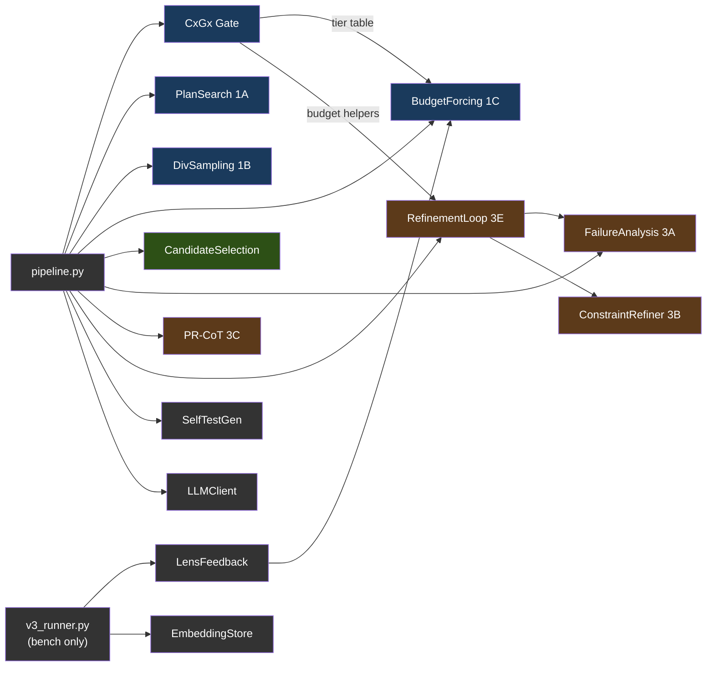

图例：蓝色 = Phase 1（生成），绿色 = Phase 2（选择），棕色 = Phase 3（修复），灰色 = 工具。由 `v3_runner.py` 供给的模块仅用于 bench 运行器；服务不会调用它们。服务本身是 `main.py`（HTTP 处理器）→ `pipeline.py`（编排器）→ `planning.py` / `scoring.py` / `symbols.py` / `adapters.py` 这样的扁平同级模块。

---

## 5. Geometric Lens

一个神经打分系统，通过分析模型嵌入的几何结构，在不执行代码的情况下评估代码质量。完全运行在 CPU 上。服务表面仅对内（`/internal/*`）：C(x)/G(x) 打分（单次与逐步），以及把此前会话中的经验回灌进 agent 循环的[模式缓存](#模式缓存)。

#### 为什么叫 "Geometric Lens"？

Geometric Lens 背后的核心理念源自一个简单的前提：停止扩大模型，转而用支撑性的基础设施把它们包裹起来。Jose Crespo 的 ["Everyone's Wrong About AI Programming"](https://www.josecrespophd.org/p/everyones-wrong-about-ai-programming) 论证了 AI 生成的代码会漂向错误，因为当前的 LLM 工作在扁平的嵌入空间中，正确与错误的代码路径代价相同。解决方案是在模型周围构建一个能量景观，让正确的代码处于"下坡"、错误的代码处于"上坡"。

Anthropic 的 [Manipulating Manifolds](https://transformer-circuits.pub/2025/linebreaks/index.html) 研究提供了证据，表明 transformer 已经在其嵌入空间中创造出可操纵的几何结构 —— 原材料早已存在。Bar 等人的 [Geometric Unification of Generative AI](https://arxiv.org/html/2510.00666v1) 形式化了如何在数据流形上学习并使用距离函数来打分。

ATLAS 用两个互补的模型实现这一点。C(x) 是建立在所选模型自身嵌入之上的一个习得的能量函数（`hidden_dim`→512→128→1 的 MLP）。每个代码候选都由 llama-server 嵌入，C(x) 给它在那个几何结构中所处的位置打分。低能量意味着该候选与已知正确的代码聚成一类。高能量意味着它与已知错误的代码聚成一类。无需外部预言机，无需执行 —— 仅仅是所选模型表示的几何结构。

G(x) 是质量预测器 —— 一个建立在 PCA 降维嵌入之上的 XGBoost 分类器，根据候选在降维空间中所处的位置预测通过/失败。当 C(x) 回答"这个候选有多好？"时，G(x) 回答"这个候选可能通过吗？"它是唯一的 G(x) 实现：早先的度量张量形式及其可修正性端点在 XGBoost 成为部署路径后已被移除（几何感知变体见 git 历史）。

### 打分模型

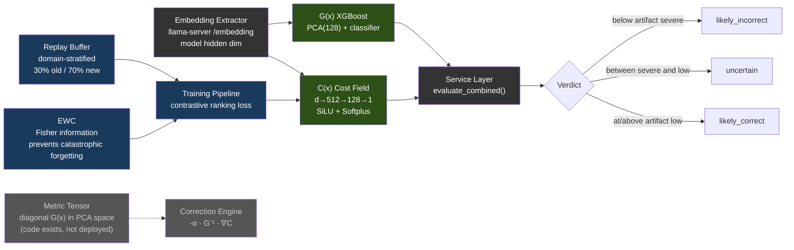

以下数字描述的是已发表的 V3 研究所用的冻结参考工件；它们是出处记录，不是运行时的维度或默认值：

| 模型 | 参考架构 | 训练数据 | 性能 |
|-------|-------------|---------------|-------------|
| **C(x)** | 4096→512→128→1 MLP (SiLU, Softplus) | 597 个 LCB 嵌入（504 PASS，93 FAIL） | Val AUC 0.9467，分离度 2.04x |
| **G(x)** | PCA(4096→128) + XGBoost | 13,398 个嵌入（4,835 PASS，8,563 FAIL） | PCA 80.8% 方差 |

C(x) 的归一化是 `sigmoid(steepness × (energy - midpoint))`。所选模型的 `cx_normalization.json` 提供这两个值；`atlas lens build` 会从该模型带标签的 PASS/FAIL 候选中推导它们。G(x) 的判定阈值同样来自 `gx_thresholds.json`。缺少任一校准时，归一化的判定保持中性/未校准状态，而不是借用参考工件的标度。

每个当前的 Lens 工件包还包含 `model_identity.json`。服务要求其中的模型名与 llama-server 的 `/v1/models` 所报告的 served-model id 匹配（该探测失败时以 `ATLAS_MODEL_NAME` 作为回退）；仅凭嵌入宽度相等无法确立两个不同模型之间的兼容性。

> **注意：** 模型权重（.pt、.pkl 文件）未提交到仓库 —— 它们在训练期间构建，并烘焙进容器镜像或在运行时挂载。当模型文件缺失时，服务会优雅降级：C(x) 返回中性能量，G(x) 返回 `gx_score: 0.5` 和 `verdict: "unavailable"`。训练数据与权重可在 [HuggingFace](https://huggingface.co/datasets/itigges22/ATLAS) 获取。

### 模式缓存

跨会话记忆：成功运行后写入的模式，会作为上下文回灌给后续的 agent 循环。

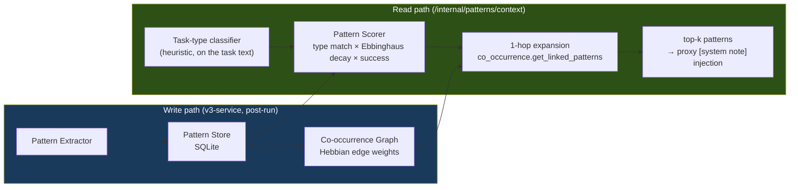

模块：`geometric-lens/cache/{pattern_store, pattern_extractor, pattern_scorer, co_occurrence, seed_patterns}.py`。匹配依据是模式类型 + 新近度 + 成功率 —— 不存在检索索引；store 会在首次启动时用 `seed_patterns` 自我播种，每次服务都会更新该模式的访问统计。消费方是代理的模式上下文注入（§3）。

<a id="rag--pageindex-v2"></a><a id="confidence-router--pattern-cache"></a>

> **已移除的子系统。** 早期版本在 lens 内部附带了 RAG/PageIndex 项目索引器、BM25 模式匹配器，以及基于 Thompson 采样的置信度路由器。它们只能通过产品中无人调用的 lens 端点触达，已在 2026-08 的简化行动中移除（见 CHANGELOG）。上面的模式缓存是那套栈残留下来的部分，并围绕单一常驻读取器做了重建。

---

## 6. Sandbox

带编译、测试和检查的隔离代码执行。

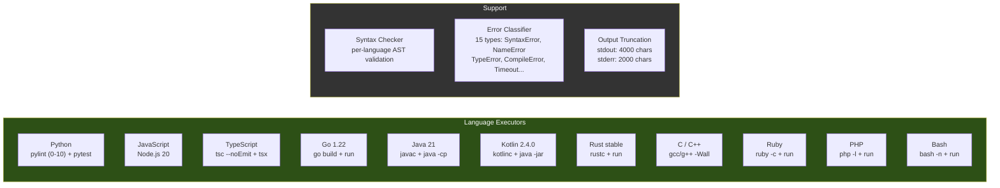

接受的语言别名：`py`/`python3`（Python）、`js`/`node`（JavaScript）、`ts`（TypeScript）、`golang`（Go）、`java`（Java）、`kt`/`kts`（Kotlin）、`rs`（Rust）、`c++`（C++）、`rb`（Ruby）、`php`（PHP）、`sh`/`shell`（Bash）。常用 CLI 工具已内置在镜像中（`git`、`sqlite3`、`jq`、`patch`、`zip`/`unzip`、`xz`、`curl`），另外还有二进制检查工具（来自 binutils 的 `strings`、`objdump`、`readelf`、`nm`，以及 `file`、`xxd`）—— 容器以非 root 身份运行在只读基础镜像上，因此任务要 shell 调用的一切都必须预装，运行时无法用 apt 安装。对二进制文件调用 `read_file` 会返回指向这些工具的提示，而不是原始字节。最大执行时间：Docker 部署中为 300s（compose 设置 `MAX_EXECUTION_TIME=${ATLAS_SANDBOX_MAX_EXECUTION_TIME:-300}` 以匹配代理 5 分钟的 `run_command` 上限；裸代码默认值为 60s）。内存、CPU 和进程数上限是容器级的：compose 设置 `mem_limit ${ATLAS_SANDBOX_MEM:-4g}`、`cpus ${ATLAS_SANDBOX_CPUS:-2}` 和 `pids_limit ${ATLAS_SANDBOX_PIDS:-1024}`；`atlas init` 会把与主机相称的取值（约为 RAM 和核心数的 75%）写入 `.env`。两个工作区路径：**`/execute`**（V3 候选测试路径）使用 `/tmp/sandbox`（tmpfs）下的一个临时草稿目录；**`/shell`**（agent 的 `run_command` 路由，外加用于后台进程的 `/jobs/*`）针对 `/workspace` 运行 —— 即来自 `ATLAS_PROJECT_DIR`（Docker）或 hostPath `${ATLAS_PROJECTS_DIR}`（K3s）绑定挂载的项目根，与代理看到的是同一路径。

---

## 7. VRAM 预算示例

一次实测的 RTX 5060 Ti 16GB 部署，使用 9B Q6 模型和 32K 上下文：

| 组件 | VRAM |
|-----------|------|
| Qwen3.5-9B-Q6_K 模型权重 | ~6.9 GB |
| KV 缓存（32K 上下文） | ~1.3 GB |
| **llama-server 合计** | **~8.2 GB** |
| Geometric Lens | 0（仅 CPU，模型约 12 MB RAM，PyTorch 运行时约 128 MB） |
| v3-service | 0（仅 CPU） |
| sandbox | 0（仅 CPU） |
| atlas-proxy | 0（Go 二进制，约 30 MB RAM） |
| **空闲 VRAM** | **~7.8 GB** |

llama-server 之外的所有计算都跑在 CPU 上。GPU 仅用于 LLM 推理和嵌入提取。

### 7.1 逐后端的 VRAM 预算

上面 8.2 GB / 7.8 GB 空闲的拆分是一个示例，不是 ATLAS 的模型默认值。实际用量取决于 `atlas init` 所选的模型、量化、上下文和并行 slot 设置。其他后端在结构上有所不同：

| 后端 | 报告的 "VRAM" | 负载下的现实预算 | 备注 |
|---|---|---|---|
| **CUDA**（专用 VRAM） | 硬件规格（基准 5060 Ti 上为 16 GB） | 约规格的 95%（驱动保留约 500 MB） | 上表中的数字直接适用。 |
| **ROCm**（专用 VRAM） | 硬件规格 | 约规格的 90–95%（HIP 运行时比 CUDA 的略重） | RX 7900 XTX (24 GB) → 可以从容运行 14B Q5 + 32K 上下文，带 2 个并行 slot。 |
| **Metal**（Apple 统一内存） | 系统总 RAM | 系统 RAM 的 **约 70%** | 操作系统 + 浏览器 + IDE 吃掉约 30%。一台 16 GB 的 MBP 有约 11 GB 的*现实*预算 —— 一旦 macOS 自身的 GPU 工作集也占用同一块内存，留给 Qwen3.5-9B Q6_K（约 6.9 GB 权重 + 32K 时约 1.3 GB KV，见 §7）的余量就很少。≤16 GB 用 Q4_K_M（5 GB）；Q6_K 想要 ≥24 GB 统一内存。 |
| **Vulkan**（跨厂商） | 硬件规格 | 尚无实测部署（预览 (Preview) —— 仅在 lavapipe CPU 路径上验证过） | 预计比同一张卡上调优过的原生后端低约 20–40%。 |
| **SYCL**（Intel Arc） | 硬件规格 | 路线图 (Roadmap) —— Intel Arc 目前走 Vulkan | A770 (16 GB) 目标在保守意义上等价于 NVIDIA 16 GB。 |

---

## 8. 部署

服务依赖图（各部署模式完全一致）：

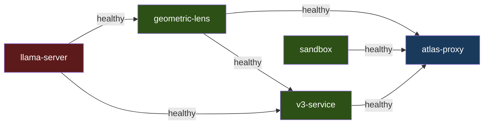

`llama-server` 和 `sandbox` 独立启动。`geometric-lens` 等待 `llama-server` 变为健康；`v3-service` 等待 `llama-server` 和 `geometric-lens`；`atlas-proxy` 等待 `llama-server`、`geometric-lens`、`v3-service` 和 `sandbox`。同一个 `inference/entrypoint-v3.1.sh` 驱动 Docker Compose、裸机和 K3s，因此上下文大小、KV 缓存量化、flash attention 和 mlock 都由环境变量控制，行为在这些模式之间完全一致；macOS 混合路径通过 `scripts/atlas-llama-macos.sh` 启动原生 llama-server，该脚本复刻了入口点的各项标志。

安装及各模式的拉起步骤（NVIDIA / ROCm override、裸机、macOS 混合 Metal、K3s 清单）见 [SETUP.md](../../SETUP.md)；macOS 原生路径见 [SETUP_MACOS.md](../../SETUP_MACOS.md)。

---

## 9. 数据流

### T1：简单文件写入

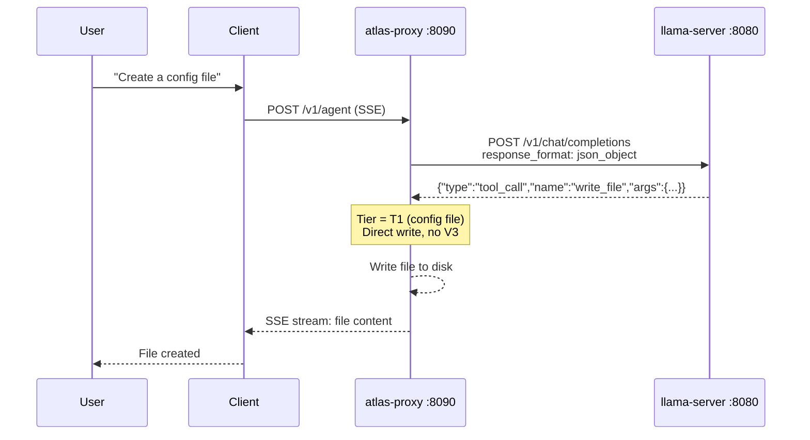

一次 LLM 调用。无 V3 开销。

### T2：功能文件写入

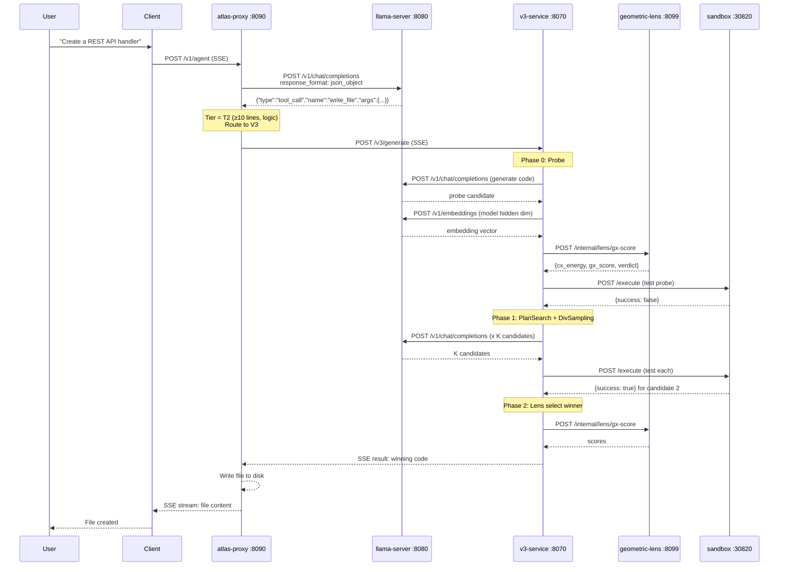

算法类任务最少 3 次 llama-server 调用（1 次 probe 生成 + 1 次自测生成 + 1 次嵌入提取）；交互式任务（游戏、UI、框架代码）跳过自测生成，因此其最少为 2 次。如果 Phase 3 修复启用了所有策略，最多 30+ 次。

### 编辑已有代码

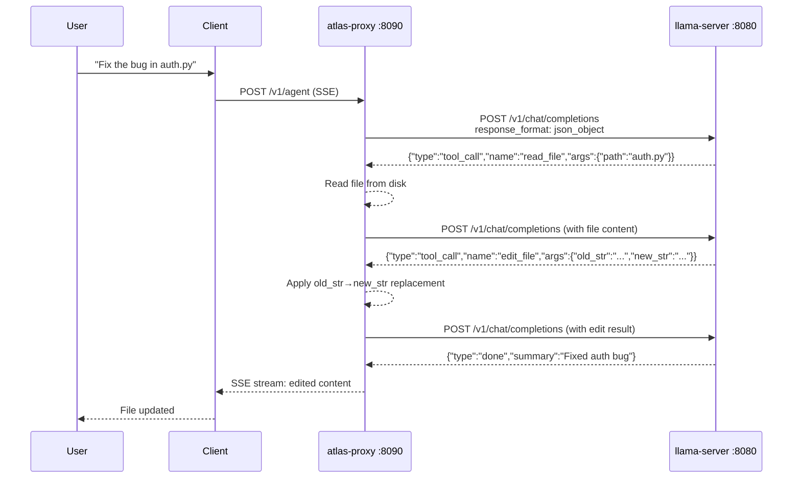

超过 5 行的已有文件对 `write_file` 会被拒绝 —— 模型必须使用 `edit_file`（外科式，≤10 行）或 `structural_edit`（整节点重写，仅 .py/.html/.htm）。在 `.py`/`.html`/`.htm` 文件上，逐步语法门控（BiasBusters #2）会在下一次决策中主动从工具名产生式里禁掉 `edit_file`/`write_file`，使模型无法退回到错误的捷径。
