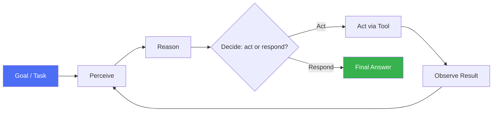
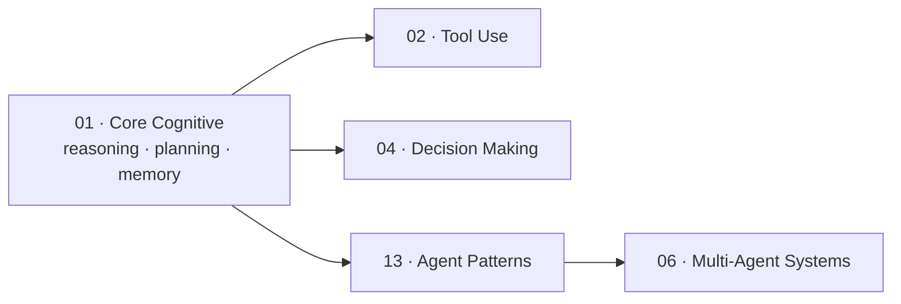

# 01 · Core Cognitive Skills

## Overview

Core cognitive skills are the foundational abilities every AI agent needs
before it can reliably use tools, talk to other agents, or operate in
production: **reasoning** (how it thinks through a problem), **planning**
(how it breaks work into steps), and **memory** (how it retains and reuses
information). Everything else in this repository — tool use, multi-agent
coordination, RAG, evaluation — is built on top of these primitives. Get
these wrong and no amount of tooling will fix an agent that can't reason
about what to do next.

## What is an agent?

An **AI agent** is a system that uses a language model as a reasoning engine
to perceive some state of the world, decide on an action, execute it (often
via tools), observe the result, and repeat — pursuing a goal with some
degree of autonomy, rather than producing a single one-shot response.

The three defining properties of an agent (versus a plain chatbot):

| Property | Plain chatbot | Agent |
|---|---|---|
| Turns | Single request → single response | Multi-step loop until goal is met or budget runs out |
| Environment interaction | None (text only) | Reads/writes external state via tools |
| Autonomy | Human decides every next step | Agent decides its own next step(s), within guardrails |

## Learning Objectives

By the end of this category, you should be able to:

- Explain the difference between reasoning strategies (CoT, ToT, GoT) and
  know when each is worth its extra cost
- Distinguish self-reflection from self-correction and know where each fits
  in an agent loop
- Decompose a complex task into a plan an agent can execute step-by-step
- Explain the difference between working, episodic, semantic, and long-term
  memory, and why an agent needs more than just a long context window

## Pages in this category

| Page | Description | Status |
|---|---|---|
| [`reasoning/chain-of-thought.md`](reasoning/chain-of-thought.md) | Step-by-step reasoning before an answer | 🟢 |
| [`reasoning/tree-of-thought.md`](reasoning/tree-of-thought.md) | Exploring multiple reasoning branches | 🟢 |
| [`reasoning/graph-of-thought.md`](reasoning/graph-of-thought.md) | Non-linear, mergeable reasoning graphs | 🟢 |
| [`reasoning/self-reflection.md`](reasoning/self-reflection.md) | Self-reflection and self-correction loops | 🟢 |
| [`planning/task-decomposition.md`](planning/task-decomposition.md) | Breaking goals into executable sub-tasks | 🟢 |
| [`planning/README.md`](planning/README.md) | Planning strategies overview (hierarchical, reactive, plan-and-execute) | 🟢 |
| [`memory/README.md`](memory/README.md) | Working, long-term, semantic, episodic memory, and compression | 🟢 |

## How this fits into the bigger picture

Reasoning and planning techniques described here are the building blocks used
by the concrete, named patterns in [`13-agent-patterns/`](../13-agent-patterns/README.md)
(e.g. ReAct combines reasoning + acting; Plan-and-Execute is planning made
explicit as an architecture).

## Key Concepts

| Term | Definition |
|---|---|
| Reasoning | The process of generating intermediate thoughts/steps before producing a final answer or action |
| Planning | Producing an ordered (or partially ordered) sequence of sub-goals/steps to achieve a larger goal |
| Task decomposition | Breaking one complex task into smaller, more tractable sub-tasks |
| Working memory | Short-term state held within the active context window / scratchpad |
| Long-term memory | Persisted information retained across sessions, outside the context window |
| Self-reflection | The agent evaluating its own output or process against a goal or set of criteria |
| Self-correction | The agent revising its own prior output based on reflection or feedback |

## Advantages / Disadvantages of investing in cognitive skills early

| Advantages | Disadvantages |
|---|---|
| Dramatically improves reliability on multi-step tasks | Adds latency and token cost (more reasoning = more generation) |
| Reduces silent failures (agent "guesses" less) | Harder to debug — reasoning traces can be long and noisy |
| Transfers across domains — same techniques work for coding, research, support | Diminishing returns past a point; ToT/GoT can over-engineer simple tasks |
| Forms the foundation every later pattern depends on | Requires careful prompt/architecture design, not just "add more thinking" |

## Common Mistakes

- **Mistake:** Reaching for Tree of Thought or multi-agent debate on a task
  that a single Chain of Thought pass would solve. **Fix:** Match reasoning
  strategy complexity to task difficulty — see the comparison table in
  [`reasoning/tree-of-thought.md`](reasoning/tree-of-thought.md).
- **Mistake:** Treating the context window as "memory." **Fix:** Separate
  working memory (context) from persisted long-term memory — see
  [`memory/README.md`](memory/README.md).
- **Mistake:** Skipping planning for tasks with more than ~3 steps, letting
  the agent improvise step-by-step. **Fix:** Use explicit task decomposition
  before execution for anything non-trivial — see
  [`planning/task-decomposition.md`](planning/task-decomposition.md).
- **Mistake:** Confusing self-reflection (evaluation) with self-correction
  (revision) and only implementing one. **Fix:** Implement both as distinct
  steps — see [`reasoning/self-reflection.md`](reasoning/self-reflection.md).

## Related Categories

- [`02-tool-use/`](../02-tool-use/README.md) — acting on reasoning/plans
- [`04-decision-making/`](../04-decision-making/README.md) — confidence, verification, fallback
- [`13-agent-patterns/`](../13-agent-patterns/README.md) — named architectures built on these primitives
- [`12-memory/`](../12-memory/README.md) — production-grade applied memory systems

## Research Papers

- **Chain-of-Thought Prompting Elicits Reasoning in Large Language Models** — Wei et al., 2022. [arXiv:2201.11903](https://arxiv.org/abs/2201.11903)
- **Tree of Thoughts: Deliberate Problem Solving with Large Language Models** — Yao et al., 2023. [arXiv:2305.10601](https://arxiv.org/abs/2305.10601)
- **Reflexion: Language Agents with Verbal Reinforcement Learning** — Shinn et al., 2023. [arXiv:2303.11366](https://arxiv.org/abs/2303.11366)

## Further Reading

- [`papers/README.md`](../papers/README.md) — full curated bibliography
- [`glossary/README.md`](../glossary/README.md) — terms used throughout this category
