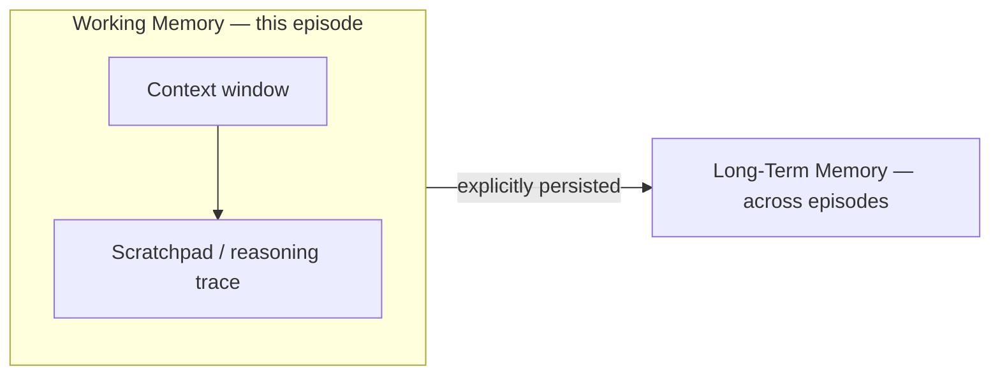
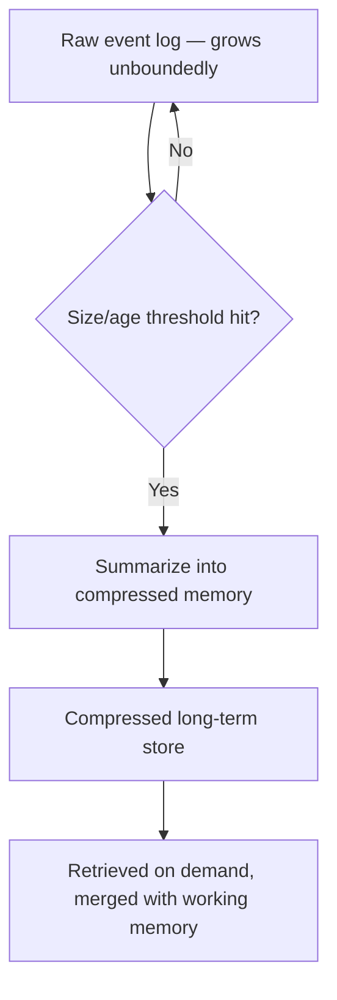

# Memory

## Overview

Memory is what lets an agent retain and reuse information beyond a single
model call. Without it, every interaction starts from zero — no recollection
of prior turns, past mistakes, learned facts, or user preferences. This page
covers the **conceptual foundations** of agent memory (the types and their
tradeoffs); production implementation patterns (vector stores, memory
compression pipelines, retrieval strategies for memory) live in
[`12-memory/`](../../12-memory/README.md).

## Learning Objectives

- Distinguish working memory from long-term memory
- Distinguish semantic memory from episodic memory
- Explain why "just use a longer context window" doesn't replace real memory
- Understand memory compression and when it's necessary

## Key Concepts

| Term | Definition |
|---|---|
| Working memory | Information held in the active context window / scratchpad during a single episode |
| Long-term memory | Information persisted across sessions, stored outside the context window |
| Semantic memory | General facts and knowledge, independent of when/how they were learned (e.g. "the user prefers metric units") |
| Episodic memory | Records of specific past events/episodes (e.g. "on March 3, the user asked about X and we did Y") |
| Memory compression | Summarizing or distilling raw history into a smaller, denser representation |

## Working Memory

Working memory is everything the agent currently "has in mind" — the prompt,
recent conversation turns, retrieved documents, and any scratchpad content
from the current reasoning process. It's fast and free to access (no
retrieval step) but bounded by the context window and reset between
sessions unless explicitly persisted.

## Long-Term Memory

Long-term memory persists information across sessions, typically in an
external store (a database, a vector index, a key-value store) that the
agent queries/writes to as part of its tool use. This is what makes an agent
"remember you" across conversations rather than starting cold every time.

## Semantic vs. Episodic

| | Semantic Memory | Episodic Memory |
|---|---|---|
| Contains | General facts, preferences, learned rules | Specific events, tied to time/context |
| Example | "User writes in British English" | "On the March 3 call, the user asked to reschedule to Friday" |
| Typical storage | Key-value facts, knowledge graph | Timestamped event log, vector store of episode summaries |
| Retrieval pattern | Direct lookup by key/topic | Similarity search over past episodes, often time-weighted |

## Memory Compression

Raw conversation/event history grows unboundedly, but context windows and
retrieval budgets do not. Memory compression addresses this by periodically
summarizing or distilling history into a smaller, denser form — trading
some detail for a bounded footprint.

Common compression strategies:

- **Rolling summarization** — periodically summarize the oldest N turns into
  one summary, drop the raw turns.
- **Salience filtering** — keep only turns/events flagged as important
  (decisions made, facts stated), discard routine turns.
- **Hierarchical summaries** — summaries of summaries, so recency is
  detailed and distant history is coarse.

## Advantages / Disadvantages

| Advantages | Disadvantages |
|---|---|
| Enables continuity across sessions — real personalization and learning | Adds infrastructure: a store, a retrieval step, a write policy |
| Semantic/episodic split allows precise retrieval (facts vs. events) | Poor write/retention policy → stale or bloated memory |
| Compression keeps long-term storage bounded and fast to retrieve from | Compression is lossy — can discard details that later turn out to matter |
| Decouples memory size from context window size | Retrieval adds latency vs. everything just being "in context" |

## Common Mistakes

- **Mistake:** Treating a large context window as a substitute for real
  memory. **Fix:** Even with huge context windows, use explicit long-term
  storage for anything that must survive a new session or be selectively
  retrieved — stuffing everything into context is expensive and doesn't
  generalize across sessions.
- **Mistake:** Storing every raw turn forever with no compression. **Fix:**
  Add a summarization/compression policy before storage grows unbounded.
- **Mistake:** Conflating semantic and episodic memory in one undifferentiated
  blob, making retrieval noisy. **Fix:** Separate stores/schemas for stable
  facts vs. timestamped events.
- **Mistake:** No write policy — writing every message to long-term memory
  regardless of importance. **Fix:** Filter for salience before persisting.

## When to Use

- Any agent used across multiple sessions by the same user/entity
- Agents that need to learn from past outcomes (see
  [Reflexion](../../13-agent-patterns/reflexion.md),
  [Feedback Loops](../../08-learning-adaptation/README.md#feedback-loops))
- Long-running autonomous agents (see
  [Voyager](../../13-agent-patterns/voyager.md))

## When NOT to Use

- Single-turn, stateless tasks with no need for continuity
- Cases where persisting user data raises privacy/compliance concerns that
  haven't been addressed (see
  [Safety & Alignment](../../07-safety-alignment/README.md))

## Related Topics

- [`12-memory/`](../../12-memory/README.md) — production memory system implementation (vector stores, retrieval)
- [RAG](../../10-rag/README.md) — retrieval techniques that also apply to memory retrieval
- [Reflexion](../../13-agent-patterns/reflexion.md) — memory used specifically for cross-episode learning
- [Voyager](../../13-agent-patterns/voyager.md) — long-term skill memory in an open-ended agent

## Research Papers

- **Generative Agents: Interactive Simulacra of Human Behavior** — Park et al., 2023. [arXiv:2304.03442](https://arxiv.org/abs/2304.03442)
- **MemGPT: Towards LLMs as Operating Systems** — Packer et al., 2023. [arXiv:2310.08560](https://arxiv.org/abs/2310.08560)

## Further Reading

- [`01-core-cognitive/README.md`](../README.md) — category overview
- [`12-memory/README.md`](../../12-memory/README.md) — applied memory systems
