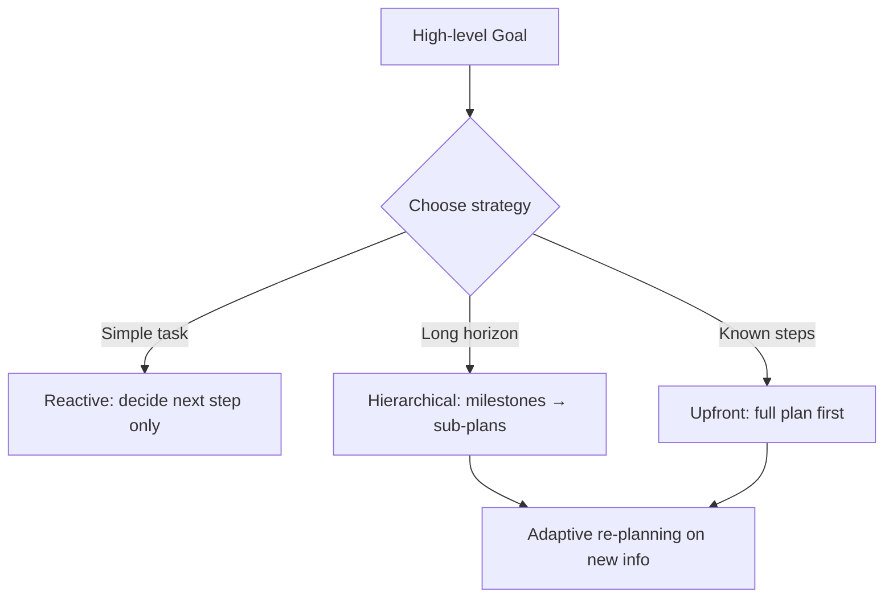

# Planning

## Overview

Planning is how an agent turns a high-level goal into an ordered (or
partially ordered) sequence of steps it can actually execute. Where
[reasoning](../reasoning/chain-of-thought.md) is about *thinking through* a
problem, planning is specifically about producing an **executable structure**
— a plan the agent (or a team of agents) can follow, monitor, and adapt.

## Learning Objectives

- Distinguish reactive, hierarchical, and upfront (plan-then-execute) planning
- Know when to re-plan mid-execution vs. commit to the original plan
- Understand the relationship between planning and [task decomposition](task-decomposition.md)

## Planning Strategies

| Strategy | Description | Best for |
|---|---|---|
| **Reactive planning** | Decide the next single step given current state, repeat (no full plan upfront) | Simple/short tasks, ReAct-style loops |
| **Upfront (plan-then-execute)** | Produce a full plan before executing any step | Tasks where steps are known and mostly independent |
| **Hierarchical planning** | Plan at a high level (milestones), then decompose each milestone into sub-plans just-in-time | Long-horizon, complex tasks |
| **Adaptive re-planning** | Start with a plan, but re-plan when execution reveals new information | Tasks with real uncertainty about the environment |

## Key Concepts

| Term | Definition |
|---|---|
| Plan | An ordered or partially-ordered set of steps intended to achieve a goal |
| Milestone | A high-level checkpoint in a hierarchical plan, itself decomposed later |
| Re-planning | Regenerating some/all of a plan after new information invalidates an assumption |
| Plan validity | Whether the plan's steps and ordering are logically sufficient to reach the goal |

## Advantages / Disadvantages

| Advantages | Disadvantages |
|---|---|
| Explicit plans are inspectable/auditable before execution starts | Upfront plans can be wrong if the environment is not well understood in advance |
| Hierarchical planning scales to long-horizon tasks | More planning steps = more latency before any action happens |
| Re-planning keeps the agent adaptive to surprises | Constant re-planning can thrash without a clear trigger condition |

## Common Mistakes

- **Mistake:** Committing to a rigid upfront plan for a task with real
  environmental uncertainty. **Fix:** Add explicit re-planning checkpoints,
  or use reactive planning instead.
- **Mistake:** Flat (non-hierarchical) plans for very long tasks, leading to
  huge unmanageable step lists. **Fix:** Decompose into milestones first (see
  [Task Decomposition](task-decomposition.md)), then expand each just-in-time.
- **Mistake:** No way to detect that a plan has failed mid-execution. **Fix:**
  Define success/failure criteria per step so the agent knows when to
  re-plan.

## Related Topics

- [Task Decomposition](task-decomposition.md) — the core technique for building any plan
- [Plan-and-Execute pattern](../../13-agent-patterns/plan-and-execute.md) — planning as an explicit architecture
- [ReAct](../../13-agent-patterns/react.md) — reactive planning in practice

## Research Papers

- **Plan-and-Solve Prompting: Improving Zero-Shot Chain-of-Thought Reasoning** — Wang et al., 2023. [arXiv:2305.04091](https://arxiv.org/abs/2305.04091)
- **HuggingGPT: Solving AI Tasks with ChatGPT and its Friends in Hugging Face** — Shen et al., 2023. [arXiv:2303.17580](https://arxiv.org/abs/2303.17580)

## Further Reading

- [`01-core-cognitive/README.md`](../README.md) — category overview
