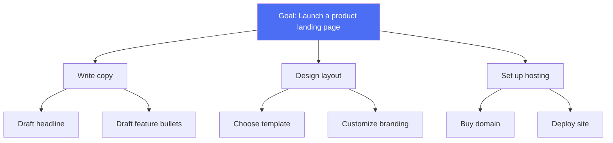

# Task Decomposition

> The single highest-leverage skill for making a complex task tractable: break it into pieces small enough to get right.

## Overview

Task decomposition is the process of breaking one large, ambiguous, or
multi-step goal into a set of smaller sub-tasks that are individually easier
to reason about, execute, verify, and (if needed) delegate. It's the
practical technique behind [planning](README.md) — a plan is essentially the
output of decomposition plus an ordering.

## Learning Objectives

- Apply top-down decomposition to a vague goal
- Recognize when sub-tasks are still too large and need further decomposition
- Know how decomposition relates to delegation in multi-agent systems
- Avoid over- or under-decomposing a task

## Key Concepts

| Term | Definition |
|---|---|
| Sub-task | A smaller unit of work that contributes to the parent goal |
| Granularity | How fine or coarse the decomposition is — too coarse = still ambiguous, too fine = coordination overhead |
| Dependency | A relationship where one sub-task's output is required before another can start |
| Leaf task | A sub-task small/concrete enough to execute directly, with no further decomposition needed |

## Architecture



## Workflow

1. **State the goal** explicitly and concretely — vague goals ("improve the
   product") decompose poorly; sharpen the goal first if needed.
2. **Identify top-level sub-tasks** — the 3-7 major pieces of work required.
3. **Check granularity**: for each sub-task, ask "could I execute this
   directly, or does it still hide multiple steps?" Recurse if needed.
4. **Identify dependencies** between sub-tasks (what must finish before
   what can start).
5. **Order** sub-tasks (or mark them parallelizable) — this becomes the plan.
6. **Assign** each leaf task to an execution step (a tool call, a single
   agent turn, or a delegated sub-agent — see
   [Multi-Agent Systems](../../06-multi-agent/README.md)).

## Example

```text
Goal: "Research competitors and write a summary report"

Decomposition:
1. Identify list of competitors (leaf: search + compile list)
2. For each competitor:
   2a. Gather pricing info (leaf: search/scrape)
   2b. Gather feature set (leaf: search/scrape)
3. Synthesize findings into a comparison table (leaf: reasoning over 2a/2b outputs)
4. Write executive summary (leaf: reasoning over table)
5. Format as final report (leaf: formatting pass)

Dependencies: step 3 depends on all of step 2 completing;
step 4 depends on step 3; step 5 depends on step 4.
```

```python
# Illustrative: LLM-driven decomposition into a structured plan
def decompose(model, goal):
    prompt = f"""Break this goal into an ordered list of concrete sub-tasks.
    Mark dependencies explicitly. Goal: {goal}
    Respond as JSON: {{"tasks": [{{"id": ..., "description": ..., "depends_on": [...]}}]}}
    """
    return model.generate_structured(prompt)
```

## Advantages / Disadvantages

| Advantages | Disadvantages |
|---|---|
| Makes ambiguous goals executable and verifiable step-by-step | Poor granularity choices waste effort (too coarse = still ambiguous, too fine = overhead) |
| Enables parallelization and delegation to sub-agents/tools | Upfront decomposition can be wrong if task understanding is incomplete |
| Sub-tasks are individually easier to verify/debug than the whole | Adds an extra reasoning pass before any real work starts |
| Natural foundation for [Plan-and-Execute](../../13-agent-patterns/plan-and-execute.md) architectures | Dependency tracking adds coordination complexity for many sub-tasks |

## When to Use

- Any goal that isn't a single, obviously-atomic action
- Tasks that will be delegated across tools or multiple agents
- Tasks where verifying the whole at once is hard, but verifying pieces is easy

## When NOT to Use

- Genuinely atomic tasks (a single lookup, a single classification)
- Extremely time-sensitive tasks where the decomposition overhead itself
  isn't worth it
- Tasks where the environment is so uncertain that any upfront decomposition
  will likely be wrong — prefer reactive planning instead (see
  [Planning overview](README.md))

## Common Mistakes

- **Mistake:** Decomposing to a fixed depth regardless of task complexity.
  **Fix:** Decompose recursively only until each leaf is concretely
  executable — stop as soon as that's true.
- **Mistake:** Ignoring dependencies, causing sub-tasks to run out of order.
  **Fix:** Explicitly track `depends_on` relationships, not just a flat list.
- **Mistake:** Decomposing once and never revisiting, even when execution
  reveals the decomposition was wrong. **Fix:** Allow re-decomposition when a
  sub-task fails or reveals new information (see
  [adaptive re-planning](README.md#planning-strategies)).

## Comparison

| Approach | Best for | Cost | Complexity |
|---|---|---|---|
| No decomposition (single-shot) | Atomic, simple tasks | Lowest | Lowest |
| Flat decomposition | Small tasks with 3-7 independent sub-tasks | Low | Low |
| Hierarchical decomposition | Long-horizon, complex projects | Medium | Medium |
| Decomposition + delegation to sub-agents | Tasks needing different specialized skills per sub-task | Medium-high | High |

## Related Topics

- [Planning overview](README.md) — where decomposition fits into planning strategy
- [Plan-and-Execute](../../13-agent-patterns/plan-and-execute.md) — architecture built on decomposition
- [Manager–Worker pattern](../../06-multi-agent/README.md#manager-worker) — delegating decomposed sub-tasks
- [Coding agents](../../05-domain-skills/README.md#coding) — decomposition applied to software tasks

## Research Papers

- **Least-to-Most Prompting Enables Complex Reasoning in Large Language Models** — Zhou et al., 2022. [arXiv:2205.10625](https://arxiv.org/abs/2205.10625)
- **HuggingGPT: Solving AI Tasks with ChatGPT and its Friends in Hugging Face** — Shen et al., 2023. [arXiv:2303.17580](https://arxiv.org/abs/2303.17580)

## Further Reading

- [`01-core-cognitive/README.md`](../README.md) — category overview
- [`18-workflows/README.md`](../../18-workflows/README.md) — decomposition applied to real workflows
