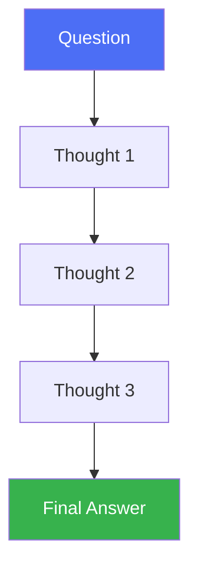

# Chain of Thought (CoT)

> Get the model to "show its work" before answering — and it gets the answer right more often.

## Overview

Chain of Thought (CoT) prompting asks a model to generate intermediate
reasoning steps — a chain of thoughts — before producing a final answer,
rather than jumping straight to a conclusion. It's the simplest and most
widely used reasoning technique, and the foundation almost every other
reasoning strategy (Tree of Thought, ReAct, Reflexion) builds on.

## Learning Objectives

- Explain why intermediate reasoning steps improve accuracy on multi-step
  problems
- Distinguish zero-shot CoT, few-shot CoT, and automatic CoT
- Know when CoT helps vs. when it's wasted latency/cost
- Recognize the failure modes of CoT (plausible-sounding but wrong chains)

## Key Concepts

| Term | Definition |
|---|---|
| Zero-shot CoT | Triggering reasoning with a simple instruction like "think step by step," no examples needed |
| Few-shot CoT | Providing worked examples with reasoning steps in the prompt before the real question |
| Self-consistency | Sampling multiple CoT chains and taking a majority vote on the final answer |
| Reasoning trace | The visible sequence of intermediate steps the model produces |

## Architecture



Compare this to direct prompting, which skips straight from question to
answer with no visible intermediate reasoning — this is exactly the gap CoT
closes.

## Workflow

1. Frame the task so an answer benefits from decomposition (arithmetic,
   multi-hop questions, logic puzzles, planning).
2. Prompt with either:
   - **Zero-shot:** append an instruction like "Let's think step by step."
   - **Few-shot:** include 2-8 worked examples showing question → reasoning → answer.
3. Let the model generate the full reasoning trace.
4. Extract the final answer (often the last line, or a delimited section).
5. *(Optional, for higher-stakes tasks)* Run multiple independent chains and
   use self-consistency (majority vote) over final answers.

## Example

```text
Q: A store had 23 apples. They sold 8 in the morning and received a new
shipment of 15 in the afternoon. How many apples do they have now?

Let's think step by step.
- Start: 23 apples
- Sold 8 in the morning: 23 - 8 = 15
- Received 15 more: 15 + 15 = 30

Answer: 30 apples
```

```python
# Minimal illustration of self-consistency: sample N chains, vote
def self_consistent_answer(model, question, n=5):
    answers = []
    for _ in range(n):
        trace = model.generate(f"{question}\nLet's think step by step.")
        answers.append(extract_final_answer(trace))
    return majority_vote(answers)
```

## Advantages / Disadvantages

| Advantages | Disadvantages |
|---|---|
| Large accuracy gains on arithmetic, logic, and multi-hop reasoning | More output tokens → higher latency and cost |
| Zero-shot version needs no curated examples | A fluent-looking chain can still reach a wrong answer ("confabulated reasoning") |
| Reasoning trace aids debugging and transparency | Not very effective on tasks with no real sequential structure (e.g. simple lookups) |
| Composable — nearly every other pattern (ReAct, ToT) extends CoT | Longer chains can accumulate small errors that compound |

## When to Use

- Arithmetic, logic, multi-hop question answering
- Any task where a human would naturally reason step by step before answering
- As the reasoning substrate inside larger patterns (ReAct, Plan-and-Execute)

## When NOT to Use

- Simple factual lookups or classification with no real reasoning chain
  (adds latency for no accuracy gain)
- Extremely latency-sensitive paths (e.g. autocomplete) where the cost of
  extra tokens isn't justified
- Tasks better solved by retrieval (see [RAG](../../10-rag/README.md)) than by
  reasoning from parametric knowledge

## Common Mistakes

- **Mistake:** Trusting a confident-looking chain without verification.
  **Fix:** For high-stakes answers, add self-consistency voting or a
  separate verification pass (see [`04-decision-making/README.md`](../../04-decision-making/README.md#verification)).
- **Mistake:** Using few-shot CoT examples that don't match the target
  task's structure. **Fix:** Craft examples in the same domain and format as
  the real questions.
- **Mistake:** Not extracting the final answer robustly (e.g., regex that
  breaks on formatting variance). **Fix:** Ask the model to wrap the final
  answer in a fixed delimiter (e.g. `Answer: ...`) and parse that.

## Comparison

| Approach | Best for | Cost | Complexity |
|---|---|---|---|
| Direct prompting | Simple lookups, classification | Lowest | Lowest |
| Zero-shot CoT | General multi-step reasoning, no examples available | Low-medium | Low |
| Few-shot CoT | Domain-specific reasoning with known patterns | Medium | Medium |
| Self-consistency (CoT + voting) | High-stakes answers where accuracy > latency | High | Medium |
| [Tree of Thought](tree-of-thought.md) | Problems needing exploration/backtracking | High | High |

## Related Topics

- [Tree of Thought](tree-of-thought.md) — explores multiple chains, not just one
- [Self-Reflection](self-reflection.md) — evaluates a chain after the fact
- [ReAct](../../13-agent-patterns/react.md) — interleaves CoT with tool actions
- [Verification](../../04-decision-making/README.md#verification) — checking a chain's conclusion

## Research Papers

- **Chain-of-Thought Prompting Elicits Reasoning in Large Language Models** — Wei et al., 2022. [arXiv:2201.11903](https://arxiv.org/abs/2201.11903)
- **Large Language Models are Zero-Shot Reasoners** — Kojima et al., 2022. [arXiv:2205.11916](https://arxiv.org/abs/2205.11916)
- **Self-Consistency Improves Chain of Thought Reasoning in Language Models** — Wang et al., 2022. [arXiv:2203.11171](https://arxiv.org/abs/2203.11171)

## Further Reading

- [`01-core-cognitive/README.md`](../README.md) — category overview
- [`13-agent-patterns/react.md`](../../13-agent-patterns/react.md) — CoT combined with tool use
