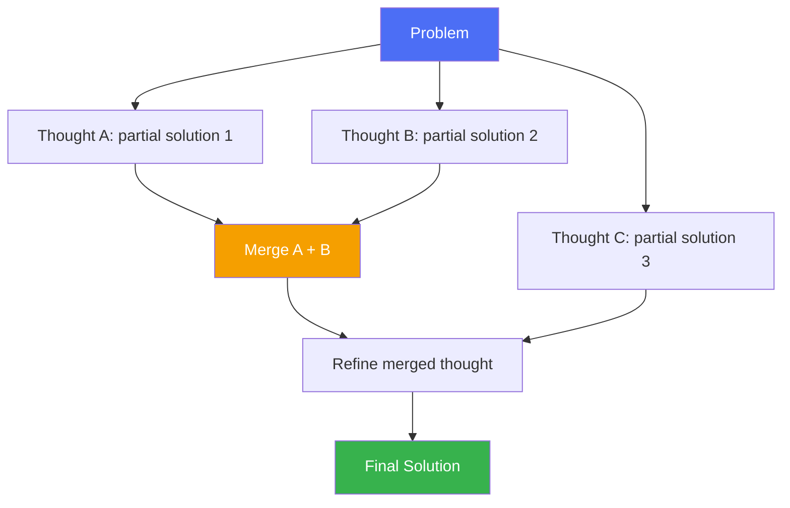

# Graph of Thought (GoT)

> Not every good idea fits on one branch — sometimes two partial solutions should merge into a better one.

## Overview

Graph of Thought generalizes [Tree of Thought](tree-of-thought.md) further:
instead of a strict tree (where each thought has exactly one parent),
thoughts form an arbitrary **graph**, where nodes can have multiple
predecessors. This allows the model to **combine** two or more independent
partial solutions into a stronger one — something a tree structure
fundamentally cannot express, since a tree forbids merging branches.

## Learning Objectives

- Explain the structural limitation of trees that GoT removes (no merging)
- Identify problem types that benefit from combining partial solutions
- Understand the added operations GoT introduces: aggregation and refinement
- Judge when GoT's complexity is worth it vs. ToT

## Key Concepts

| Term | Definition |
|---|---|
| Thought graph | A directed graph of reasoning states where edges represent "was derived from" |
| Aggregation | Combining two or more thought nodes into a new, merged thought |
| Refinement | Revisiting and improving an existing thought node in place (a self-loop) |
| Volume of a thought | How much of the original problem's information is captured, transitively, by a node — a GoT-specific quality signal |

## Architecture



Note how `M` has two parents (`A` and `B`) — this is the structural feature a
tree cannot represent.

## Workflow

1. Decompose the problem into independently-solvable sub-parts where it's
   plausible that combining partial answers beats any single chain.
2. Generate multiple thoughts in parallel, as in ToT.
3. Score/evaluate thoughts as usual.
4. **Aggregate**: select 2+ promising thoughts and prompt the model to merge
   them into a single, better thought.
5. **Refine**: optionally loop back and improve a thought using itself as
   context (self-loop).
6. Continue expanding/merging/refining until a termination condition (budget,
   solution found, no further improvement) is met.

## Example

A canonical use case: **sorting or merging a long list** where the model
sorts sub-chunks independently (thoughts A, B, C), then merges sorted
sub-lists pairwise — a merge-sort-like structure that a tree cannot express
because merging *requires* multiple parents feeding one node.

```python
# Simplified aggregation step
def aggregate(model, thought_a, thought_b):
    prompt = f"""Combine these two partial solutions into one improved solution:
    Partial solution 1: {thought_a}
    Partial solution 2: {thought_b}
    """
    return model.generate(prompt)
```

## Advantages / Disadvantages

| Advantages | Disadvantages |
|---|---|
| Can express merge/combine operations trees fundamentally cannot | Highest complexity and engineering overhead of the reasoning-strategy family |
| Well-suited to divide-and-conquer style problems (sorting, summarizing many docs, multi-source synthesis) | Even higher token/latency cost than ToT |
| Refinement loops allow iterative quality improvement on a single node | Harder to reason about termination — merge/refine loops can go on indefinitely without careful budgets |
| More expressive quality metric ("volume") than tree-based scoring alone | Tooling/framework support is less mature than CoT/ToT |

## When to Use

- Divide-and-conquer tasks: multi-document summarization/synthesis, sorting,
  large-scale aggregation of partial results
- Problems where two independently-good partial answers can be combined into
  something better than either alone
- Research/offline settings where cost is secondary to solution quality

## When NOT to Use

- Simple linear or lightly-branching problems — use CoT or ToT instead
- Latency-sensitive or interactive agents
- When merge operations don't make semantic sense for the task (e.g. a
  single arithmetic answer has nothing meaningful to "merge" with another)

## Common Mistakes

- **Mistake:** Using GoT when ToT (no merging needed) would already solve
  the problem. **Fix:** Confirm the task genuinely benefits from combining
  independent partial solutions before adding this complexity.
- **Mistake:** No cap on refinement loops. **Fix:** Always bound the number
  of refinement iterations per node.
- **Mistake:** Treating "volume"/graph structure as free — every additional
  edge usually means an additional model call. **Fix:** Budget total model
  calls up front, not just depth.

## Comparison

| Approach | Best for | Cost | Complexity |
|---|---|---|---|
| [Tree of Thought](tree-of-thought.md) | Search/planning without merging | High | High |
| Graph of Thought | Divide-and-conquer, merging partial solutions | Highest | Highest |
| [Plan-and-Execute](../../13-agent-patterns/plan-and-execute.md) | Explicit upfront planning, simpler merge-free execution | Medium | Medium |

## Related Topics

- [Tree of Thought](tree-of-thought.md) — the tree-structured special case
- [Chain of Thought](chain-of-thought.md) — the linear special case
- [RAG: advanced patterns](../../10-rag/advanced-rag.md) — multi-source synthesis shares the "combine partial results" motivation

## Research Papers

- **Graph of Thoughts: Solving Elaborate Problems with Large Language Models** — Besta et al., 2023. [arXiv:2308.09687](https://arxiv.org/abs/2308.09687)

## Further Reading

- [`01-core-cognitive/README.md`](../README.md) — category overview
