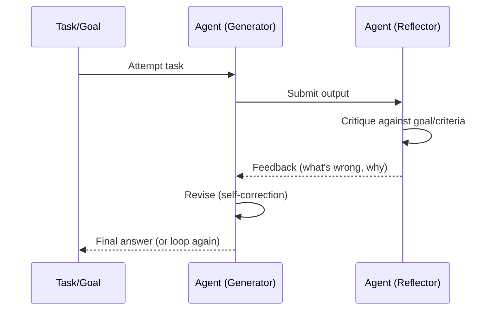

# Self-Reflection & Self-Correction

> Two different skills: noticing something might be wrong, and actually fixing it.

## Overview

Self-reflection is an agent evaluating its own output or reasoning process
against the goal or a set of criteria — essentially generating critique of
itself. **Self-correction** is the follow-on step: using that critique to
revise the output. They are often implemented together but are conceptually
distinct, and conflating them is a common source of bugs (an agent that
"reflects" but never actually changes its answer isn't self-correcting at
all).

## Learning Objectives

- Distinguish self-reflection (evaluation) from self-correction (revision)
- Understand where reflection fits in an agent loop (after generation, before
  finalizing/acting)
- Know the main risks: reflection loops that don't converge, and
  overcorrection
- Recognize how this differs from external verification (see
  [Decision Making](../../04-decision-making/README.md#verification))

## Key Concepts

| Term | Definition |
|---|---|
| Self-reflection | The model critiques its own prior output/reasoning against the goal or criteria |
| Self-correction | The model revises its output based on a reflection or external feedback |
| Verbal reinforcement | Using natural-language reflective feedback (rather than gradient updates) as the learning signal across attempts |
| Convergence | Whether repeated reflect→correct cycles actually improve the answer, or just churn |

## Architecture



## Workflow

1. **Generate** an initial attempt (answer, plan, or code) using any
   reasoning strategy (e.g. [CoT](chain-of-thought.md)).
2. **Reflect**: prompt the model (same or different call) to critique the
   attempt against explicit criteria — correctness, completeness, style,
   constraints.
3. **Decide**: if the critique finds no material issues, stop. Otherwise,
   continue.
4. **Correct**: feed the critique back in and ask for a revised attempt.
5. **Bound the loop**: cap iterations (e.g. 2-3 rounds) and/or stop early if
   an external check (unit test, verifier) passes.

## Example

```text
Attempt: "The capital of Australia is Sydney."

Reflection prompt: "Check the above answer for factual accuracy. Is there
anything wrong?"

Reflection: "This is incorrect. The capital of Australia is Canberra, not
Sydney — Sydney is the largest city but not the capital."

Correction: "The capital of Australia is Canberra."
```

```python
def reflect_and_correct(model, task, max_rounds=2):
    attempt = model.generate(task)
    for _ in range(max_rounds):
        critique = model.generate(f"Critique this answer for errors:\n{attempt}")
        if "no issues" in critique.lower():
            break
        attempt = model.generate(
            f"Revise this answer based on the critique.\nAnswer: {attempt}\nCritique: {critique}"
        )
    return attempt
```

## Advantages / Disadvantages

| Advantages | Disadvantages |
|---|---|
| Catches errors without needing external tools/verifiers | Reflection can be unreliable — the model may miss its own real errors ("blind spots") |
| Works purely via prompting — no fine-tuning required | Extra round-trips add latency and cost |
| Naturally composes with memory (Reflexion stores reflections across episodes) | Can overcorrect — "fixing" something that wasn't actually wrong |
| Improves output on tasks with checkable criteria (style, format, constraints) | Doesn't reliably catch errors the model is confidently, consistently wrong about |

## When to Use

- Tasks with explicit, checkable criteria (formatting rules, constraints,
  rubrics)
- Code generation, where reflection can catch obvious logic/style issues
  before an external verifier (tests) even runs
- Multi-turn agent loops (see [Reflexion](../../13-agent-patterns/reflexion.md))
  where reflections can be stored and reused across attempts

## When NOT to Use

- As a substitute for actual verification when ground truth is checkable
  (e.g. always run unit tests instead of relying only on self-reflection for
  code correctness)
- Latency-critical single-turn responses
- When the model has a systematic blind spot on the task — reflection from
  the same model often reproduces the same blind spot

## Common Mistakes

- **Mistake:** Reflecting without actually correcting — displaying "here's
  what could be better" and stopping. **Fix:** Always pair reflection with an
  explicit correction step, and check the output actually changed.
- **Mistake:** Unbounded reflect-correct loops. **Fix:** Cap rounds and add a
  convergence check (e.g. stop if the answer didn't change between rounds).
- **Mistake:** Relying solely on self-reflection for factual/logical
  correctness where an external check exists. **Fix:** Prefer verification
  (tests, retrieval, calculators) over self-reflection when ground truth is
  checkable — see [Verification](../../04-decision-making/README.md#verification).

## Comparison

| Approach | Best for | Cost | Complexity |
|---|---|---|---|
| Self-reflection only | Surfacing likely issues for a human to review | Low-medium | Low |
| Self-reflection + correction | Autonomous quality improvement without external tools | Medium | Medium |
| [Reflexion](../../13-agent-patterns/reflexion.md) | Multi-episode tasks where reflections persist across attempts | Medium-high | Medium-high |
| External verification | Anything with checkable ground truth (tests, calculators, retrieval) | Varies | Varies, but more reliable |

## Related Topics

- [Chain of Thought](chain-of-thought.md) — the reasoning substrate being reflected on
- [Reflexion](../../13-agent-patterns/reflexion.md) — self-reflection extended across episodes with memory
- [Verification](../../04-decision-making/README.md#verification) — external, ground-truth-based checking
- [Hallucination Detection](../../04-decision-making/README.md#hallucination-detection)

## Research Papers

- **Reflexion: Language Agents with Verbal Reinforcement Learning** — Shinn et al., 2023. [arXiv:2303.11366](https://arxiv.org/abs/2303.11366)
- **Self-Refine: Iterative Refinement with Self-Feedback** — Madaan et al., 2023. [arXiv:2303.17651](https://arxiv.org/abs/2303.17651)

## Further Reading

- [`01-core-cognitive/README.md`](../README.md) — category overview
- [`13-agent-patterns/reflexion.md`](../../13-agent-patterns/reflexion.md) — the full agent pattern built on this idea
