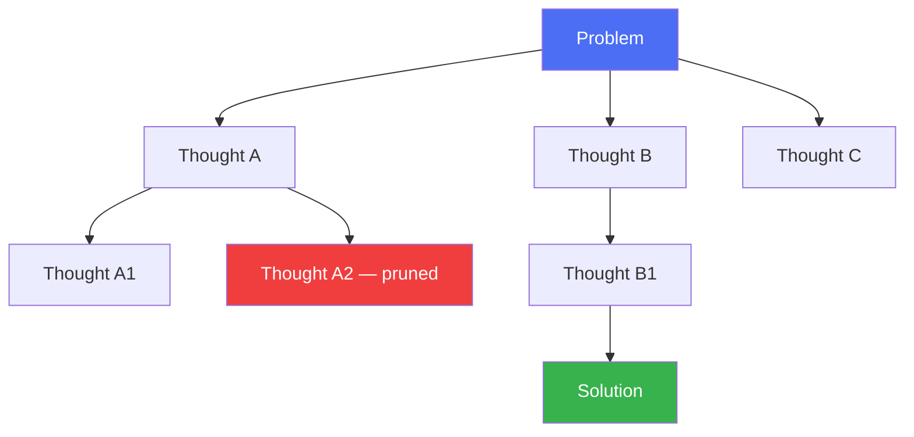

# Tree of Thought (ToT)

> When one line of reasoning isn't enough, explore several — and backtrack from dead ends.

## Overview

Tree of Thought generalizes [Chain of Thought](chain-of-thought.md) from a
single linear chain to a **search tree** of intermediate reasoning steps
("thoughts"). At each step, the agent generates multiple candidate next
thoughts, evaluates them, and expands the most promising ones — with the
ability to backtrack when a branch stalls. This trades extra compute for
significantly better performance on problems that require exploration,
lookahead, or planning (puzzles, complex math, multi-step strategy tasks).

## Learning Objectives

- Explain how ToT differs structurally from CoT and self-consistency
- Understand the three components of a ToT search: generation, evaluation,
  and search strategy
- Know which search strategies (BFS, DFS, beam search) fit which problems
- Judge when ToT's extra cost is justified vs. when it's overkill

## Key Concepts

| Term | Definition |
|---|---|
| Thought | A coherent intermediate reasoning step, small enough to evaluate on its own |
| Thought generator | The mechanism that proposes candidate next thoughts from a given state |
| State evaluator | A function (often the LLM itself) that scores or votes on how promising a partial path is |
| Search strategy | The algorithm exploring the tree — breadth-first, depth-first, or beam search |
| Backtracking | Abandoning a branch that the evaluator scores poorly, returning to a parent state |

## Architecture



## Workflow

1. **Decompose** the problem into steps small enough to be evaluated
   individually (this is problem-specific — e.g. "place one number" for a
   math puzzle, "write one paragraph" for creative writing).
2. **Generate** k candidate next thoughts from the current state (sample or
   propose).
3. **Evaluate** each candidate — via LLM self-scoring ("rate 1-10"), voting
   across candidates, or a heuristic/external check.
4. **Search**: expand the best candidate(s) using BFS, DFS, or beam search;
   prune low-scoring branches.
5. **Terminate** when a candidate reaches a valid solution state, or a
   compute/depth budget is exhausted.

## Example

```python
# Simplified beam-search style ToT loop
def tree_of_thought(model, problem, beam_width=3, max_depth=4):
    beams = [problem]
    for depth in range(max_depth):
        candidates = []
        for state in beams:
            next_thoughts = model.generate_candidates(state, k=beam_width)
            candidates.extend(next_thoughts)
        scored = [(model.evaluate(c), c) for c in candidates]
        scored.sort(reverse=True)
        beams = [c for _, c in scored[:beam_width]]
        if any(model.is_solution(b) for b in beams):
            break
    return max(beams, key=model.evaluate)
```

## Advantages / Disadvantages

| Advantages | Disadvantages |
|---|---|
| Substantially better on problems needing lookahead/backtracking (e.g. Game of 24, crosswords) | Much higher token cost — multiple candidates × multiple depths |
| Can escape local reasoning dead-ends CoT gets stuck in | Requires a working evaluator — a bad evaluator sinks the whole search |
| Search strategy is tunable to the problem (BFS/DFS/beam) | Higher latency — often unsuitable for interactive/real-time use |
| Produces auditable branches, not just one opaque chain | Overkill (wasted cost) for problems a single CoT pass would solve |

## When to Use

- Problems with a genuine combinatorial or planning structure (puzzles,
  proofs, strategic games, complex scheduling)
- Tasks where a wrong early step is expensive and hard to recover from later
  with a single linear chain
- Offline or batch settings where added latency is acceptable

## When NOT to Use

- Tasks a single CoT pass already solves reliably — check with a quick CoT
  baseline before reaching for ToT
- Real-time/interactive agents where latency budgets are tight
- When you don't have (or can't build) a reliable state evaluator — ToT
  without a good evaluator just explores randomly at higher cost

## Common Mistakes

- **Mistake:** Applying ToT to tasks that don't decompose into evaluable
  intermediate steps (e.g. open-ended creative writing without a clear
  "how good is this partial draft" signal). **Fix:** Confirm you can define a
  meaningful state evaluator before adopting ToT.
- **Mistake:** Using an unbounded tree with no depth/width limits. **Fix:**
  Always cap beam width and max depth — unbounded search is a cost/latency
  trap.
- **Mistake:** Reaching for ToT by default. **Fix:** Start with CoT, only
  escalate to ToT when CoT demonstrably fails on a class of problems (see
  comparison table below).

## Comparison

| Approach | Best for | Cost | Complexity |
|---|---|---|---|
| [Chain of Thought](chain-of-thought.md) | Linear multi-step reasoning | Low-medium | Low |
| Self-consistency | High-stakes single-path answers, no need to explore alternatives mid-reasoning | Medium-high | Medium |
| Tree of Thought | Search/planning problems needing backtracking | High | High |
| [Graph of Thought](graph-of-thought.md) | Problems where partial solutions should be *merged*, not just chosen between | Highest | Highest |

## Related Topics

- [Chain of Thought](chain-of-thought.md) — the linear special case ToT generalizes
- [Graph of Thought](graph-of-thought.md) — further generalization allowing merges
- [Self-Reflection](self-reflection.md) — a different axis: evaluating output *after* generation
- [Plan-and-Execute](../../13-agent-patterns/plan-and-execute.md) — an architecture that separates planning from execution

## Research Papers

- **Tree of Thoughts: Deliberate Problem Solving with Large Language Models** — Yao et al., 2023. [arXiv:2305.10601](https://arxiv.org/abs/2305.10601)
- **Large Language Model Guided Tree-of-Thought** — Long, 2023. [arXiv:2305.08291](https://arxiv.org/abs/2305.08291)

## Further Reading

- [`01-core-cognitive/README.md`](../README.md) — category overview
- [`13-agent-patterns/README.md`](../../13-agent-patterns/README.md) — named agent architectures
