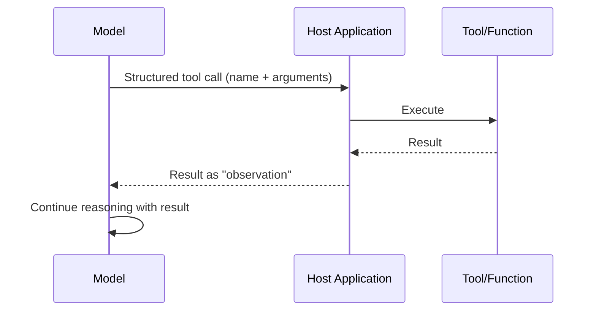

# 02 · Tool Use

## Overview

Tool use is what turns a language model from a text generator into an agent
that can act on the world: searching the web, calling APIs, querying
databases, running code, browsing the web, and reading/writing files. This
category covers the general concepts; the standardized protocol for
exposing tools across applications is covered in [`11-mcp/`](../11-mcp/README.md).

## Learning Objectives

- Explain function/tool calling and how models decide when to invoke a tool
- Compare the major tool categories and their distinct risk profiles
- Know the core safety considerations for any tool-using agent

## Function Calling

Function calling (also called tool calling) is the mechanism by which a
model is given a set of available functions (name, description, parameter
schema) and can choose to emit a structured call to one of them instead of
(or interleaved with) plain text, which the host application then executes
and returns the result of.

Key practices:

- Write clear, specific tool descriptions and parameter schemas — the model
  relies entirely on these to decide when/how to call a tool.
- Validate all arguments server-side; never trust that a model will only
  ever send well-formed input.
- Return structured, parseable results — not just a dumped raw blob — so the
  model can reliably use the output.

## Web Search

Giving an agent a web search tool extends its knowledge beyond training data
cutoff and into current, external information. Typically implemented as: the
model emits a search query → a search API returns results/snippets → the
model may follow up with a page-fetch tool for full content.

## Browser Automation

Browser automation tools let an agent interact with actual web pages —
clicking, filling forms, navigating — rather than just reading static
search results. This is higher-risk than read-only search: it involves
taking real actions on real sites, so scoping, sandboxing, and human
approval for consequential actions (purchases, submissions) matter more.

## API Calling

General-purpose calling of external REST/GraphQL/RPC APIs. The same
function-calling mechanism applies; the key design work is exposing the
right subset of an API's capabilities with least-privilege credentials
(see [`11-mcp/security-and-transport.md`](../11-mcp/security-and-transport.md)
for a deeper treatment applicable beyond MCP specifically).

## Database Access

Tools that let an agent query (and sometimes write to) databases. Because
raw SQL access from a model carries significant risk (destructive queries,
data exfiltration), strong practices include:

- Read-only credentials by default; write access only where explicitly
  required and approved.
- Parameterized/templated queries rather than free-form SQL generation where
  feasible, or a validation layer over generated SQL.
- Row-level/column-level access control matching the requesting user's
  actual permissions.

## CLI / Shell Tools

Giving an agent access to a command-line interface is extremely powerful and
extremely high-risk — it's effectively general-purpose code/command
execution. This should always run in a sandboxed environment with strict
resource and permission limits (see
[Safety & Alignment](../07-safety-alignment/README.md)).

## Python / Code Execution

Letting an agent write and execute code (see also [CodeAct](../13-agent-patterns/codeact.md))
for data processing, calculations, or complex logic. Sandboxing is
non-negotiable here as well.

## File System Access

Tools that let an agent read and/or write files. Should be scoped to a
specific directory/workspace, never the full host filesystem, with explicit
read vs. write permission distinctions.

## Key Concepts

| Term | Definition |
|---|---|
| Tool/function call | A structured request from the model to invoke a specific action with arguments |
| Tool schema | The declared name, description, and parameter types/constraints for a tool |
| Observation | The result of a tool call, fed back to the model to continue reasoning |
| Sandboxing | Isolating tool execution (especially code/shell) from the host system |
| Least privilege | Granting a tool only the minimum access/permissions it needs |

## Advantages / Disadvantages of tool use in general

| Advantages | Disadvantages |
|---|---|
| Extends the agent beyond static training knowledge into live, external action | Every tool is a new risk surface — especially write/destructive/code-execution tools |
| Enables real task completion (booking, querying, computing), not just Q&A | Requires careful schema design, validation, and permission scoping |
| Composes with reasoning patterns ([ReAct](../13-agent-patterns/react.md), [CodeAct](../13-agent-patterns/codeact.md)) | Tool failures/timeouts need graceful handling in the agent loop |

## Common Mistakes

- **Mistake:** Vague tool descriptions, leading the model to call the wrong
  tool or pass malformed arguments. **Fix:** Write precise, example-rich tool
  descriptions and strict parameter schemas.
- **Mistake:** Granting write/destructive access by default "in case it's
  needed." **Fix:** Default to read-only; add write/destructive access only
  when explicitly required, gated by approval where appropriate (see
  [Human-in-the-Loop Approval](../07-safety-alignment/README.md#human-approval)).
- **Mistake:** No sandboxing for code/shell execution tools. **Fix:** Always
  sandbox — see [`07-safety-alignment/`](../07-safety-alignment/README.md).

## Related Categories

- [`11-mcp/`](../11-mcp/README.md) — the standardized protocol for exposing tools
- [`07-safety-alignment/`](../07-safety-alignment/README.md) — permissions, guardrails, and approval for tool actions
- [`13-agent-patterns/`](../13-agent-patterns/README.md) — patterns (ReAct, CodeAct) that structure tool use

## Research Papers

- **Toolformer: Language Models Can Teach Themselves to Use Tools** — Schick et al., 2023. [arXiv:2302.04761](https://arxiv.org/abs/2302.04761)
- **ReAct: Synergizing Reasoning and Acting in Language Models** — Yao et al., 2022. [arXiv:2210.03629](https://arxiv.org/abs/2210.03629)

## Further Reading

- [`11-mcp/README.md`](../11-mcp/README.md) — protocol-level standardization of tool use
