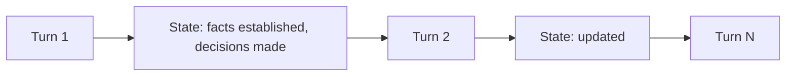
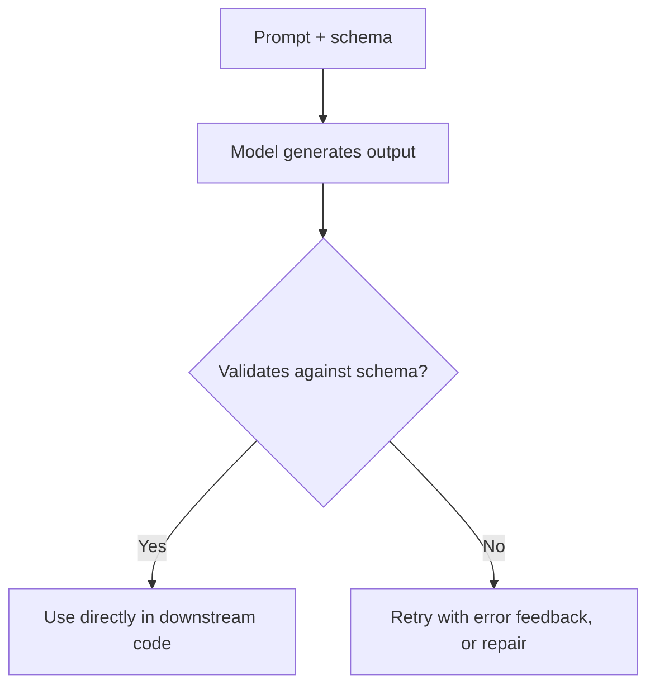

# 03 · Communication

## Overview

Communication skills govern how an agent processes and produces language
itself — independent of reasoning or tool use: summarizing, translating,
managing multi-turn conversation state, engineering effective prompts, and
producing structured (machine-parseable) output. These skills sit underneath
almost every other category — a research agent still needs to summarize
findings; a coding agent still needs structured output for its patches.

## Learning Objectives

- Apply summarization appropriately for different output goals (extractive
  vs. abstractive)
- Understand what changes with translation tasks for an agent vs. a human
  translator
- Manage conversation state across long multi-turn interactions
- Design prompts and structured output schemas that are reliable, not just
  usually-correct

## Summarization

Summarization condenses a longer source into a shorter representation that
preserves the key information. Two broad styles:

| Style | Description | Best for |
|---|---|---|
| Extractive | Selects and stitches together existing sentences/phrases from the source | Cases needing verifiable, unmodified quotes |
| Abstractive | Generates new phrasing that captures meaning, not verbatim text | Cases needing concise, readable synthesis |

For agents synthesizing multiple retrieved sources (see [RAG](../10-rag/README.md)),
abstractive summarization with careful grounding/citation is typical — and
carries meaningful copyright and accuracy considerations (never fabricate
what a source said; paraphrase rather than reproduce).

## Translation

Machine translation as an agent skill goes beyond literal language
conversion — it also involves preserving intent, tone, and domain-specific
terminology, and often needs to interact with other skills (e.g. translate,
then summarize; or detect source language automatically as a first step).

## Conversation State

Multi-turn agents need to track what's been said, decided, and committed to
across a conversation — related to, but distinct from, long-term
[memory](../01-core-cognitive/memory/README.md) (state here is
typically scoped to the current session/conversation, not persisted
indefinitely).

Key practices: track explicit decisions/commitments (not just raw transcript
history), and compress/summarize older turns as the conversation grows (see
[Memory Compression](../01-core-cognitive/memory/README.md#memory-compression)).

## Prompt Engineering

The practice of designing inputs to reliably elicit the desired model
behavior. Core techniques:

- Be clear, specific, and unambiguous about the task and desired format.
- Provide positive examples (what good output looks like) and, where useful,
  negative examples (common failure modes to avoid).
- Encourage step-by-step reasoning where the task benefits from it (see
  [Chain of Thought](../01-core-cognitive/reasoning/chain-of-thought.md)).
- Request specific structure/format explicitly rather than hoping for it
  implicitly.
- Iterate empirically — test prompts against real, varied inputs, not just
  the first example that worked.

## Structured Outputs

Getting a model to produce output conforming to a specific schema (JSON, a
specific format) reliably enough for downstream code to parse without
constant special-case handling.

Key practices: provide the schema explicitly in the prompt, validate output
programmatically rather than trusting it blindly, and have a retry/repair
strategy for validation failures rather than silently failing downstream.

## Key Concepts

| Term | Definition |
|---|---|
| Extractive summarization | Summary built from verbatim source excerpts |
| Abstractive summarization | Summary built from newly-generated phrasing |
| Conversation state | Tracked facts/decisions across a multi-turn interaction |
| Structured output | Model output conforming to a defined schema (e.g. JSON) for programmatic use |

## Advantages / Disadvantages

| Advantages | Disadvantages |
|---|---|
| These skills underlie nearly every agent application — high leverage to get right | Easy to under-invest in since they seem "simple" compared to reasoning/tool use |
| Structured outputs make agents reliably composable with other software | Over-constraining prompts/schemas can reduce quality on genuinely open-ended tasks |
| Good summarization reduces context bloat and downstream cost | Summarization/translation both carry accuracy and grounding risks if not verified |

## Common Mistakes

- **Mistake:** Trusting "mostly valid JSON" output without programmatic
  validation. **Fix:** Always validate structured output against a schema
  and have a defined retry/repair path.
- **Mistake:** Summarizing without grounding — introducing claims not
  actually present in the source. **Fix:** Constrain summarization prompts
  to only use provided source content; verify against
  [Hallucination Detection](../04-decision-making/README.md#hallucination-detection)
  practices for high-stakes summaries.
- **Mistake:** Letting conversation state grow unbounded without
  summarization. **Fix:** Apply memory compression as conversations grow
  (see [Memory](../01-core-cognitive/memory/README.md)).

## Related Categories

- [`01-core-cognitive/`](../01-core-cognitive/README.md) — memory and reasoning underlying these skills
- [`10-rag/`](../10-rag/README.md) — summarization/synthesis over retrieved sources
- [`04-decision-making/`](../04-decision-making/README.md) — verifying summarized/generated claims

## Research Papers

- **A Survey on Text Summarization Techniques** — various surveys; see [`papers/README.md`](../papers/README.md) for a curated entry point.

## Further Reading

- [`docs/style-guide.md`](../docs/style-guide.md) — this repository's own applied prompt/writing conventions
