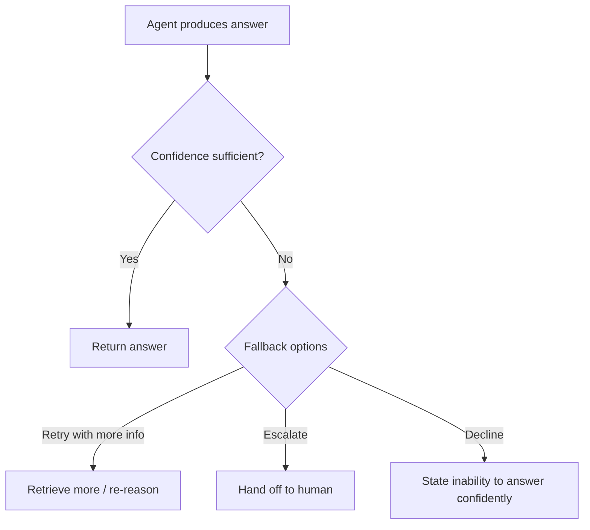

# 04 · Decision Making

## Overview

Decision making covers how an agent judges its own confidence, decides when
to trust an answer versus escalate or fall back, detects when it might be
hallucinating, and verifies its own outputs. These are the skills that
separate a merely-fluent agent from a *trustworthy* one — the difference
between an agent that always answers confidently and one that knows when it
shouldn't.

## Learning Objectives

- Distinguish confidence estimation from actual correctness
- Design fallback strategies for low-confidence situations
- Recognize common hallucination patterns and detection techniques
- Apply verification techniques appropriate to different claim types

## Risk Analysis

Risk analysis involves the agent (or its surrounding system) assessing the
potential cost of being wrong before acting, especially for consequential
actions (irreversible operations, financial transactions, anything
affecting real-world state). Higher-risk actions warrant more verification,
more conservative defaults, and often human approval (see
[Human-in-the-Loop Approval](../07-safety-alignment/README.md#human-approval)).

## Confidence Estimation

Confidence estimation is the practice of getting a model (or a surrounding
system) to express — reliably — how likely its own answer is to be correct.

| Technique | Description |
|---|---|
| Verbalized confidence | Asking the model to state a confidence level alongside its answer (unreliable on its own — models are often miscalibrated) |
| Self-consistency voting | Sampling multiple independent answers; agreement rate as a confidence proxy (see [Chain of Thought](../01-core-cognitive/reasoning/chain-of-thought.md)) |
| External calibration | Comparing model confidence signals against actual historical accuracy on similar tasks |

> ⚠️ A model's stated confidence is not the same as its actual accuracy.
> Treat verbalized confidence as a weak signal, not ground truth, unless
> empirically calibrated against real outcomes.

## Fallback Strategies

When confidence is low, or a tool/retrieval fails, an agent needs a defined
fallback rather than guessing:

Common fallback options: retrying with additional retrieval/tools, escalating
to a human, or explicitly declining rather than guessing — all preferable to
silently returning a low-confidence answer as if it were certain.

## Hallucination Detection

A hallucination is content the model generates that isn't actually supported
by real evidence, source material, or fact — stated with the same fluency
and confidence as accurate content, which is what makes it dangerous.

Detection approaches:

- **Grounding checks**: verify each claim against retrieved source material
  (see [RAG](../10-rag/README.md)) — flag claims with no supporting source.
- **Self-consistency**: sample multiple generations; low agreement on a
  specific factual claim is a hallucination-risk signal.
- **External fact-checking tools**: cross-reference claims against a
  trusted database or search results.
- **Citation requirements**: require the model to cite specific source
  passages for factual claims, then verify the citation actually supports
  the claim.

## Verification

Verification means checking an answer against an independent, ideally
ground-truth source rather than trusting the generation process alone.

| Verification method | Best for |
|---|---|
| Unit tests / execution | Code generation |
| Calculator / symbolic tools | Arithmetic and math |
| Retrieval cross-check | Factual claims with a known corpus |
| Self-consistency voting | Reasoning tasks without an external oracle |
| Human review | High-stakes or ambiguous decisions |

## Key Concepts

| Term | Definition |
|---|---|
| Confidence | A signal (verbalized or derived) estimating how likely an answer is correct |
| Calibration | How well confidence signals actually track real-world accuracy |
| Hallucination | Fluent, confident-sounding content not actually supported by evidence |
| Fallback | A defined alternative action taken when confidence is insufficient |
| Verification | Checking an answer against an independent, ideally ground-truth source |

## Advantages / Disadvantages

| Advantages | Disadvantages |
|---|---|
| Dramatically reduces silent, confidently-wrong failures | Adds latency/cost — verification and fallback logic mean extra steps |
| Builds user trust through appropriate humility ("I'm not sure, let me check") | Poorly calibrated confidence signals can create false security if not validated |
| Enables graceful degradation instead of hard failure | Requires deliberate engineering — doesn't happen automatically from a good prompt alone |

## Common Mistakes

- **Mistake:** Trusting a model's verbalized confidence at face value.
  **Fix:** Use empirically validated confidence signals (self-consistency,
  calibration studies) rather than raw stated confidence.
- **Mistake:** No fallback path — the agent always returns *an* answer even
  when it shouldn't be trusted. **Fix:** Define explicit fallback behavior
  for low-confidence situations.
- **Mistake:** Treating citation presence as proof of grounding without
  checking the citation actually supports the claim. **Fix:** Verify
  citations point to content that genuinely substantiates the claim made.

## Related Categories

- [`01-core-cognitive/reasoning/self-reflection.md`](../01-core-cognitive/reasoning/self-reflection.md) — self-evaluation as one input to decision-making
- [`10-rag/`](../10-rag/README.md) — grounding for hallucination reduction
- [`07-safety-alignment/`](../07-safety-alignment/README.md) — human approval for high-risk decisions
- [`15-evaluation/`](../15-evaluation/README.md) — measuring calibration and hallucination rates systematically

## Research Papers

- **Self-Consistency Improves Chain of Thought Reasoning in Language Models** — Wang et al., 2022. [arXiv:2203.11171](https://arxiv.org/abs/2203.11171)
- **Survey of Hallucination in Natural Language Generation** — Ji et al., 2023. [arXiv:2202.03629](https://arxiv.org/abs/2202.03629)

## Further Reading

- [`15-evaluation/README.md`](../15-evaluation/README.md) — systematic measurement of these properties
