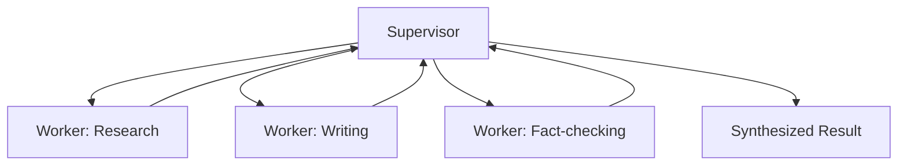
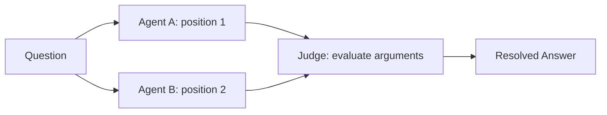
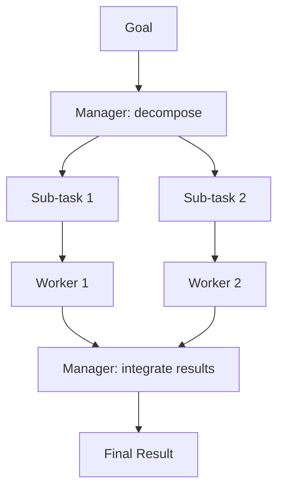

# 06 · Multi-Agent Systems

## Overview

Multi-agent systems coordinate multiple specialized agents to solve a task
that's better decomposed across distinct roles than handled by one
monolithic agent — mirroring how human teams divide labor. This category
covers communication between agents, delegation, and the common
coordination topologies: supervisor, swarm, debate, critic/judge, and
manager-worker.

## Learning Objectives

- Explain why and when multi-agent decomposition outperforms a single agent
- Compare the major coordination topologies and their tradeoffs
- Recognize the added failure modes multi-agent systems introduce
  (coordination overhead, error propagation, cost multiplication)

## Agent Communication

Agents in a multi-agent system need a shared protocol for exchanging
messages, task assignments, and results — this can be as simple as
structured text messages passed through an orchestrator, or as formal as a
dedicated message-passing schema. The key design question: what information
does one agent need from another, and in what form?

## Delegation

Delegation is the act of one agent (or an orchestrator) assigning a
sub-task to another agent better suited to it — building directly on
[task decomposition](../01-core-cognitive/planning/task-decomposition.md).
Effective delegation requires clear task scoping, well-defined success
criteria, and a way to return results to the delegating agent.

## Supervisor Pattern

A supervisor agent coordinates a set of worker agents: routing tasks,
monitoring progress, and synthesizing final results — without doing the
domain-specific work itself.

## Swarm

A swarm topology has many similar agents operating with lightweight,
often peer-to-peer or emergent coordination, rather than a strict hierarchy
— useful for tasks that decompose into many similar, parallelizable units.

## Debate

Two or more agents argue different positions or independently attempt a
task, then a synthesis step (another agent, a human, or a voting mechanism)
resolves disagreements — used to surface flaws in reasoning that a single
agent might not catch on its own.

## Critic / Judge

A dedicated critic (or judge) agent evaluates another agent's output against
criteria, without doing the original task itself — a multi-agent analog of
[self-reflection](../01-core-cognitive/reasoning/self-reflection.md), but
with the evaluation done by an independent agent rather than the same model
reflecting on itself (reducing shared blind spots).

## Manager–Worker

Similar to Supervisor, but with an explicit emphasis on task decomposition:
a manager agent decomposes a goal into sub-tasks (see
[Task Decomposition](../01-core-cognitive/planning/task-decomposition.md)),
assigns each to a worker agent (often specialized per sub-task type), and
integrates their outputs.

## Key Concepts

| Term | Definition |
|---|---|
| Orchestrator | The component (agent or system) coordinating multiple agents' work |
| Topology | The structural pattern of how agents communicate/coordinate (hierarchical, peer-to-peer, debate) |
| Role specialization | Assigning distinct responsibilities to different agents rather than one general-purpose agent doing everything |
| Error propagation | A failure in one agent's output cascading into downstream agents that depend on it |

## Advantages / Disadvantages

| Advantages | Disadvantages |
|---|---|
| Specialization can outperform one generalist agent on complex, multi-skill tasks | Coordination overhead — more messages, more latency, more failure points |
| Parallelization possible across independent sub-tasks | Cost multiplies with the number of agent calls involved |
| Debate/critic patterns can catch errors a single agent would miss | Errors can propagate/compound across agents without careful validation at handoffs |
| Easier to reason about/debug narrow, specialized agent roles | Overkill for tasks a single well-designed agent already handles well |

## Common Mistakes

- **Mistake:** Defaulting to multi-agent architectures for tasks a single
  agent (with good [reasoning](../01-core-cognitive/README.md) and
  [tool use](../02-tool-use/README.md)) already handles well. **Fix:**
  Justify multi-agent complexity with a genuine need for role specialization
  or parallelization — measure against a strong single-agent baseline first.
- **Mistake:** No validation at handoff points between agents, letting
  errors propagate silently. **Fix:** Validate/sanity-check outputs at each
  handoff, especially before they inform downstream agents' work.
- **Mistake:** Unbounded inter-agent communication loops (agents repeatedly
  passing work back and forth without progress). **Fix:** Cap
  communication rounds and define clear termination conditions.

## Related Categories

- [`13-agent-patterns/`](../13-agent-patterns/README.md) — single-agent patterns often used as the building block for each agent in a multi-agent system
- [`01-core-cognitive/planning/task-decomposition.md`](../01-core-cognitive/planning/task-decomposition.md) — the basis for delegation
- [`14-observability/`](../14-observability/README.md) — tracing multi-agent interactions is significantly harder than single-agent, and worth investing in early

## Research Papers

- **CAMEL: Communicative Agents for "Mind" Exploration of Large Language Model Society** — Li et al., 2023. [arXiv:2303.17760](https://arxiv.org/abs/2303.17760)
- **AutoGen: Enabling Next-Gen LLM Applications via Multi-Agent Conversation** — Wu et al., 2023. [arXiv:2308.08155](https://arxiv.org/abs/2308.08155)
- **Improving Factuality and Reasoning in Language Models through Multiagent Debate** — Du et al., 2023. [arXiv:2305.14325](https://arxiv.org/abs/2305.14325)

## Further Reading

- [`18-workflows/README.md`](../18-workflows/README.md) — real workflows that use multi-agent coordination
