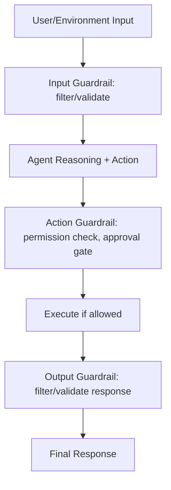
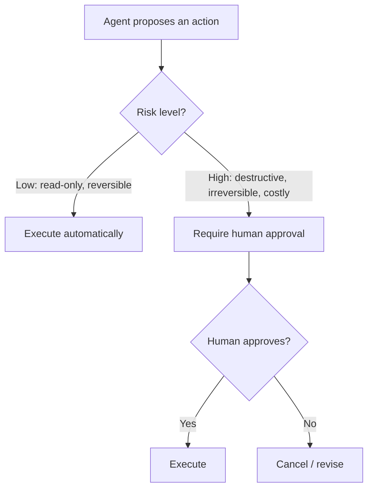

# 07 · Safety & Alignment

## Overview

Safety and alignment covers the mechanisms that keep an agent's actions
within intended, safe bounds: guardrails, defenses against prompt injection
and jailbreak attempts, permission models, authentication/authorization, and
human-in-the-loop approval for consequential actions. As agents gain more
autonomy and tool access, this category moves from "nice to have" to
foundational — an agent that reasons brilliantly but acts unsafely is not
production-ready.

## Learning Objectives

- Design layered guardrails around agent behavior
- Understand prompt injection and why it's structurally different from
  traditional input validation problems
- Apply least-privilege permission design to agent tool access
- Know when human approval should gate an action

## Guardrails

Guardrails are checks — before, during, or after generation — that constrain
an agent's behavior to safe/intended bounds: input filtering, output
filtering, action-level constraints, and topic/scope boundaries.

Layered guardrails (input + action + output) are more robust than relying on
any single layer, since each catches different failure modes.

## Prompt Injection

Prompt injection occurs when content an agent processes as *data* (a
webpage, a document, a tool result, an email) contains text that attempts to
be interpreted as *instructions*, potentially hijacking the agent's behavior
— this is structurally different from traditional injection attacks because
there's no strict syntactic boundary between "instruction" and "data" in
natural language the way there is between code and data in a SQL query.

Mitigations include: treating all externally-sourced content as untrusted
data (never granting it instruction-following authority), applying
permission/approval gates on consequential actions regardless of what
"instructed" them, and monitoring for anomalous tool-call patterns following
exposure to untrusted content.

## Jailbreaks

Jailbreaks are attempts (via clever prompting) to get a model to bypass its
safety training/instructions — distinct from prompt injection in that
jailbreaks target the model's own behavior directly (usually via the primary
user's own input), while injection targets manipulation via third-party data
the agent processes. Defense-in-depth (multiple independent safety layers,
not relying on the model's judgment alone) is the standard mitigation
approach for both.

## Permissions

Agent tool access should follow least-privilege: each tool/credential scoped
to the minimum access required for its declared purpose, not broad
"just-in-case" access. See
[`11-mcp/security-and-transport.md`](../11-mcp/security-and-transport.md)
for a protocol-specific treatment that generalizes to tool use broadly.

## Authentication

Authentication verifies *who* (which user, which system) is making a
request — relevant both for the agent's own credentials to external systems,
and for verifying the identity of the human/system the agent is acting on
behalf of.

## Authorization

Authorization determines *what* an authenticated identity is allowed to do.
For agents, this should typically mirror the requesting user's own
permissions — an agent should not have broader access than the human it acts
on behalf of, unless explicitly and deliberately granted.

## Human Approval

For actions with real-world consequences — especially irreversible,
destructive, or high-cost actions — requiring explicit human confirmation
before execution is one of the most reliable safety mechanisms available.

## Key Concepts

| Term | Definition |
|---|---|
| Guardrail | A check constraining agent behavior to safe/intended bounds |
| Prompt injection | Untrusted content manipulating an agent by being interpreted as instructions |
| Jailbreak | An attempt to bypass a model's safety training/instructions via crafted prompting |
| Least privilege | Granting only the minimum access necessary for a declared purpose |
| Defense in depth | Using multiple independent safety layers rather than relying on any single mechanism |

## Advantages / Disadvantages

| Advantages | Disadvantages |
|---|---|
| Prevents costly, embarrassing, or dangerous agent failures | Adds friction/latency, especially with human approval gates |
| Builds justified trust, enabling broader agent deployment over time | Over-restrictive guardrails can make an agent frustratingly limited |
| Least-privilege design limits the blast radius of any single failure/compromise | Requires ongoing investment — new tools/capabilities need new safety review |

## Common Mistakes

- **Mistake:** Relying solely on the model's own judgment/training to avoid
  unsafe actions, with no independent guardrail layer. **Fix:** Add
  system-level checks (permissions, approval gates) that don't depend on the
  model "deciding correctly" every time.
- **Mistake:** Treating all tool-fetched content as trustworthy instructions.
  **Fix:** Explicitly separate instructions from data, and never let
  fetched/external content grant new permissions or override prior
  instructions.
- **Mistake:** No human approval gate for destructive/irreversible actions.
  **Fix:** Classify actions by risk/reversibility and gate high-risk ones
  behind explicit confirmation.

## Related Categories

- [`11-mcp/security-and-transport.md`](../11-mcp/security-and-transport.md) — protocol-specific security treatment
- [`02-tool-use/`](../02-tool-use/README.md) — the actions being safeguarded
- [`14-observability/`](../14-observability/README.md) — monitoring for anomalous behavior after the fact

## Research Papers

- **Prompt Injection Attacks and Defenses in LLM-Integrated Applications** — Liu et al., 2023. [arXiv:2310.12815](https://arxiv.org/abs/2310.12815)
- **Universal and Transferable Adversarial Attacks on Aligned Language Models** — Zou et al., 2023. [arXiv:2307.15043](https://arxiv.org/abs/2307.15043)

## Further Reading

- [`SECURITY.md`](../SECURITY.md) — this repository's own security policy
