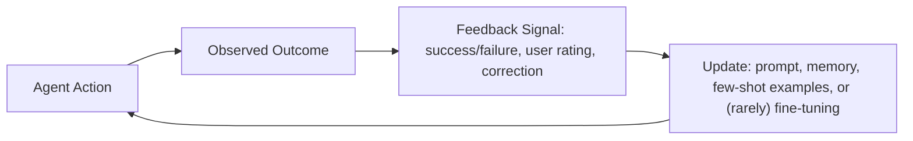

# 08 · Learning & Adaptation

## Overview

Learning and adaptation covers how an agent improves — either within a
single interaction (in-context) or across many interactions over time
(feedback loops, knowledge updates) — without necessarily requiring
retraining or fine-tuning the underlying model.

## Learning Objectives

- Distinguish few-shot learning from in-context learning more broadly
- Design feedback loops that genuinely improve agent behavior over time
- Understand the challenge of keeping an agent's knowledge current

## Few-Shot Learning

Few-shot learning means providing a handful of example input-output pairs
directly in the prompt, letting the model infer the desired pattern/task
without any weight updates. This is often enough to steer a model to a
specific format, tone, or task variant that zero-shot prompting handles
poorly.

```text
Example (few-shot for a classification task):

Input: "This product broke after one use." → Sentiment: Negative
Input: "Fast shipping, exactly as described." → Sentiment: Positive
Input: "It's okay, does the job." → Sentiment: Neutral

Input: "Wish I'd bought this sooner!" → Sentiment: ?
```

## In-Context Learning

In-context learning is the broader phenomenon few-shot learning is a special
case of: a model adapting its behavior based purely on information present
in its current context (examples, instructions, retrieved documents),
without any parameter updates. This is the mechanism underlying essentially
all prompting-based techniques in this repository.

## Feedback Loops

A feedback loop is a system where the outcome of an agent's action informs
future behavior — ranging from simple (log failures for a human to review
and manually improve prompts) to sophisticated (automatically incorporate
reflections into future attempts, as in [Reflexion](../13-agent-patterns/reflexion.md)).



Feedback signals can come from: automated evaluators (tests, verifiers),
explicit user feedback (ratings, corrections), or implicit signals (did the
user accept the output, retry, or abandon the task).

## Knowledge Updating

Knowledge updating addresses the fact that a model's parametric knowledge is
frozen at training time, while the world keeps changing. Approaches, roughly
in order of engineering complexity:

| Approach | Description | Tradeoff |
|---|---|---|
| Retrieval ([RAG](../10-rag/README.md)) | Inject current information at query time | No retraining needed; retrieval quality bottlenecks results |
| Prompt/system updates | Manually update instructions/context with new facts | Simple but doesn't scale to large volumes of changing info |
| Fine-tuning | Retrain (or adapter-tune) the model on updated data | Higher cost/complexity; needed for deep behavioral changes, not just fact updates |

For most agent applications, retrieval is the practical default for keeping
factual knowledge current — see [`10-rag/`](../10-rag/README.md).

## Key Concepts

| Term | Definition |
|---|---|
| Few-shot learning | Steering model behavior via example input-output pairs in the prompt |
| In-context learning | The general phenomenon of adapting behavior from context, without weight updates |
| Feedback loop | A system where action outcomes inform future agent behavior |
| Knowledge updating | Keeping an agent's effective knowledge current despite a frozen training cutoff |

## Advantages / Disadvantages

| Advantages | Disadvantages |
|---|---|
| In-context techniques require no retraining — fast to iterate | Effects don't persist beyond the context unless explicitly captured in memory |
| Feedback loops enable continuous improvement without fine-tuning cycles | Poorly designed feedback loops can reinforce bad patterns as easily as good ones |
| Retrieval-based knowledge updating is far cheaper than fine-tuning for factual currency | Retrieval only helps with retrievable facts, not deeper behavioral/reasoning adaptation |

## Common Mistakes

- **Mistake:** Assuming in-context adaptation persists across sessions
  without explicit memory storage. **Fix:** Persist useful adaptations via
  [long-term memory](../01-core-cognitive/memory/README.md) if they should
  carry forward.
- **Mistake:** Building feedback loops with noisy/unreliable signals (e.g.
  user silence interpreted as approval). **Fix:** Use clear, validated
  feedback signals wherever possible; be skeptical of implicit signals.
- **Mistake:** Reaching for fine-tuning to solve what's actually a
  knowledge-currency problem. **Fix:** Try retrieval-based updates first —
  see [`10-rag/`](../10-rag/README.md); reserve fine-tuning for genuine
  behavioral changes retrieval can't address.

## Related Categories

- [`13-agent-patterns/reflexion.md`](../13-agent-patterns/reflexion.md) — feedback loops in action
- [`10-rag/`](../10-rag/README.md) — the primary knowledge-updating mechanism for most agents
- [`01-core-cognitive/memory/README.md`](../01-core-cognitive/memory/README.md) — where learned adaptations persist

## Research Papers

- **Language Models are Few-Shot Learners (GPT-3)** — Brown et al., 2020. [arXiv:2005.14165](https://arxiv.org/abs/2005.14165)
- **A Survey on In-context Learning** — Dong et al., 2022. [arXiv:2301.00234](https://arxiv.org/abs/2301.00234)

## Further Reading

- [`13-agent-patterns/README.md`](../13-agent-patterns/README.md) — patterns that operationalize feedback loops
