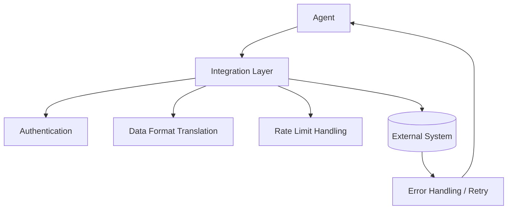

# 09 · Integrations

## Overview

Integrations covers the vendor-neutral patterns for connecting an agent to
external systems — beyond the protocol-specific treatment in
[`11-mcp/`](../11-mcp/README.md). This includes general design principles
for any integration: authentication patterns, data format translation,
rate-limit handling, and error resilience — the concerns that come up
whether you're integrating via MCP, a bespoke REST wrapper, or a
framework-specific plugin system.

## Learning Objectives

- Apply general integration design principles independent of specific
  protocols or frameworks
- Design resilient integrations that degrade gracefully under failure
- Understand common authentication patterns for agent-to-system connections

## Integration Design Principles

| Principle | Description |
|---|---|
| Least privilege | Scope credentials/access to exactly what the integration needs |
| Idempotency where possible | Design actions so retries don't cause duplicate side effects |
| Graceful degradation | An integration failure shouldn't crash the whole agent — define fallback behavior |
| Explicit rate-limit handling | Respect and handle external API rate limits with backoff, not silent failure |
| Structured error surfaces | Return errors in a form the agent can reason about, not opaque failures |

## Authentication Patterns

| Pattern | Description | Common use |
|---|---|---|
| API keys | Static secret passed with each request | Simple service-to-service integrations |
| OAuth 2.0 | Delegated, scoped, revocable access on behalf of a user | User-facing integrations (email, calendar, cloud storage) |
| Service accounts | Non-human identity with defined permissions | Backend/system-level integrations |
| Signed tokens (JWT, etc.) | Verifiable, often short-lived credentials | Distributed systems, microservice-style integrations |

Prefer scoped, revocable, short-lived credentials (OAuth, signed tokens)
over long-lived static API keys wherever the external system supports it —
this limits blast radius if a credential is ever compromised.

## Data Format Translation

Agents and external systems rarely speak the exact same data shape — an
integration layer typically needs to translate between what a tool schema
expects and what the external API actually returns/requires, including
handling schema versioning as external APIs evolve.

## Resilience Patterns

- **Timeouts**: every external call should have a defined timeout — an
  agent should never hang indefinitely on an unresponsive integration.
- **Retries with backoff**: transient failures (network blips, rate limits)
  should retry with exponential backoff, not fail immediately or retry
  aggressively.
- **Circuit breakers**: repeatedly failing integrations should be
  temporarily disabled rather than retried indefinitely, to avoid
  cascading load on an already-struggling external system.
- **Fallback responses**: when an integration is unavailable, the agent
  should have a defined fallback (inform the user, use cached/stale data
  with a caveat, or try an alternative source) rather than failing silently.

## Key Concepts

| Term | Definition |
|---|---|
| Integration layer | The code/component translating between agent tool calls and an external system's actual interface |
| Idempotency | A property where repeating an action has the same effect as doing it once |
| Circuit breaker | A pattern that temporarily disables calls to a failing integration to prevent cascading issues |
| Graceful degradation | Continuing to provide partial/reduced functionality rather than total failure when a dependency is unavailable |

## Advantages / Disadvantages

| Advantages | Disadvantages |
|---|---|
| Well-designed integrations make agents robust to real-world external system instability | Building genuine resilience (retries, circuit breakers, fallbacks) is real engineering effort |
| Standardized auth patterns (OAuth) improve security posture over static keys | OAuth flows add implementation complexity vs. simple API keys |
| Graceful degradation preserves partial usefulness during outages | Requires deliberately designing fallback behavior per integration, not just for the happy path |

## Common Mistakes

- **Mistake:** No timeout on external calls, risking the agent hanging
  indefinitely. **Fix:** Always set explicit timeouts.
- **Mistake:** Retrying failed calls aggressively without backoff, worsening
  load on a struggling external system. **Fix:** Use exponential backoff and
  circuit breakers.
- **Mistake:** Treating every integration failure as a hard agent failure
  with no fallback. **Fix:** Design explicit graceful-degradation behavior
  per integration.

## Related Categories

- [`11-mcp/`](../11-mcp/README.md) — the standardized protocol option for integrations
- [`02-tool-use/`](../02-tool-use/README.md) — the general tool-use concepts integrations expose
- [`16-deployment/`](../16-deployment/README.md) — operating integrations reliably in production

## Research Papers

Integration design draws primarily from general software engineering and
distributed systems practice rather than agent-specific research; see
[`resources/README.md`](../resources/README.md) for relevant engineering
references.

## Further Reading

- [`11-mcp/README.md`](../11-mcp/README.md) — the standardized protocol approach
