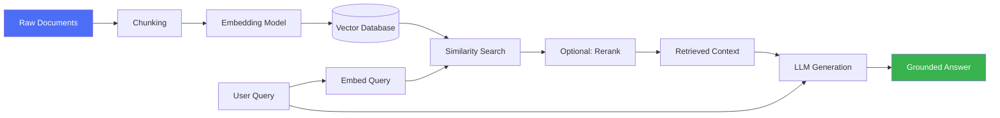

# 10 · Retrieval-Augmented Generation (RAG)

## Overview

RAG grounds a language model's output in external documents retrieved at
query time, rather than relying solely on knowledge baked into the model's
weights. It's the standard technique for giving an agent access to private,
proprietary, or frequently-changing information without retraining the
model, and for reducing hallucination by anchoring answers in retrievable
source text.

## Learning Objectives

- Explain the end-to-end RAG pipeline: ingest → chunk → embed → index →
  retrieve → generate
- Choose a chunking strategy appropriate to a document type
- Understand embeddings and how similarity search works
- Compare basic vector retrieval to hybrid search, reranking, GraphRAG, CRAG,
  and Self-RAG, and know when each is worth the added complexity

## Pages in this category

| Page | Description | Status |
|---|---|---|
| [`chunking.md`](chunking.md) | Splitting documents into retrievable units | 🟢 |
| [`embeddings.md`](embeddings.md) | Turning text into vectors for similarity search | 🟢 |
| [`retrieval-strategies.md`](retrieval-strategies.md) | Dense, sparse, hybrid search, and reranking | 🟢 |
| [`advanced-rag.md`](advanced-rag.md) | GraphRAG, CRAG, Self-RAG | 🟢 |
| [`vector-databases.md`](vector-databases.md) | Storage/index layer for embeddings | 🟢 |

## A Minimal RAG Pipeline

## Key Concepts

| Term | Definition |
|---|---|
| Chunk | A retrievable unit of a document, sized to balance context relevance and precision |
| Embedding | A numeric vector representation of text capturing semantic meaning |
| Vector database | A storage/index system optimized for nearest-neighbor search over embeddings |
| Retrieval | The process of fetching the most relevant chunks for a given query |
| Grounding | Anchoring generated text in retrieved source material, ideally with citations |
| Hallucination | Model-generated content not actually supported by the retrieved (or any real) source |

## Advantages / Disadvantages

| Advantages | Disadvantages |
|---|---|
| Injects private/current knowledge without retraining the model | Retrieval quality bottlenecks answer quality — bad chunks in, bad answers out |
| Reduces hallucination when done well, and supports citations | Adds infrastructure: embedding pipeline, vector store, retrieval logic |
| Scales to large corpora that wouldn't fit in any context window | Naive top-k retrieval can miss multi-hop or reasoning-heavy queries |
| Composable with reasoning/agent patterns (retrieve, then reason) | Chunking/embedding choices are corpus-specific — no universal default |

## When to Use

- Question-answering over private, proprietary, or frequently changing data
- Reducing hallucination on factual queries within a known corpus
- Any case where the model needs source-grounded, citable answers

## When NOT to Use

- Tasks that don't depend on external documents (pure reasoning/math)
- Extremely small, static knowledge bases that fit entirely in a prompt —
  simpler to just include the text directly
- Real-time data that changes faster than the retrieval index can be updated
  (consider live API/tool calls instead — see [`02-tool-use/`](../02-tool-use/README.md))

## Common Mistakes

- **Mistake:** Treating chunk size as a one-size-fits-all constant across
  document types. **Fix:** Match chunking strategy to document structure —
  see [`chunking.md`](chunking.md).
- **Mistake:** Using only dense vector search when the query has exact-match
  requirements (IDs, codes, names). **Fix:** Use hybrid search — see
  [`retrieval-strategies.md`](retrieval-strategies.md).
- **Mistake:** Assuming retrieval is "done" after top-k similarity search with
  no reranking. **Fix:** Add a reranking stage for higher-stakes applications.
- **Mistake:** No citation/grounding check before returning an answer.
  **Fix:** Verify claims against retrieved chunks — see
  [Hallucination Detection](../04-decision-making/README.md#hallucination-detection).

## Related Categories

- [`11-mcp/`](../11-mcp/README.md) — a standard way to expose retrieval tools to agents
- [`12-memory/`](../12-memory/README.md) — memory retrieval reuses many RAG techniques
- [`04-decision-making/`](../04-decision-making/README.md) — verifying grounded answers

## Research Papers

- **Retrieval-Augmented Generation for Knowledge-Intensive NLP Tasks** — Lewis et al., 2020. [arXiv:2005.11401](https://arxiv.org/abs/2005.11401)
- **Dense Passage Retrieval for Open-Domain Question Answering** — Karpukhin et al., 2020. [arXiv:2004.04906](https://arxiv.org/abs/2004.04906)

## Further Reading

- [`papers/README.md`](../papers/README.md) — full curated bibliography
- [`glossary/README.md`](../glossary/README.md) — RAG-related terms
