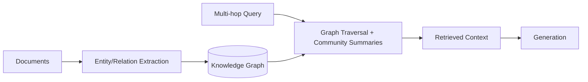
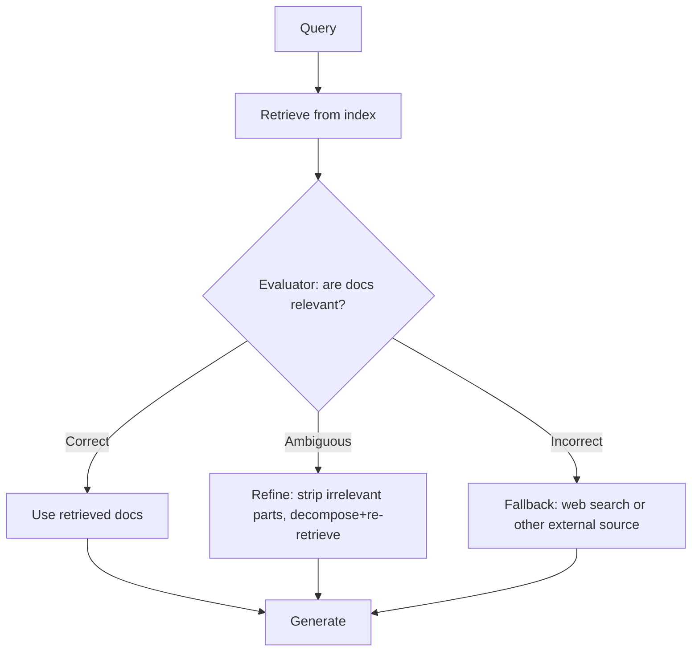
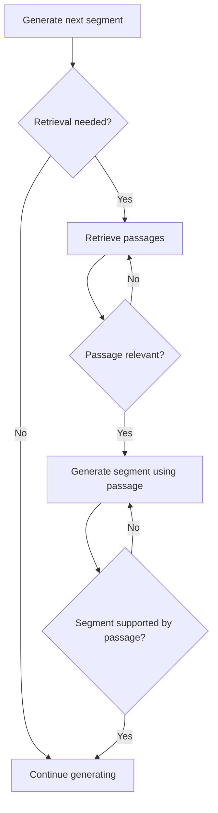

# Advanced RAG: GraphRAG, CRAG, Self-RAG

> Once basic retrieval hits its ceiling, these patterns address specific known failure modes.

## Overview

Basic RAG (chunk → embed → retrieve → generate) fails in predictable ways:
it struggles with questions that require connecting facts across many
documents, it has no mechanism to notice when retrieval itself failed, and it
has no way to decide *whether* retrieval was even necessary. **GraphRAG**,
**CRAG**, and **Self-RAG** are three advanced patterns that each address one
of these specific gaps.

## Learning Objectives

- Explain what problem each of GraphRAG, CRAG, and Self-RAG specifically
  solves
- Recognize the symptoms in your own RAG system that indicate you need one
  of these
- Understand the added infrastructure/complexity each requires

## Key Concepts

| Term | Definition |
|---|---|
| GraphRAG | Retrieval over a knowledge graph built from the corpus, enabling multi-hop reasoning across entities |
| CRAG (Corrective RAG) | A retrieval-evaluation step that grades retrieved documents and triggers correction (e.g. web search) when they're insufficient |
| Self-RAG | The model learns to decide when to retrieve, critique retrieved passages, and critique its own generated output — all via special reflection tokens |
| Multi-hop question | A question whose answer requires connecting information across multiple documents/entities, not found in any single chunk |

## GraphRAG

Standard RAG treats each chunk independently. GraphRAG instead builds a
**knowledge graph** (entities and relationships) from the corpus, then
retrieves via graph traversal alongside or instead of chunk similarity. This
directly targets **multi-hop questions** basic RAG struggles with — e.g.
"Which companies did investors of Company X also fund?" requires connecting
multiple entities, not a single similar chunk.

## CRAG (Corrective RAG)

CRAG adds a **retrieval evaluator** step: after retrieving, a lightweight
model grades the retrieved documents as *correct*, *incorrect*, or
*ambiguous* relative to the query. Depending on the grade, CRAG can refine
the retrieved set, discard irrelevant chunks, or fall back to an external
source (e.g. a live web search) when the local corpus is insufficient.

## Self-RAG

Self-RAG trains (or prompts) the model to interleave generation with special
**reflection decisions**: whether retrieval is needed at all for this part of
the response, whether a retrieved passage is relevant, and whether its own
generated segment is actually supported by that passage. This directly
targets the "we always retrieve, whether or not it's needed" and "we never
check whether the output is grounded" gaps in basic RAG.

## Advantages / Disadvantages

| Pattern | Advantages | Disadvantages |
|---|---|---|
| GraphRAG | Handles multi-hop/relational questions basic RAG can't | Expensive to build/maintain a knowledge graph; extraction errors propagate |
| CRAG | Catches and corrects bad retrievals instead of silently generating from irrelevant context | Extra evaluator call per query; fallback sources (web search) add latency/cost |
| Self-RAG | Reduces unnecessary retrieval and improves groundedness | Requires specialized training/fine-tuning or careful prompting; more complex generation loop |

## When to Use

- **GraphRAG:** corpora rich in interconnected entities (organizational data,
  research literature, legal case law) where questions are often relational
- **CRAG:** production systems where silently answering from irrelevant
  retrieved context is costly (customer-facing, compliance-sensitive)
- **Self-RAG:** systems where both unnecessary retrieval (cost) and
  ungrounded generation (hallucination) are both live concerns

## When NOT to Use

- Don't adopt any of these before confirming basic RAG (with hybrid search +
  reranking) is genuinely insufficient — they all add real complexity
- GraphRAG is overkill for corpora without meaningful entity relationships
- Self-RAG's training requirements make it impractical if you can't fine-tune
  or don't have strong prompting control over reflection behavior

## Common Mistakes

- **Mistake:** Reaching for GraphRAG to fix what's actually a chunking or
  embedding problem. **Fix:** Rule out basic retrieval-strategy fixes (see
  [`retrieval-strategies.md`](retrieval-strategies.md)) first.
- **Mistake:** Implementing CRAG's evaluator with the same model/prompt used
  for generation, introducing correlated blind spots. **Fix:** Use a
  distinct, ideally simpler, evaluation step with explicit grading criteria.
- **Mistake:** Assuming Self-RAG-style behavior emerges from just asking the
  model to "decide if retrieval is needed" without any structure/training.
  **Fix:** Treat this as a genuine architecture change, not a one-line prompt
  addition — validate empirically.

## Comparison

| Approach | Solves | Best for | Complexity |
|---|---|---|---|
| Basic RAG (+ hybrid + rerank) | Single-hop factual grounding | Most production Q&A | Medium |
| GraphRAG | Multi-hop, relational questions | Entity-rich corpora | High |
| CRAG | Bad/irrelevant retrievals going unnoticed | Reliability-critical systems | Medium-high |
| Self-RAG | Unnecessary retrieval + ungrounded generation | Systems that can invest in training/fine control | High |

## Related Topics

- [Retrieval Strategies](retrieval-strategies.md) — the foundation these patterns build on
- [Hallucination Detection](../04-decision-making/README.md#hallucination-detection) — the broader problem CRAG/Self-RAG partially address
- [Verification](../04-decision-making/README.md#verification) — general grounding checks

## Research Papers

- **From Local to Global: A Graph RAG Approach to Query-Focused Summarization** — Edge et al., 2024. [arXiv:2404.16130](https://arxiv.org/abs/2404.16130)
- **Corrective Retrieval Augmented Generation** — Yan et al., 2024. [arXiv:2401.15884](https://arxiv.org/abs/2401.15884)
- **Self-RAG: Learning to Retrieve, Generate, and Critique through Self-Reflection** — Asai et al., 2023. [arXiv:2310.11511](https://arxiv.org/abs/2310.11511)

## Further Reading

- [`10-rag/README.md`](README.md) — category overview
