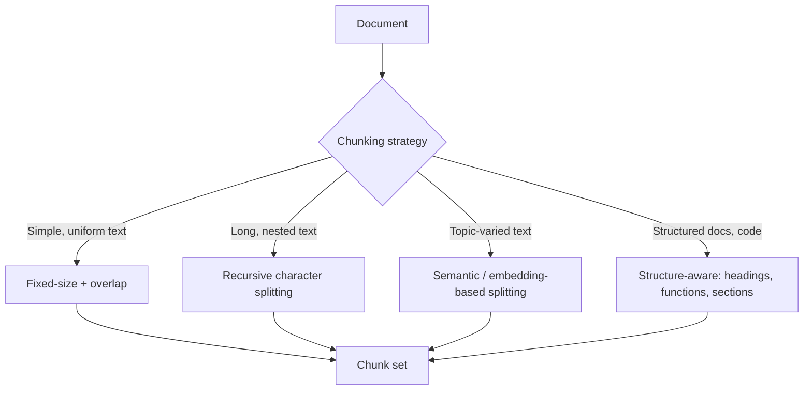

# Chunking Strategies

> Retrieval quality is capped by chunk quality — get this wrong and nothing downstream can fix it.

## Overview

Chunking splits source documents into smaller units that get embedded and
indexed for retrieval. The chunk size and boundary strategy directly
determine what the retriever *can* find: chunks too large dilute relevance
and waste context; chunks too small lose necessary surrounding context.

## Learning Objectives

- Compare fixed-size, recursive, semantic, and structure-aware chunking
- Choose chunk size and overlap appropriate to a document type
- Understand the tradeoff between chunk size and retrieval precision

## Key Concepts

| Term | Definition |
|---|---|
| Chunk size | The target length of each retrievable unit (in tokens or characters) |
| Overlap | Shared text between consecutive chunks, preserving context across boundaries |
| Semantic chunking | Splitting at points of topic change rather than fixed length |
| Structure-aware chunking | Splitting along document structure (headings, sections, code blocks) |

## Architecture



## Workflow

1. **Inspect document structure** — is it plain prose, markdown with
   headings, code, tables, or a mix?
2. **Pick a base strategy**:
   - **Fixed-size** — split every N tokens with some overlap. Simple,
     works acceptably on uniform prose.
   - **Recursive character splitting** — try splitting on paragraph breaks
     first, then sentences, then words, falling back only as needed to hit
     the size target while preserving natural boundaries.
   - **Semantic chunking** — embed sentences, split where semantic
     similarity between consecutive sentences drops (topic shift).
   - **Structure-aware chunking** — split along markdown headings, code
     function boundaries, or table rows so a chunk never straddles an
     unrelated section.
3. **Set overlap** (commonly 10-20% of chunk size) so context isn't lost at
   boundaries.
4. **Attach metadata** to each chunk (source doc, section title, position) —
   critical for both filtering and citation later.
5. **Evaluate** retrieval quality empirically (see
   [Evaluation](../15-evaluation/README.md)) and adjust size/strategy per
   corpus — there's no universal best chunk size.

## Example

```python
# Illustrative recursive splitter
def recursive_split(text, max_tokens=300, overlap=50, separators=("\n\n", "\n", ". ", " ")):
    for sep in separators:
        if sep in text:
            parts = text.split(sep)
            break
    else:
        parts = list(text)

    chunks, current = [], ""
    for part in parts:
        if len((current + part).split()) > max_tokens:
            chunks.append(current)
            current = current[-overlap:] + part
        else:
            current += sep + part if current else part
    if current:
        chunks.append(current)
    return chunks
```

## Advantages / Disadvantages

| Strategy | Advantages | Disadvantages |
|---|---|---|
| Fixed-size | Simple, fast, predictable | Can split mid-sentence or mid-idea |
| Recursive | Respects natural boundaries, still bounded size | Slightly more complex to implement |
| Semantic | Chunks align with actual topic boundaries | Requires an embedding pass just to chunk; slower |
| Structure-aware | Best fidelity for structured docs (code, markdown, tables) | Needs per-format parsing logic |

## When to Use

- **Fixed-size:** quick prototypes, uniform plain-text corpora
- **Recursive:** general-purpose default for most prose documents
- **Semantic:** long documents with varied topics per section (research
  papers, long reports)
- **Structure-aware:** code repositories, well-formatted markdown/docs, tables

## When NOT to Use

- Don't use fixed-size chunking on code — it will split functions/classes
  mid-body; use structure-aware chunking instead.
- Don't over-invest in semantic chunking for short, uniform documents where
  the added latency isn't justified.

## Common Mistakes

- **Mistake:** Using one chunk size for every document type in a mixed
  corpus. **Fix:** Chunk each document type with its own appropriate
  strategy, tagging chunks with source-type metadata.
- **Mistake:** No overlap between chunks, losing context at boundaries.
  **Fix:** Add 10-20% overlap as a default starting point, tune empirically.
- **Mistake:** Stripping metadata (source, section) during chunking. **Fix:**
  Always retain metadata for citation and filtered retrieval.

## Comparison

| Approach | Best for | Cost | Complexity |
|---|---|---|---|
| Fixed-size | Prototypes, uniform prose | Lowest | Lowest |
| Recursive | General-purpose default | Low | Low |
| Semantic | Long, topic-varied documents | Medium-high | Medium |
| Structure-aware | Code, structured docs | Medium | Medium |

## Related Topics

- [Embeddings](embeddings.md) — what each chunk is converted into
- [Retrieval Strategies](retrieval-strategies.md) — how chunks are searched
- [Vector Databases](vector-databases.md) — where chunks are stored

## Research Papers

- **Lost in the Middle: How Language Models Use Long Contexts** — Liu et al., 2023. [arXiv:2307.03172](https://arxiv.org/abs/2307.03172)

## Further Reading

- [`10-rag/README.md`](README.md) — category overview
