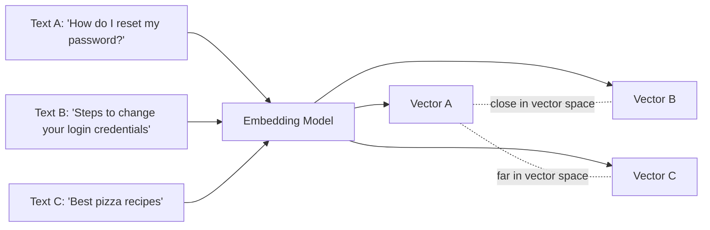

# Embeddings

> The bridge between raw text and mathematical similarity search.

## Overview

An embedding is a fixed-length numeric vector representation of text (or
other modalities) such that semantically similar inputs produce vectors that
are close together in that vector space. Embeddings are what make similarity
search possible: instead of exact keyword matching, retrieval becomes a
nearest-neighbor search in vector space.

## Learning Objectives

- Explain what an embedding model actually produces and why distance in
  vector space corresponds to semantic similarity
- Compare common similarity metrics (cosine, dot product, Euclidean)
- Understand the tradeoffs between embedding dimensionality, model choice,
  and retrieval quality/cost
- Know the difference between symmetric and asymmetric embedding tasks

## Key Concepts

| Term | Definition |
|---|---|
| Embedding vector | A fixed-length array of floats representing the semantic content of a text |
| Cosine similarity | A metric measuring the angle between two vectors — common similarity metric for embeddings |
| Dimensionality | The length of the embedding vector — higher isn't always better (cost/latency tradeoffs) |
| Symmetric vs. asymmetric search | Whether queries and documents are of similar form (symmetric, e.g. Q&A pairs) or different form (asymmetric, e.g. short query vs. long document) |
| Embedding drift | Degradation in retrieval quality when the corpus's domain shifts away from what the embedding model was trained/tuned on |

## Architecture



## Workflow

1. **Choose an embedding model** appropriate to the domain and language(s)
   involved — general-purpose models work broadly; domain-specific models
   (legal, code, biomedical) can outperform on specialized corpora.
2. **Decide symmetric vs. asymmetric** usage: for short-query/long-document
   retrieval, use a model/mode designed for asymmetric search (often models
   expose separate "query" and "document" encoding modes).
3. **Embed all chunks** once at ingestion time; store vectors alongside
   metadata in a [vector database](vector-databases.md).
4. **Embed the query** at request time using the same model (mixing
   embedding models between index-time and query-time silently breaks
   retrieval).
5. **Compute similarity** (commonly cosine similarity) between the query
   vector and stored vectors; return top-k nearest.
6. **Re-embed** the corpus if you ever change embedding models — vectors
   from different models are not comparable.

## Example

```python
# Illustrative embedding + similarity search
def embed(model, text):
    return model.encode(text)  # returns a fixed-length vector

def cosine_similarity(a, b):
    import math
    dot = sum(x * y for x, y in zip(a, b))
    norm_a = math.sqrt(sum(x * x for x in a))
    norm_b = math.sqrt(sum(y * y for y in b))
    return dot / (norm_a * norm_b)

def top_k(query_vec, doc_vecs, k=5):
    scored = [(cosine_similarity(query_vec, v), i) for i, v in enumerate(doc_vecs)]
    return sorted(scored, reverse=True)[:k]
```

## Advantages / Disadvantages

| Advantages | Disadvantages |
|---|---|
| Captures semantic similarity beyond exact keyword overlap | Struggles with exact-match needs (IDs, codes, rare proper nouns) without hybrid search |
| Works across paraphrases and different phrasings | Embedding models can carry domain bias — poor fit for out-of-domain corpora |
| Dense vectors enable fast approximate nearest-neighbor search at scale | Re-embedding a whole corpus is required whenever the model changes |
| Composable with metadata filtering | Vector similarity ≠ factual correctness — a "similar" chunk can still be wrong context |

## When to Use

- Any RAG or memory-retrieval system relying on semantic similarity
- Deduplication, clustering, or semantic search across large corpora
- Recommendation-style "find things like this" queries

## When NOT to Use

- Exact-match retrieval needs (looking up a specific ID, SKU, or code) — use
  keyword/structured lookup or hybrid search instead
- Extremely small corpora where a simple keyword search already performs well

## Common Mistakes

- **Mistake:** Mixing embeddings from two different models in one index.
  **Fix:** Always re-embed the entire corpus when switching embedding models.
- **Mistake:** Using a general-purpose embedding model on a highly
  specialized domain (legal, medical, code) without evaluating fit. **Fix:**
  Benchmark domain-specific embedding models against the general-purpose
  default before committing.
- **Mistake:** Relying purely on embedding similarity for retrieval quality
  and skipping empirical evaluation. **Fix:** Evaluate retrieval with real
  queries and labeled relevant chunks — see [`15-evaluation/`](../15-evaluation/README.md).

## Comparison

| Similarity metric | Best for | Notes |
|---|---|---|
| Cosine similarity | Most general-purpose embedding search | Ignores magnitude, only direction |
| Dot product | Models trained with dot-product objective | Sensitive to vector magnitude |
| Euclidean distance | Some clustering algorithms | Less common for text embeddings |

## Related Topics

- [Chunking](chunking.md) — what gets embedded
- [Vector Databases](vector-databases.md) — where embeddings are stored and searched
- [Retrieval Strategies](retrieval-strategies.md) — combining embeddings with other search signals

## Research Papers

- **Sentence-BERT: Sentence Embeddings using Siamese BERT-Networks** — Reimers & Gurevych, 2019. [arXiv:1908.10084](https://arxiv.org/abs/1908.10084)
- **Text and Code Embeddings by Contrastive Pre-Training** — Neelakantan et al., 2022. [arXiv:2201.10005](https://arxiv.org/abs/2201.10005)

## Further Reading

- [`10-rag/README.md`](README.md) — category overview
