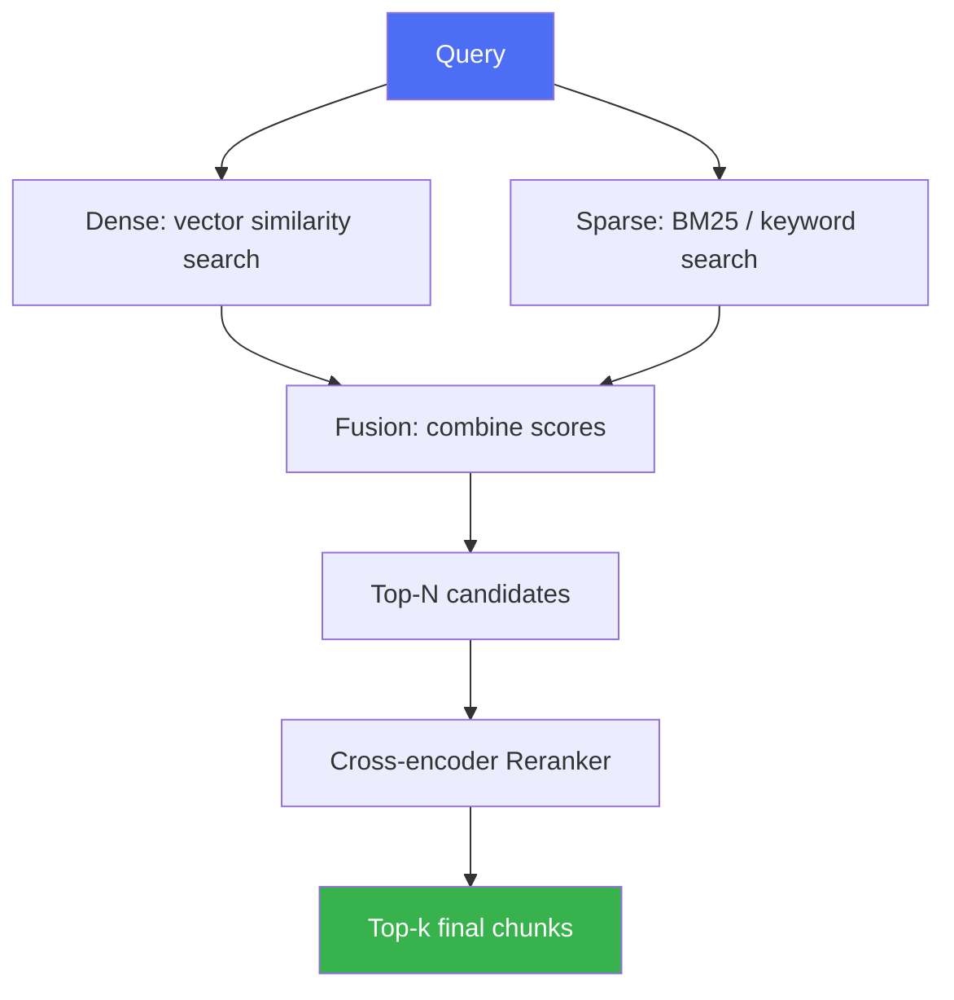

# Retrieval Strategies

> Dense search alone isn't always enough — combining signals usually beats any single method.

## Overview

Once documents are chunked and embedded, the retrieval strategy determines
*how* candidates are found and ranked for a given query. This page covers
dense (vector) search, sparse (keyword) search, hybrid combinations, and
reranking — the layer between "we have an index" and "we return the best
possible chunks for this query."

## Learning Objectives

- Compare dense, sparse, and hybrid retrieval
- Explain what reranking adds and why it's usually a second stage, not a
  replacement for first-stage retrieval
- Know when exact-match/keyword signals matter more than semantic similarity

## Key Concepts

| Term | Definition |
|---|---|
| Dense retrieval | Similarity search over embeddings (see [Embeddings](embeddings.md)) |
| Sparse retrieval | Keyword-based search (e.g. BM25) using term frequency statistics, no embeddings |
| Hybrid search | Combining dense and sparse retrieval scores (e.g. weighted sum or reciprocal rank fusion) |
| Reranking | A second-stage model that re-scores a first-stage candidate set more precisely (often cross-encoder based) |
| Recall vs. precision (retrieval) | Recall = did we find the relevant chunks at all; precision = are the top-ranked chunks actually the best ones |

## Architecture



## Hybrid Search

Dense retrieval excels at semantic paraphrase matching but can miss exact
terms (product codes, names, acronyms) that a keyword search catches
trivially. Hybrid search runs both and fuses the results — commonly via
**Reciprocal Rank Fusion (RRF)**, which combines rankings without needing to
normalize incompatible score scales.

```python
# Illustrative Reciprocal Rank Fusion
def reciprocal_rank_fusion(rankings, k=60):
    scores = {}
    for ranking in rankings:  # list of ranked doc-id lists
        for rank, doc_id in enumerate(ranking):
            scores[doc_id] = scores.get(doc_id, 0) + 1 / (k + rank + 1)
    return sorted(scores.items(), key=lambda x: -x[1])
```

## Reranking

First-stage retrieval (dense/sparse/hybrid) is optimized for speed over
large corpora, which limits how precise it can be. Reranking runs a slower
but more accurate model (typically a cross-encoder that jointly encodes the
query and each candidate) over a small candidate set (e.g. top 50) to
reorder them more precisely into the final top-k.

## Workflow

1. Run first-stage retrieval: dense, sparse, or both.
2. If hybrid, fuse rankings (e.g. RRF) into a single candidate list.
3. Take the top-N candidates (commonly 20-100).
4. Run a reranker over these candidates for a precision boost.
5. Return the final top-k (commonly 3-10) to the generation step.

## Advantages / Disadvantages

| Strategy | Advantages | Disadvantages |
|---|---|---|
| Dense only | Good semantic recall, simple pipeline | Misses exact-match terms; can be fooled by superficial similarity |
| Sparse only | Excellent for exact terms/codes/names, fast, interpretable | Misses paraphrases and semantic similarity |
| Hybrid | Best of both — strong recall across match types | More moving parts, fusion tuning required |
| + Reranking | Meaningful precision boost on the final top-k | Added latency/cost — an extra model call per query |

## When to Use

- **Hybrid search:** almost always a good default for production RAG,
  especially with mixed content (prose + codes/IDs/names)
- **Reranking:** when retrieval precision materially affects answer quality
  and latency budget allows an extra step (customer-facing Q&A, legal/medical
  domains)

## When NOT to Use

- Skip reranking for latency-critical paths where first-stage retrieval
  quality is already sufficient (measure this — don't assume)
- Skip sparse/hybrid if the corpus has no exact-match terms at all and dense
  search already performs well in evaluation

## Common Mistakes

- **Mistake:** Assuming dense search alone is sufficient without checking
  for exact-match failure cases (product SKUs, names). **Fix:** Test queries
  containing exact terms specifically; add sparse/hybrid if they fail.
- **Mistake:** Skipping reranking evaluation and assuming it always helps.
  **Fix:** A/B test reranking against first-stage-only retrieval on your
  actual corpus and queries — see [`15-evaluation/`](../15-evaluation/README.md).
- **Mistake:** Naively normalizing and summing dense/sparse scores with
  incompatible scales. **Fix:** Use rank-based fusion (RRF) instead of raw
  score summation when scales differ.

## Comparison

| Approach | Best for | Cost | Complexity |
|---|---|---|---|
| Dense only | Semantic/paraphrase-heavy queries | Low | Low |
| Sparse only | Exact-match heavy queries, quick baseline | Lowest | Lowest |
| Hybrid | Mixed corpora, production default | Medium | Medium |
| Hybrid + Rerank | High-stakes, precision-critical retrieval | Medium-high | Medium-high |

## Related Topics

- [Embeddings](embeddings.md) — the dense retrieval substrate
- [Advanced RAG](advanced-rag.md) — GraphRAG, CRAG, Self-RAG build on retrieval strategies
- [Vector Databases](vector-databases.md) — where dense retrieval is executed at scale

## Research Papers

- **Okapi BM25 (foundational sparse retrieval formula)** — Robertson & Zaragoza, 2009 (survey). Widely documented; original derivations from 1990s TREC work.
- **Passage Re-ranking with BERT** — Nogueira & Cho, 2019. [arXiv:1901.04085](https://arxiv.org/abs/1901.04085)

## Further Reading

- [`10-rag/README.md`](README.md) — category overview
