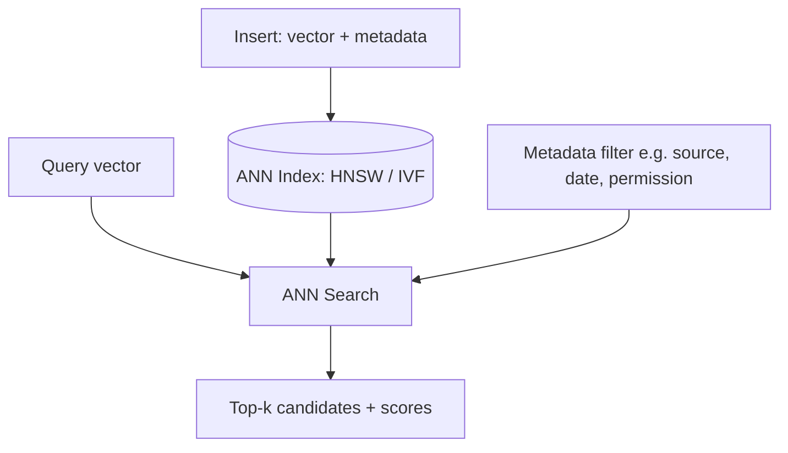

# Vector Databases

> Where embeddings actually live, and where "search" turns into "search fast, at scale."

## Overview

A vector database (or vector index) stores embeddings alongside metadata and
supports efficient approximate nearest-neighbor (ANN) search over them. At
small scale, brute-force similarity search over an in-memory list works
fine; at production scale (millions+ of vectors), specialized indexing
structures become necessary for acceptable latency.

## Learning Objectives

- Explain why exact nearest-neighbor search doesn't scale, and what ANN
  trades off to fix that
- Compare common indexing approaches (flat, IVF, HNSW) at a conceptual level
- Know what metadata filtering adds to vector search
- Choose between a dedicated vector DB, a vector-search extension to an
  existing DB, and an in-memory library based on scale and constraints

## Key Concepts

| Term | Definition |
|---|---|
| ANN (Approximate Nearest Neighbor) | Search that trades a small amount of accuracy for large speed gains at scale |
| Index | A data structure organizing vectors for fast search (e.g. HNSW graph, IVF clusters) |
| HNSW | Hierarchical Navigable Small World graphs — a common high-recall, fast ANN index type |
| IVF (Inverted File Index) | Clusters vectors into buckets, searches only the most relevant buckets |
| Metadata filtering | Restricting search to vectors matching non-vector conditions (e.g. `source = "policy_docs"`, `date > X`) |
| Recall@k | The fraction of true top-k nearest neighbors an ANN index actually returns |

## Architecture



## Workflow

1. **Choose a storage option** based on scale and existing infrastructure:
   dedicated vector database, a vector extension on an existing relational/
   document database, or an in-memory library for small/prototype scale.
2. **Design the schema**: vector + metadata fields needed for filtering
   (source, permissions/access control, timestamps, document type).
3. **Choose an index type** — HNSW is a common high-recall default; IVF-based
   indexes can be more memory-efficient at very large scale with a small
   recall tradeoff.
4. **Insert embeddings** at ingestion time, tagged with metadata.
5. **Query** with the embedded query vector, applying metadata filters
   *before or during* the ANN search (not just after, which wastes the top-k
   budget on filtered-out results).
6. **Tune recall vs. latency** — most ANN indexes expose parameters trading
   search accuracy for speed (e.g. `ef_search` in HNSW); tune against your
   actual latency budget and evaluation set.

## Example

```python
# Illustrative interface shape (not tied to a specific vendor)
class VectorIndex:
    def upsert(self, id: str, vector: list[float], metadata: dict):
        ...

    def query(self, vector: list[float], k: int = 5, filter: dict | None = None):
        # filter applied at the index level, not as a post-filter, when possible
        ...
```

## Advantages / Disadvantages

| Advantages | Disadvantages |
|---|---|
| Enables fast similarity search over millions+ of vectors | Adds an infrastructure component to operate/scale/monitor |
| Metadata filtering enables access control and scoping | ANN indexes trade some recall for speed — never 100% exact |
| Purpose-built indexes (HNSW, IVF) scale far better than brute force | Index rebuild/maintenance cost when embeddings model changes |
| Many options integrate directly with RAG frameworks | Choosing wrong index parameters can silently hurt recall |

## When to Use

- Any RAG or memory system beyond prototype scale (roughly, once brute-force
  linear scan latency becomes noticeable)
- Multi-tenant systems needing metadata-based access control on retrieval
- Systems requiring frequent updates/inserts to the index (not just static)

## When NOT to Use

- Small corpora (thousands of chunks) — brute-force cosine similarity in
  memory is simpler and fast enough; don't add infrastructure prematurely
- When your primary need is exact-match lookup — a regular indexed database
  query is simpler and more precise than vector search

## Common Mistakes

- **Mistake:** Applying metadata filters only *after* retrieving top-k
  results, so the top-k budget gets wasted on chunks that get filtered out
  anyway. **Fix:** Use pre-filtering or filtered-search capabilities that
  apply constraints during the ANN search itself.
- **Mistake:** Never re-evaluating recall after tuning for latency. **Fix:**
  Periodically measure recall@k against a held-out labeled set — see
  [`15-evaluation/`](../15-evaluation/README.md).
- **Mistake:** Choosing a vector database based on hype rather than your
  actual scale, latency, and existing-infrastructure constraints. **Fix:**
  Benchmark 2-3 options against your real corpus size and query patterns
  before committing.

## Comparison

| Option | Best for | Cost | Complexity |
|---|---|---|---|
| In-memory / brute-force library | Prototypes, small corpora | Lowest | Lowest |
| Vector extension on existing DB | Teams wanting to avoid a new system, moderate scale | Low-medium | Low-medium |
| Dedicated vector database | Large scale, high query volume, advanced filtering needs | Medium-high | Medium-high |

## Related Topics

- [Embeddings](embeddings.md) — what's being stored and searched
- [Retrieval Strategies](retrieval-strategies.md) — how search results are combined/reranked
- [Deployment](../16-deployment/README.md) — operating this infrastructure in production

## Research Papers

- **Efficient and Robust Approximate Nearest Neighbor Search Using Hierarchical Navigable Small World Graphs** — Malkov & Yashunin, 2018. [arXiv:1603.09320](https://arxiv.org/abs/1603.09320)

## Further Reading

- [`10-rag/README.md`](README.md) — category overview
