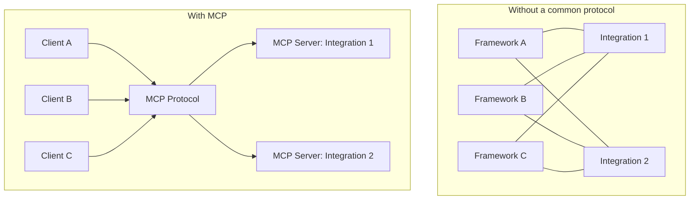
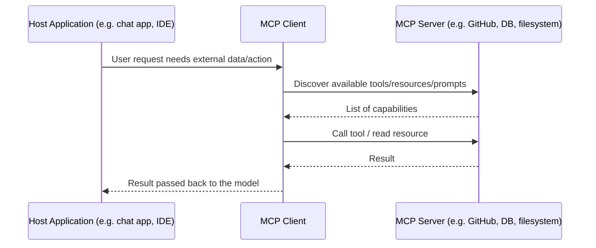

# 11 · Model Context Protocol (MCP)

## Overview

The Model Context Protocol (MCP) is an open standard for connecting AI
applications to external tools, data sources, and systems through a common
client-server interface. Rather than every agent framework and every
integration inventing its own bespoke tool-calling glue, MCP defines a
standard protocol so a **server** exposing tools/data (e.g. a GitHub
integration, a database connector) can be used by **any** MCP-compatible
**client** (a chat app, an IDE, an agent framework) without custom
integration work per pairing.

## Learning Objectives

- Explain the client-server architecture of MCP and why it decouples
  integrations from agent applications
- Understand MCP's three core primitives: tools, resources, and prompts
- Know how MCP handles authentication and transport
- Be able to reason about when to build an MCP server vs. a bespoke
  integration

## Pages in this category

| Page | Description | Status |
|---|---|---|
| [`protocol.md`](protocol.md) | Protocol fundamentals and message flow | 🟢 |
| [`servers.md`](servers.md) | Building and hosting MCP servers | 🟢 |
| [`clients.md`](clients.md) | How MCP clients discover and use servers | 🟢 |
| [`primitives.md`](primitives.md) | Tools, Resources, and Prompts in depth | 🟢 |
| [`security-and-transport.md`](security-and-transport.md) | Authentication, permissions, transport options | 🟢 |

## Why MCP Exists

Before a common protocol, every pairing of (agent framework) × (external
system) needed custom glue code: N frameworks × M integrations = N×M
integration efforts. MCP turns this into an N+M problem: a system builds one
MCP server, and every MCP-compatible client can use it immediately.

## Architecture at a Glance

## Key Concepts

| Term | Definition |
|---|---|
| Host | The application embedding an LLM that needs external context/actions (e.g. a chat app) |
| Client | The component within the host that speaks MCP to one or more servers |
| Server | A process exposing tools, resources, and/or prompts over MCP |
| Tool | An action the server exposes that the model can invoke (function-calling style) |
| Resource | Read-only data the server exposes that can be attached as context |
| Prompt | A reusable, parameterized prompt template the server exposes |
| Transport | The underlying communication channel (e.g. stdio for local processes, HTTP/SSE for remote servers) |

## Advantages / Disadvantages

| Advantages | Disadvantages |
|---|---|
| Decouples integrations from any specific agent framework | Adds a protocol layer/spec to learn vs. ad-hoc function calling |
| One server works across many compatible clients | Still-evolving ecosystem — spec and tooling maturity vary by transport/feature |
| Standardizes discovery (tools/resources/prompts are enumerable) | Requires running/hosting servers (local process or remote service) |
| Clear separation of concerns: servers own domain logic, clients own orchestration | Security model requires careful implementation — a poorly secured server is a real risk (see [`security-and-transport.md`](security-and-transport.md)) |

## When to Use

- Building a reusable integration meant to work across multiple agent
  applications, not just one bespoke agent
- Standardizing how your organization connects internal systems (databases,
  ticketing, internal APIs) to multiple AI tools
- Wanting clear separation between "what a tool can do" (server) and "how an
  agent orchestrates tools" (client/host)

## When NOT to Use

- A single, throwaway internal tool call used by exactly one agent — plain
  function calling (see [`02-tool-use/`](../02-tool-use/README.md)) may be
  simpler
- When your host application's ecosystem doesn't yet support MCP and adding
  it isn't justified by reuse needs

## Common Mistakes

- **Mistake:** Treating MCP tools as inherently safe to call without
  permission checks. **Fix:** Apply least-privilege and human-approval
  patterns from [`07-safety-alignment/`](../07-safety-alignment/README.md)
  regardless of protocol.
- **Mistake:** Conflating Resources (read-only context) with Tools (actions)
  when designing a server. **Fix:** See [`primitives.md`](primitives.md) for
  the distinction and when to use each.
- **Mistake:** Assuming one transport (e.g. stdio) fits all deployment needs.
  **Fix:** Choose transport based on whether the server is local or remote —
  see [`security-and-transport.md`](security-and-transport.md).

## Related Categories

- [`02-tool-use/`](../02-tool-use/README.md) — the general tool-use concepts MCP standardizes
- [`07-safety-alignment/`](../07-safety-alignment/README.md) — permissions and approval for MCP tool calls
- [`09-integrations/`](../09-integrations/README.md) — broader integration patterns beyond MCP

## Research Papers

MCP is an engineering specification rather than an academic paper-driven
technique; see [`protocol.md`](protocol.md) for links to the official
specification.

## Further Reading

- [`09-integrations/README.md`](../09-integrations/README.md) — broader integration patterns
- [`glossary/README.md`](../glossary/README.md) — MCP-related terms
