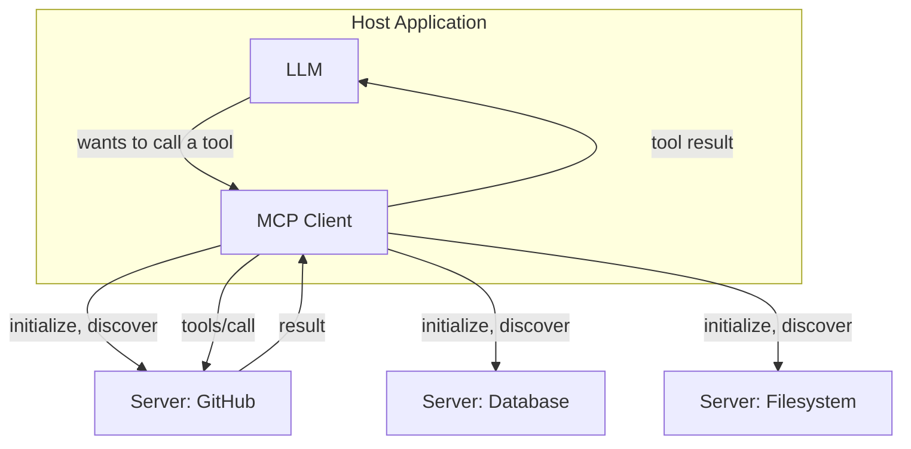

# MCP Clients

> The orchestrator: discovers what servers can do, decides when to call them, and feeds results back to the model.

## Overview

An MCP client lives inside a **host application** (a chat app, an IDE, an
agent framework) and manages the connection(s) to one or more MCP servers:
performing the handshake, discovering capabilities, translating model
tool-call intents into protocol calls, and returning results in a form the
model can use.

## Learning Objectives

- Understand the client's responsibilities distinct from the host
  application's
- Know how a client exposes discovered tools to the underlying model
- Understand multi-server orchestration (one client, many servers)

## Key Concepts

| Term | Definition |
|---|---|
| Host application | The overall product embedding an LLM (e.g. a chat UI, IDE) |
| Client | The component within the host that speaks MCP to servers |
| Tool exposure | Translating a server's declared tools into the format the model's function-calling interface expects |
| Multi-server orchestration | A single client connected to multiple servers, merging their capabilities for the model |

## Architecture



## Workflow

1. **Connect** to one or more configured servers and complete the
   initialization handshake with each.
2. **Discover** each server's tools/resources/prompts.
3. **Merge and expose** the combined capability set to the underlying model
   in whatever tool-calling format the model expects (translating MCP tool
   schemas into that format).
4. **Route** a model-requested tool call to the correct server.
5. **Handle results/errors**, translating them back into a form the model
   can use to continue its reasoning.
6. **Manage session lifecycle**: reconnect on failure, handle servers whose
   tool list changes mid-session (via notifications), and clean up
   connections when the host application closes.

## Example

```python
# Illustrative client-side orchestration (pseudocode)
class MCPClient:
    def __init__(self, servers: list[ServerConnection]):
        self.servers = servers
        self.tool_index = {}  # tool_name -> server

    def discover_all(self):
        for server in self.servers:
            for tool in server.list_tools():
                self.tool_index[tool["name"]] = server

    def call_tool(self, name, arguments):
        server = self.tool_index.get(name)
        if not server:
            raise ToolNotFoundError(name)
        return server.call_tool(name, arguments)
```

## Advantages / Disadvantages

| Advantages | Disadvantages |
|---|---|
| One client can aggregate many servers into a unified tool set for the model | Naming collisions between servers' tools need a resolution strategy |
| Decouples "how the model calls tools" from "how a specific server implements them" | Client must handle partial failures gracefully (one server down shouldn't break all tool use) |
| Enables dynamic tool availability (servers can be added/removed at runtime) | More servers = more surface area for permission/security review |

## When to Use

- Building any agent host application that needs to connect to more than one
  external system in a standard way
- Building a reusable agent framework meant to work with arbitrary
  MCP servers a user configures

## When NOT to Use

- A minimal single-tool integration where the overhead of full client
  orchestration isn't justified — direct function calling may suffice (see
  [`02-tool-use/`](../02-tool-use/README.md))

## Common Mistakes

- **Mistake:** No handling for tool name collisions across multiple
  connected servers. **Fix:** Namespace tool names by server (e.g.
  `github.search_issues` vs. `jira.search_issues`) when merging.
- **Mistake:** One server's failure/timeout blocking the entire tool-call
  pipeline. **Fix:** Isolate failures per-server with timeouts and
  fallbacks.
- **Mistake:** Exposing every discovered tool to the model regardless of the
  current task or user permissions. **Fix:** Filter the exposed tool set
  based on context and the user's actual permissions (see
  [`07-safety-alignment/README.md#permissions`](../07-safety-alignment/README.md#permissions)).

## Related Topics

- [Protocol Fundamentals](protocol.md) — the message layer clients implement
- [Servers](servers.md) — what the client is connecting to
- [Security & Transport](security-and-transport.md) — auth considerations for client-server connections

## Research Papers

MCP is a protocol specification; see the official specification for
authoritative client implementation guidance.

## Further Reading

- [`11-mcp/README.md`](README.md) — category overview
