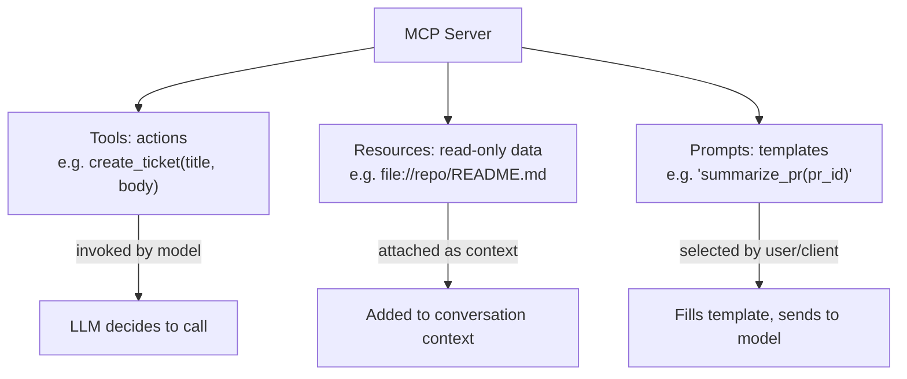

# MCP Primitives: Tools, Resources, and Prompts

> Three distinct kinds of things a server can expose — knowing which to use for what matters.

## Overview

MCP defines three core primitives a server can expose: **Tools** (actions
the model can invoke), **Resources** (read-only data that can be attached as
context), and **Prompts** (reusable, parameterized prompt templates).
Conflating these — e.g. exposing a data lookup as a "tool" when it should be
a "resource" — leads to confusing, harder-to-reason-about integrations.

## Learning Objectives

- Distinguish tools, resources, and prompts by their intent, not just
  mechanics
- Choose the right primitive when designing a new server capability
- Understand how each primitive is discovered and invoked

## Key Concepts

| Term | Definition |
|---|---|
| Tool | An action with side effects or computation the model explicitly decides to invoke, with arguments |
| Resource | Read-only content (a file, a record, a document) that can be listed, read, and attached as context |
| Prompt | A reusable, parameterized prompt template exposed by the server for consistent task framing |
| Annotation | Metadata a server can attach to a tool/resource (e.g. marking a tool as read-only or destructive) |

## Comparison Table

| | Tools | Resources | Prompts |
|---|---|---|---|
| **Intent** | "Do something" | "Here's some data" | "Use this template" |
| **Invoked by** | Model decision (function-calling style) | Client/user selection, or model request | Client/user selection |
| **Has side effects?** | Often yes (can be) | No — read-only by design | No |
| **Discovery method** | `tools/list` | `resources/list` | `prompts/list` |
| **Typical example** | "Create a ticket," "send an email," "run a query" | "The current open PRs," "a specific file's contents" | "Summarize this PR for release notes" |

## Architecture



## Workflow

1. **Classify** each capability you want to expose: does it *do* something
   (tool), *provide* something read-only (resource), or *template* a common
   request (prompt)?
2. **For Tools**: define a precise input schema, document side effects, and
   annotate whether it's read-only, idempotent, or destructive — this
   informs downstream permission/approval logic (see
   [`07-safety-alignment/README.md#human-approval`](../07-safety-alignment/README.md#human-approval)).
3. **For Resources**: expose a URI scheme and support listing + reading;
   keep them strictly read-only — if an action has side effects, it belongs
   under Tools instead.
4. **For Prompts**: parameterize common request patterns your server's
   domain benefits from, so users/clients get consistent, well-crafted
   framing without re-inventing prompts per use.

## Example

```json
// A Tool — has a side effect
{"name": "create_ticket", "description": "Create a new support ticket",
 "inputSchema": {"type": "object", "properties": {"title": {"type": "string"}, "body": {"type": "string"}}}}

// A Resource — read-only
{"uri": "ticket://12345", "name": "Ticket #12345", "mimeType": "text/plain"}

// A Prompt — a reusable template
{"name": "summarize_ticket_thread", "description": "Summarize a ticket's full comment thread",
 "arguments": [{"name": "ticket_id", "required": true}]}
```

## Advantages / Disadvantages

| Advantages | Disadvantages |
|---|---|
| Clear separation makes server design and client handling much simpler | Requires upfront design discipline to classify correctly |
| Read-only Resources are inherently lower-risk than Tools, simplifying security review | Some capabilities are genuinely ambiguous (e.g. a "search" that also logs the query) — needs a judgment call |
| Prompts standardize good task framing across users of the same server | An extra primitive to design/maintain vs. dumping everything into Tools |

## When to Use

- Use **Tools** for anything with a side effect or that requires the model
  to supply parameters to compute/fetch something specific
- Use **Resources** for static or slowly-changing read-only content useful
  as context
- Use **Prompts** to encode expert-crafted request templates for common
  tasks in your domain

## When NOT to Use

- Don't model pure data lookups as Tools if they have no meaningful
  parameters and no side effects — a Resource is simpler and clearly
  communicates "read-only" to any downstream permission logic
- Don't over-template every possible request as a Prompt — reserve Prompts
  for genuinely common, high-value request patterns

## Common Mistakes

- **Mistake:** Exposing a destructive action (e.g. `delete_record`) without
  annotating it as such. **Fix:** Annotate tools with their effect level
  (read-only / idempotent / destructive) so clients can apply appropriate
  caution (e.g. requiring human approval for destructive tools).
- **Mistake:** Modeling read-only data access as a Tool by default. **Fix:**
  Use Resources for anything genuinely read-only — it's a clearer contract.
- **Mistake:** Under-specifying a Tool's input schema (e.g. accepting a
  free-text string where structured fields would be safer/more reliable).
  **Fix:** Use precise, typed schemas wherever the underlying action supports
  it.

## Related Topics

- [Protocol Fundamentals](protocol.md) — how these primitives are discovered/invoked
- [Servers](servers.md) — implementing these primitives
- [Function Calling](../02-tool-use/README.md#function-calling) — the general concept Tools formalize
- [Human-in-the-Loop Approval](../07-safety-alignment/README.md#human-approval) — using effect annotations to decide when to require approval

## Research Papers

MCP is a protocol specification; see the official specification for the
authoritative primitive definitions.

## Further Reading

- [`11-mcp/README.md`](README.md) — category overview
