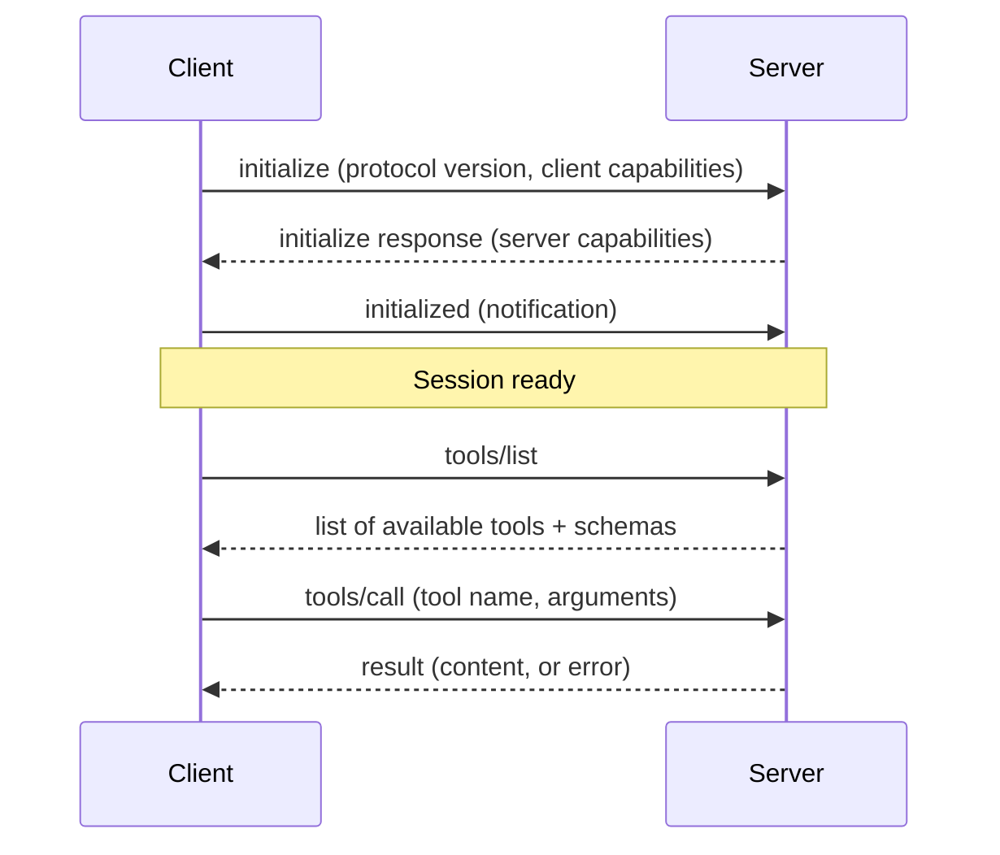

# MCP Protocol Fundamentals

> A common language for "what can this tool do, and how do I use it" — spoken over JSON-RPC.

## Overview

MCP defines a message protocol (built on JSON-RPC 2.0) for the interaction
between a client and a server: capability discovery, invocation, and
results. Understanding this base layer clarifies everything built on top of
it — servers, clients, and the tool/resource/prompt primitives.

## Learning Objectives

- Explain the request/response message shape MCP uses
- Understand the initialization/handshake sequence between client and server
- Know the lifecycle of a typical tool call from discovery to result

## Key Concepts

| Term | Definition |
|---|---|
| JSON-RPC 2.0 | The underlying remote-procedure-call message format MCP builds on |
| Initialization / handshake | The initial exchange where client and server agree on protocol version and capabilities |
| Capability negotiation | Client and server each declare what features they support (e.g. does the server support resources?) |
| Session | The lifetime of a connected client-server interaction |

## Architecture



## Workflow

1. **Initialize**: the client connects and sends an `initialize` request
   with its supported protocol version and capabilities; the server responds
   with its own capabilities (which primitives it supports: tools,
   resources, prompts).
2. **Discover**: the client lists available tools (`tools/list`), resources
   (`resources/list`), and/or prompts (`prompts/list`).
3. **Invoke**: the client calls a tool (`tools/call`) with arguments matching
   the tool's declared schema, or reads a resource (`resources/read`).
4. **Receive**: the server returns a structured result or a structured error.
5. **Repeat** as needed within the session; either side can send
   notifications (e.g. the server notifying the client that its tool list
   changed).

## Example

```json
// Client → Server: discover tools
{"jsonrpc": "2.0", "id": 1, "method": "tools/list"}

// Server → Client: response
{
  "jsonrpc": "2.0",
  "id": 1,
  "result": {
    "tools": [
      {
        "name": "search_issues",
        "description": "Search issues in a repository",
        "inputSchema": {
          "type": "object",
          "properties": {"query": {"type": "string"}},
          "required": ["query"]
        }
      }
    ]
  }
}

// Client → Server: call the tool
{
  "jsonrpc": "2.0",
  "id": 2,
  "method": "tools/call",
  "params": {"name": "search_issues", "arguments": {"query": "bug label:critical"}}
}
```

## Advantages / Disadvantages

| Advantages | Disadvantages |
|---|---|
| Standard, well-understood base (JSON-RPC) rather than a bespoke format | Requires implementing the handshake/lifecycle correctly, not just ad-hoc calls |
| Capability negotiation allows graceful evolution (not all servers support all primitives) | Debugging a protocol-level issue requires understanding this layer, not just tool logic |
| Consistent structure across every server, easing tooling (loggers, proxies, validators) | Adds a small amount of overhead vs. a single hardcoded function call |

## When to Use

- Any time you're building or integrating with an MCP server — this is the
  layer everything else sits on, so understanding it is not optional

## When NOT to Use

- N/A — if you're using MCP at all, this is the required foundation. If you
  decide MCP isn't the right fit for your use case at all, see
  [`02-tool-use/`](../02-tool-use/README.md) for a protocol-agnostic
  treatment of tool use.

## Common Mistakes

- **Mistake:** Skipping or mishandling the initialization handshake,
  assuming tools can be called immediately. **Fix:** Always complete
  `initialize` → `initialized` before any other request.
- **Mistake:** Ignoring capability negotiation and assuming every server
  supports every primitive (tools, resources, prompts). **Fix:** Check the
  server's declared capabilities before attempting to use a primitive.
- **Mistake:** Not handling structured errors distinctly from successful
  results. **Fix:** Implement explicit error handling per the JSON-RPC error
  object shape.

## Related Topics

- [Servers](servers.md) — implementing the server side of this protocol
- [Clients](clients.md) — implementing the client side
- [Primitives](primitives.md) — tools, resources, prompts in depth
- [Security & Transport](security-and-transport.md) — how messages are actually transported and secured

## Research Papers

MCP is a protocol specification, not an academic technique. Refer to the
official Model Context Protocol specification site for the authoritative,
versioned protocol details.

## Further Reading

- [`11-mcp/README.md`](README.md) — category overview
