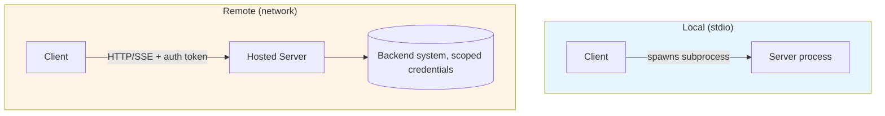

# MCP Security & Transport

> The plumbing choices and permission model that determine whether an MCP integration is safe to run.

## Overview

MCP servers can run locally (as a subprocess, communicating over stdio) or
remotely (as a hosted service, communicating over a network transport). Each
choice has different security implications: authentication, permission
scoping, and what a compromised or over-permissioned server can actually do.

## Learning Objectives

- Compare stdio and network-based (e.g. HTTP/SSE) transports
- Understand authentication options for remote MCP servers
- Apply least-privilege thinking to MCP server credentials and tool design
- Recognize the specific risks tool-calling introduces (as opposed to
  read-only chat)

## Key Concepts

| Term | Definition |
|---|---|
| stdio transport | Communication over standard input/output with a locally-spawned subprocess |
| Network transport | Communication over HTTP (often with Server-Sent Events or similar for streaming) to a remote server |
| Least privilege | Granting a server's underlying credentials only the minimum access its declared tools require |
| Confused deputy problem | When an agent, tricked by malicious input, misuses its own legitimate permissions on behalf of an attacker |
| Human-in-the-loop approval | Requiring explicit user confirmation before executing higher-risk tool calls |

## Architecture

## Transport Comparison

| | stdio (local) | Network (remote) |
|---|---|---|
| Typical use | Personal tools, filesystem/local dev access | Shared/production servers, multi-user |
| Auth needed | Usually relies on local process/OS permissions | Requires explicit auth (tokens, OAuth, API keys) |
| Attack surface | Limited to local machine | Broader — network-exposed, needs hardened auth |
| Latency | Very low | Depends on network/hosting |

## Workflow: Securing a Server

1. **Scope credentials to least privilege** — the server's underlying access
   (API keys, DB credentials) should cover exactly what its declared tools
   need, nothing more.
2. **Choose transport deliberately** — stdio for genuinely local/personal
   use; network transport with real authentication for anything shared or
   remote.
3. **Authenticate properly on network transports** — use established
   mechanisms (OAuth, signed tokens) rather than static shared secrets where
   possible.
4. **Annotate tool risk levels** (read-only / idempotent / destructive) so
   clients can apply human-in-the-loop approval to higher-risk calls.
5. **Validate all input server-side** — never trust that the model will only
   send well-formed, safe arguments.
6. **Log and monitor tool invocations** for auditability (see
   [`14-observability/`](../14-observability/README.md)).
7. **Consider the confused-deputy risk**: if a tool processes untrusted
   content (e.g. a webpage, an email) as part of its input, that content
   could contain instructions attempting to manipulate the agent into
   misusing its own permissions — treat all such content as untrusted data,
   not instructions.

## Advantages / Disadvantages

| Transport/Approach | Advantages | Disadvantages |
|---|---|---|
| stdio | Simple, low-latency, minimal attack surface for local-only use | Not viable for multi-user or remote scenarios |
| Network + strong auth | Enables shared, production-grade servers | Requires real security engineering investment |
| Least-privilege credential scoping | Limits blast radius if a server or its credentials are compromised | Requires upfront design work to define minimal scopes per tool |
| Human-in-the-loop approval | Strong safety net for destructive/high-risk actions | Adds friction/latency; not appropriate for every action |

## When to Use What

- **stdio**: local developer tools, filesystem access on the user's own
  machine, personal productivity integrations
- **Network transport + auth**: any server used by multiple users, hosted
  centrally, or accessed remotely
- **Human-in-the-loop approval**: destructive actions (deletions,
  irreversible sends, financial transactions), and anything operating on
  untrusted input

## Common Mistakes

- **Mistake:** Using a single set of broad, standing credentials for a
  server that exposes many tools, rather than scoping per tool/purpose.
  **Fix:** Apply least privilege — scope credentials to exactly what's
  needed.
- **Mistake:** Treating content fetched by a tool (e.g. a webpage, an email
  body) as trusted instructions rather than untrusted data. **Fix:**
  Explicitly separate "instructions from the user/system" from "data
  returned by a tool," and never let fetched content silently grant new
  permissions or override prior instructions — see
  [`07-safety-alignment/README.md#prompt-injection`](../07-safety-alignment/README.md#prompt-injection).
- **Mistake:** No human approval step for destructive or irreversible tools.
  **Fix:** Annotate and gate destructive tools behind explicit user
  confirmation.
- **Mistake:** Skipping input validation server-side because "the model
  wouldn't send that." **Fix:** Always validate — malicious or malformed
  input can and does occur.

## Related Topics

- [Servers](servers.md) — where these controls are implemented
- [Guardrails](../07-safety-alignment/README.md#guardrails) — broader safety mechanisms
- [Prompt Injection](../07-safety-alignment/README.md#prompt-injection) — the risk of untrusted tool-fetched content
- [Permissions & Least Privilege](../07-safety-alignment/README.md#permissions)
- [Human-in-the-Loop Approval](../07-safety-alignment/README.md#human-approval)

## Research Papers

MCP is a protocol specification; broader prompt-injection and agent-security
research is cataloged in [`papers/README.md`](../papers/README.md).

## Further Reading

- [`11-mcp/README.md`](README.md) — category overview
- [`07-safety-alignment/README.md`](../07-safety-alignment/README.md) — full safety category
