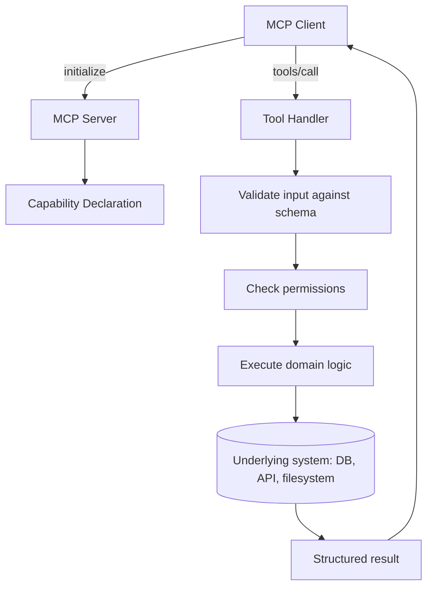

# MCP Servers

> The side that does the actual work: exposing tools, data, and prompts to any client that connects.

## Overview

An MCP server is a process that exposes some set of tools, resources, and/or
prompts over the protocol, so any compatible client can discover and use
them. A server typically wraps an existing system — a database, an internal
API, a filesystem, a SaaS product — behind a standard MCP interface.

## Learning Objectives

- Understand the responsibilities of an MCP server (declare capabilities,
  implement handlers, validate input, return structured results)
- Know the design considerations for exposing tools safely
- Understand how servers are hosted (local process vs. remote service)

## Key Concepts

| Term | Definition |
|---|---|
| Server capability declaration | The set of primitives (tools/resources/prompts) a server advertises during initialization |
| Handler | The server-side function executed when a specific tool is called or resource is read |
| Input schema | A JSON Schema describing a tool's expected arguments, used for both documentation and validation |
| Local server | Runs as a subprocess on the same machine as the client (stdio transport) |
| Remote server | Runs as a separately hosted service, reached over a network transport |

## Architecture



## Workflow

1. **Define capabilities**: decide what to expose as tools (actions), what
   as resources (read-only data), and what as prompts (reusable templates).
2. **Write schemas**: for each tool, define a precise input schema — this is
   both documentation for the client/model and a validation contract.
3. **Implement handlers**: the server-side logic executed per tool call —
   should validate input, check permissions, execute the underlying action,
   and return a structured result or error.
4. **Apply least-privilege**: scope what the server's underlying credentials
   can actually do to the minimum necessary (see
   [`security-and-transport.md`](security-and-transport.md)).
5. **Choose hosting**: local (stdio, run as a subprocess by the client) for
   personal/dev tools; remote (HTTP-based transport) for shared/production
   servers used by multiple clients or users.
6. **Test discovery and invocation** independently of any specific client to
   confirm the server behaves correctly against the protocol.

## Example

```python
# Illustrative server-side tool handler (pseudocode, not a specific SDK)
TOOLS = {
    "search_issues": {
        "description": "Search issues in a repository",
        "inputSchema": {
            "type": "object",
            "properties": {"query": {"type": "string"}},
            "required": ["query"],
        },
    }
}

def handle_tools_call(name, arguments, auth_context):
    if name == "search_issues":
        validate_schema(arguments, TOOLS[name]["inputSchema"])
        require_permission(auth_context, "issues:read")
        results = issue_tracker.search(arguments["query"])
        return {"content": [{"type": "text", "text": format_results(results)}]}
    raise ToolNotFoundError(name)
```

## Advantages / Disadvantages

| Advantages | Disadvantages |
|---|---|
| Write the integration once, usable by any MCP client | Server becomes a piece of infrastructure to run, monitor, and secure |
| Clear contract (schemas) makes tool behavior predictable for the model | Poorly scoped permissions on a server are a real security exposure |
| Can wrap legacy or internal systems without changing them | Handling errors, rate limits, and partial failures well takes real engineering effort |

## When to Use

- Wrapping any system multiple agents/clients need access to (databases,
  ticketing systems, internal APIs, filesystems)
- Standardizing internal tool access across an organization's AI applications

## When NOT to Use

- A single-use, throwaway tool needed by exactly one agent for a one-off task
  — plain function calling may be faster to stand up

## Common Mistakes

- **Mistake:** Granting the server's underlying credentials broad access
  "just in case," rather than the minimum needed for its declared tools.
  **Fix:** Apply least-privilege scoping — see
  [`security-and-transport.md`](security-and-transport.md) and
  [`07-safety-alignment/README.md#permissions`](../07-safety-alignment/README.md#permissions).
- **Mistake:** Loose or missing input validation, trusting the model to only
  ever send well-formed arguments. **Fix:** Always validate against the
  declared schema server-side — models can and do send malformed input.
- **Mistake:** Returning unstructured error strings instead of proper
  protocol-level errors. **Fix:** Use structured error responses so clients
  can handle failures programmatically.

## Comparison

| Hosting | Best for | Complexity |
|---|---|---|
| Local (stdio subprocess) | Personal/dev tools, filesystem access, single-user | Low |
| Remote (network transport) | Shared/production servers, multi-user, multi-client | Medium-high |

## Related Topics

- [Protocol Fundamentals](protocol.md) — the message layer servers implement
- [Clients](clients.md) — the consumer side of a server
- [Primitives](primitives.md) — designing good tools/resources/prompts
- [Security & Transport](security-and-transport.md) — auth and transport choices

## Research Papers

MCP is a protocol specification; see the official specification for
authoritative server implementation guidance.

## Further Reading

- [`11-mcp/README.md`](README.md) — category overview
