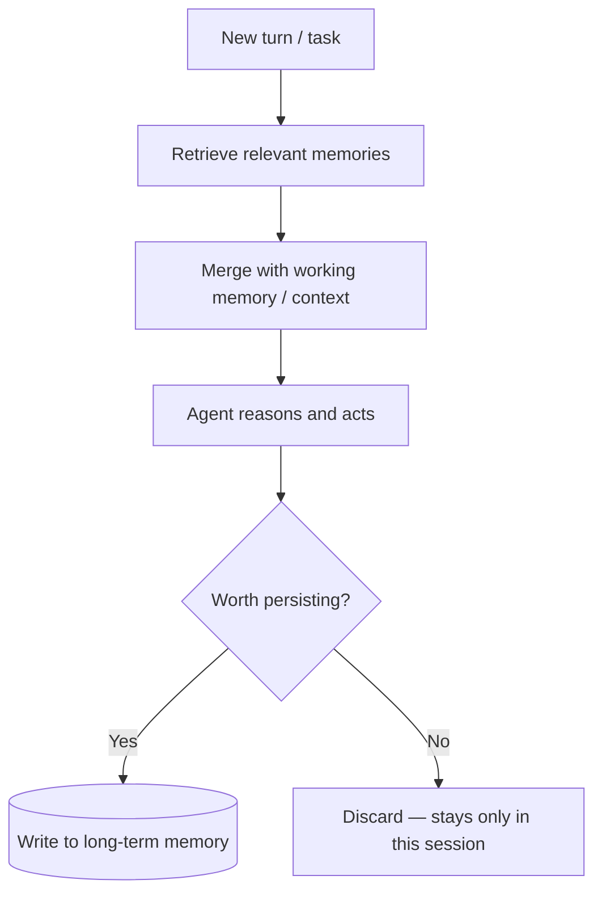

# 12 · Memory Systems (Applied)

## Overview

This category covers **production implementation** of agent memory —
building on the conceptual foundations in
[`01-core-cognitive/memory/README.md`](../01-core-cognitive/memory/README.md).
Where that page explains working vs. long-term, semantic vs. episodic
memory, and compression conceptually, this category focuses on how to
actually build and operate a memory system: storage choices, retrieval
integration, and write policies.

## Learning Objectives

- Choose appropriate storage for different memory types
- Integrate memory retrieval into an agent's reasoning loop
- Design write/retention policies that avoid both memory bloat and
  premature forgetting

## Storage Choices by Memory Type

| Memory type | Typical storage | Retrieval pattern |
|---|---|---|
| Working memory | In-context (prompt/scratchpad) | Always present, no retrieval needed |
| Semantic memory | Key-value store, structured DB, or vector store | Direct lookup by key/topic, or similarity search |
| Episodic memory | Timestamped event log, often vector-indexed by episode summary | Similarity search, often time-weighted |
| Compressed/summarized memory | Same stores as above, but storing summaries instead of raw data | Retrieved like semantic/episodic memory, denser per unit storage |

Much of the infrastructure overlaps directly with [RAG](../10-rag/README.md)
— [chunking](../10-rag/chunking.md), [embeddings](../10-rag/embeddings.md),
and [vector databases](../10-rag/vector-databases.md) apply equally to
memory retrieval as to document retrieval; memory retrieval is, structurally,
RAG over the agent's own history rather than over a static corpus.

## Integration Into the Agent Loop

## Write Policy Design

Not everything should be persisted — a good write policy filters for
salience:

- **Explicit signals**: the user states a preference or fact worth
  remembering ("I prefer metric units").
- **Decision points**: a meaningful decision was made that should inform
  future interactions.
- **Outcome signals**: something succeeded or failed in a way worth
  learning from (see [Reflexion](../13-agent-patterns/reflexion.md)).
- **Explicit skip**: routine, low-information turns generally shouldn't be
  persisted verbatim — summarize or discard.

## Retention and Compression Policy

Long-term memory needs an active retention policy, not just unbounded
accumulation:

| Policy | Description |
|---|---|
| Time-based decay | Older, unaccessed memories are compressed or archived |
| Salience-based retention | Higher-salience memories retained longer/in more detail |
| Access-frequency weighting | Frequently-retrieved memories kept more accessible/detailed |
| Periodic re-summarization | Old raw entries periodically compressed into denser summaries |

## Key Concepts

| Term | Definition |
|---|---|
| Write policy | Rules determining what gets persisted to long-term memory |
| Retention policy | Rules determining how long/in what detail memories are kept |
| Memory retrieval | Fetching relevant memories for the current context, structurally similar to RAG retrieval |

## Advantages / Disadvantages

| Advantages | Disadvantages |
|---|---|
| Enables true personalization and continuity across sessions | Requires real infrastructure investment (storage, retrieval, policies) |
| Reuses mature RAG techniques rather than needing bespoke solutions | Privacy/compliance considerations for storing user data must be addressed explicitly |
| Compression/retention policies keep long-term costs bounded | Poor retrieval relevance can inject irrelevant/stale "memories" into current reasoning |

## Common Mistakes

- **Mistake:** No retention/compression policy, letting memory storage grow
  unboundedly. **Fix:** Apply time-based or salience-based retention (see
  [Memory Compression](../01-core-cognitive/memory/README.md#memory-compression)).
- **Mistake:** Writing every conversational turn to long-term memory
  regardless of salience. **Fix:** Apply an explicit write policy filtering
  for what's actually worth persisting.
- **Mistake:** No privacy/consent consideration for persisted user data.
  **Fix:** Be explicit with users about what's remembered and provide a way
  to view/delete stored memories.

## Related Categories

- [`01-core-cognitive/memory/README.md`](../01-core-cognitive/memory/README.md) — conceptual foundations
- [`10-rag/`](../10-rag/README.md) — the retrieval infrastructure memory systems reuse
- [`13-agent-patterns/reflexion.md`](../13-agent-patterns/reflexion.md), [`13-agent-patterns/voyager.md`](../13-agent-patterns/voyager.md) — patterns that depend heavily on memory

## Research Papers

- **Generative Agents: Interactive Simulacra of Human Behavior** — Park et al., 2023. [arXiv:2304.03442](https://arxiv.org/abs/2304.03442)
- **MemGPT: Towards LLMs as Operating Systems** — Packer et al., 2023. [arXiv:2310.08560](https://arxiv.org/abs/2310.08560)

## Further Reading

- [`01-core-cognitive/memory/README.md`](../01-core-cognitive/memory/README.md) — start here for foundations before this page
