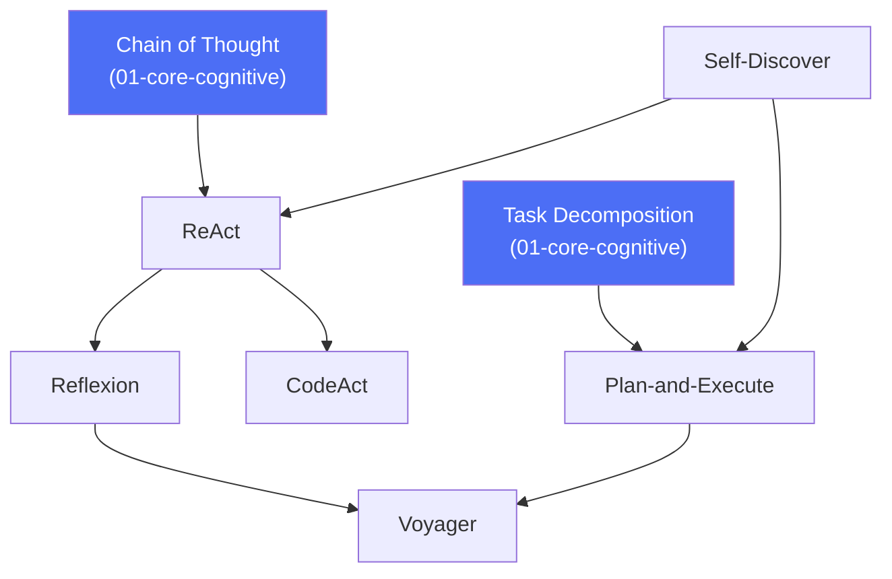

# 13 · Agent Patterns

## Overview

Agent patterns are named, well-studied architectures that combine the core
cognitive skills ([reasoning](../01-core-cognitive/README.md),
[planning](../01-core-cognitive/planning/README.md),
[memory](../01-core-cognitive/memory/README.md)) with
[tool use](../02-tool-use/README.md) into a concrete, repeatable agent loop.
Where Chapter 01 teaches the primitives, this category teaches the recipes —
ReAct, Reflexion, Plan-and-Execute, CodeAct, Voyager, and Self-Discover — each
solving a different structural problem in how an agent operates over time.

## Learning Objectives

- Explain the core loop of each pattern and what specific problem it solves
- Choose the right pattern (or combination) for a given task's structure
- Recognize when a pattern is being over- or under-applied

## Pages in this category

| Page | Description | Status |
|---|---|---|
| [`react.md`](react.md) | Interleaving reasoning and acting in a single loop | 🟢 |
| [`reflexion.md`](reflexion.md) | Self-reflection persisted across episodes via memory | 🟢 |
| [`plan-and-execute.md`](plan-and-execute.md) | Separating upfront planning from execution | 🟢 |
| [`codeact.md`](codeact.md) | Using executable code as the action representation | 🟢 |
| [`voyager.md`](voyager.md) | Open-ended, long-horizon skill-accumulating agents | 🟢 |
| [`self-discover.md`](self-discover.md) | Agents that compose their own reasoning structure per task | 🟢 |

## How the Patterns Relate

## Key Concepts

| Term | Definition |
|---|---|
| Agent loop | The repeated perceive → reason → act → observe cycle a pattern structures |
| Action representation | The form an agent's actions take — a tool call, a code snippet, a plan step |
| Episode | One complete attempt at a task, especially relevant to patterns with cross-episode memory (Reflexion, Voyager) |

## Advantages / Disadvantages

| Advantages | Disadvantages |
|---|---|
| Battle-tested structures — you don't need to invent an agent loop from scratch | Patterns can be mismatched to a task if chosen by habit rather than fit |
| Clear mental model for debugging ("which step of the loop failed?") | Some patterns (Voyager, CodeAct) require more infrastructure (sandboxed execution, skill libraries) |
| Composable — patterns often combine (e.g. Plan-and-Execute + Reflexion) | More moving parts than a single-shot prompt for simple tasks |

## Common Mistakes

- **Mistake:** Defaulting to ReAct for everything because it's the most
  well-known pattern. **Fix:** Match pattern to task shape — see the
  comparison table in each page and the "When to Use" sections.
- **Mistake:** Implementing CodeAct without a proper sandboxed execution
  environment. **Fix:** Never execute model-generated code without
  sandboxing — see [`codeact.md`](codeact.md) and
  [`07-safety-alignment/README.md`](../07-safety-alignment/README.md).
- **Mistake:** Building a Voyager-style long-horizon agent without a memory/
  skill-library system to back it. **Fix:** Review
  [`01-core-cognitive/memory/README.md`](../01-core-cognitive/memory/README.md)
  and [`12-memory/`](../12-memory/README.md) before attempting this pattern.

## Related Categories

- [`01-core-cognitive/`](../01-core-cognitive/README.md) — the reasoning/planning/memory primitives these patterns use
- [`02-tool-use/`](../02-tool-use/README.md) — the action layer these patterns act through
- [`06-multi-agent/`](../06-multi-agent/README.md) — patterns for coordinating multiple agents, often built from these single-agent patterns

## Research Papers

- **ReAct: Synergizing Reasoning and Acting in Language Models** — Yao et al., 2022. [arXiv:2210.03629](https://arxiv.org/abs/2210.03629)
- **Reflexion: Language Agents with Verbal Reinforcement Learning** — Shinn et al., 2023. [arXiv:2303.11366](https://arxiv.org/abs/2303.11366)
- **Voyager: An Open-Ended Embodied Agent with Large Language Models** — Wang et al., 2023. [arXiv:2305.16291](https://arxiv.org/abs/2305.16291)

## Further Reading

- [`papers/README.md`](../papers/README.md) — full curated bibliography
