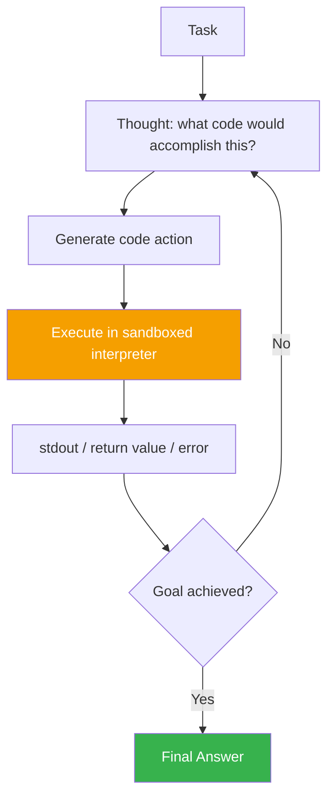

# CodeAct

> Why constrain actions to a fixed menu of tool calls when the model can just write code?

## Overview

CodeAct represents an agent's actions as executable code (typically Python)
rather than structured tool-call JSON. Instead of choosing from a fixed set
of predefined function signatures, the model writes arbitrary code that can
compose control flow (loops, conditionals), combine multiple tool calls in
one action, and process results programmatically — executed in a sandboxed
interpreter, with the output fed back as the observation.

## Learning Objectives

- Explain how CodeAct's action space differs from fixed tool-call schemas
- Understand why sandboxing is non-negotiable for this pattern
- Know when the expressiveness of code as actions is worth the added risk
  surface

## Key Concepts

| Term | Definition |
|---|---|
| Action space | The set of possible actions available at each step — for CodeAct, this is "any valid code," not a fixed menu |
| Sandbox | An isolated execution environment (container, restricted interpreter) preventing generated code from affecting the host system |
| Code action | A snippet of executable code the model generates as its action for a given step |
| Execution result | stdout/stderr/return value from running the code action, fed back as the observation |

## Architecture



## Workflow

1. **Expose available functions/tools as importable Python functions** (or
   equivalent) inside the sandbox, rather than as a fixed JSON tool-call
   schema.
2. **Generate a code action**: the model writes a snippet using these
   functions, standard library, loops, and conditionals as needed.
3. **Execute in a sandbox**: run the code in an isolated environment with no
   access to the host filesystem/network beyond explicitly permitted
   interfaces.
4. **Capture output**: stdout, return values, and errors become the
   observation fed back to the model.
5. **Repeat** in a [ReAct](react.md)-like loop until the goal is achieved.

## Example

```python
# Instead of a single fixed tool call like:
#   search(query="Tokyo weather") -> one result
#
# CodeAct lets the model compose logic directly:

results = []
for city in ["Tokyo", "Osaka", "Kyoto"]:
    weather = get_weather(city)
    if weather["temp_c"] > 20:
        results.append((city, weather["temp_c"]))

print(sorted(results, key=lambda x: -x[1]))
# Observation returned to the model: the sorted (city, temp) results
```

This single action combines a loop, a conditional, and multiple tool calls —
something a fixed one-tool-call-per-step schema would require several
separate reasoning/action/observation cycles to achieve.

## Advantages / Disadvantages

| Advantages | Disadvantages |
|---|---|
| Far more expressive — loops, conditionals, and data processing in a single action | Requires a properly sandboxed execution environment — non-negotiable |
| Fewer round-trips for tasks needing composition of multiple tool results | Debugging generated code failures can be harder than debugging a single fixed tool call |
| Familiar to the model — code is heavily represented in training data | Larger attack surface if sandboxing is weak (arbitrary code execution risk) |
| Can leverage existing libraries (data processing, math) directly | Not all environments have a safe, capable sandbox available |

## When to Use

- Data-processing-heavy tasks (filtering, transforming, aggregating tool
  results) where composing logic in one action saves many round-trips
- Environments where a proper sandboxed code execution service is already
  available
- Agents working extensively with structured/numeric data

## When NOT to Use

- Any environment without a real sandbox — never execute model-generated
  code directly on a host system or with unrestricted access
- Simple tasks where a single fixed tool call already suffices — added
  expressiveness isn't worth the complexity
- Highly regulated/audited environments where a fixed, enumerable action
  set is required for compliance review

## Common Mistakes

- **Mistake:** Executing model-generated code without sandboxing, "just to
  prototype quickly." **Fix:** Never skip sandboxing, even in prototypes —
  treat this as a hard requirement from day one. See
  [`07-safety-alignment/README.md`](../07-safety-alignment/README.md).
- **Mistake:** Giving the sandbox unrestricted network/filesystem access "to
  make tools work." **Fix:** Expose only explicitly permitted interfaces
  (specific functions), not general OS-level access.
- **Mistake:** No resource limits (CPU, memory, execution time) on the
  sandbox. **Fix:** Enforce hard limits to prevent runaway or malicious
  generated code from consuming excessive resources.

## Comparison

| Approach | Best for | Cost | Complexity |
|---|---|---|---|
| Fixed tool-call schema | Simple, auditable, enumerable actions | Low | Low |
| CodeAct | Data-processing-heavy, multi-tool composition tasks | Medium-high | High (sandboxing required) |
| [ReAct](react.md) (fixed tools) | General-purpose tool use without composition needs | Low-medium | Low |

## Related Topics

- [ReAct](react.md) — the loop structure CodeAct typically fits into
- [Python / Code Execution](../02-tool-use/README.md#code-execution) — the broader tool-use category
- [Guardrails](../07-safety-alignment/README.md#guardrails) — sandboxing and execution safety

## Research Papers

- **Executable Code Actions Elicit Better LLM Agents** — Wang et al., 2024. [arXiv:2402.01030](https://arxiv.org/abs/2402.01030)

## Further Reading

- [`13-agent-patterns/README.md`](README.md) — category overview
- [`07-safety-alignment/README.md`](../07-safety-alignment/README.md) — sandboxing and permission model
