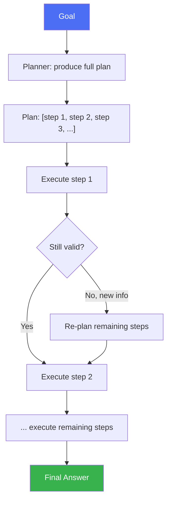

# Plan-and-Execute

> Decide the whole route before taking the first step — then drive it, adjusting only when reality disagrees with the map.

## Overview

Plan-and-Execute separates an agent's work into two distinct phases: a
**planning** phase that produces a full (or milestone-level) plan before any
action is taken, and an **execution** phase that carries out each step —
optionally re-planning if a step's outcome invalidates the rest of the plan.
This contrasts with [ReAct](react.md), which decides only the next single
step at a time.

## Learning Objectives

- Explain the two-phase structure and why separating planning from
  execution helps on tasks with many interdependent steps
- Know when to trigger re-planning mid-execution
- Compare Plan-and-Execute to purely reactive (ReAct) approaches

## Key Concepts

| Term | Definition |
|---|---|
| Planner | The component (often a distinct model call) that produces the full plan |
| Executor | The component that carries out each plan step, often using a ReAct-style loop per step |
| Re-planning trigger | A condition (step failure, new information) that causes the planner to revise the remaining plan |
| Plan step | One discrete, ideally independently-executable unit of the overall plan |

## Architecture



## Workflow

1. **Plan**: given the goal, generate an ordered plan — this leans on
   [task decomposition](../01-core-cognitive/planning/task-decomposition.md).
2. **Execute step 1**: carry out the first step, typically via a
   [ReAct](react.md)-style loop (reason, act, observe) scoped to just that
   step.
3. **Check validity**: after each step, check whether the remaining plan is
   still valid given what was learned.
4. **Re-plan if needed**: if a step's outcome invalidates assumptions behind
   later steps, regenerate the remaining plan (not from scratch — just the
   affected portion where possible).
5. **Continue** executing steps until the plan is complete.
6. **Synthesize** a final answer from the accumulated step outputs.

## Example

```text
Goal: "Plan a 3-day trip itinerary to Tokyo within a $1500 budget."

Plan:
1. Research flight costs to Tokyo
2. Research hotel options within remaining budget
3. Identify 3 days of activities
4. Compile into a day-by-day itinerary with running budget total

Execute step 1: flights cost $650 round trip.
Execute step 2: with $850 remaining, find hotels — 3 nights average $120/night = $360.
  Remaining budget for food/activities: $490.
Execute step 3 & 4: build itinerary within remaining $490.
```

```python
def plan_and_execute(model, tools, goal):
    plan = model.generate_plan(goal)  # e.g. ["step 1", "step 2", ...]
    results = []
    i = 0
    while i < len(plan):
        step_result = react_loop(model, tools, plan[i])
        results.append(step_result)
        if invalidates_remaining_plan(step_result, plan[i+1:]):
            plan = plan[:i+1] + model.replan(goal, results, plan[i+1:])
        i += 1
    return model.synthesize_final_answer(goal, results)
```

## Advantages / Disadvantages

| Advantages | Disadvantages |
|---|---|
| Efficient on tasks with a mostly-known, stable step sequence — avoids re-reasoning about the whole task at every step | A wrong upfront plan can waste effort if re-planning isn't triggered promptly |
| Plan is inspectable/auditable before any action is taken | Two-phase structure adds a distinct planning call/latency upfront |
| Scales better than pure ReAct on long, many-step tasks | Re-planning logic itself adds complexity to get right |
| Plan steps can potentially be parallelized or delegated (see [Manager-Worker](../06-multi-agent/README.md#manager-worker)) | Overkill for short tasks where planning overhead exceeds execution effort |

## When to Use

- Tasks with many steps where the overall structure is knowable in advance
  (research reports, multi-stage data pipelines, structured workflows)
- Tasks where inspecting/approving the plan before execution matters (e.g.
  human review of the plan before autonomous execution)
- Tasks whose steps can be parallelized or delegated across sub-agents/tools

## When NOT to Use

- Short tasks (1-3 steps) where the planning overhead isn't worth it — use
  [ReAct](react.md) directly
- Highly uncertain environments where any upfront plan is likely to be
  invalidated almost immediately — favor purely reactive approaches

## Common Mistakes

- **Mistake:** Never checking plan validity after each step, so execution
  continues on a plan invalidated by earlier results. **Fix:** Add an
  explicit validity check after each step, not just at the end.
- **Mistake:** Re-planning the entire plan from scratch on every minor
  deviation. **Fix:** Re-plan only the affected remaining steps where
  possible, preserving completed work.
- **Mistake:** Producing an overly granular upfront plan for a task with
  real uncertainty. **Fix:** Plan at the milestone level and decompose
  further just-in-time (see
  [hierarchical planning](../01-core-cognitive/planning/README.md#planning-strategies)).

## Comparison

| Approach | Best for | Cost | Complexity |
|---|---|---|---|
| [ReAct](react.md) | Short, step-dependent tasks | Low-medium | Low |
| Plan-and-Execute | Long, mostly-known-structure tasks | Medium | Medium |
| Plan-and-Execute + [Reflexion](reflexion.md) | Long tasks needing both planning and learning from failures | High | High |

## Related Topics

- [Task Decomposition](../01-core-cognitive/planning/task-decomposition.md) — how the plan is produced
- [ReAct](react.md) — typical per-step execution pattern
- [Manager-Worker Pattern](../06-multi-agent/README.md#manager-worker) — delegating plan steps to sub-agents

## Research Papers

- **Plan-and-Solve Prompting: Improving Zero-Shot Chain-of-Thought Reasoning by Large Language Models** — Wang et al., 2023. [arXiv:2305.04091](https://arxiv.org/abs/2305.04091)

## Further Reading

- [`13-agent-patterns/README.md`](README.md) — category overview
