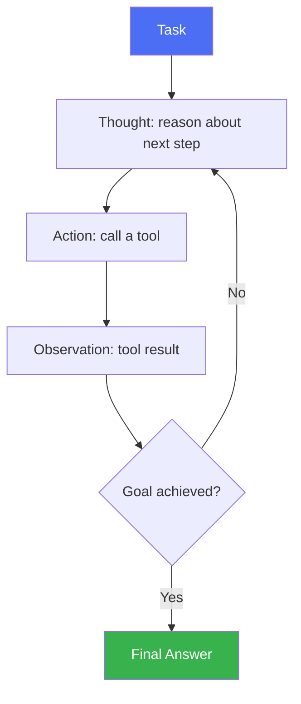

# ReAct (Reasoning + Acting)

> The foundational agent loop: think, act, observe, repeat.

## Overview

ReAct interleaves reasoning traces (like [Chain of Thought](../01-core-cognitive/reasoning/chain-of-thought.md))
with actions (tool calls) in a single loop: the model reasons about what to
do next, takes an action, observes the result, and reasons again — rather
than planning everything upfront or acting without any visible reasoning.
It's the most common foundational pattern for tool-using agents.

## Learning Objectives

- Explain the Thought → Action → Observation loop
- Understand why interleaving reasoning with acting improves on
  acting-only or reasoning-only approaches
- Know how to bound a ReAct loop to prevent runaway iteration

## Key Concepts

| Term | Definition |
|---|---|
| Thought | The model's reasoning about what to do next, generated before an action |
| Action | A tool call the model decides to make based on its thought |
| Observation | The result returned from executing the action, fed back into the next reasoning step |
| Loop budget | A cap on the number of thought-action-observation cycles to prevent infinite loops |

## Architecture



## Workflow

1. **Receive the task/goal.**
2. **Generate a Thought** — reasoning about the current state and what to do
   next (using [CoT](../01-core-cognitive/reasoning/chain-of-thought.md)-style
   reasoning).
3. **Take an Action** — a tool call chosen based on the thought (see
   [Tool Use](../02-tool-use/README.md)).
4. **Receive an Observation** — the tool's result.
5. **Repeat** steps 2-4, incorporating the observation into the next
   thought, until the goal is met or a loop/step budget is exhausted.
6. **Produce a Final Answer** once the model determines the goal is
   satisfied.

## Example

```text
Task: "What's the weather in the city where the 2024 Olympics were held, in Celsius?"

Thought: I need to find which city hosted the 2024 Olympics.
Action: search("2024 Olympics host city")
Observation: "The 2024 Summer Olympics were held in Paris, France."

Thought: Now I need the current weather in Paris, in Celsius.
Action: get_weather(city="Paris", unit="celsius")
Observation: "18°C, partly cloudy"

Thought: I have what I need.
Final Answer: It's currently 18°C and partly cloudy in Paris.
```

```python
def react_loop(model, tools, task, max_steps=6):
    history = [f"Task: {task}"]
    for _ in range(max_steps):
        thought_and_action = model.generate("\n".join(history) + "\nThought:")
        action, args = parse_action(thought_and_action)
        if action == "final_answer":
            return args["answer"]
        observation = tools[action].run(**args)
        history.append(f"Thought: ...\nAction: {action}({args})\nObservation: {observation}")
    return "Max steps reached without a final answer."
```

## Advantages / Disadvantages

| Advantages | Disadvantages |
|---|---|
| Simple, general-purpose loop that works across many task types | Can loop inefficiently without a well-designed stopping condition |
| Visible reasoning trace aids debugging | Each step is a full model call — latency/cost scales with loop length |
| Naturally incorporates real-time tool feedback into reasoning | No explicit upfront plan — can be short-sighted on tasks needing lookahead |
| Widely supported — the default pattern in most agent frameworks | Prone to repeating failed actions without a mechanism like self-reflection |

## When to Use

- General-purpose tool-using agents (search, lookups, API calls, multi-step
  Q&A)
- Tasks where the next step genuinely depends on the previous step's result
  (can't be fully planned upfront)
- As the execution engine within larger patterns (e.g. executing one step of
  a [Plan-and-Execute](plan-and-execute.md) plan)

## When NOT to Use

- Tasks with a clear, fully-known sequence of steps where upfront planning is
  more efficient — see [Plan-and-Execute](plan-and-execute.md)
- Long-horizon tasks needing persistent memory across many episodes — see
  [Voyager](voyager.md)
- Tasks needing significant lookahead/backtracking — see
  [Tree of Thought](../01-core-cognitive/reasoning/tree-of-thought.md)

## Common Mistakes

- **Mistake:** No maximum step budget, allowing the loop to run indefinitely
  on a stuck task. **Fix:** Always cap max steps and detect repeated
  identical actions as a stuck-loop signal.
- **Mistake:** Not surfacing observations clearly back into context, causing
  the model to "forget" what it just learned. **Fix:** Structure the history
  so each thought-action-observation triple is clearly formatted and
  retained in context.
- **Mistake:** Treating ReAct as sufficient for tasks that actually need
  explicit planning. **Fix:** For tasks with many interdependent steps known
  in advance, consider [Plan-and-Execute](plan-and-execute.md) instead or in
  combination.

## Comparison

| Pattern | Best for | Cost | Complexity |
|---|---|---|---|
| ReAct | General tool-using tasks, step-dependent tasks | Low-medium | Low |
| [Plan-and-Execute](plan-and-execute.md) | Tasks with a known, mostly-independent step sequence | Medium | Medium |
| [Reflexion](reflexion.md) | Tasks needing learning from repeated failed attempts | Medium-high | Medium |
| [CodeAct](codeact.md) | Tasks better expressed as executable code actions | Medium-high | Medium-high |

## Related Topics

- [Chain of Thought](../01-core-cognitive/reasoning/chain-of-thought.md) — the reasoning substrate of each "Thought" step
- [Tool Use](../02-tool-use/README.md) — what an "Action" actually is
- [Reflexion](reflexion.md) — adds cross-episode memory to a ReAct-like loop
- [Plan-and-Execute](plan-and-execute.md) — an alternative structuring the plan upfront

## Research Papers

- **ReAct: Synergizing Reasoning and Acting in Language Models** — Yao et al., 2022. [arXiv:2210.03629](https://arxiv.org/abs/2210.03629)

## Further Reading

- [`13-agent-patterns/README.md`](README.md) — category overview
