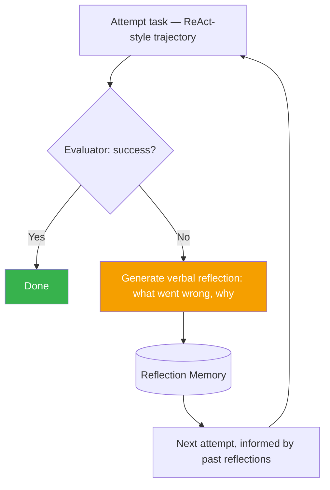

# Reflexion

> Learning from failure without updating any weights — just remembering what went wrong and why.

## Overview

Reflexion extends [self-reflection](../01-core-cognitive/reasoning/self-reflection.md)
across multiple attempts (episodes) at a task by persisting reflective
feedback in memory. After a failed or suboptimal attempt, the agent
generates a verbal reflection on *why* it failed, stores it, and retrieves
it on the next attempt — functioning as a lightweight, gradient-free
learning signal ("verbal reinforcement learning").

## Learning Objectives

- Explain how Reflexion differs from single-episode self-reflection
- Understand the role of an external evaluator/environment signal
  (success/failure) in triggering reflection
- Know where reflection memory is stored and how it's retrieved on
  subsequent attempts

## Key Concepts

| Term | Definition |
|---|---|
| Episode | One complete attempt at a task |
| Trajectory | The full sequence of thoughts/actions/observations within one episode |
| Verbal reinforcement | Using natural-language reflective feedback as the improvement signal, rather than gradient updates |
| Reflection memory | Persisted store of past reflections, retrieved and injected into future attempts |
| Evaluator | The mechanism (external tool, test suite, or self-judgment) that determines whether an episode succeeded |

## Architecture



## Workflow

1. **Attempt** the task using an execution pattern (typically
   [ReAct](react.md)), producing a full trajectory.
2. **Evaluate** the outcome — via an external signal when available (unit
   tests passing, a scored environment, explicit success criteria) or via
   self-judgment when no external signal exists.
3. **If unsuccessful**, generate a **verbal reflection**: a natural-language
   explanation of what went wrong and what to try differently, informed by
   the full trajectory.
4. **Store** the reflection in memory (see
   [Memory](../01-core-cognitive/memory/README.md)).
5. **Retry**, injecting relevant past reflections into the new attempt's
   context.
6. **Repeat** until success or a max-attempt budget is reached.

## Example

```text
Attempt 1: Agent writes code to parse a CSV, but crashes on a missing column.
Evaluator: Unit test fails — KeyError on missing column.

Reflection: "My code assumed the 'email' column always exists. I should
check for column presence before accessing it, and handle missing columns
gracefully instead of crashing."

Attempt 2 (with reflection in context): Agent writes code that checks for
column existence first. Unit test passes.
```

```python
def reflexion_loop(model, tools, task, evaluator, max_attempts=3):
    reflections = []
    for attempt in range(max_attempts):
        trajectory = react_loop(model, tools, task, context=reflections)
        result = evaluator.check(trajectory)
        if result.success:
            return trajectory
        reflection = model.generate(
            f"The attempt failed: {result.failure_reason}\n"
            f"Trajectory: {trajectory}\n"
            f"Reflect on what went wrong and what to try differently."
        )
        reflections.append(reflection)
    return trajectory  # last attempt, even if unsuccessful
```

## Advantages / Disadvantages

| Advantages | Disadvantages |
|---|---|
| Improves performance across attempts without any fine-tuning/weight updates | Needs multiple attempts — not useful for strictly single-shot tasks |
| Reflections are human-readable, aiding debugging | Requires a reliable evaluator signal; noisy evaluators produce noisy reflections |
| Composes naturally with [long-term memory](../01-core-cognitive/memory/README.md) for persistence across sessions | More total cost than a single attempt (multiple trajectories + reflection generations) |
| Works well for tasks with clear pass/fail signals (code, games, structured tasks) | Less effective on tasks with ambiguous or hard-to-define success criteria |

## When to Use

- Tasks with an available success/failure signal (unit tests, verifiable
  outputs, scored environments) — especially coding tasks
- Iterative agents allowed multiple attempts within a budget
- Long-running agents that benefit from accumulating lessons across sessions

## When NOT to Use

- Strictly single-shot tasks with no opportunity to retry
- Tasks with no reliable way to evaluate success/failure (reflection without
  a real signal risks reinforcing the wrong lessons)
- Extremely latency-sensitive contexts where multiple attempts aren't
  feasible

## Common Mistakes

- **Mistake:** Using Reflexion without any real evaluator, relying purely on
  the model's own uncertain self-judgment of success. **Fix:** Whenever
  possible, use an external, objective signal (tests, verifiers) to trigger
  reflection.
- **Mistake:** Storing reflections without any retrieval/relevance filtering,
  so irrelevant past reflections clutter future attempts. **Fix:** Retrieve
  only reflections relevant to the current task (see
  [RAG](../10-rag/README.md) techniques applied to memory retrieval).
- **Mistake:** No cap on attempts, allowing unbounded retry loops. **Fix:**
  Set a max-attempt budget and gracefully report failure if exceeded.

## Comparison

| Approach | Best for | Cost | Complexity |
|---|---|---|---|
| [Self-reflection (single episode)](../01-core-cognitive/reasoning/self-reflection.md) | Improving one attempt in place | Low-medium | Low |
| Reflexion | Multi-attempt tasks with a success/failure signal | Medium-high | Medium |
| [Voyager](voyager.md) | Long-horizon, open-ended skill accumulation | High | High |

## Related Topics

- [Self-Reflection & Self-Correction](../01-core-cognitive/reasoning/self-reflection.md) — the single-episode building block
- [ReAct](react.md) — the typical execution pattern within one Reflexion episode
- [Memory](../01-core-cognitive/memory/README.md) — where reflections are stored
- [Feedback Loops](../08-learning-adaptation/README.md#feedback-loops) — the broader learning-from-outcomes concept

## Research Papers

- **Reflexion: Language Agents with Verbal Reinforcement Learning** — Shinn et al., 2023. [arXiv:2303.11366](https://arxiv.org/abs/2303.11366)

## Further Reading

- [`13-agent-patterns/README.md`](README.md) — category overview
