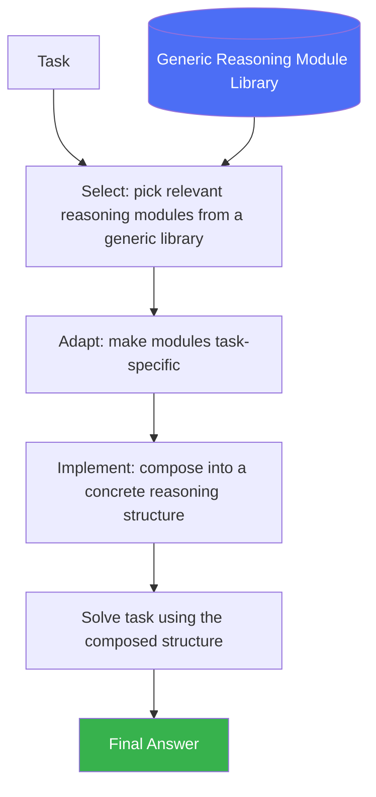

# Self-Discover

> Instead of hand-picking a reasoning strategy, let the model compose its own from a library of reasoning modules.

## Overview

Self-Discover is a pattern where the model, given a task, first **selects
and composes its own reasoning structure** from a set of generic reasoning
modules (e.g. "break the problem down," "use analogies," "consider step by
step," "critique your own approach") before actually solving the task using
that self-composed structure. Rather than a human hardcoding "use CoT" or
"use ToT" for a given task type, the model adapts its own reasoning
architecture per problem.

## Learning Objectives

- Explain the three stages: select, adapt, and implement reasoning modules
- Understand how this differs from simply picking one fixed reasoning
  pattern for all tasks
- Know the cost/benefit tradeoff of an extra "meta-reasoning" stage

## Key Concepts

| Term | Definition |
|---|---|
| Reasoning module | An atomic, generic reasoning strategy description (e.g. "decompose into sub-problems," "identify constraints") |
| Select stage | Choosing which reasoning modules are relevant to the task at hand |
| Adapt stage | Rephrasing selected modules to be specific to the task |
| Implement stage | Composing adapted modules into a concrete step-by-step reasoning structure, then executing it |
| Self-composed structure | The task-specific reasoning plan the model builds for itself, rather than a fixed human-chosen pattern |

## Architecture



## Workflow

1. **Maintain a library of generic reasoning modules** — reusable
   descriptions of reasoning strategies (decomposition, analogical
   reasoning, constraint identification, step-by-step verification, etc.),
   not tied to any specific task.
2. **Select**: given a new task, prompt the model to choose which modules
   from the library are relevant to it.
3. **Adapt**: prompt the model to rephrase the selected generic modules into
   task-specific instructions.
4. **Implement**: prompt the model to compose the adapted modules into a
   concrete, structured reasoning plan (e.g. a numbered sequence of
   reasoning steps specific to this task).
5. **Execute**: solve the actual task by following the self-composed
   structure.
6. *(Optional)* Reuse the composed structure across similar tasks in the same
   batch, amortizing the select/adapt/implement cost.

## Example

```text
Generic module library includes:
- "Break the problem into sub-problems"
- "Identify the constraints"
- "Think about it from multiple perspectives"
- "Use step-by-step arithmetic"

Task: A logic grid puzzle with several constraints.

Select: chooses "Identify the constraints" and "Break the problem into sub-problems"
(skips "step-by-step arithmetic" as irrelevant).

Adapt: "Identify the constraints" → "List each clue as an explicit constraint
on the grid. Identify which cells each constraint restricts."

Implement: composes into a concrete plan:
1. List all clues as explicit constraints
2. For each constraint, eliminate impossible grid cells
3. Repeat elimination until only one consistent assignment remains

Solve: executes this composed plan on the actual puzzle.
```

## Advantages / Disadvantages

| Advantages | Disadvantages |
|---|---|
| Adapts reasoning structure per-task rather than using one fixed strategy for everything | Adds an upfront meta-reasoning cost (select/adapt/implement) before solving even starts |
| Can outperform a single fixed strategy (e.g. always-CoT) on diverse task types | Requires maintaining/curating a useful library of generic reasoning modules |
| Composed structure is reusable across similar tasks, amortizing the cost | More complex to implement and debug than a single fixed prompting strategy |
| Produces an inspectable, task-specific reasoning plan | Benefit is most visible on genuinely diverse task batches — less useful for a narrow, uniform task type |

## When to Use

- Batches of diverse tasks where no single fixed reasoning strategy fits all
  of them well
- Systems that need to generalize across many task types without per-type
  hardcoded prompting logic
- Settings where the extra select/adapt/implement cost can be amortized
  (e.g. reused across many similar instances)

## When NOT to Use

- A narrow, well-understood task type where a known strategy (CoT,
  [ReAct](react.md)) already performs well — the meta-reasoning overhead
  isn't justified
- Latency-critical single tasks where the extra stages add unacceptable
  delay

## Common Mistakes

- **Mistake:** Using Self-Discover for a single, one-off task where the
  meta-reasoning overhead outweighs any benefit. **Fix:** Reserve this
  pattern for diverse task batches or genuinely unclear-strategy situations.
- **Mistake:** A poorly-curated or too-generic module library that doesn't
  meaningfully change reasoning per task. **Fix:** Invest in a
  well-differentiated set of reasoning modules that actually specialize
  reasoning behavior.
- **Mistake:** Not reusing the composed structure across similar tasks,
  re-running select/adapt/implement from scratch every time. **Fix:** Cache
  composed structures per task type/cluster when tasks repeat.

## Comparison

| Approach | Best for | Cost | Complexity |
|---|---|---|---|
| Fixed strategy (e.g. always CoT) | Narrow, uniform task types | Low | Low |
| Self-Discover | Diverse task batches, unclear best strategy per task | Medium-high | Medium-high |
| [Tree of Thought](../01-core-cognitive/reasoning/tree-of-thought.md) | Search/planning-heavy single tasks | High | High |

## Related Topics

- [Chain of Thought](../01-core-cognitive/reasoning/chain-of-thought.md) — one possible reasoning module Self-Discover might select
- [Tree of Thought](../01-core-cognitive/reasoning/tree-of-thought.md) — another possible module/strategy
- [Planning](../01-core-cognitive/planning/README.md) — related meta-level structuring of how to approach a task

## Research Papers

- **Self-Discover: Large Language Models Self-Compose Reasoning Structures** — Zhou et al., 2024. [arXiv:2402.03620](https://arxiv.org/abs/2402.03620)

## Further Reading

- [`13-agent-patterns/README.md`](README.md) — category overview
