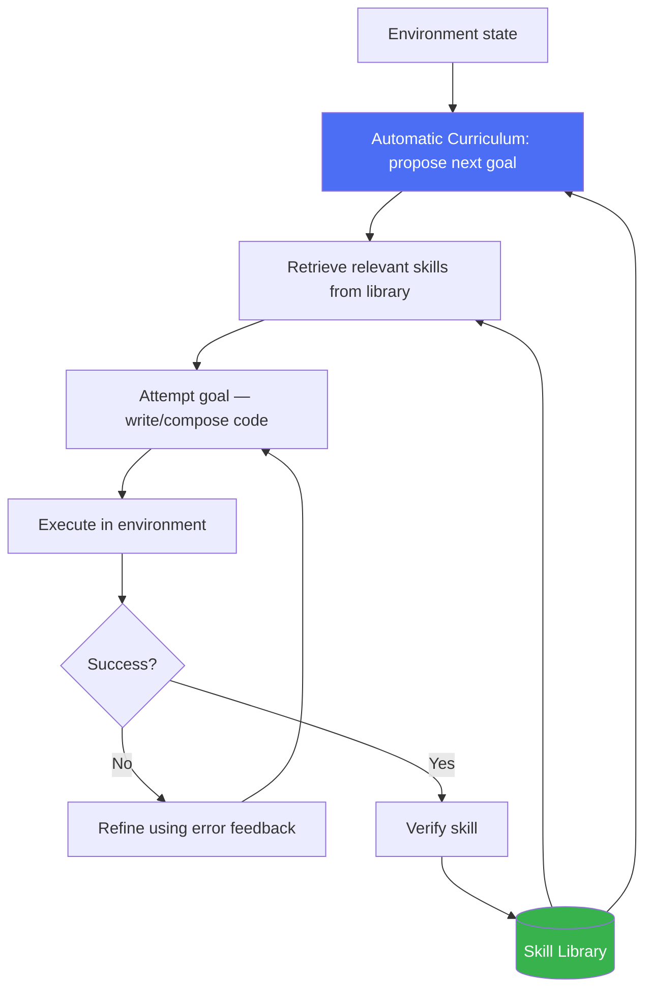

# Voyager

> An agent that keeps a growing library of skills it learned itself, so tomorrow's tasks get easier because of what it did today.

## Overview

Voyager is a pattern for **open-ended, long-horizon agents** that
continuously explore an environment, propose their own next goals, and
accumulate a persistent, reusable **skill library** — verified code/behaviors
that worked, which can be composed into solving harder tasks later. It was
introduced in the context of an agent playing Minecraft, but the underlying
pattern (automatic curriculum + skill library + iterative refinement)
generalizes to any long-running, open-ended agent.

## Learning Objectives

- Explain the three core components: automatic curriculum, skill library,
  iterative prompting mechanism
- Understand how accumulated skills compound over time
- Know what kind of tasks actually benefit from this pattern (vs. shorter,
  well-scoped tasks that don't)

## Key Concepts

| Term | Definition |
|---|---|
| Automatic curriculum | The agent proposing its own next goal/task based on current capability and environment state, rather than a human specifying every task |
| Skill library | A persisted collection of verified, reusable code/behaviors the agent has learned, indexed for retrieval |
| Iterative refinement | Using execution feedback (errors, environment state) to revise a skill attempt, similar to [Reflexion](reflexion.md) but applied to skill acquisition |
| Compounding skills | Complex skills built by composing previously-learned simpler skills |

## Architecture



## Workflow

1. **Observe environment state** and current agent capabilities.
2. **Propose the next goal** via an automatic curriculum — something
   slightly beyond current capability, informed by what's already in the
   skill library (avoiding both trivial repeats and impossibly large leaps).
3. **Retrieve relevant skills** from the library that might compose toward
   this goal.
4. **Attempt the goal**, generating code/actions that use retrieved skills
   plus new logic.
5. **Execute** in the environment and observe the result/errors.
6. **Refine** iteratively using execution feedback (similar to
   [Reflexion](reflexion.md)) until the attempt succeeds or a budget is
   exhausted.
7. **Verify** the successful skill (e.g. re-run it to confirm it generalizes,
   not just a one-off fluke).
8. **Add to skill library**, indexed for future retrieval.
9. **Repeat** indefinitely, with each new skill making future goals more
   reachable.

## Example

```text
Skill library so far: ["chop_tree()", "craft_planks()"]

Curriculum proposes: "craft a wooden pickaxe" (slightly beyond current skills)

Attempt: agent writes code combining chop_tree() + craft_planks(),
adding new logic for crafting_table interaction + pickaxe recipe.

Execution fails: missing crafting table. Refine: add build_crafting_table()
sub-step, retry. Succeeds.

New skill added: "craft_wooden_pickaxe()" — now composable into future goals
like "mine stone".
```

## Advantages / Disadvantages

| Advantages | Disadvantages |
|---|---|
| Capability compounds over time — later tasks benefit from all prior learning | Significant infrastructure: environment, verification, skill storage/retrieval |
| No human needs to specify every task — the curriculum is self-generated | Automatic curricula can propose poorly-calibrated goals (too easy/too hard) without tuning |
| Skill library is inspectable and reusable across sessions | Best suited to genuinely open-ended environments — overkill for narrow, well-scoped tasks |
| Naturally supports lifelong/continual learning framing | Verification of "did this skill actually generalize" is nontrivial to get right |

## When to Use

- Genuinely open-ended environments with a long task horizon (game-playing
  agents, simulated/robotic environments, continuous automation systems)
- Systems expected to run and improve over long periods (days/weeks+), where
  skill accumulation compounds

## When NOT to Use

- Well-scoped, short-horizon tasks — the curriculum/skill-library
  infrastructure is unjustified overhead
- One-off tasks with no expectation of repetition where skill reuse never
  pays off
- Environments without a reliable way to verify whether a "skill" actually
  worked (verification failure undermines the whole library's trustworthiness)

## Common Mistakes

- **Mistake:** Adopting this pattern for a short, one-shot task. **Fix:**
  Reserve Voyager-style architectures for genuinely long-horizon, repeated-use
  agents — see [Plan-and-Execute](plan-and-execute.md) or
  [ReAct](react.md) for shorter tasks.
- **Mistake:** Adding unverified skills directly to the library. **Fix:**
  Always verify a skill (e.g. re-execute, check it generalizes) before
  persisting it for reuse.
- **Mistake:** No retrieval filtering — dumping the entire skill library into
  context on every attempt. **Fix:** Retrieve only skills relevant to the
  current goal (see [RAG](../10-rag/README.md) techniques applied to skill
  retrieval).

## Comparison

| Approach | Best for | Cost | Complexity |
|---|---|---|---|
| [Reflexion](reflexion.md) | Multi-attempt learning within a bounded task | Medium-high | Medium |
| Voyager | Open-ended, long-horizon, self-directed exploration | High | Highest |
| [Plan-and-Execute](plan-and-execute.md) | Bounded, mostly-known-structure tasks | Medium | Medium |

## Related Topics

- [Reflexion](reflexion.md) — the iterative refinement mechanism Voyager builds on
- [Memory](../01-core-cognitive/memory/README.md) — the skill library is a form of long-term memory
- [Knowledge Updating](../08-learning-adaptation/README.md#knowledge-updating) — the broader continual-learning theme

## Research Papers

- **Voyager: An Open-Ended Embodied Agent with Large Language Models** — Wang et al., 2023. [arXiv:2305.16291](https://arxiv.org/abs/2305.16291)

## Further Reading

- [`13-agent-patterns/README.md`](README.md) — category overview
