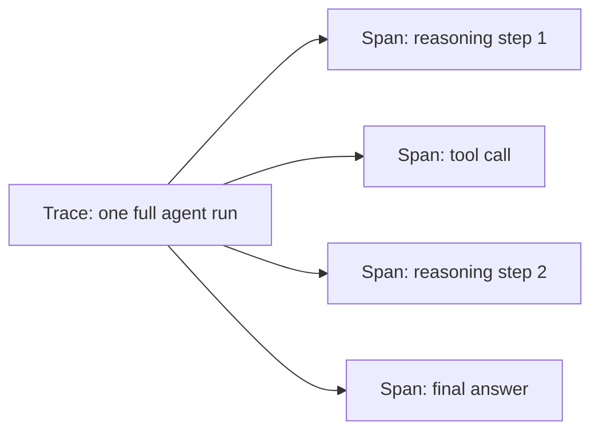
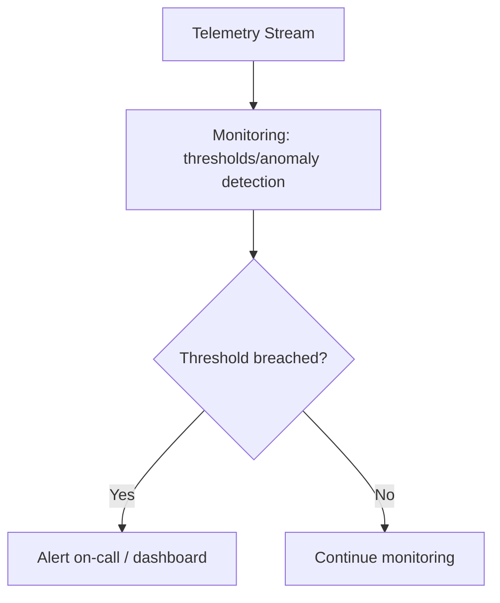

# 14 · Observability

## Overview

Observability is how you know what your agent is actually doing in
production: tracing individual reasoning/tool-call steps, collecting
telemetry and metrics, logging, and monitoring for anomalies. Agents are
harder to observe than traditional software because their behavior is
non-deterministic and their "logic" lives partly in a model's generation
rather than in code you wrote — making good observability tooling
essential, not optional.

## Learning Objectives

- Design a tracing scheme that captures an agent's full reasoning/action
  trajectory
- Choose the right metrics to monitor for agent health and quality
- Distinguish logging (for debugging) from monitoring (for ongoing health)

## Tracing

Tracing captures the full trajectory of a single agent run: every
reasoning step, tool call, observation, and decision point — essential for
debugging why an agent did what it did, especially for multi-step or
multi-agent systems where the failure could be several steps upstream of
where it became visible.

Each **span** should capture: input, output, latency, and any
errors/retries — enough to fully reconstruct what happened without needing
to reproduce the run.

## Telemetry

Telemetry aggregates trace data into ongoing signals about system behavior:
call volumes, latency distributions, tool-usage frequency, error rates —
the operational pulse of the system over time, as distinct from any single
trace.

## Logging

Structured logs capture discrete events (a tool call, an error, a decision)
in a form that's searchable and filterable — critical for debugging specific
incidents after the fact. Prefer structured (JSON-like) logs over free-text
for anything that will need to be queried/aggregated later.

## Monitoring

Monitoring watches telemetry for signals requiring attention: error rate
spikes, latency degradation, unusual tool-usage patterns (potential misuse
or a broken integration), and quality regressions — typically paired with
alerting so issues surface proactively rather than being discovered by
users first.

## Key Metrics for Agents

| Metric | Why it matters |
|---|---|
| Task success rate | The core measure of whether the agent is actually working |
| Latency (p50/p95/p99) | User experience and cost implications |
| Tool call error rate | Signals integration health/degradation |
| Loop/step count distribution | Detects inefficient reasoning or stuck loops |
| Cost per task | Tracks token/API spend against value delivered |
| Escalation/fallback rate | How often the agent needs human handoff — a proxy for confidence calibration |

## Key Concepts

| Term | Definition |
|---|---|
| Trace | The full recorded trajectory of one agent run |
| Span | One discrete step within a trace (a reasoning step, a tool call) |
| Telemetry | Aggregated operational signals derived from traces/logs over time |
| Structured logging | Logging in a consistently-parseable format (e.g. JSON) rather than free text |

## Advantages / Disadvantages

| Advantages | Disadvantages |
|---|---|
| Makes non-deterministic agent behavior debuggable | Full tracing of every reasoning step can be verbose/costly to store |
| Enables proactive issue detection via monitoring/alerting | Requires deliberate instrumentation — doesn't happen automatically |
| Metrics enable data-driven iteration (see [Evaluation](../15-evaluation/README.md)) | Multi-agent systems multiply tracing complexity significantly |

## Common Mistakes

- **Mistake:** No tracing until something goes wrong in production, making
  root-cause analysis impossible after the fact. **Fix:** Instrument tracing
  from the start, even in early development.
- **Mistake:** Free-text logging that's hard to query/aggregate later.
  **Fix:** Use structured logging from day one.
- **Mistake:** Tracking only latency/cost metrics without task success rate
  or quality signals. **Fix:** Pair operational metrics with quality metrics
  — see [`15-evaluation/`](../15-evaluation/README.md).

## Related Categories

- [`15-evaluation/`](../15-evaluation/README.md) — measuring quality, which observability data feeds into
- [`16-deployment/`](../16-deployment/README.md) — operating agents in production, where observability is essential
- [`06-multi-agent/`](../06-multi-agent/README.md) — multi-agent systems that especially need robust tracing

## Research Papers

Observability practices for agentic systems draw heavily from general
distributed-systems observability practice; see
[`resources/README.md`](../resources/README.md) for tooling references.

## Further Reading

- [`15-evaluation/README.md`](../15-evaluation/README.md) — turning observability data into systematic evaluation
