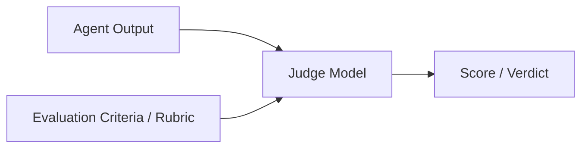
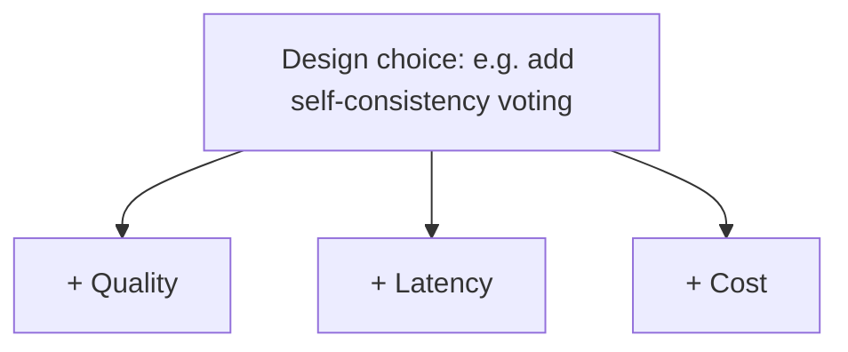

# 15 · Evaluation

## Overview

Evaluation is how you know, systematically rather than anecdotally, whether
an agent is actually good — and whether a change made it better or worse.
This category covers LLM-as-a-judge techniques, benchmark design, and the
practical tradeoffs between latency, cost, and quality that every agent
deployment has to navigate.

## Learning Objectives

- Design an evaluation set that actually reflects real usage
- Understand when and how to use LLM-as-a-judge, and its known limitations
- Reason explicitly about latency/cost/quality tradeoffs rather than
  optimizing quality alone

## LLM-as-a-Judge

Using a (typically stronger, or specially-prompted) language model to
evaluate the quality of another model's output against defined criteria —
useful when human evaluation doesn't scale, but not a perfect substitute for
it.

Best practices:

- Use a clear, explicit rubric — not just "rate this 1-10" with no criteria.
- Validate the judge against human ratings on a sample before trusting it at
  scale.
- Be aware of known judge biases: preference for longer outputs, position
  bias in pairwise comparisons, and self-preference bias (a model favoring
  outputs similar to its own style).
- Use pairwise comparison (which of A/B is better) rather than absolute
  scoring where possible — pairwise judgments tend to be more reliable.

## Benchmarks

A benchmark is a fixed, representative set of tasks with known
correct/acceptable answers (or judgeable criteria), used to measure and
track agent performance over time.

| Benchmark type | Description |
|---|---|
| Public/standard benchmarks | Established task sets (useful for comparing general capability across models) |
| Custom/domain benchmarks | Built from your own real usage patterns — usually more predictive of production performance than public benchmarks |
| Regression test sets | A curated set of previously-failed cases, re-run on every change to prevent regressions |

Public benchmarks are useful for comparing underlying models (see
[`17-models/`](../17-models/README.md)), but a custom benchmark reflecting
your actual task distribution is almost always more predictive of real
production performance.

## Latency / Cost / Quality Tradeoffs

Every agent design choice trades off across these three axes — there is no
free lunch:

| Lever | Quality impact | Latency impact | Cost impact |
|---|---|---|---|
| More reasoning steps (CoT, ToT) | Usually improves | Increases | Increases |
| Self-consistency voting | Improves reliability | Increases (parallel calls can offset) | Increases (N× calls) |
| Larger/more capable model | Usually improves | Often increases | Usually increases |
| Retrieval + reranking | Improves grounding | Increases | Increases |
| Caching repeated sub-tasks | Neutral | Decreases | Decreases |

The right tradeoff point depends entirely on the use case — a customer
support chatbot needs low latency and acceptable quality at high volume; an
overnight research report generation task can trade latency for maximum
quality.

## Key Concepts

| Term | Definition |
|---|---|
| LLM-as-a-judge | Using a model to evaluate another model's output against criteria |
| Benchmark | A fixed, representative task set with known correct/judgeable answers |
| Regression test set | Previously-failed cases re-run on every change to catch regressions |
| Pairwise comparison | Judging which of two outputs is better, rather than scoring each in isolation |

## Advantages / Disadvantages

| Advantages | Disadvantages |
|---|---|
| Systematic evaluation catches regressions before users do | Building good evaluation infrastructure is real, ongoing engineering work |
| LLM-as-a-judge scales far beyond manual human review | Judge models carry their own biases and imperfect correlation with human judgment |
| Custom benchmarks reflect actual production task distribution | Public benchmarks can be misleading if they don't match your real use case |

## Common Mistakes

- **Mistake:** Relying solely on public benchmarks that don't reflect your
  actual task distribution. **Fix:** Build a custom evaluation set from real
  (or realistic) usage.
- **Mistake:** Trusting an LLM judge without validating it against human
  ratings first. **Fix:** Sample-check judge scores against human evaluation
  before trusting it at scale.
- **Mistake:** Optimizing quality alone without considering latency/cost
  tradeoffs relevant to the actual use case. **Fix:** Explicitly define
  acceptable latency/cost bounds before optimizing quality further.
- **Mistake:** No regression test set, allowing quality to silently degrade
  across changes. **Fix:** Maintain and re-run a regression set on every
  significant change.

## Related Categories

- [`14-observability/`](../14-observability/README.md) — the data evaluation draws from
- [`04-decision-making/`](../04-decision-making/README.md) — confidence/hallucination concepts evaluation measures
- [`16-deployment/`](../16-deployment/README.md) — where evaluation gates production releases

## Research Papers

- **Judging LLM-as-a-Judge with MT-Bench and Chatbot Arena** — Zheng et al., 2023. [arXiv:2306.05685](https://arxiv.org/abs/2306.05685)
- **Holistic Evaluation of Language Models (HELM)** — Liang et al., 2022. [arXiv:2211.09110](https://arxiv.org/abs/2211.09110)

## Further Reading

- [`14-observability/README.md`](../14-observability/README.md) — instrumenting the data evaluation needs
